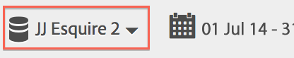
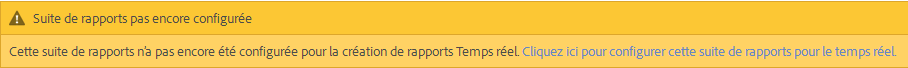
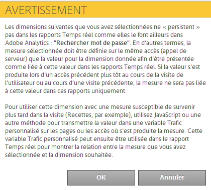

# Configuration des rapports en temps réel

Cette rubrique décrit les étapes d’administration pour configurer les rapports en temps réel.

Setting up real-time reports within [!UICONTROL Reports &amp; Analytics] consists of selecting the report suite and configuring up to 3 reports for it.

1. Sélectionnez la suite de rapports pour laquelle activer les rapports en temps réel.

   Navigate to **[!UICONTROL Analytics]** &gt; **[!UICONTROL Reports]** &gt; **[!UICONTROL View All Reports &gt; Site Metrics]** &gt; **[!UICONTROL Real-Time]** and select the report suite from the drop-down at the top:

   

   Si vous essayez d’afficher des rapports en temps réel pour une suite de rapports qui n’a pas été configurée pour la création de rapports en temps réel, un message s’affiche. Celui-ci vous permet de configurer la suite de rapports.

   

1. Click **[!UICONTROL Configure]** (gear icon) to run the [!UICONTROL Report Suite Manager].

   (Also available under **[!UICONTROL Analytics]** &gt; **[!UICONTROL Admin &gt; Report Suites]** &gt; **[!UICONTROL Edit Settings]** &gt; **[!UICONTROL Real-Time]**.)

1. Turn on the **[!UICONTROL Enable Real-Time]** setting.
1. Configurez la collecte de données en temps réel pour trois rapports au maximum, avec une mesure et trois dimensions ou classifications par rapport.

   

   For information on supported real-time metrics and dimensions, see [Supported Metrics and Dimensions](../../components/c-real-time-reporting/realtime-metrics.md#concept_B86D8DF89AD448839332AD84B1DF2AE7).

   Si vous avez créé des classifications, elles apparaissent en retrait sous la dimension pour laquelle elles ont été définies :

   

   >[!NOTE]
   >
   >Pour un seul rapport Real - Time, nous ne prenons actuellement pas en charge l'activation de dimensions en double, même si une autre classification est sélectionnée pour chaque dimension.

   For more information about classifications, see [About Classifications](../../components/c-classifications2/c-classifications.md#concept_4CEC7FF1A9E24204A7DA6B9AC70709DE).

   >[!NOTE]
   >
   >Certaines dimensions, telles que « Mot-clé de recherche » ou « Produit », ne persistent pas en Réel, comme elles le font ailleurs dans Adobe Analytics. Lorsque vous sélectionnez une mesure non permanente, cet avertissement s’affiche :

   

1. Click **[!UICONTROL Save]** or **[!UICONTROL Save and View Report]**.

   Après cette configuration initiale du rapport, comptez jusqu’à 20 minutes pour que les données commencent à se diffuser. À partir de ce moment, les données sont immédiatement disponibles. Pour en savoir plus sur l’affichage des rapports Temps réel, voir [Exécution d’un rapport Temps réel](https://marketing.adobe.com/resources/help/en_US/sc/user/reports_realtime.html).

1. Par défaut, tous les utilisateurs ont accès aux rapports Temps réel.
