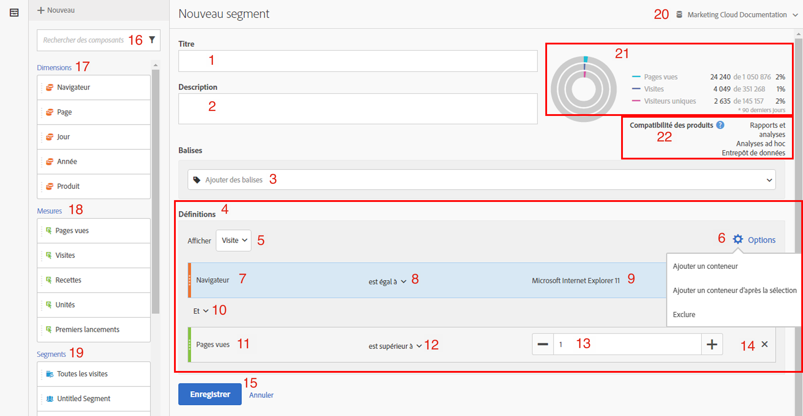
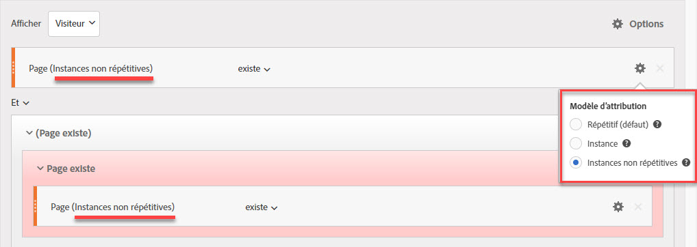
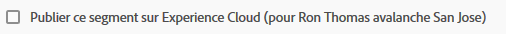
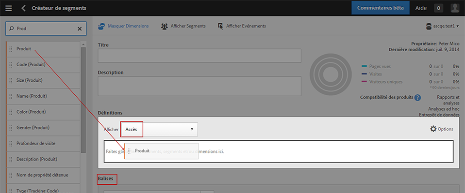
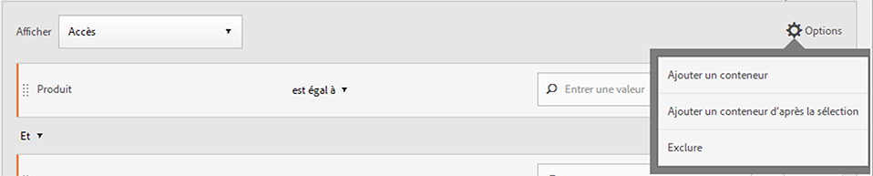
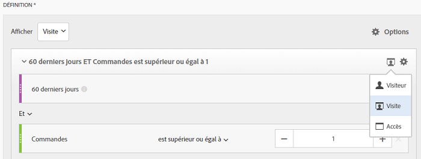
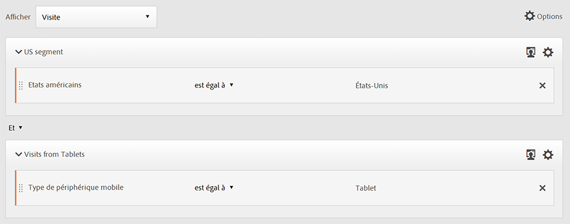
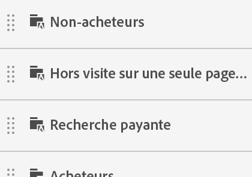
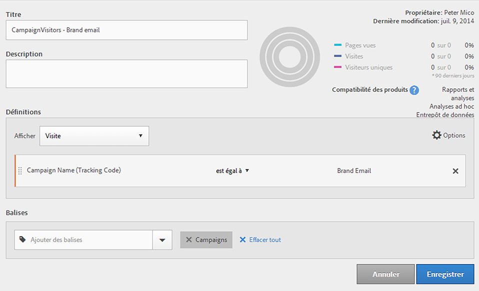

# Créateur de segments

Le Créateur de segments propose un canevas permettant de faire glisser et de déposer des dimensions de mesure, des segments et des événements afin de segmenter les visiteurs en fonction d’opérateurs, de règles et d’une logique de hiérarchie de conteneurs. Cet outil de développement intégré vous permet de créer et d’enregistrer des segments simples ou complexes qui identifient les attributs et actions des visiteurs entre les visites et accès aux pages.

Le [!UICONTROL Créateur de segments] propose un canevas permettant de faire glisser et de déposer des dimensions de mesure, des segments et des événements afin de segmenter les visiteurs en fonction d’opérateurs, de règles et d’une logique de hiérarchie de conteneurs. Cet outil de développement intégré vous permet de créer et d’enregistrer des segments simples ou complexes qui identifient les attributs et actions des visiteurs entre les visites et accès aux pages.

>[!IMPORTANT]
>
>Nous avons introduit des modèles d’attribution de dimension dans la version de juin 2019. Voir #6 sous Fonctionnalités de l’interface utilisateur Web ci-dessous.

Il existe plusieurs façons d’accéder au Créateur de segments :

* **Navigation** supérieure dans Analytics : Cliquez sur **[!UICONTROL Analytics]** &gt; **[!UICONTROL Composants]** &gt; **[!UICONTROL Segments]**.
* **[!UICONTROL Analysis Workspace]**: Cliquez sur **[!UICONTROL Analytics]** &gt; **[!UICONTROL Workspace]**, ouvrez un projet et cliquez sur **[!UICONTROL + Nouveau]** &gt; **[!UICONTROL Créer un segment.]**
* **[!UICONTROL Rapports et analyses]**: Cliquez sur **[!UICONTROL Analytics]** &gt; **[!UICONTROL Rapports]**, ouvrez un rapport existant et cliquez sur l’icône Segments  dans le volet de navigation de gauche, puis cliquez sur **[!UICONTROL Ajouter]**.
* **[!UICONTROL Analyses]** ad hoc : [Créez des segments dans les analyses](/help/components/c-segmentation/c-segmentation-workflow/seg-build.md#build-segments)ad hoc.
* **[!UICONTROL Créateur]** de rapports : [Ajouter ou modifier des segments dans le créateur](https://marketing.adobe.com/resources/help/en_US/arb/segmentation.html)de rapports.

## Segment Builder user interface {#concept_643F2DF74C544796B58F4656ABC5F726}

Le [!UICONTROL Créateur de segments] permet de créer des segments simples ou complexes qui identifient les attributs et actions des visiteurs lors des visites et accès aux pages. Il offre un canevas permettant de faire glisser et de déposer des dimensions de mesure, des événements ou d’autres segments afin de segmenter les visiteurs selon une logique de hiérarchie, des règles et des opérateurs.

## Fonctionnalités de l’interface utilisateur Web {#section_F61C4268A5974C788629399ADE1E6E7C}

Le [!UICONTROL Créateur de segments] permet de créer et de modifier des segments dans l’interface utilisateur Web (ou dans une [interface utilisateur Java des analyses ad hoc](/help/components/c-segmentation/c-segmentation-workflow/seg-workflow.md)). Vous pouvez ajouter des définitions de règle et des conteneurs afin d’affiner vos segments en les empilant et les imbriquant. Vous pouvez également valider le nombre de pages vues, de visites et de visiteurs uniques qui a résulté de votre définition de segment active. Le segment pourra alors être enregistré en vue d’une utilisation ultérieure.

Accédez au Créateur de segments en procédant comme suit ::

* Affichez un rapport existant, puis cliquez sur l’icône Segments  Dans le rail du segment qui s’affiche, cliquez sur **[!UICONTROL Ajouter]**.

* Dans le Gestionnaire de segments, cliquez sur **[!UICONTROL + Ajouter]**.
* Cliquez sur le titre d’un segment existant dans le Gestionnaire de segments afin de modifier le segment dans le Créateur de segments.

1. **[!UICONTROL Titre]**: Permet de nommer ou de renommer le segment.
1. **[!UICONTROL Description]**: Fournissez une description du segment. Vous devez fournir une description si vous souhaitez partager le segment.
1. **[!UICONTROL Balises]**: [Balisez le segment](/help/components/c-segmentation/c-segmentation-workflow/seg-workflow.md) que vous créez en sélectionnant une liste de balises existantes ou en créant une nouvelle balise.
1. **[!UICONTROL Définitions]**: C’est là que vous [créez et configurez des segments](/help/components/c-segmentation/c-segmentation-workflow/seg-workflow.md), ajoutez des règles et imbriquez et séquencez des conteneurs. Permet de fournir une description du nouveau segment en sélectionnant le conteneur et en faisant glisser-déposer les dimensions, segments ou mesures dans la définition.
1. **[!UICONTROL Afficher]**: (Sélecteur Conteneur supérieur.) Lets you select the top-level [container](/help/components/c-segmentation/seg-overview.md) ( [!UICONTROL Visitor], [!UICONTROL Visit], [!UICONTROL Hit]). Le conteneur de niveau supérieur par défaut est le conteneur Accès.
1. **[!UICONTROL Options]**: (engrenage) icône

   * **[!UICONTROL + Ajouter un conteneur]** : permet d’ajouter un nouveau conteneur (sous le conteneur de niveau supérieur) à la définition de segment.
   * **[!UICONTROL + Ajouter un conteneur d’après la sélection]** : permet de créer un nouveau conteneur à partir des éléments que vous avez sélectionnés dans le champ Définitions.
   * **[!UICONTROL Exclure]** : permet de définir le segment en excluant un ou plusieurs segments, dimensions ou mesures.

1. **[!UICONTROL Modèles]** d’attribution : Pour la segmentation des dimensions. Les modèles de dimension sont particulièrement utiles pour la segmentation séquentielle, comme dans le cas des visualisations de flux :

   * **[!UICONTROL Répétition]** (par défaut) : Inclut des instances et des valeurs persistantes pour la dimension.
   * **[!UICONTROL Instance]**: Inclut des instances pour la dimension.
   * **[!UICONTROL Instance]** non répétée : Inclut des instances uniques (non répétées) pour la dimension.
   

1. **[!UICONTROL Dimensions]**: Les dimensions sont glissées et déposées depuis la liste Dimensions (barre latérale orange).
1. **[!UICONTROL Comparaison]**: Vous pouvez comparer et contraindre des valeurs à l’aide d’opérateurs sélectionnés.
1. **[!UICONTROL Valeur]**: Valeur saisie ou sélectionnée pour la dimension, le segment ou la mesure.
1. **[!UICONTROL Et/Ou/Puis]**: Affecte les opérateurs [!UICONTROL ET/OU/ALORS] entre des conteneurs ou des règles. The THEN operator lets you [define sequential segments](/help/components/c-segmentation/c-segmentation-workflow/seg-sequential-build.md).
1. **[!UICONTROL Mesure]**: (Barre latérale verte) Mesure qui a été glissée et déposée depuis la liste Mesures.
1. **[!UICONTROL Opérateur de comparaison]** : Vous pouvez comparer et contraindre des valeurs à l’aide d’opérateurs sélectionnés.
1. **[!UICONTROL Valeur]**: Valeur saisie ou sélectionnée pour la dimension, le segment ou la mesure.
1. **[!UICONTROL X]**: (Supprimer) Permet de supprimer cette partie de la définition de segment.
1. **[!UICONTROL Enregistrer]** ou **[!UICONTROL Annuler]**: Enregistre ou annule le segment. After clicking **[!UICONTROL Save]**, you are taken to the Segment Manager where you can manage the segment.
1. **[!UICONTROL Rechercher]**: Recherche la liste des dimensions, des segments ou des mesures.
1. **[!UICONTROL Dimensions]**: (Liste) Cliquez sur l’en-tête pour le développer.
1. **[!UICONTROL Mesures]**: Cliquez sur l’en-tête pour le développer.
1. **[!UICONTROL Segments]**: Cliquez sur l’en-tête pour le développer.
1. **[!UICONTROL Sélecteur]** de suite de rapports : Permet de sélectionner la suite de rapports sous laquelle ce segment sera enregistré. Vous pouvez tout de même utiliser le segment dans toutes les suites de rapport.
1. **[!UICONTROL Aperçu]** du segment : Vous permet de prévisualiser les mesures clés afin de déterminer si vous disposez d’un segment valide et sa largeur. Représente la ventilation du jeu de données auquel vous pouvez vous attendre si vous appliquez ce segment. Affiche 3 cercles concentriques et une liste afin d’afficher le nombre et le pourcentage de correspondances pour [!UICONTROL Accès], [!UICONTROL Visites] et [!UICONTROL Visiteurs] pour une exécution de segment par rapport à un jeu de données. Ce graphique est mis à jour immédiatement une fois que vous avez créé ou apporté des modifications à votre définition de segment.
1. **[!UICONTROL Compatibilité]** des produits : Fournit une liste des produits Adobe Analytics (Analysis Workspace, [!UICONTROL Rapports et analyses], Analyses ad hoc, Entrepôt de données) avec lesquels le segment que vous avez créé est compatible. La plupart des segments sont compatibles avec tous les produits. Néanmoins, tous les opérateurs et dimensions ne sont pas compatibles avec l’ensemble des produits Analytics, notamment [Data Warehouse](/help/components/c-segmentation/seg-reference/seg-compatibility.md). Ce graphique est mis à jour instantanément quand vous modifiez votre définition de segment.

Segments with embedded date ranges continue to operate differently in Analysis Workspace versus [!UICONTROL Reports &amp; Analytics]: In Workspace, a segment with an embedded date range overrides the panel date range. By contrast, [!UICONTROL Reports &amp; Analytics] gives you the intersection of the report date range and the segment's embedded date range.

**[!UICONTROL Publier dans Experience Cloud (pour`<report suite name>`)]**: (Non affiché à l’écran) Cette option s’affiche uniquement si la suite de rapports dans laquelle vous enregistrez ce segment est [activée pour Experience Cloud](/help/components/c-segmentation/c-segmentation-workflow/seg-workflow.md). By publishing a segment to the Experience Cloud, you can use the segment for marketing activity in the [!UICONTROL Audience Library], [!DNL Target], and [!DNL Audience Manager]. Un titre et une description du segment sont requis.

> [!NOTE]Dans Analytics, vous pouvez modifier ou supprimer un segment publié. Si le segment est en cours d’utilisation, un message d’avertissement s’affiche lorsque vous le modifiez. Vous ne pouvez pas supprimer un segment publié en cours d’utilisation par Adobe [!DNL Target].

>[!IMPORTANT]
>
>Vous devez limiter le nombre d’audiences partagées à partir d’Analytics à 20 afin d’éviter des retards de traitement supplémentaires. Les audiences partagées avec Experience Cloud depuis Analytics ne doivent pas dépasser 20 millions de membres. En outre, en raison de la mise en cache, les suites de rapports supprimées dans Analytics ne disparaîtront pas d’Experience Cloud avant 12 heures.

>[!IMPORTANT]
>
>Once a visitor qualifies for the audience shared from Analytics, there is a 24 - 48 hour delay before that information is actionable in [!DNL Target], [!DNL Advertising Cloud], and [!DNL Campaign].

## Création de segments {#build-segments}

1. Faites simplement glisser une dimension, un segment ou un événement de mesure depuis le panneau de gauche vers le champ [!UICONTROL Définitions].

   

   Le conteneur [!UICONTROL Accès] de niveau supérieur par défaut s’affiche après avoir fait glisser un élément vers [!UICONTROL Définitions]. Vous pouvez modifier le type de conteneur sur Visite ou Visiteur depuis le menu déroulant **[!UICONTROL Afficher].**

1. Définissez l’ [opérateur](/help/components/c-segmentation/seg-reference/seg-operators.md) dans le menu déroulant.
1. Saisissez ou sélectionnez une valeur pour l’élément sélectionné.
1. Add additional containers if needed, using **[!UICONTROL And]**, **[!UICONTROL Or]**, or **[!UICONTROL Then]** rules.
1. Après avoir placé les conteneurs et défini les règles, consultez les résultats du segment dans le graphique de validation dans la partie supérieure droite. Le programme de validation indique le pourcentage et le nombre absolu de pages vues, de visites et de visiteurs uniques qui correspondent au segment que vous avez créé.
1. Under **[!UICONTROL Tags]**, [tag](/help/components/c-segmentation/c-segmentation-workflow/seg-tag.md) the container by selecting an existing tag or creating a new one.
1. Cliquez sur **[!UICONTROL Enregistrer]pour enregistrer le segment.**

Vous accédez maintenant au Gestionnaire [de](/help/components/c-segmentation/c-segmentation-workflow/seg-manage.md)segments, où vous pouvez baliser, partager et gérer votre segment de plusieurs manières.

## Build and nest containers {#section_1C38F15703B44474B0718CEF06639EFD}

You can [build a framework of containers](/help/components/c-segmentation/seg-overview.md) and then place logic rules and operators between.

1. Cliquez sur **[!UICONTROL Options &gt; Ajouter un conteneur]**.

   

   Un nouveau conteneur [!UICONTROL Accès] s’ouvre sans qu’aucun conteneur [!UICONTROL Accès] (Page vue) ne soit identifié.

   

1. Modifiez le type de conteneur, le cas échéant.
1. Faites glisser une dimension, un segment ou un événement depuis le panneau de gauche vers le conteneur.
1. Continue to add new containers from the top-level **[!UICONTROL Options]** &gt; **[!UICONTROL Add container]** button at the top of the definition, or add containers from within a container to nest logic.

   **OU**

   Select one or more rules and then click **[!UICONTROL Options]** &gt; **[!UICONTROL Add container from selection]**. Votre sélection devient ainsi un conteneur distinct.

## Use date ranges in segments {#concept_252A83D43B6F4A4EBAB55F08AB2A1ACE}

Vous pouvez créer des segments qui contiennent des périodes flottantes afin d’obtenir des réponses sur les campagnes ou les événements en cours.

Par exemple, vous pouvez facilement créer un segment qui inclut "toutes les personnes qui ont effectué un achat au cours des 60 derniers jours".

Vous pouvez créer un conteneur Visite et dans celui-ci ajouter la période [!UICONTROL 60 derniers jours] et la mesure [!UICONTROL Ordre est supérieur ou égal à 1], avec un opérateur ET :

## Stack segments {#task_58140F17FFD64FF1BC30DC7B0A1B0E6D}

L’empilement de segments fonctionne en associant les critères de chaque segment en utilisant un opérateur « et », puis en appliquant les critères associés.

Par exemple, l’empilement d’un segment « utilisateurs de téléphone mobile » et d’un segment « géographie États-Unis » renvoie des données uniquement pour les utilisateurs de téléphone mobile aux États-Unis.

Envisagez ces segments comme des blocs de création ou des modules que vous pouvez inclure dans une bibliothèque de segments pour que les utilisateurs s’en servent à leur guise. Ainsi, vous pouvez fortement réduire le nombre de segments requis. Par exemple, présumons que vous avez 40 segments :

* 20 pour les utilisateurs de téléphone mobile dans différents pays (États-Unis_mobile, Allemagne_mobile, France_mobile, Brésil_mobile, etc.)
* 20 pour les utilisateurs de tablette dans différents pays (États-Unis_tablette, Allemagne_tablette, France_tablette, Brésil_tablette, etc.)

À l’aide de l’empilement de segments, vous pouvez réduire votre nombre de segments à 22 et les empiler, le cas échéant. Vous devrez créer les segments suivants :

* un segment pour les utilisateurs de téléphone mobile
* un segment pour les utilisateurs de tablette
* 20 segments pour les différents pays

> [!NOTE] Lorsque deux segments sont empilés, ils sont par défaut associés par une instruction ET. qui ne peut pas être changée en instruction OU.

1. Accédez au Créateur de segments.
1. Fournissez un titre et une description du segment.

   Résultat de l’étape 1. Cliquez sur **[!UICONTROL Afficher segments]pour afficher la liste de segments dans la navigation de gauche.**

   Résultat de l’étape 1. Faites glisser et déposez les segments que vous souhaitez empiler sur le canevas de définitions de segment. Vous trouverez ci-dessous un exemple de segment qui empile les segments existants « Visites provenant de tablettes » et « Géographie États-Unis » :

   

1. Enregistrez le segment.

   Résultat de l’étape

## Use segment templates {#concept_5098446CC78D441E93B8E4D1D1EA6558}

Les modèles représentent les anciens segments préconfigurés et de suite.

In the Segment Manager, click **[!UICONTROL Add]**, which takes you to the Segment Builder. Now click the Segments icon  

pour afficher le rail de segments. Les modèles de segments apparaissent au bas de la liste de segments. Ils sont indiqués par une icône en forme de dossier à gauche du nom du modèle :

Vous pouvez faire glisser ces modèles dans le canevas Définitions et les utiliser tels qu’ils ont été définis, ou les modifier.

<table id="table_98B87D807E9344C9BEBF072C65D87B1B"> 
 <thead> 
  <tr> 
   <th colname="col1" class="entry"> Nom du modèle </th> 
   <th colname="col2" class="entry"> Définition </th> 
  </tr> 
 </thead>
 <tbody> 
  <tr> 
   <td colname="col1"> Abandonner le panier </td> 
   <td colname="col2">Affiche les données concernant les visiteurs qui ont ajouté des éléments à leur panier mais n’ont rien commandé. Dans la définition de segment, le conteneur est Visite. La règle pour ce segment séquentiel est la suivante : 
 l’option Ajouts au panier n’a pas la valeur nulle 
 
Alors 
 
Les commandes sont égales à 0. 
 </td> 
  </tr> 
  <tr> 
   <td colname="col1"> Premières visites </td> 
   <td colname="col2">Affiche des données concernant les visiteurs qui ont visité le site au maximum une [1] fois. Dans la définition de segment, le conteneur est Visite. La règle est la suivante : 
Nombre de visites = 1. 
 </td> 
  </tr> 
  <tr> 
   <td colname="col1"> Non-acheteurs </td> 
   <td colname="col2">Affiche les données concernant les visiteurs qui n’ont pas participé à un événement de commande. Dans la définition de segment, le conteneur est Visiteur. Ce segment utilise la logique Exclure. La règle est la suivante : 
Les commandes n’ont pas la valeur nulle. 
 </td> 
  </tr> 
  <tr> 
   <td colname="col1"> Hors visite sur une seule page (sans rebonds) </td> 
   <td colname="col2">Affiche les données concernant les visiteurs qui ont effectué plus d’une visite. Dans la définition de segment, le conteneur est Visiteur. Ce segment utilise la logique Exclure. La règle est la suivante : 
L’accès unique n’a pas la valeur nulle. 
 </td> 
  </tr> 
  <tr> 
   <td colname="col1"> Recherche payante </td> 
   <td colname="col2">Affiche les données concernant les visiteurs provenant d’une recherche payante. Dans la définition de segment, le conteneur est Visite. La règle est la suivante : 
Recherche payée = 1. 
 </td> 
  </tr> 
  <tr> 
   <td colname="col1"> Acheteurs </td> 
   <td colname="col2">Affiche les données concernant les visiteurs qui ont participé à un événement de commande. Dans la définition de segment, le conteneur est Visiteur. La règle est la suivante : 
Les commandes n’ont pas la valeur nulle. 
 </td> 
  </tr> 
  <tr> 
   <td colname="col1"> Visites retours </td> 
   <td colname="col2">Affiche les données concernant les visiteurs qui ont effectué au moins une visite. Dans la définition de segment, le conteneur est Visite. La règle est la suivante : 
Nombre de visites supérieur à 1. 
 </td> 
  </tr> 
  <tr> 
   <td colname="col1"> Visites sur une seule page </td> 
   <td colname="col2"> Affiche les données provenant de visites dans lesquelles vous consultez une seule valeur de page, même si vous pouvez soumettre plusieurs pages vues au cours de cette visite. Les visites de page unique avec des événements de lien de sortie sont incluses dans le segment. Dans la définition de segment, le conteneur est Visite. La règle est la suivante : 
Visites mono-page = 1. 
 </td> 
  </tr> 
  <tr> 
   <td colname="col1"> Produit affiché non ajouté au panier </td> 
   <td colname="col2">Affiche les données concernant les visiteurs qui ont affiché des produits mais sans les ajouter au panier. Dans la définition de segment, le conteneur est Visite. La règle pour ce segment séquentiel est la suivante : 
Les consultations produits n’ont pas la valeur nulle 
 
Alors 
 
 Les ajouts au panier sont égaux à 0. 
 </td> 
  </tr> 
  <tr> 
   <td colname="col1"> Visites à partir de la campagne </td> 
   <td colname="col2">Affiche les données concernant les visiteurs venus par l’entremise des campagnes. Dans la définition de segment, le conteneur est Visite. La règle est la suivante : 
Le code de suivi n’a pas la valeur nulle. 
 </td> 
  </tr> 
  <tr> 
   <td colname="col1"> Visites depuis des périphériques mobiles </td> 
   <td colname="col2">Affiche les données concernant les visiteurs utilisant des périphériques mobiles. Dans la définition de segment, le conteneur est Visite. La règle est la suivante : 
Périphérique mobile différent de zéro. 
 </td> 
  </tr> 
  <tr> 
   <td colname="col1"> Visites depuis la recherche naturelle </td> 
   <td colname="col2">Affiche les données concernant les visiteurs ne provenant pas d’une recherche payante. Dans la définition de segment, le conteneur est Visite. La règle est la suivante : 
Recherche payée = 0. 
 </td> 
  </tr> 
  <tr> 
   <td colname="col1"> Visites à partir de périphériques non mobiles </td> 
   <td colname="col2">Affiche les données concernant les visiteurs n’utilisant pas de périphériques mobiles. Dans la définition de segment, le conteneur est Visite. Ce segment utilise la logique Exclure. La règle est la suivante : 
Type de périphérique mobile = Téléphone mobile 
 
OU 
 
Type de périphérique mobile = Tablette. 
 </td> 
  </tr> 
  <tr> 
   <td colname="col1"> Visites à partir de téléphones </td> 
   <td colname="col2">Affiche les données concernant les visiteurs utilisant des téléphones. Dans la définition de segment, le conteneur est Visite. La règle est la suivante : 
Type de périphérique = Téléphone mobile. 
 </td> 
  </tr> 
  <tr> 
   <td colname="col1"> Visites à partir de moteurs de recherche </td> 
   <td colname="col2">Affiche les données concernant les visiteurs venus par l’entremise des moteurs de recherche. Dans la définition de segment, le conteneur est Visite. La règle est la suivante : 
Type de référent = Moteurs de recherche 
 </td> 
  </tr> 
  <tr> 
   <td colname="col1"> Visites depuis les sites sociaux </td> 
   <td colname="col2">Affiche les données concernant les visiteurs venus par l’entremise des sites sociaux. Dans la définition de segment, le conteneur est Visite. La règle est la suivante : 
Type de référent = Réseaux sociaux. 
 </td> 
  </tr> 
  <tr> 
   <td colname="col1"> Visites à partir de tablettes </td> 
   <td colname="col2">Affiche les données concernant les visiteurs utilisant des tablettes. Dans la définition de segment, le conteneur est Visite. La règle est la suivante : 
Type de périphérique = Tablette. 
 </td> 
  </tr> 
  <tr> 
   <td colname="col1"> Visites avec cookie d’identifiant visiteur </td> 
   <td colname="col2">Affiche les données concernant les visiteurs de votre site, où un cookie persistant est requis. Dans la définition de segment, le conteneur est Visite. La règle est la suivante : 
Cookie persistant = 1. 
 </td> 
  </tr> 
 </tbody> 
</table>

## Example: Campaign visitors segment {#concept_61AC6115097B4EB3AEFE8CE98F38315D}

Présente un exemple de ce segment fréquemment utilisé.

De nombreux clients souhaitent consulter les mesures des visiteurs qui ont répondu à des campagnes spécifiques. La création d’un segment de visiteurs de campagnes est un moyen facile de récupérer ces données.

La création de ce segment dans le Créateur de segments signifie que, depuis un conteneur de visites de niveau supérieur, vous faites glisser une dimension de campagne, dans ce cas Nom de la campagne :

(Facultatif) Vous pouvez également appliquer une balise Campagnes à ce segment si vous souhaitez facilement appliquer un filtre sur tous les segments associés à la campagne.
