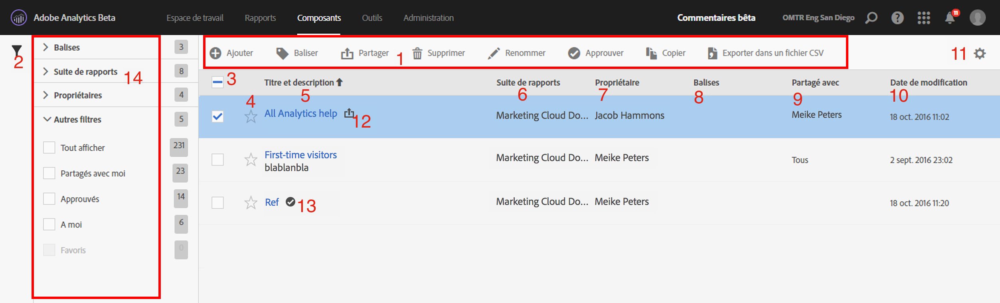
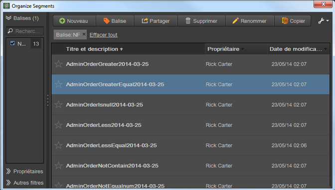

# Gestion des segments

Le Gestionnaire de segments offre plusieurs manières d’organiser les segments, par exemple le partage, le filtrage, le marquage, l’approbation, la copie, la suppression et le marquage en tant favoris.

Le Gestionnaire de segments Analytics vous présente tous les segments que vous possédez et qui ont été partagés avec vous. Les utilisateurs de niveau administrateur peuvent consulter tous les segments de l’entreprise. Cet aperçu présente l’interface utilisateur et les fonctionnalités du Gestionnaire de segments. Accédez au Gestionnaire de segments en procédant comme suit :

* Sélectionnez **[!UICONTROL Analytics]** > **[!UICONTROL Composants]** > **[!UICONTROL Segments]** dans le volet de navigation supérieur.
* Affichez un rapport existant, puis cliquez sur l’icône Segments  dans le volet de navigation de gauche. Cliquez ensuite sur **[!UICONTROL Gérer]**.

## Vidéo pratique {#section_B3C5DA22DC5248DBA17C56E03DA2D4F2}

Cette [vidéo YouTube d’Adobe Analytics](https://www.youtube.com/watch?v=CdfOq98PTrg&amp;index=6&amp;list=PL2tCx83mn7GtHqZicFTa--aE6d02BvvTd) explique brièvement comment utiliser le Gestionnaire de segments.

## Interface utilisateur du Gestionnaire de segments  {#section_7FDCD12949BE4741A402DB83AB7B37DF}

| # | Fonction de l’interface utilisateur | Description |
|---|---|---|
| 1 | Barre d’outils de la gestion des segments | Une fois que vous avez coché un segment, cette barre d’outils s’affiche. La plupart des tâches de gestion peuvent être réalisées depuis cette barre. |
| 2 | Afficher les filtres | Le fait de cliquer sur l’icône Filtrer affiche le menu Filtrer. Vous pouvez filtrer selon les options Balises, Propriétaires, Tout afficher (administrateur uniquement), Le mien, Favoris, Approuvés et Partagés avec moi. |
| 3 | Cases à cocher | Cochez un segment pour le gérer. |
| 4 | Favoris | Le fait de cliquer sur l’étoile en regard d’un segment la rend jaune et marque le segment comme favori. |
| 5 | Titre et description des segments | Fournis dans le Créateur de segments. Pour modifier le titre et la description, cliquez sur le lien du titre : il vous ramène au Créateur de segments. |
| 6 | Suites de rapports | Cette colonne indique dans quelle suite de rapports le segment a été enregistré en dernier. |
| 7 | Propriétaire | Indique qui possède le segment. En tant que non administrateur, vous ne pouvez consulter que les segments que vous possédez ou ceux qui ont été partagés avec vous. |
| 8 | Balises (non cochées dans le sélecteur de colonnes, de ce fait, la colonne n’apparaît pas) | Les balises qui ont été appliquées au segment, soit par vous, soit par des personnes qui ont partagé le segment avec vous. |
| 9 | Partagé avec | Répertorie les individus ou les groupes (administrateur uniquement) ou toutes les personnes (administrateur uniquement) avec lesquelles vous avez partagé le segment. |
| 10 | Date de modification | Affiche la date de la dernière modification du segment. |
| 11 | Sélecteur de colonnes | Permet de sélectionner ou désélectionner des colonnes dans le Gestionnaire de segments. |
| 12 | Icône Partagé | Indique que ce segment est partagé par ou avec vous. |
| 13 | Icône Approuvé | Indique que ce segment a été approuvé par un administrateur. |
| 14 | Filtres | Permet d’afficher et de sélectionner les filtres sous Balises, Suites de rapports, Propriétaires et Autres (Afficher tout, À moi, Partager avec moi, Approuvés, Favoris). |

## Gestionnaires de segments dans les analyses ad hoc {#section_CC8BDC968EBC4BC1919870869D8443A9}

L’Organisateur de segments des analyses ad hoc présente tous les segments que vous possédez et ceux partagés avec vous.

Pour accéder à l’Organiseur de segments dans [!DNL ad hoc analysis] :

* Cliquez sur l’onglet **[!UICONTROL Segments]** du panneau de gauche, puis sur l’icône en forme de clé à molette  et sélectionnez **[!UICONTROL Organiser les segments]** dans le menu.

Tout comme le Gestionnaire de segments dans l’interface utilisateur Web, cette console fournit plusieurs fonctionnalités, notamment le partage, le filtrage, le marquage, l’approbation, la copie, la suppression et le marquage en tant que favoris des segments.
