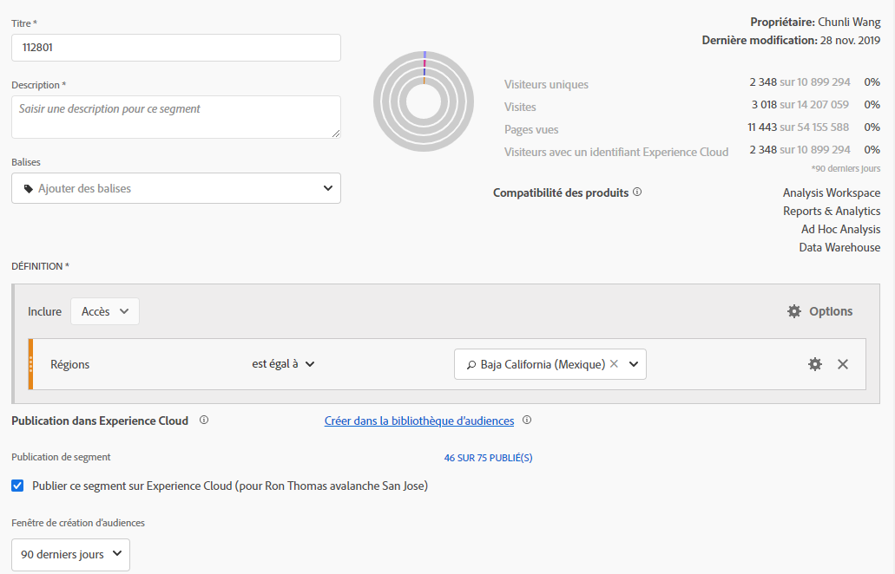
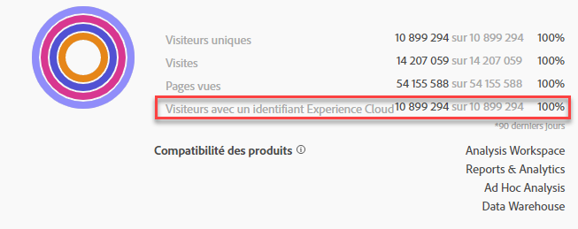
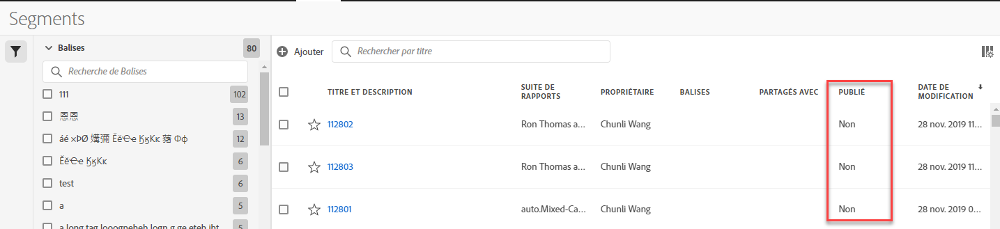

# Publication de segments dans Experience Cloud

Publishing a segment to the Experience Cloud lets you use the segment for marketing activity in the [!UICONTROL Audience Library], [!DNL Target], [!DNL Audience Manager], [!DNL Advertising Cloud], and [!DNL Campaign]. Les mises à jour récentes ont considérablement optimisé le processus de publication. Auparavant, la publication d’un segment utilisable prenait environ 48 heures.

Désormais, le traitement peut prendre jusqu’à 8 heures, mais en fonction du trafic et de la taille du segment, il peut être encore plus rapide. (Toutefois, nous n’avons actuellement pas de moyen de vous informer du moment où le segment est disponible. Vous devrez donc le vérifier manuellement.) Nous avons également porté le nombre maximum de segments publiables à 75 (contre 20). Vous pouvez afficher les segments publiés dans Composants > Segments.

> [!NOTE] Adobe Campaign (Classic et Standard) se comporte différemment dans le sens où il génère une latence supplémentaire de 24 heures en plus de la latence de 8 heures.

## Conditions préalables

* Vérifiez si la suite de rapports dans laquelle vous enregistrez ce segment est [activée pour Experience Cloud](https://docs.adobe.com/content/help/en/core-services/interface/audiences/t-publish-audience-segment.html). Sinon, vous ne pouvez pas la publier dans Experience Cloud.
* Vérifiez que vous travaillez dans une suite de rapports [mappée à votre ](https://docs.adobe.com/content/help/en/core-services/interface/about-core-services/report-suite-mapping.html)organisation Experience Cloud.
* Assurez-vous que votre entreprise utilise des Experience Cloud ID.
* Before you can publish segments, your Admin needs to assign the [!UICONTROL Segment Publishing] permission to a product profile in the [Admin Console](https://docs.adobe.com/content/help/en/core-services/interface/manage-users-and-products/admin-getting-started.html), and add you to the product profile.

## Considérations

* **Limites de suites de rapports** : vous pouvez publier jusqu’à 75 segments par suite de rapports. Cette limite est appliquée. Si 75 segments ont déjà été publiés, vous ne pouvez pas en publier d’autres tant que vous n’avez pas annulé la publication de suffisamment de segments pour arriver sous le seuil de 75 segments.
* **Limites d’abonnements** : les audiences partagées avec [!DNL Experience Cloud] depuis Analytics ne doivent pas dépasser 20 millions de membres.
* **Confidentialité des données** : les audiences ne sont pas filtrées d’après l’état d’authentification d’un visiteur. Si un visiteur peut parcourir votre site qu’il soit authentifié ou non, les actions qui se produisent lorsqu’il n’est pas authentifié peuvent avoir pour conséquence que le visiteur est inclus dans une audience. Examinez la [politique de confidentialité d’Adobe Experience Cloud](https://www.adobe.com/privacy/experience-cloud.html) pour bien comprendre toutes les implications du partage des audiences en matière de confidentialité.
* Pour une discussion sur les **différences entre les segments dans[!DNL Adobe Analytics]et[!DNL Audience Manager]**, consultez[ce lien](https://docs.adobe.com/content/help/en/analytics/integration/audience-analytics/audience-analytics-workflow/aam-analytics-segments.html).

## Journal de publication des segments

| Ce qui est disponible | Lorsqu’il est disponible | Où il est disponible |
|---|---|---|
| Métadonnées (titre et définition du segment) | Immédiatement après la publication | [!DNL Audience Manager], [!UICONTROL Experience Cloud Audience Library], [!DNL Target] |
| Segment utilisable avec abonnement | Jusqu’à huit heures après la publication | Visionneuse du profil du visiteur dans [!DNL Audience Manager] |
| Caractéristique et population membre | Dans les 24 à 48 heures | [!DNL Audience Manager] |

## Publication de segments dans [!UICONTROL Segment Builder]

1. Navigate to **[!UICONTROL Analytics > Workspace > Components > Segments]> +**
1. Créez un segment dans le [!UICONTROL Segment Builder].
1. Fournissez un titre et une description pour le segment. Sinon, vous ne pourrez pas l’enregistrer.
1. Vérifier la suite **[!UICONTROL Publish this segment to the Experience Cloud (for *de *rapports)]**.

>[!IMPORTANT]
>
>Veillez à utiliser « Visiteurs avec un Experience Cloud ID » lors de l’affichage des aperçus de segments dans Analytics au lieu de l’aperçu du segment total de « visiteurs uniques » lorsque vous comparez des chiffres d’Adobe Analytics aux chiffres d’Audience Manager :
>
>

| Élément | Description |
|---|---|
| **[!UICONTROL Publish this segment to the Experience Cloud (for *<report suite>*)]** | Lorsque cette option est activée, le titre et la définition du segment (c’est-à-dire l’audience du shell aussi souvent utilisée dans les plateformes publicitaires) sont partagés instantanément avec Experience Cloud, tandis que l’adhésion au segment est évaluée et partagée toutes les quatre heures.   Lorsque cette audience est associée à une activité dans [!DNL Target], par exemple, [!DNL Analytics] commence à envoyer les identifiants des visiteurs à inclure dans cette audience Experience Cloud et [!DNL Target]. À ce stade, le nom de l’audience et les données correspondantes commencent à s’afficher sur la page Audiences d’Experience Cloud.   |
| **[!UICONTROL Audience Creation Window]** | La période sélectionnée sert à créer l’audience selon un calendrier variable. Par exemple, « 30 derniers jours » (par défaut) inclut les visiteurs qui se sont qualifiés pour l’audience au cours des 30 derniers jours à compter de la date du jour (PAS à partir de la date d’origine de la création du segment). |
| **[!UICONTROL Create in Audience Library]** | Les segments que vous créez et publiez peuvent être mis à disposition sans latence dans la bibliothèque d’audiences d’Experience Cloud. Ils ne dépendent pas des mises à jour Analytics. Ces segments ne sont pas pris en compte par rapport à votre limite de 75 segments publiés. |
| **[!UICONTROL x of 75 Published]** | Indique le nombre de segments que vous avez publiés dans Experience Cloud. Cliquez sur le lien pour afficher la liste des segments publiés, ainsi que la suite de rapports et le propriétaire qui y sont associés. |
| **[!UICONTROL Save]** | Enregistre ce segment. |

## Annuler la publication ou supprimer des segments

Pour supprimer un segment qui a été publié dans Experience Cloud, vous devez tout d’abord en annuler la publication. Pour annuler la publication d’un segment, il vous suffit **de désactiver la case à cocher** que vous avez cochée pour le publier.

> [!NOTE]Vous **ne pouvez pas** annuler la publication d’un segment qui est actuellement utilisé par l’une des solutions Adobe suivantes : [!DNL Analytics] (dans [!DNL Audience Analytics]), [!DNL Campaign], [!DNL Advertising Cloud] (pour les utilisateurs de [!DNL Core Service] et d’[!DNL Audience Manager]) et tous les autres partenaires externes (pour les utilisateurs de [!DNL Audience Manager]). Vous **pouvez** annuler la publication d’un segment utilisé par [!DNL Target].

## View segment publishing status in the [!UICONTROL Segment Manager]

1. Accédez à [!UICONTROL Analytics > Components > Segments].
1. Notice the new [!UICONTROL Published] column. Oui/Non indique si le segment a été publié ou non dans Experience Cloud.

## Récupérer l’[!DNL Audience Manager]UUID

Il existe deux manières de capturer l’UUID AAM actuellement associé au navigateur :

* Adobe Experience Cloud Debugger
* Outil de développement natif dans les navigateurs (par exemple, Chrome Developer Tools)

Les captures d’écran suivantes montrent comment récupérer l’UUID AAM sur votre navigateur et l’utiliser dans la visionneuse du profil du visiteur d’Audience Manager pour valider la caractéristique et l’adhésion à un segment.

**Méthode 1 : utiliser Adobe Experience Cloud Debugger**

1. Téléchargez et installez [Adobe Experience Cloud Debugger](https://docs.adobe.com/content/help/en/analytics/implementation/testing-and-validation/debugger.html) dans Chrome Web Store.
1. Lancez le débogueur lors du chargement d’une page.
1. Accédez à la section Audience Manager et recherchez l’UUID AAM défini sur la page du navigateur actuelle
(`50814298273775797762943354787774730612` dans l’exemple ci-dessous).

**Méthode 2 : utiliser Chrome Developer Tools (ou les outils de développement d’un autre navigateur)**

1. Lancer Chrome Developer Tools avant le chargement d’une page
1. Chargez la page et cochez Applications > Cookies. L’UUID AAM doit être défini dans le cookie tiers
Demdex ([adobe.demdex.net](https://marketing.adobe.com/resources/help/en_US/aam/demdex-calls.html) dans l’exemple ci-dessous). Le champ Demdex est l’UUID AAM défini sur le
navigateur (`50814298273775797762943354787774730612` dans l’exemple ci-dessous).

## Utiliser  Gestionnaire  de [!UICONTROL Visitor Profile Viewer]

The AAM UUID on the browser will be used by default when [!UICONTROL Visitor Profile Viewer] is loaded. If verifying trait realizations for other users, input a UUID in the UUID field and click [!UICONTROL Refresh]. Consultez [Visionneuse du profil du visiteur](https://marketing.adobe.com/resources/help/en_US/aam/t_visitor_profile_viewer.html) pour plus d’informations.

## Afficher les caractéristiques du segment dans [!DNL Audience Manager]

Dans AAM, la liste des visiteurs avec des ECID pour un segment donné est évaluée en flux continu, étant donné qu’Analytics partage des segments avec Experience Cloud.

1. À [!DNL Audience Manager]l&#39;intérieur, allez [!UICONTROL Audience Data > Traits > Analytics Traits]. Un dossier s’affiche pour chaque suite de rapports Analytics associée à votre organisation Experience Cloud. Ces dossiers (pour Caractéristiques, Segments et Sources de données) sont créés lorsque le service principal Profils et audiences / Personnes est lancé ou mis en service.
1. Sélectionnez le dossier de la suite de rapports dans laquelle vous avez créé le segment que vous souhaitez partager avec [!DNL Audience Manager]. Vous verrez le segment/l’audience que vous avez créé. Lorsque vous partagez un segment, deux choses se produisent dans [!DNL Audience Manager] :
* Une caractéristique est créée, tout d’abord sans contenir de données. Environ Huit heures après la publication du segment dans [!DNL Analytics], la liste des ECID est intégrée et partagée avec [!DNL Audience Manager] et d’autres solutions Experience Cloud.

* Un segment à caractère unique est créé. Il utilise la source de données associée à la suite de rapports dans laquelle vous avez publié le segment.
* L’expiration des caractéristiques est désormais définie sur 16 jours (il s’agissait auparavant de 2 jours).

## Afficher le segment dans [!DNL Adobe Target]

The [!UICONTROL Publish this segment to the Experience Cloud] checkbox during the segment creation process in Adobe Analytics allows the segment to be available within the Adobe Target&#39;s custom audience library. Un segment créé dans Analytics ou dans Audience Manager peut être utilisé pour des activités dans Target. Vous pouvez par exemple créer des activités de campagne d’après les mesures de conversion d’Analytics et les segments d’audience créés dans Analytics.
], click [!UICONTROL Audiences].
1. Sur la page [!UICONTROL Audiences], recherchez l’audience provenant d’[!DNL Experience Cloud]. Ces audiences peuvent être utilisées dans des activités [!DNL Target].

