# Création des segments séquentiels

Les segments séquentiels sont créés à l’aide de l’opérateur ALORS, au lieu de ET ou OU. ALORS implique l’apparition d’un critère de segment, suivi d’un autre. Par défaut, un segment séquentiel identifie toutes les données correspondantes, en affichant le filtre « Inclure tout le monde ». Les segments séquentiels peuvent être filtrés davantage pour obtenir un sous-ensemble d’accès correspondants en utilisant les options « Seulement avant la séquence » et « Seulement après la séquence ».

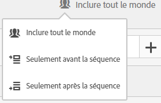

De plus, vous pouvez contraindre des segments séquentiels à une durée spécifique, une granularité donnée et un nombre d’accès entre des points de contrôle en utilisant les [opérateurs Après et Dans](/help/components/c-segmentation/c-segmentation-workflow/seg-sequential-build.md).

## Inclure tout le monde {#section_75ADDD5D41F04800A09E592BB2940B35}

Lors de la création d’un segment pour lequel « Inclure tout le monde » est sélectionné, le segment identifie les chemins correspondant au modèle donné dans son ensemble. Il s’agit d’un exemple de segment de séquence de base qui recherche un accès (page A) suivi d’un autre (page B) tel que visité par le même. Le segment est défini sur Inclure tout le monde.

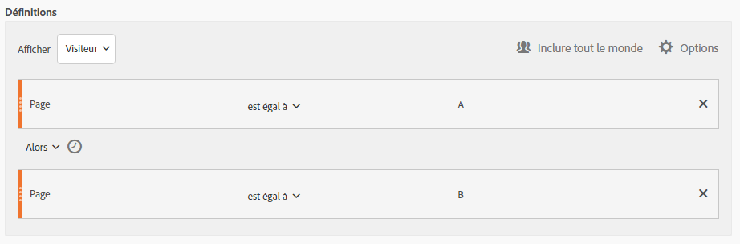

| Si le résultat… | Séquence |
|--- |--- |
| Correspond à | A puis B A puis B (lors d’une autre visite) A puis D puis B |
| Ne correspond pas à | B puis A |

## Seulement avant la séquence et Seulement après la séquence  {#section_736E255C8CFF43C2A2CAAA6D312ED574}

Options **[!UICONTROL Only Before Sequence]** et **[!UICONTROL Only After Sequence]** filtrez le segment vers un sous-ensemble de données avant ou après la séquence spécifiée.

* **Seulement avant la séquence :** inclut tous les accès avant une séquence + le premier accès de la séquence elle-même (voir les exemples 1 et 3). Si une séquence apparaît plusieurs fois dans un chemin, « Seulement avant la séquence » inclut le premier accès de la dernière occurrence de la séquence et tous les accès précédents (voir l’exemple 2).
* **Seulement après la séquence :** inclut tous les accès après une séquence + le dernier accès de la séquence elle-même (voir les exemples 1 et 3). Si une séquence apparaît plusieurs fois dans un chemin, « Seulement après la séquence » inclut le dernier accès de la première occurrence de la séquence et tous les accès suivants (voir l’exemple 2).

Prenons l’exemple d’une séquence B -> D. Les trois  identifieraient les accès comme suit :

**Exemple 1 : B puis D apparaît une fois**

| Exemple | A  | B | C  | D | E | Ve |
|---|---|---|---|---|---|---|
| Inclure tout le monde | A  | B | C  | D | E | Ve |
| Seulement avant la séquence | A  | B |  |  |  |  |
| Seulement après la séquence |  |  |  | D | E | Ve |

**Exemple 2 : B puis D apparaît plusieurs fois**

| Exemple | A  | B | C  | D | B | C  | D | E |
|---|---|---|---|---|---|---|---|---|
| Inclure tout le monde | A  | B | C  | D | B | C  | D | E |
| Seulement avant la séquence | A  | B | C  | D | B |  |  |  |
| Seulement après la séquence |  |  |  | D | B | C  | D | E |

Formulons également ce concept avec la dimension de Détail des accès.

**Exemple 3 : Détail des accès sur 3 puis sur 5**

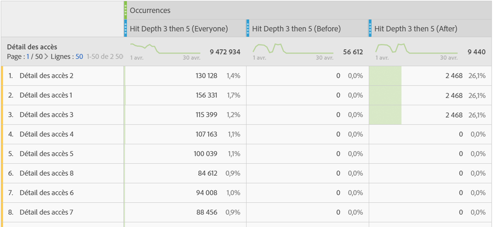

## Contraintes de dimension {#section_EAFD755F8E674F32BCE9B642F7F909DB}

Dans une clause « dans » entre des instructions ALORS, vous pouvez ajouter par exemple « dans une instance de mot-clé de recherche », « dans une instance eVar 47 ». Le segment est ainsi limité à une instance d’une dimension.

Définir une clause « Dans la dimension » entre des règles permet à un segment de limiter les données aux séquences où cette clause est satisfaite. Voir l’exemple ci-dessous où la contrainte est définie sur « Dans 1 Page » :

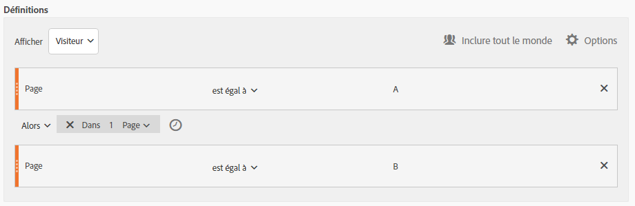

| Si le résultat… | Séquence |
|--- |--- |
| Correspond à | A puis B |
| Ne correspond pas à | A puis C puis B (car B ne se trouvait pas à moins d’une page de A) **Remarque ** : si la restriction de dimension est levée, « A puis B » et « A puis C puis B » correspondent tous les deux. |

## Séquence simple de pages vues

Identifiez les qui ont consulté une page, puis une autre page. Les données au niveau de l’accès filtrent cette séquence indépendamment des sessions précédentes, intermédiaires ou de visite précédente ou de l’heure ou du nombre de  de page qui se produisent entre les deux.

**Exemple** : le visiteur a consulté la page A, puis la page B au cours de la même visite ou d’une autre.

**Cas d’utilisation**

Vous trouverez ci-dessous des exemples d’utilisation du segment.

1. d&#39;un site de sports lede football et puis de la  de basketball, puis de la  de basket dans l&#39;ordre séquentiel, mais pas nécessairement lors de la même visite. Ceci invite à une campagne pour pousser le contenu du basket vers les spectateurs de football pendant la saison de football.
1. Le concessionnaire automobile identifie une relation entre ceux qui accèdent à la page de fidélité du client, puis à la page vidéo à tout moment pendant la visite ou une autre visite.

**Créer ce segment**

You nest two page rules within a top-level [!UICONTROL Visitor] container and sequence the page hits using the [!UICONTROL THEN] operator.

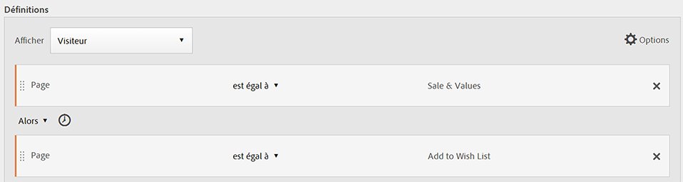

## Séquence de visiteur entre plusieurs visites

Identifiez les visiteurs qui ont abandonné une campagne, mais sont revenus à la séquence de pages vues au cours d’une autre session.

**Exemple** : le visiteur a consulté la page A lors d’une session, puis la page B au cours d’une autre.

**Cas d’utilisation**

Vous trouverez ci-dessous des exemples d’utilisation de ce type de segment :

* Les de la page Sports d’un site d’actualités revisitent ensuite la page Sports lors d’une autre session.
* Un détaillant de vêtements voit une relation entre les qui atterrissent sur un au cours d&#39;une session, puis se rendent directement sur la page de passage en caisse lors d&#39;une autre session.

**Créer ce segment**

This example nests two **[!UICONTROL Visit]** containers within the top-level **[!UICONTROL Visitor]** container and sequences the segment using the [!UICONTROL THEN] operator.

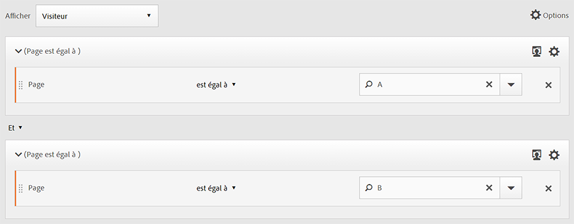

## Séquence de niveau mixte

Identifiez les visiteurs qui consultent deux pages lors d’un nombre indéterminé de visites, puis consultent une troisième page lors d’une autre visite.

**Exemple** : les visiteurs visitent la page A, puis la page B lors d’une ou de plusieurs visites, puis la page C lors d’une autre visite.

**Cas d’utilisation**

Vous trouverez ci-dessous des exemples d’utilisation de ce type de segment :

* Les visitent d’abord un site d’informations, puis  la page des sports au cours de la même visite. Lors d&#39;une autre visite, le visite la page météo.
* Le détaillant définit les qui entrent dans la page principale, puis accèdent à la page Mon compte. Au cours d’une autre visite, ils visitent la page du panier .

**Créer ce segment**

1. Déposez deux dimensions Page depuis les volets de gauche dans un  de niveau [!UICONTROL Visitor] supérieur.
1. Ajouter l’opérateur ALORS entre eux.
1. Cliquez sur **[!UICONTROL Options]** > **[!UICONTROL Add container]** et ajoutez un [!UICONTROL Visit]  sous le [!UICONTROL Visitor] niveau et séquencez-le à l’aide de l’ [!UICONTROL THEN] opérateur.

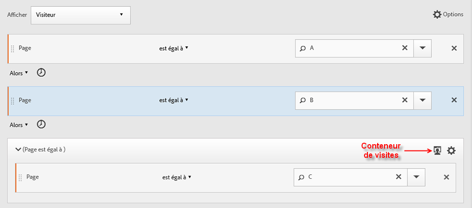

## Agrégat de conteneurs

L’ajout de plusieurs [!UICONTROL Hit]  dans un [!UICONTROL Visitor] vous permet d’utiliser les opérateurs appropriés entre le même type de [!UICONTROL Hit] , ainsi que d’utiliser des règles et des dimensions telles que Page et Nombre de visites pour définir le de page et fournir une dimension de séquence dans le-. L’application de la logique au niveau Accès vous permet de limiter et de combiner des correspondances au même niveau d’accès dans le [!UICONTROL Visitor] pour créer divers types de segments.

**Exemple**: Les ont consulté la page A après le premier accès dans la séquence des  de page (page D dans l’exemple), puis ont consulté la page B ou C sans tenir compte du nombre de visites.

**Cas d’utilisation**

Vous trouverez ci-dessous des exemples d’utilisation de ce type de segment :

* Identifiez les qui se rendent au principal au cours d&#39;une visite, puis  la page des vêtements pour hommes lors d&#39;une autre visite, puis  le pour femmes ou pour enfants lors d&#39;une autre visite.
* Un e-zine capture les qui se rendent au au cours d’une visite, la page Sports au cours d’une autre visite et la page Opinion au cours d’une autre visite.

**Créer ce segment**

1. Sélectionnez le [!UICONTROL Visitor] comme de niveau supérieur.
1. Ajouter à deux [!UICONTROL Hit]niveaux (une dimension avec une dimension numérique appropriée associée au même [!UICONTROL Hit] niveau par l’ [!UICONTROL AND] opérateur et [!UICONTROL OR] ).
1. Dans le [!UICONTROL Visit] , ajoutez un autre  de [!UICONTROL Hit] et imbriquez deux autres [!UICONTROL Hit] , jointes par un opérateur [!UICONTROL OR] ou [!UICONTROL AND] .

   Séquencez ces [!UICONTROL Hit] imbriqués avec l’ [!UICONTROL THEN] opérateur.

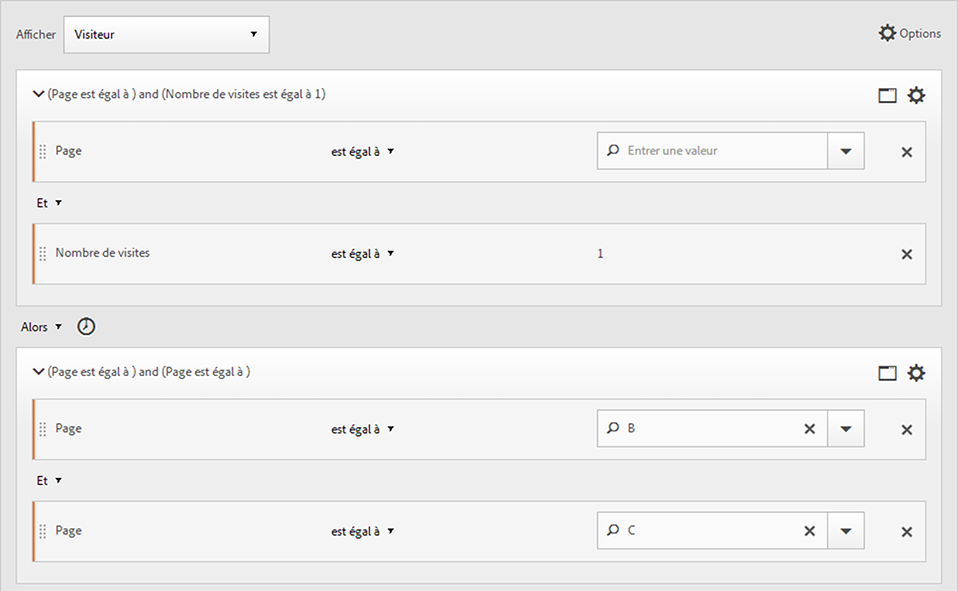

## « Imbrication » dans des segments séquentiels

By placing checkpoints at both the [!UICONTROL Visit] and [!UICONTROL Hit] level, you can constrain the segment to meet requirements within a specific visit as well as a specific hit.

**Exemple** : le visiteur a consulté la page A, puis la page B au cours de la même visite. Au cours d’une nouvelle visite, le visiteur a accédé à la page C.

**Créer ce segment**

1. Underneath a top-level [!UICONTROL Visit] container, drag in two page dimensions.
1. Sélectionnez plusieurs fois les deux règles, cliquez sur **[!UICONTROL Options]** > **[!UICONTROL Add container from selection]** et remplacez-la par un [!UICONTROL Visit] .
1. Rejoignez-les avec un [!UICONTROL THEN] opérateur.
1. Créez un d’accès en tant qu’homologue de l’ de [!UICONTROL Visit] et faites glisser une dimension de page.
1. Associez la séquence imbriquée dans le  [!UICONTROL Visit] du au  de la [!UICONTROL Hit] à l’aide d’un autre [!UICONTROL THEN] opérateur.

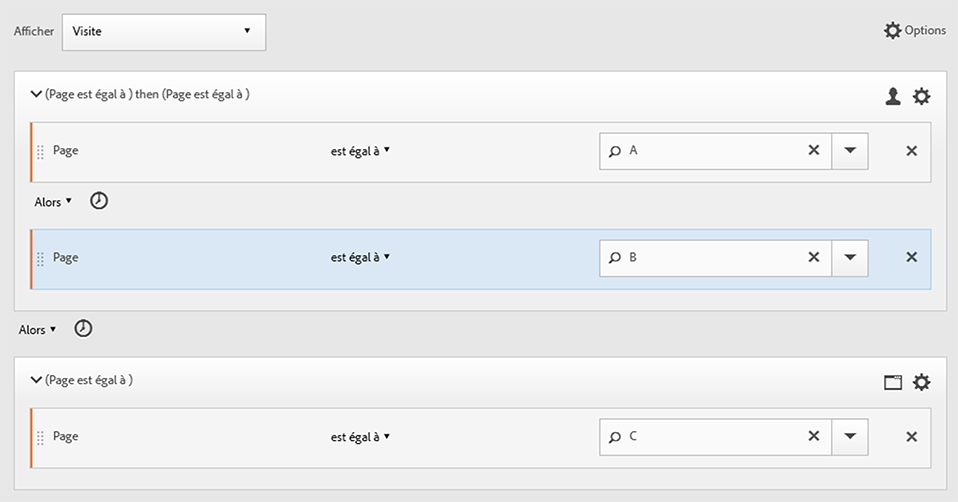

## Exclure les accès

Les règles de segmentation incluent toutes les données, sauf si vous excluez spécifiquement [!UICONTROL Visitor], [!UICONTROL Visit]ou [!UICONTROL Hit] les données à l’aide de la [!UICONTROL Exclude] règle. Il vous permet d’ignorer les données courantes et de créer des segments plus ciblés. Cela vous permet également de créer des segments qui excluent les groupes trouvés afin d’identifier le jeu de données restant ; il peut s’agir, par exemple, de la création d’une règle qui inclut les visiteurs qui ont passé des commandes, puis les exclut afin d’identifier les simples visiteurs (en d’autres termes, les « non-acheteurs »). Cependant, dans la plupart des cas, il est préférable de créer des règles qui excluent des valeurs générales plutôt que d’essayer d’utiliser la [!UICONTROL Exclude] règle pour des valeurs d’inclusion spécifiques.

Par exemple :

* **Exclure les pages**. Utilisez une règle de segmentation afin d’exclure une page spécifique  *`Home Page`*) d’un rapport. Créez une règle Accès dans laquelle la page est égale à « Page d’accueil », puis excluez-la. Cette règle inclut automatiquement toutes les valeurs, à l’exception du  de.
* **Exclure les domaines** référents. Utilisez une règle qui inclut uniquement les domaines référents de Google.com et exclut tous les autres.
* **Identifiez les non-acheteurs**. Déterminez quand les commandes sont supérieures à zéro, puis excluez la [!UICONTROL Visitor].

L’ [!UICONTROL Exclude] opérateur peut être utilisé pour identifier une séquence dans laquelle des visites ou des accès spécifiques ne sont pas effectués par le. [!UICONTROL Exclude Checkpoints] peut également être inclus dans un groupe [logique](/help/components/c-segmentation/c-segmentation-workflow/seg-sequential-build.md).

### Exclure entre les points de contrôle

Impose la logique de segmentation des visiteurs lorsqu’un point de contrôle ne s’est pas produit explicitement entre deux autres.

**Exemple** : les visiteurs qui ont visité la page A, puis la page C mais pas la page B.

**Cas d’utilisation**

Vous trouverez ci-dessous des exemples d’utilisation de ce type de segment :

* à une page Style de vie, puis à la section Théâtre sans accéder à la page Arts.
* Un concessionnaire automobile voit une relation entre ceux qui visitent le  principal et qui passent directement à la campagne Sans intérêt sans accéder à la page Véhicule.

**Créer ce segment**

Créez un segment comme vous le feriez pour un segment  simple, mixed-level, or nested sequential segment and then set the [!UICONTROL EXCLUDE] operator for the container element. L’exemple ci-dessous est un segment   où les trois [!UICONTROL Hit] sont déplacés vers le canevas, l’ [!UICONTROL THEN] opérateur affecté à la logique du, puis excluent le de la page intermédiaire pour n’inclure que les qui sont passés de la page A à la page C dans la séquence.

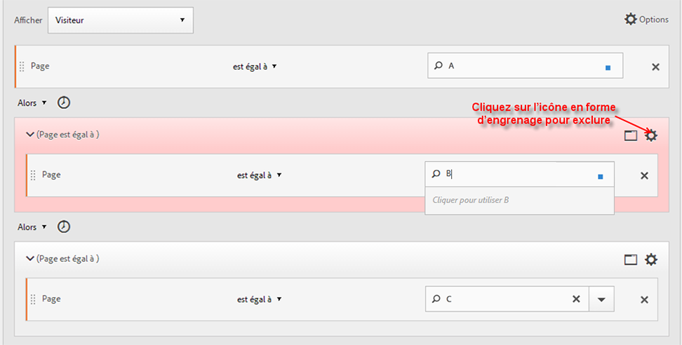

### Exclure au début d’une séquence

Si le point de contrôle d’exclusion se situe au début d’un segment séquentiel, cette option s’assure qu’une page exclue n’a pas été vue avant le premier accès non exclu.

**Exemple** : le visiteur a visité la page A et non la page B.

**Cas d’utilisation**

Vous trouverez ci-dessous des exemples de cas d’utilisation de ce type de segment :

* qui ont consulté la page A et n’ont pas consulté la page B.
* Un restaurant souhaite voir les utilisateurs chevronnés qui évitent le principal et qui accèdent directement à la page Commande à l’extérieur.

**Créer ce segment**

Créez deux  d’accès distincts au sein d’un  de de niveau supérieur. Définissez ensuite l’ [!UICONTROL EXCLUDE] opérateur pour le premier  de.

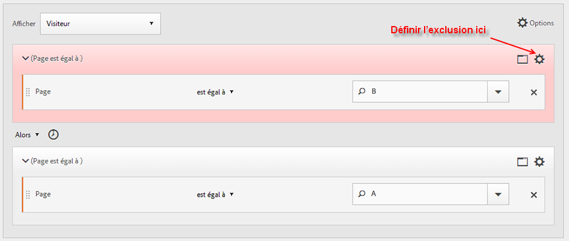

### Exclure en fin de séquence

Si le point de contrôle d’exclusion se situe à la fin d’une séquence, cette option s’assure que le point de contrôle ne s’est pas produit entre le dernier point non exclu et la fin de la séquence du visiteur.

**Exemple** : les visiteurs ont consulté la page A, mais n’ont pas, par la suite, consulté la page B, que ce soit lors de la visite en cours ou de visites ultérieures.

**Cas d’utilisation**

Vous trouverez ci-dessous des exemples d’utilisation de ce type de segment :

* qui ont consulté la page A et n’ont pas consulté la page B.
* Un restaurant souhaite voir les utilisateurs chevronnés qui évitent le principal et qui accèdent directement à la page Commande à l’extérieur.

**Créer ce segment**

Build a simple sequence segment by dragging two [!UICONTROL Hit] containers to the canvas and connecting them using the [!UICONTROL THEN] operator. Then assign the [!UICONTROL EXCLUDE] operator to the second [!UICONTROL Hit] container in the sequence.

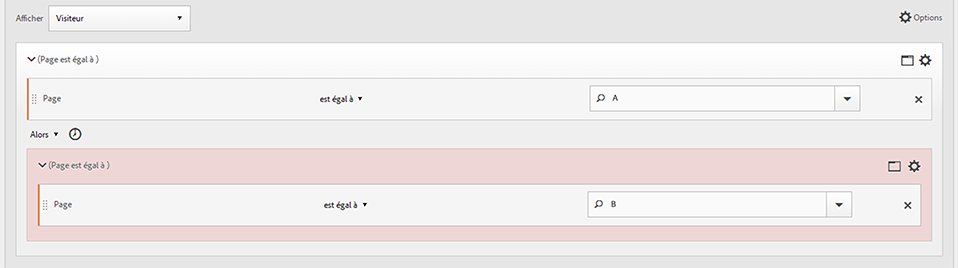

## Conteneurs Groupe logique

Les conteneurs Groupe logique sont nécessaires pour regrouper des conditions dans un point de contrôle de segment séquentiel unique. Le conteneur Groupe logique spécial n’est disponible que dans la segmentation séquentielle, afin de garantir que ses conditions sont remplies après tout point de contrôle séquentiel précédent et avant tout point de contrôle séquentiel suivant. Les conditions dans le point de contrôle du groupe logique lui-même peuvent être remplies dans n’importe quel ordre. En revanche, les conteneurs non séquentiels (accès, visite, visiteur) ne nécessitent pas que leurs conditions soient remplies dans la séquence globale, ce qui produit des résultats non intuitifs s’ils sont utilisés avec un opérateur ALORS.
The [!UICONTROL Logic Group] container was designed to treat *several checkpoints as a group*, *without any ordering* among the grouped checkpoints. En d’autres termes, nous ne nous soucions pas de l’ordre des points de contrôle dans ce groupe. For example, you can&#39;t nest a [!UICONTROL Visitor] container within a [!UICONTROL Visitor] container. But instead, you can nest a [!UICONTROL Logic Group] container within a [!UICONTROL Visitor] container with specific [!UICONTROL Visit]-level and [!UICONTROL Hit]-level checkpoints.

>[!NOTE] Une [!UICONTROL Logic Group] variable ne peut être définie que dans un segment séquentiel, ce qui signifie que l’ [!UICONTROL THEN] opérateur est utilisé dans le  .

| Hiérarchie des conteneurs | Illustration | Définition |
|---|---|---|
| Hiérarchie des conteneurs standard |  | Dans le [!UICONTROL Visitor] , les  [!UICONTROL Visit] et [!UICONTROL Hit] le sont imbriqués de manière séquentielle afin d’extraire les segments en fonction des accès, du nombre de visites et du. |
| Hiérarchie de conteneurs logiques |  | La hiérarchie de  standard est également requise en dehors du [!UICONTROL Logic Group] de. Mais à l&#39;intérieur du [!UICONTROL Logic Group] , les points de contrôle ne nécessitent pas d&#39;ordre ou de hiérarchie établi : ces points de contrôle doivent simplement être respectés par le dans n&#39;importe quel ordre. |

Les groupes logiques peuvent sembler décourageants. Voici quelques bonnes pratiques pour les utiliser :

**Groupe logique ou conteneur Accès/Visite ?**
Si vous souhaitez regrouper des points de contrôle séquentiels, alors votre « conteneur » est Groupe logique. Toutefois, si ces points de contrôle séquentiels doivent se produire dans le cadre d’un accès ou d’une visite unique, des conteneurs « d’accès » ou « de visites » sont requis. (Bien sûr, un « accès » n’a aucun sens pour un groupe de points de contrôle séquentiels, lorsqu’un accès ne peut pas créditer plus d’un point de contrôle).

**Les groupes logiques simplifient-ils la création de segments séquentiels ?**
Oui, ils le peuvent. Supposons que vous essayiez de répondre à la question suivante : **Un visiteur a-t-il consulté la page B, la page C ou la page D après la page A ?**

Vous pouvez créer ce segment sans conteneur Groupe logique, mais cette opération est complexe et fastidieuse :
* `Visitor Container [Page A THEN Page B THEN Page C THEN Page D] or`
* `Visitor Container [Page A THEN Page B THEN Page D THEN Page C] or`
* `Visitor Container [Page A THEN Page C THEN Page B THEN Page D] or`
* `Visitor Container [Page A THEN Page C THEN Page D THEN Page B] or`
* `Visitor Container [Page A THEN Page D THEN Page B THEN Page C] or`
* `Visitor Container [Page A THEN Page D THEN Page C THEN Page B]`

Un conteneur Groupe logique simplifie considérablement la création de ce segment, comme illustré ici :

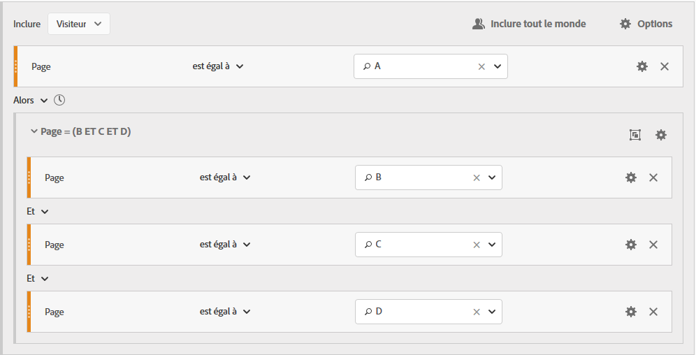

### Créer un segment Groupe logique {#section_A5DDC96E72194668AA91BBD89E575D2E}

Comme d&#39;autres  de, [!UICONTROL Logic Group] les  de peuvent être construits de multiples façons au sein du [!UICONTROL Segment Builder]. Voici une méthode privilégiée pour imbriquer des [!UICONTROL Logic Group] :

1. Faites glisser des dimensions, des  ou des segments depuis les volets de gauche.
1. Modifiez le  supérieur en  de. [!UICONTROL Visitor]
1. Remplacez l’opérateur [!UICONTROL AND] ou [!UICONTROL OR] inséré par défaut par l’opérateur ALORS.
1. Sélectionnez le [!UICONTROL Hit] (Dimension, ou Élément) et cliquez sur **[!UICONTROL Options]** > **[!UICONTROL Add container from selection]**.
1. Click the container icon and select **[!UICONTROL Logic Group]**.  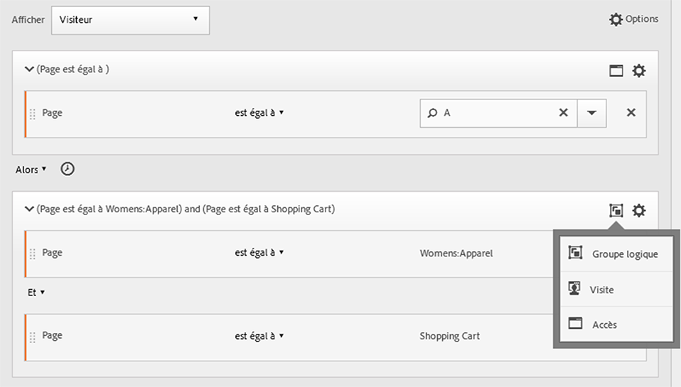
1. You can now set the [!UICONTROL Hit] within the [!UICONTROL Logic Group] container without regard to hierarchy.

### Points de contrôle du groupe logique dans n’importe quel ordre

Using the [!UICONTROL Logic Group] lets you meet conditions within that group that reside outside of the sequence. This allows you to build segments where a [!UICONTROL Visit] or [!UICONTROL Hit] container happens irrespective of the normal hierarchy.

**Exemple** : visiteurs ayant consulté la page A, puis les pages B et C, dans n’importe quel ordre.

**Créer ce segment**

Page B and C are nested in a [!UICONTROL Logic Group] container within the outer [!UICONTROL Visitor] container. The [!UICONTROL Hit] container for A is then followed by the [!UICONTROL Logic Group] container with B and C identified using the [!UICONTROL AND] operator. Because it is in the [!UICONTROL Logic Group], the sequence is not defined and hitting both page B and C in any order makes the argument true.

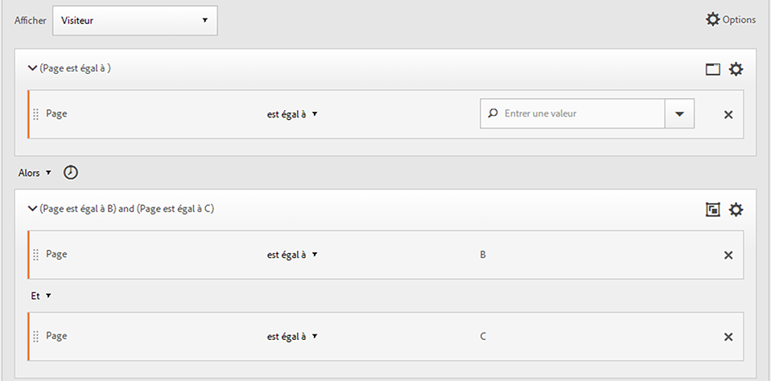

**Autre exemple** : visiteurs qui ont consulté la page B ou C, puis la page A :

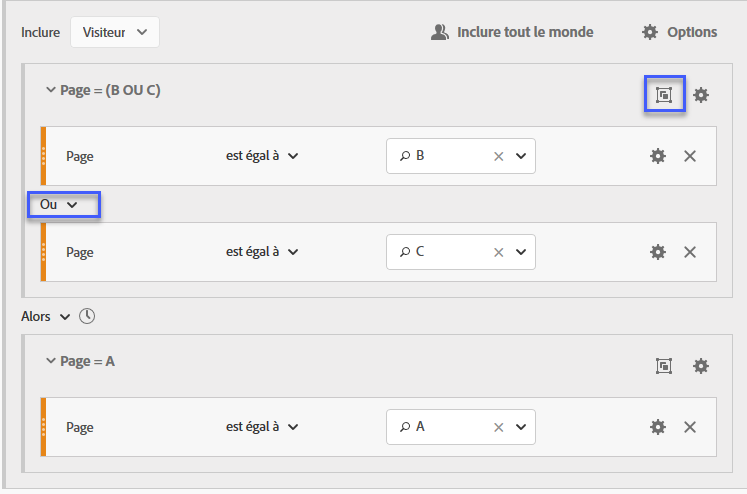

Le segment doit correspondre au moins à l’un des points de contrôle du groupe logique (B ou C). En outre, les conditions du groupe logique peuvent être remplies dans le même accès ou sur plusieurs accès.

### Première correspondance dans le groupe logique

Using the [!UICONTROL Logic Group] lets you meet conditions within that group that reside outside of the sequence. Dans ce segment de première correspondance non ordonné, les [!UICONTROL Logic Group] règles sont d’abord identifiées comme étant un de page de la page B ou C, puis comme étant le requis de la page A.

**Exemple** : visiteurs qui ont consulté la page B ou C, puis la page A.

**Créer ce segment**

Page B and page C dimensions are grouped within a [!UICONTROL Logic Group] container with the [!UICONTROL OR] operator selected, then the [!UICONTROL Hit]container identifying a page view of page A as the value.

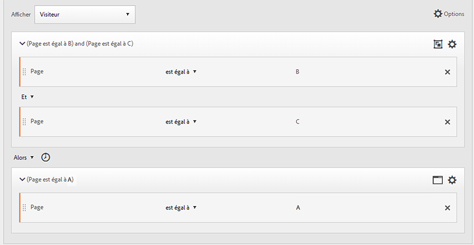

### Opérateur ET d’exclusion du groupe logique

Build segments using the [!UICONTROL Logic Group] where multiple page views are aggregated to define what pages were necessary to be hit while other pages were specifically missed. ****

**Exemple** : le visiteur a consulté la page A, puis n’a pas explicitement consulté la page B ou C, mais a accédé à la page D.

**Créer ce segment**

Créez ce segment en faisant glisser des dimensions, des événements et des segments pré-créés à partir des volets de gauche. Reportez-vous à la section [Création d’un segment Groupe logique](/help/components/c-segmentation/c-segmentation-workflow/seg-sequential-build.md).

Après avoir imbriqué les valeurs dans le [!UICONTROL Logic Group], cliquez sur le **[!UICONTROL Exclude]** bouton dans le [!UICONTROL Logic Group] .

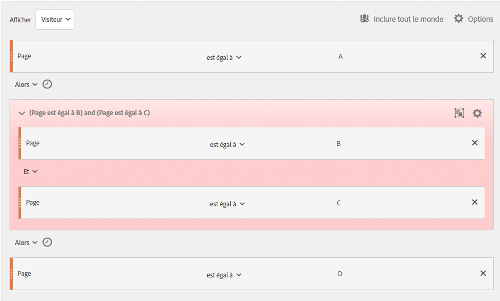

### Opérateur OU d’exclusion du groupe logique

Build segments using the [!UICONTROL Logic Group] where multiple page views are aggregated to define what pages were necessary to be hit while other pages were specifically missed.

**Exemple** : visiteurs ayant consulté la page A mais sans avoir, au préalable, consulté la page B ou C.

**Créer ce segment**

The initial B and C pages are identified in a [!UICONTROL Logic Group] container that is excluded, and then followed by a hit to page A by the visitor.

Créez ce segment en faisant glisser des dimensions, des événements et des segments pré-créés à partir des volets de gauche.

Après avoir imbriqué les valeurs dans le [!UICONTROL Logic Group], cliquez sur le **[!UICONTROL Exclude]** bouton dans le [!UICONTROL Logic Group] .

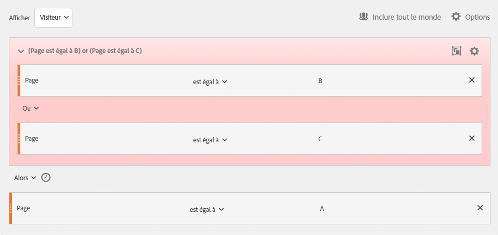

## Création de segments Durée-Dans et Durée-Après

Utilisez les opérateurs [!UICONTROL Within] et [!UICONTROL After] intégrés à l’en-tête de chaque pour définir l’heure, le et le nombre.

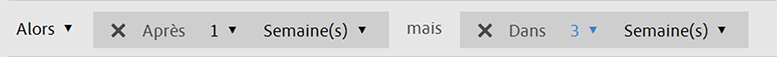

Vous pouvez limiter la correspondance à une durée spécifiée à l’aide des  [!UICONTROL Within] et du [!UICONTROL After] et en spécifiant une granularité et un nombre. The [!UICONTROL Within] operator is used to specify a max limit on the amount of time between two checkpoints. The [!UICONTROL After] operator is used to specify a minimum limit on the amount of time between two checkpoints.

### Opérateurs Après et Dans  {#section_CCAF5E44719447CFA7DF8DA4192DA6F8}

La durée est spécifiée par une seule lettre majuscule représentant la granularité, suivie d’un nombre indiquant le nombre de répétitions de la granularité.

**[!UICONTROL Within]** inclut le point de fin (inférieur ou égal à).

**[!UICONTROL After]** n’inclut pas le point de fin (supérieur à).

| Opérateurs | Description |
|--- |--- |
| APRES | L’opérateur Après est utilisé pour spécifier une limite de temps minimale entre deux points de contrôle. Lorsque vous définissez des valeurs Après, la durée commence au moment où le segment est appliqué. Par exemple, si l’opérateur Après est défini sur un conteneur afin d’identifier des visiteurs qui consultent la page A, mais ne visualisent pas la page B avant au moins un jour, ce jour commence au moment où le visiteur quitte la page A. Pour que le visiteur soit inclus dans le segment, au moins 1 440 minutes (soit un jour) doivent s’écouler entre le moment où le visiteur quitte la page A et celui où il consulte la page B. |
| DANS | L’opérateur Dans est utilisé pour spécifier une limite de temps maximale entre deux points de contrôle. Par exemple, si l’opérateur Dans est défini sur un conteneur afin d’identifier les visiteurs qui consultent la page A, puis reviennent sur le site dans les 24 heures, cette période commence au moment où le visiteur quitte la page A. Pour que le visiteur soit inclus dans le segment, il dispose au maximum de 24 heures pour ouvrir la page B. Pour que le visiteur soit inclus dans le segment, la consultation de la page B doit avoir lieu, au maximum, 1 440 minutes (soit un jour) après avoir quitté la page A. |
| APRÈS/DANS | Lorsque vous utilisez les opérateurs Après et Dans, il importe de comprendre que tous les deux commencent et se terminent en parallèle, et non de manière séquentielle.   Par exemple, si vous créez un segment en définissant le conteneur sur:  `After = 1 Week(s) and Within = 2 Week(s)` , les conditions d’identification des visiteurs dans le segment sont réunies uniquement entre 1 et 2 semaines. Les deux conditions sont appliquées à compter du premier accès à la page. |

### Utilisation de l’opérateur Après

* Le rapport Durée après vous permet d’effectuer un suivi par année, mois, jour, heure et minute pour établir une correspondance avec les visites.
* L’option Après ne peut être appliquée qu’à un [!UICONTROL Hit] , car il s’agit du seul niveau pour lequel une granularité aussi fine est définie.

**Exemple** : visiteurs qui ont consulté la page A, puis seulement la page B après 2 semaines.****

**Créez le segment**: Ce segment est créé en ajoutant un [!UICONTROL Visitor] avec deux  [!UICONTROL Hit] . You can then set the [!UICONTROL THEN] operator, and open the [!UICONTROL AFTER] operator drop down and set the number of weeks.

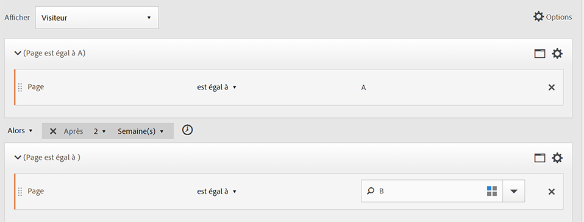

**Correspond à**

Lorsque « Après 2 semaines » est spécifié, si un accès à la page A a lieu le 1er juin 2019 à 00:01, un accès à la page B suivant sera considéré comme une correspondance s’il se produit avant le 15 juin 2019 à 00:01 (14 jours plus tard).

| Accès A | Accès B | Correspondance |
|--- |--- |--- |
| Accès **A** : 1er juin 2019 00:01 | Accès **B** : 15 juin 2019 00:01 | **Correspond à** : cette contrainte temporelle est considérée comme une correspondance, car elle intervient après le 1er juin 2019 (deux semaines). |
| Accès **A** : 1er juin 2019 00:01 | Accès **B** : 8 juin 2019 00:01 Accès B : 15 juin 2019 00:01 | **Ne correspond pas à** : le premier accès à la page B n’est pas considéré comme une correspondance, car il entre en conflit avec la contrainte. |

### Utilisation de l’opérateur Dans

* [!UICONTROL Within] vous permet d’effectuer un suivi par année, mois, jour, heure et minute pour établir une correspondance avec les visites.
* [!UICONTROL Within] ne peut être appliquée qu’à un [!UICONTROL Hit] , car il s’agit du seul niveau pour lequel une granularité aussi fine est définie.

>[!IMPORTANT]
>
>Dans une clause « dans » entre des instructions ALORS, vous pouvez ajouter par exemple « dans une instance de mot-clé de recherche », « dans une instance eVar 47 ». Le segment est ainsi limité à une instance d’une dimension.

**Exemple** : visiteurs ayant consulté la page A, puis la page B dans les cinq minutes.

**Créez le segment**: Ce segment est créé en ajoutant un [!UICONTROL Visitor] [!UICONTROL Hit] de, puis en faisant glisser deux  de. You can then set the [!UICONTROL THEN] operator, and open the [!UICONTROL AFTER] operator drop down and set the interval: hits, page views, visits, minutes, hours, days, weeks, months, quarters, or years.

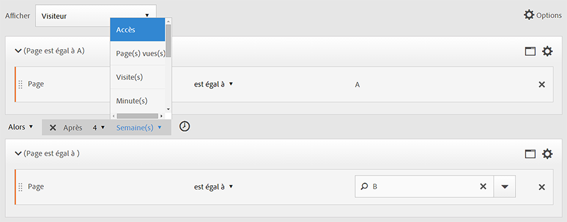

**Correspond à**

Les correspondances doivent se produire dans la limite temporelle définie. Dans le cas de l’expression , si un visiteur accède à la page A à 00:01, un accès ultérieur à la page B sera considéré comme une correspondance pour autant qu’il se produise au plus tard à 00:06 (soit cinq minutes plus tard). Les accès effectués dans la même minute sont également considérés comme des correspondances.

### Opérateurs Dans et Après

Use [!UICONTROL Within] and [!UICONTROL After] to provide a maximum and minimum endpoint at both ends of a segment.

**Exemple** : visiteurs qui ont consulté la page A, puis ont accédé à la page B dans un délai de deux semaines à un mois.

**Créez le segment**: Créez le segment en séquençant deux  [!UICONTROL Hit] dans un  de [!UICONTROL Visitor] . Définissez ensuite les opérateurs [!UICONTROL After] et [!UICONTROL Within] .

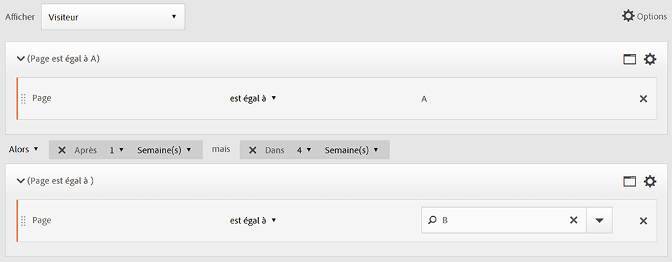

**Correspond à**

Sont inclus dans ce segment tous les visiteurs qui accèdent à la page A le 1er juin 2019 et qui reviennent sur cette page après le 15 juin 2019 à 00:01, mais *avant* le 1er juillet 2019. Comparaison avec le [délai entre les exclusions](/help/components/c-segmentation/c-segmentation-workflow/seg-sequential-build.md).

Les opérateurs [!UICONTROL After] et [!UICONTROL Within] peuvent être utilisés ensemble pour définir un segment séquentiel.

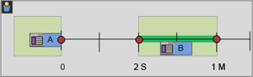

Cet exemple illustre une seconde visite à la page B après deux semaines mais dans un mois.
