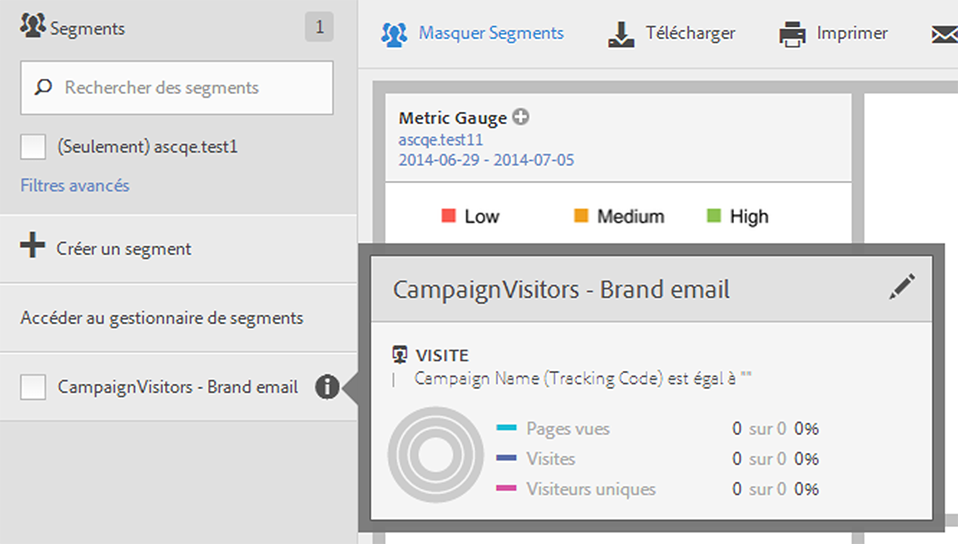
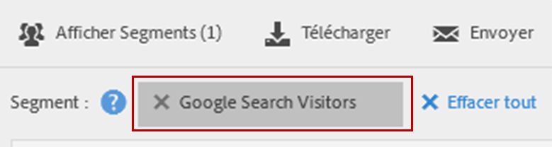

# Sélection et application des segments

Comment appliquer un ou plusieurs segments à un rapport depuis le rail de segments.

1. Faites apparaître le rapport auquel vous souhaitez appliquer un segment, par exemple le [!UICONTROL Rapport sur les pages].
1. Cliquez sur **[!UICONTROL Afficher segments]** au-dessus du rapport. Le rail de segment s’ouvre.

   

1. Cochez la case en regard d’un ou de plusieurs segments ou utilisez l’option **[!UICONTROL Rechercher des segments]** pour trouver le segment approprié.

   >[!NOTE]
   >
   >Vous pouvez appliquer plus d’un segment à un rapport (nommé « empilement de segments »). Lorsque plusieurs segments sont appliqués, les critères de chaque segment sont associés à l’aide de l’opérateur « et », puis appliqués. Le nombre de segments que vous pouvez empiler ne comporte pas de limite.

   >[!NOTE]
   >
   >Le fait de cliquer sur l’icône d’informations (i) en regard du nom du segment permet de prévisualiser les mesures clés afin de vérifier si votre segment est valide et d’en connaître la largeur.

1. Vous pouvez filtrer par suite de rapports en cochant la case **[!UICONTROL (Uniquement)`<report suite name>`]**. Seuls les segments qui ont été enregistrés en dernier dans la suite de rapports s’affichent.
1. Cliquez sur **[!UICONTROL Appliquer un segment]** et le rapport s’actualise. Le segment ou les segments appliqués s’affichent désormais dans la partie supérieure du rapport :

   
