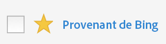

# Marquage des segments comme favoris

Le marquage des segments en tant que favoris est une autre manière de les organiser pour en faciliter l’utilisation.

1. Dans le Gestionnaire de segments, cochez l’étoile en regard des segments que vous souhaitez marquer en tant que favoris. L’étoile devrait maintenant être jaune :

   

1. Vous pouvez également filtrer par favoris en accédant à **[!UICONTROL Filtres]** &gt; **[!UICONTROL Autres filtres]** &gt; **[!UICONTROL Favoris]**.
