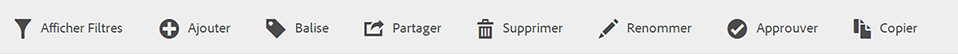
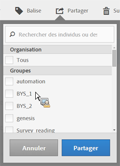

# Partage de segments

Selon vos autorisations, vous pouvez partager des segments avec l’ensemble de l’entreprise, des groupes ou des utilisateurs individuels.

| Administrateur | Peut partager des segments avec l’ensemble de l’entreprise, avec des groupes et avec des utilisateurs. Les groupes sont configurés en tant que groupes d’autorisations dans la console d’administration. |
|---|---|
| Non administrateur | Peut partager les segments uniquement avec des utilisateurs individuels. |

À quel moment devriez-vous partager des segments à l’échelle de l’entreprise au lieu de vous limiter à des groupes d’utilisateurs ou des individus ? Vous trouverez ci-dessous quelques bonnes pratiques que vous pouvez suivre :

* En tant qu’administrateur, partagez un segment avec **[!UICONTROL Tous]s’il est utile à l’ensemble de l’entreprise et si tout le monde sait l’utiliser correctement.** In this case, you should also consider making it an [approved](../../../components/c-segmentation/c-segmentation-workflow/seg-approve.md#concept_DF477F151A9E483A92ED1DDAAF035953) segment.

* En tant qu’administrateur, partagez un segment avec un **[!UICONTROL Groupe]spécifique si le segment offre une valeur ajoutée intéressante à l’équipe en question.** N’approuvez pas officiellement ce type de segment.
* En tant qu’administrateur ou utilisateur individuel, le partage d’un segment avec d’autres individus approuve et valide le segment en question. S’il ne s’avère pas utile, il peut être ignoré. N’approuvez pas officiellement ce type de segment.

1. Dans le Gestionnaire de segments, cochez la case en regard du segment que vous souhaitez partager. La barre d’outils de gestion des segments apparaît :

   

1. Cliquez sur **[!UICONTROL Partager]**.

   

   Si vous êtes administrateur, vous pouvez sélectionner **[!UICONTROL Tous]** ou effectuer une sélection dans les **[!UICONTROL Groupes]et** Utilisateurs] de votre entreprise. **[!UICONTROL ** En tant que non administrateur, vous ne pouvez consulter que les utilisateurs individuels. Utilisez le champ **[!UICONTROL Rechercher]pour rechercher des groupes ou des utilisateurs.** 1. Click **[!UICONTROL Share]**.

   L’icône Partagé s’affiche en regard du segment : 

1. You can filter on segments shared with you by going to **[!UICONTROL Filters]** &gt; **[!UICONTROL Other Filters]** &gt; **[!UICONTROL Shared with Me]**.
