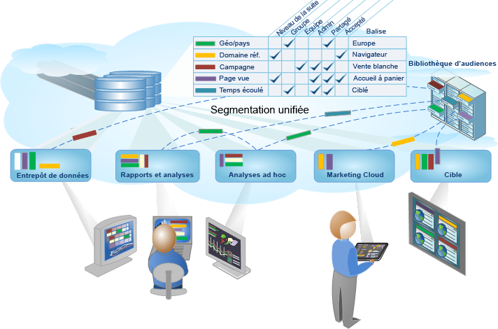

# Segmentation Analytics

Adobe Analytics permet de créer, gérer, partager et appliquer des segments d’audiences, puissants et ciblés, aux rapports à l’aide des fonctionnalités d’Analytics, d’Adobe Experience Cloud, d’Adobe Target et d’autres produits Adobe intégrés.

La segmentation d’Analytics inclue le [Créateur de segments](/help/components/c-segmentation/c-segmentation-workflow/seg-workflow.md) permettant de créer des segments et d’exécuter un pré-test et le [Gestionnaire de segments](/help/components/c-segmentation/c-segmentation-workflow/seg-workflow.md) permettant de collecter, baliser, approuver, définir la sécurité et partager des segments dans l’ensemble de votre organisation.

Les analystes de données et marketing peuvent utiliser, développer et affiner les segments pour les analyses spécifiques à leurs besoins, puis enregistrer le segment pour que d’autres utilisateurs le développent, l’affinent et l’enregistrent en tant que nouveau segment dans la bibliothèque. Une fois lancée, la segmentation est un cycle de conception et de gestion d’informations codées sur les audiences sous la forme  [processus de segments unifiés](/help/components/c-segmentation/c-segmentation-workflow/seg-workflow.md).

**Prise en main**

Commencez par [Configuration d’un processus de segmentation](/help/components/c-segmentation/c-segmentation-workflow/seg-workflow.md) ou [Création de segments](/help/components/c-segmentation/c-segmentation-workflow/seg-build.md), ou encore [À propos des segments](/help/components/c-segmentation/seg-overview.md) pour un aperçu rapide.
