# À propos des segments et des conteneurs

Les segments vous permettent d’identifier des sous-ensembles de visiteurs selon des caractéristiques ou des interactions Web. Les segments sont conçus en tant que connaissances de l’audience codifiées que vous pouvez créer selon vos besoins spécifiques, puis vérifier, modifier et partager avec d’autres membres de l’équipe ou utiliser dans d’autres produits d’Adobe et fonctionnalités d’Analytics.

Les segments sont basés sur une hiérarchie de niveau [!UICONTROL Visiteur], [!UICONTROL Visite] et [!UICONTROL Accès] en utilisant un modèle de conteneur imbriqué. Les conteneurs imbriqués permettent de définir les attributs des visiteurs et les actions en fonction de règles entre et dans les conteneurs. Les segments Analytics peuvent être créés, approuvés, partagés, enregistrés et exécutés dans plusieurs produits et fonctionnalités d’[!DNL Adobe Experience Cloud]. Les segments peuvent être générés depuis un rapport, créés dans un rapport de tableau de bord ou mis en signet pour un accès rapide.

Vous pouvez créer et enregistrer des segments dans le Créateur de segments, ou en générer depuis un rapport d’abandons (dans [!DNL ad hoc analysis]). Vous pouvez également utiliser et développer des segments pré-créés en fonction de règles spécifiques entre les conteneurs imbriqués, permettant de filtrer les résultats et de les appliquer aux rapports. En outre, les segments peuvent être utilisés ensemble en tant que [segments empilés](/help/components/c-segmentation/c-segmentation-workflow/seg-workflow.md).

## Segments {#section_CC4EBA2A6CCB4F8BBB8437052A880657}

Les segments identifient la nature de vos visiteurs (pays, sexe, café-restaurant), les périphériques et services qu’ils utilisent (navigateur, moteur de recherche, périphérique mobile), les pages qu’ils ont parcourues (moteur de recherche, page de sortie, recherche naturelle), et bien plus encore.


Les segments peuvent être basés sur les valeurs suivantes :

* Visiteurs sur la base d’attributs : type de navigateur, périphérique, nombre de visites, pays, sexe.
* Visiteurs sur la base d’interactions : campagnes, recherche par mots-clés, moteur de recherche.
* Visiteurs sur la base des sorties et des entrées : visiteurs provenant de Facebook, d’une page d’entrée définie, d’un domaine référent.
* Visiteurs sur la base de variables personnalisées : champ de formulaire, catégories définies, ID de client.

Lors de la création de segments d’audiences dans le Créateur de segments, vous définissez des conditions en utilisant les opérateurs [!UICONTROL ET] et [!UICONTROL OU] entre les conteneurs.

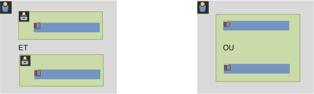

Ce type de segment filtre les jeux de données en fonction de caractéristiques regroupées à l’aide des opérateurs [!UICONTROL ET] et [!UICONTROL OU].

## Segments séquentiels {#section_EE5B14287FC44E0B96E77679A2438948}

Les segments séquentiels permettent d’identifier les visiteurs selon la navigation et la page vue sur votre site, fournissant un segment d’actions et d’interactions définies. Les segments séquentiels permettent d’identifier ce qu’aime un visiteur et ce qu’il évite. Lors de la création de segments séquentiels, l’opérateur [!UICONTROL ALORS] est utilisé pour définir et classer la navigation du visiteur.


| Visite 1 | Visite 2 | Visite 3 |
|---|---|---|
| Lors de la première visite, le visiteur s’est rendu sur la page d’entrée principale (A), a exclu la page de la campagne (B), puis a consulté la page des produits (C). | Lors de la deuxième visite, le visiteur s’est à nouveau rendu sur la page d’entrée principale (A), a exclu la page de la campagne (B), est retourné sur la page des produits (C), puis a consulté une nouvelle page (D). | Lors de la troisième visite, le visiteur a suivi le même chemin que lors des première et deuxième visites, puis a exclu la page F pour se rendre directement à la page des produits ciblés (G). |

Les segments séquentiels peuvent être basés sur les valeurs d’accès suivantes :

* Visiteurs sur la base d’une séquence d’accès aux pages : pages vues lors d’une visite unique, pages vues lors de visites distinctes, visites qui ont exclu les pages vues.
* Visiteurs sur la base de la durée entre et après les pages vues : une fois une durée écoulée, entre des accès, après un événement.

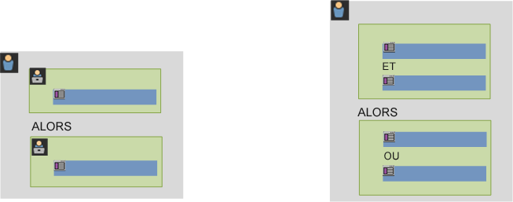

Un segment séquentiel filtre des jeux de données sur la base des actions de l’utilisateur à l’aide de l’opérateur [!UICONTROL ALORS].

## Vidéo pratique {#section_89D6184890AF4086A8056BFBB0B68C29}

Cette vidéo YouTube illustre brièvement ce que sont les conteneurs de segments et donne un bref aperçu de la manière dont les utiliser.

| Nom de la vidéo | Lien de la vidéo |
|---|---|
| Conteneurs de segments | [Conteneurs de segments dans Adobe Analytics](https://www.youtube.com/watch?v=A513j-ej0oc&index=2&list=PL2tCx83mn7GtHqZicFTa--aE6d02BvvTd) |

## À propos des conteneurs {#section_AF2A28BE92474DB386AE85743C71B2D6}

Un segment définit des conditions de filtrage d’un visiteur basées sur ses attributs ou interactions avec votre site. Pour définir des conditions dans un segment, définissez des règles permettant de filtrer les visiteurs selon leurs caractéristiques de visiteur et/ou de navigation. Pour ventiler plus en détail les données du visiteur, vous pouvez filtrer selon des visites spécifiques et/ou les accès aux pages vues pour chaque visiteur. Le Créateur de segments fournit une architecture simple permettant de créer ces sous-ensembles et d’appliquer des règles sous la forme de conteneurs imbriqués, hiérarchiques Visiteur, Visite ou Accès.

L’architecture de conteneur utilisée dans le Créateur de segments définit **[!UICONTROL Visiteur]** en tant que conteneur le plus éloigné, comportant les données principales spécifiques au visiteur pour les visites et les pages vues. Un conteneur **[!UICONTROL Visite]** imbriqué permet de définir des règles pour ventiler les données du visiteur selon les visites, et un conteneur **[!UICONTROL Accès]** imbriqué permet de ventiler les informations du visiteur selon des pages vues spécifiques. Chaque conteneur permet de créer un rapport de l’historique du visiteur, de ses interactions ventilées par visites ou de ses ventilations par accès individuels.

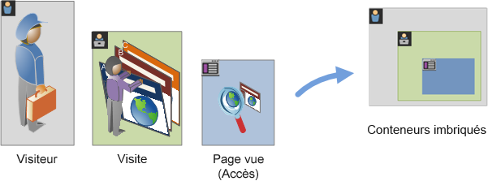

**Conteneur de visiteurs**

Le conteneur de visiteurs inclut chaque visite et page vue pour les visiteurs au cours d’une période indiquée. Un segment au niveau Visiteur renvoie la page qui respecte la condition plus toutes les autres pages consultées par le visiteur (et contraintes uniquement par des périodes définies). Comme il s’agit du conteneur ayant la définition la plus large, les rapports générés au niveau du conteneur de visiteurs renvoient les pages vues de toutes les visites et permettent de générer une analyse multi-visites. De ce fait, le conteneur de visiteurs est le plus susceptible de changer selon les périodes définies.

Les conteneurs de visiteurs peuvent inclure des valeurs basées sur l’historique global d’un visiteur :

* Jours avant le premier achat
* Page d’accès originale
* Domaines référents d’origine

**Conteneur de visites**

Le conteneur de visites permet d’identifier les interactions de pages, les campagnes ou les conversions pour une session Web spécifique. Le conteneur de visites est le conteneur le plus souvent utilisé car il capture les comportements pour l’ensemble de la visite une fois que la règle est respectée et permet de définir les visites que vous souhaitez inclure ou exclure de la création et de l’application d’un segment. Il peut vous aider à répondre à la question : combien de visiteurs ont consulté la section Nouvelles et sports lors de la même visite ? Ou encore : les pages qui ont produit une conversion réussie en vente ?

Les conteneurs de visites incluent des valeurs basées sur l’occurrence par visite :

* Nombre de visites
* Page d’accès
* Fréquence des retours
* Mesures de participation
* Mesures allouées linéairement

**Conteneur d’accès**

Le conteneur d’accès définit les accès de page que vous souhaitez inclure ou exclure d’un segment. Il s’agit du plus étroit des conteneurs disponibles, permettant d’identifier des clics et des pages vues spécifiques pour lesquels une condition est vraie (true) ou encore d’afficher un code de suivi unique ou d’isoler un comportement dans une section spécifique de votre site. Vous souhaitez peut-être également déterminer une valeur spécifique lorsqu’une action se produit, tel que le canal marketing lorsqu’une commande est passée.

Les conteneurs d’accès incluent des valeurs basées sur des ventilations de page unique :

* Produits
* Propriétés de liste
* eVars de liste
* eVars de marchandisage (dans le contexte d’événements)

   >[!NOTE]
   >
   >Si vous utilisez ce conteneur sur une valeur qui persiste, une eVar par exemple, il va extraire chaque accès comportant une valeur persistante. Dans le cas d’un code de suivi qui expire au bout d’une semaine, cette valeur pourrait persister sur plusieurs visites.

**conteneur Groupe logique**

Le conteneur Groupe logique vous permet de fournir un conteneur distinct dans les règles de segmentation afin de filtrer les entités qui ne reposent pas sur la hiérarchie. Vous pouvez par exemple souhaiter fournir un conteneur imbriqué dans le segment qui filtre les entités en fonction des visiteurs. Ce type de logique nécessite que vous rompiez la hiérarchie (puisque vous disposez déjà d’un conteneur Visiteur de niveau supérieur) afin de filtrer uniquement les entités pour les visiteurs sélectionnés. Vous pouvez y parvenir en utilisant le conteneur Groupe logique. Reportez-vous à la section [Exemples de groupes logiques](/help/components/c-segmentation/c-segmentation-workflow/seg-sequential-build.md) pour en savoir plus.

## Imbrication de conteneurs {#section_7FDF47B3C6A94C38AE40D3559AFFAF70}

Lors de la création de conteneur de segments dans d’autres conteneurs, vous créez par essence un segment dans un segment. La logique suivante est utilisée avec les conteneurs imbriqués :

1. Déterminez les données qui sont incluses à l’aide du conteneur le plus éloigné. Les données qui ne correspondent pas à cette règle d’éloignement sont ignorées dans le rapport segmenté.
1. Appliquez la règle imbriquée aux données restantes. La règle imbriquée NE s’applique PAS aux accès que la première règle a rejetés.
1. Répétez jusqu’à ce que toutes les règles de conteneur imbriquées aient été calculées. Les données restantes sont alors incluses dans le rapport résultant.

Vous pouvez utiliser l’imbrication de conteneurs ainsi que de règles dans un conteneur. Vous pouvez imbriquer les éléments suivants dans chaque conteneur :

| Nom du conteneur | Éléments que vous pouvez y imbriquer |
|---|---|
| Accès | Événements uniquement |
| Visite | Conteneur d’accès, Événements |
| Visiteur | Conteneur de visites, Conteneur d’accès, Événements |
| Groupe logique | Conteneur de visiteurs, conteneur de visites, conteneur d’accès |

**Inclure plusieurs conteneurs dans une seule définition**

L’inclusion de plusieurs segments dans un nouveau segment composé permet d’affiner encore plus les données. Le fait de faire glisser deux segments existants ensemble agit comme une instruction « OU » lors du filtrage des visiteurs. Tous les conteneurs du canevas sont comparés à l’ensemble des données et les données qui correspondent à l’un des conteneurs sont incluses dans la création de rapports.

Par exemple, le fait de faire glisser un conteneur de visites pour lequel Pays = États-Unis avec un conteneur de visites pour lequel Commande = Vrai

```
Country = United States + Order = True
```

crée un segment qui se comporte dans cet ordre :

1. Ce segment étudierait tout d’abord l’ensemble des données et identifierait tous les visiteurs compris dans les États-Unis.
1. Le segment étudierait alors à nouveau toutes les données, recherchant si des visiteurs ont passé une commande.
1. Les deux jeux de données s’appliqueraient alors au rapport.

## Conteneurs pour les segments séquentiels {#section_324AF503F51A4A62806151FE440F3B2E}

La segmentation séquentielle utilise les mêmes conteneurs de base, notamment [!UICONTROL Visiteurs], [!UICONTROL Visites] et [!UICONTROL Accès] (y compris les pages vues ou d’autres dimensions), imbriqués hiérarchiquement.


[!UICONTROL Visiteurs] est le conteneur dont l’ordre est le plus élevé dans la segmentation séquentielle ; [!UICONTROL Visites] se trouvant dans le conteneur [!UICONTROL Visiteurs] et [!UICONTROL Accès] se trouvant dans les conteneurs [!UICONTROL Visiteurs] ou [!UICONTROL Visites]. Cette  [hiérarchie de conteneurs](/help/components/c-segmentation/seg-overview.md#section_7FDF47B3C6A94C38AE40D3559AFFAF70) doit être conservée pour créer des segments séquentiels bien ordonnés.

**Pour créer des segments séquentiels**, les conteneurs sont imbriqués et la séquence logique est associée à l’aide de l’opérateur [!UICONTROL ALORS] qui exige que chaque conteneur soit défini sur « vrai » sur la base de la séquence du visiteur.

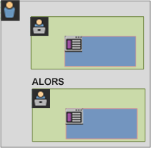

S’agissant de cette hiérarchie de conteneurs, la seule exception réside dans l’utilisation du [conteneur Groupe logique](/help/components/c-segmentation/c-segmentation-workflow/seg-sequential-build.md). Le conteneur [!UICONTROL Groupe logique] vous permet d’imbriquer un accès dans un conteneur de manière non ordonnée, afin de capturer des événements et des dimensions, mais sans ordre séquentiel.

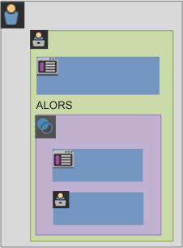

## Rapports basés sur les données de conteneur {#concept_BE822C12F87C4F07B7147D80BEFBAB87}

Les conteneurs permettent de filtrer des données différentes différemment selon les valeurs de création de rapports lors de la ventilation de segments et de leur application aux rapports.

Les données capturées à chaque niveau de la hiérarchie de conteneurs Visiteur &gt; Visite &gt; Accès affectent la manière dont vous créez vos segments. Si vous utilisez le même segment appliqué au même rapport utilisant le même jeu de données, vous obtenez des valeurs différentes en fonction du conteneur depuis lequel vous générez le rapport. Des facteurs tels que le niveau de création de rapports et la persistance des valeurs du conteneur dans les accès peuvent provoquer de grandes modifications dans la précision de la création de rapports.

## Concepts de base des données de conteneur {#section_9576D970F912450191AFB5B83F7F1656}

Par exemple, le visiteur représenté ci-dessous a visité un site à la première visite, est arrivé sur la page d’accueil, puis a visité trois pages supplémentaires et converti la visite en une vente. Lors d’une autre visite, le visiteur est arrivé cette fois-ci par l’intermédiaire de la page des produits, puis a visité la page d’accueil, puis à nouveau la page des produits avant de fermer la session après avoir regardé les chapeaux d’hiver. Selon les données capturées pour chaque conteneur pour le segment, différentes valeurs s’affichent dans le rapport.

Le segment *Page est égal à Winter Coats* (Manteaux d’hiver) ci-dessous s’applique au **Rapport sur les pages**.

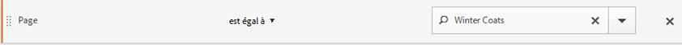

Selon le conteneur sélectionné, le rapport affiche différents résultats.


**Création de rapports depuis le conteneur d’accès**

Lorsque cette condition est incluse dans un conteneur d’accès, alors le rapport ne répertorie que les pages pour lesquelles la condition *Page = Manteaux d’hiver* est vraie. Puisque seule une page correspond à cette condition dans un conteneur d’une seule page, seule la page Manteaux d’hiver s’affiche.

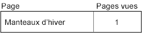

Si vous créez des rapports depuis le conteneur d’accès, vous pouvez constater dans quelle mesure la création de rapports depuis différents conteneurs affecte les valeurs globales de la création de rapports. En affichant le rapport Segment, notez que les pages vues sont approximativement égales aux visites (environ 2 000 visiteurs ont vu des pages en double lors d’une visite, ce qui vient s’ajouter au nombre total de pages vues), et les visiteurs uniques sont approximativement égaux au nombre de visites (environ 2 000 visiteurs uniques ont visité plus d’une fois.)

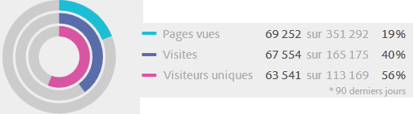

>[!IMPORTANT]
>
>Quelle que soit la manière dont vous consultez les données, depuis les conteneurs d’accès, de visites ou de visiteurs, vous trouvez le même nombre de visiteurs, 63 541 par exemple. Quelle que soit la méthode de génération du rapport, la condition initiale du visiteur - Visiteurs qui a consulté la page Manteaux d’hiver - reste en l’état. Il s’agit du sous-ensemble de données depuis lequel vous créez des rapports aux différents niveaux.

**Création de rapports depuis le conteneur de visites**

Si cette même condition figure dans un conteneur de visites, le rapport répertorie toutes les pages de la visite pour lesquelles la condition *Page est égal à Winter Coats* (Manteaux d’hiver) est vraie. Elle filtre la page Manteaux d’hiver mais capture également toutes les autres pages de la visite pour lesquelles la condition est vraie. Le visiteur ayant également visité les pages d’accueil, Produit et Achat au cours de la visite pour laquelle la condition était respectée, ces pages supplémentaires sont répertoriées dans le rapport lorsque ce dernier est créé à l’aide des données du conteneur de visiteurs.

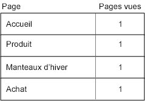

En affichant les valeurs de segments depuis le conteneur de visites, vous pouvez constater que le nombre de pages vues a augmenté de manière significative. En effet, la création de rapports depuis un conteneur de visites identifie toutes les pages qui respectent les conditions, plus toutes les autres pages consultées lors de la visite (avec toutes les pages vues capturées dans chaque conteneur de visites).


**Création de rapports depuis le conteneur de visiteurs**

Si cette même condition figure dans un conteneur de visiteurs, le rapport répertorie toutes les pages vues par n’importe quel visiteur pour lesquelles la condition *Page est égal à Winter Coats* (Manteaux d’hiver) est vraie. Cela signifie que si un visiteur a consulté la page Manteaux d’hiver, alors toutes les pages du conteneur de visiteurs, y compris les pages vues lors d’autres visites, sont répertoriées. En conséquence, les pages qui ne respectent pas la condition sont répertoriées dans le rapport car le visiteur les a consultées antérieurement. Toutes les pages du conteneur de visiteurs seront répertoriées dans le rapport, même si elles se sont produites antérieurement et ne respectent pas spécifiquement les conditions.

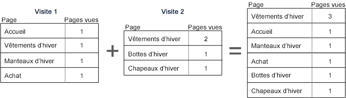

Si vous affichez les segments du conteneur de visiteurs, vous pouvez constater que le nombre de pages vues et de visites a augmenté. En effet, depuis le niveau visiteur, si le visiteur a consulté la page Manteaux d’hiver une seule fois (rendant la condition vraie), alors toutes les autres pages vues et toutes les autres visites sont capturées pour ce visiteur.

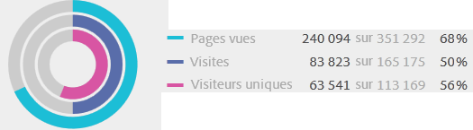

En résumé, comprendre comment la segmentation fonctionne sur les différentes ventilations de données constitue la clé de l’interprétation des données qu’elle renvoie.

## Création de rapports basée sur le conteneur {#section_D0604748F2794327B8C668617A31EC18}

Une portée est appliquée à chaque ventilation de données de segment. La plupart des ventilations sont basées sur les *pages vues*. Néanmoins, de nombreux segments de valeur sont basés sur le conteneur de *visites* et, à un degré moindre, sur le conteneur de *visiteurs*. Il est important de comprendre que la création de rapports est basée sur la portée de votre conteneur.

Selon l’exemple de segment *Page = Manteaux d’hiver* utilisé précédemment, les problèmes répertoriés ci-dessous définissent d’autres aspects de votre segment basés sur la manière dont les données de conteneur sont appliquées et sur la manière dont la portée des données doit correspondre au type de segment.

**Conteneur de segment basé sur une règle de segment correspondante**

L’application du conteneur de segment sur une portée naturelle de données donne les résultats escomptés pour lesquels les lignes correspondent à la règle de segment.

* **Conteneur d’accès pour lequel la page est égale à « Manteaux d’hiver » (Winter Coats)** : la consultation d’un rapport sur les *pages* avec ce segment renvoie uniquement les valeurs égales à « Manteaux d’hiver ». Toutes les autres pages sont exclues du rapport.
* **Conteneur de visites pour lequel la page d’accès est égale à « Vêtements d’hiver »** : la consultation d’un rapport sur les *pages d’accès* avec ce segment renvoie uniquement la deuxième visite car sa page d’accès correspond à la règle de segment.
* **Conteneur de visites pour lequel le nombre de visites est égal à 1** : la consultation d’une page vue Toutes les visites depuis la première visite est incluse dans le rapport car elle correspond à la règle de segment.

**Pages vues au niveau du conteneur de visites**

De nombreuses règles de segment identifient les pages vues par visite. Lorsque cela se produit, l’ensemble du conteneur de visiteurs est appliqué, si seulement un accès correspond à la règle. Ce rapport de segment est tout particulièrement intéressant car les pages vues basées sur des visites fournissent des informations sur les pages vues par visite.

* **Conteneur de visites pour lequel la page est égale à la page « Manteaux d’hiver » (Winter Coats)** : dans un rapport sur les pages au niveau du conteneur de visiteurs, affiche toutes les pages vues des visites qui incluaient une consultation de la page « Vêtements d’hiver ». Si une page correspond à la règle de segment, toutes les pages vues associées à cette visite sont incluses dans le rapport.
* **Conteneur de visites pour lequel la page est égale à la page d’accueil** : dans un rapport sur les pages, avec ce segment uniquement, affiche les données de la première visite, car, lors de la seconde visite, le visiteur n’a pas consulté la page d’accueil.
* **Conteneur de visiteurs pour lequel la page est égale à « Vêtements d’hiver »** : dans un rapport sur les pages, ce segment récupère toutes les données des deux visites car, lors de ces visites, le visiteur a consulté la page « Vêtements d’hiver ».

**Conteneur de segments identifiant les accès plus petits que les pages vues**

L’utilisation d’un segment avec un conteneur plus petit que la portée de la ventilation renvoie des données inattendues. L’utilisation d’une ventilation plus petite extrait tout de même tous les accès de cette portée de données.

* **Conteneur d’accès pour lequel la page d’accès est égale à la page des produits** : chaque page s’associe avec la page d’accès de la visite, créant ainsi une ventilation basée sur la visite. L’utilisation de ce segment extrait non seulement la page des produits en tant que page d’accès mais également tous les accès de cette visite.
* **Conteneur d’accès pour lequel Variable de liste 1 contient ValeurA** : si plusieurs valeurs ont été définies sur le même accès en tant que variable de liste, alors toutes les valeurs de variable sont incluses dans le segment. Il n’est pas possible de séparer des valeurs qui se produisent dans la même page vue car le conteneur d’accès est le plus petit conteneur de segments permettant de ventiler des accès.
* **Conteneur d’accès pour lequel la page est égale à « Achat »** : si vous utilisez les pages vues comme mesure, seule la page des achats s’affiche (comme prévu). Si vous utilisez un rapport Participation recettes, toutes les pages de la première visite reçoivent 100 $ puisque les mesures de participation sont basées sur les visites.
* **Conteneur d’accès pour lequel la page est égale à « Manteaux d’hiver »** : si vous utilisez les pages vues comme mesure, seule la page Manteaux d’hiver s’affiche (comme prévu). Si vous utilisez un rapport Participation recettes, aucune page ne reçoit de crédit car cette dimension requiert une dimension persistante. La page vue qui a réellement effectué l’achat (la page des achats) n’est pas incluse dans le conteneur d’accès. De ce fait, aucune participation aux recettes n’est attribuée à un élément quelconque. Néanmoins, l’exécution d’un rapport depuis le conteneur des visites inclurait toutes les pages vues au cours de cette visite et distribuerait une participation aux recettes (100 $) sur toutes les pages vues de la session.

## Persistance dans les conteneurs {#concept_E579D72B1C644AE9A4C4EAF6B47A4DCB}

Le filtrage par dimensions qui persistent dans une plage de pages, une eVar de campagne ou une dimension référente par exemple, affecte les données collectées au niveau du conteneur et doit être compris afin de garantir la précision de la création de rapports.

Les données de segment peuvent varier selon la persistance d’une dimension ou d’une variable appliquée dans des pages sélectionnées. Certaines dimensions, comme la dimension Page, fournissent des valeurs uniques au niveau de la page et sont filtrées selon les données provenant du conteneur d’accès. (Voir [l’exemple Rapports basés sur les données de conteneur](/help/components/c-segmentation/seg-overview.md)). D’autres dimensions, telle la dimension Domaine référent, persistent dans plusieurs pages pour une visite. Certaines dimensions ou variables appliquées, comme la Durée de la visite, s’étalent sur l’ensemble de l’historique du visiteur.

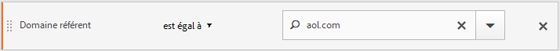

En contraste à la dimension Page, la valeur Domaine référent est associée à chaque page de cette visite. Par exemple, le visiteur ci-dessous arrive sur la page d’accueil en provenance d’un site référencé. En conséquence, la même valeur de domaine référent est affectée à toutes les pages de cette visite.

Le segment *Domaine référent est égal à aol.com* ci-dessus s’applique aux **Rapports sur les pages**.

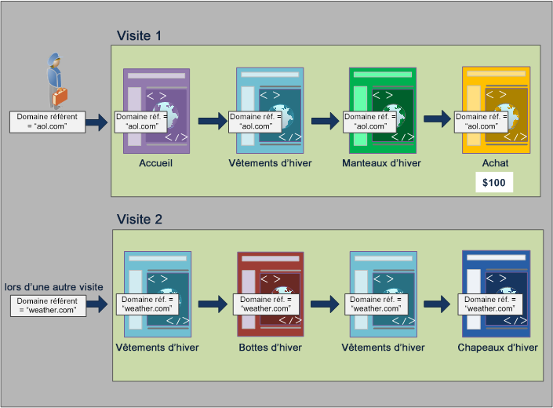

Dans une nouvelle visite, le visiteur est référencé depuis un autre site. En conséquence, la nouvelle valeur de domaine référent pour chaque page vue est affectée à toutes les pages de la nouvelle visite.

**Création de rapports depuis le conteneur d’accès**

La même valeur de domaine référent étant affectée à toutes les pages vues d’une même visite, la création de rapports au niveau du conteneur d’accès, où la condition *Domaine référent = « aol.com »*, renvoie toutes les pages répertoriées dans le tableau ci-dessous.

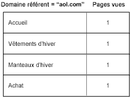

L’affichage des données provenant du conteneur d’accès montre qu’un peu plus de 92 000 pages vues ont été consultées en un peu plus de 33 000 visites par à peine plus de 32 000 visiteurs. En moyenne, trois pages ont été vues à chaque visite et la quasi-totalité des visites ont été effectuées par des visiteurs uniques.

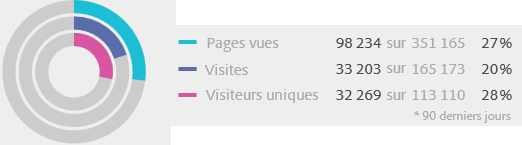

**Création de rapports depuis le conteneur de visites**

Si cette même condition est filtrée dans le conteneur de visites pour un rapport sur les pages, alors, pour toutes les pages de la visite, la condition *Domaine référent = « aol.com »* est vraie. Dans la mesure où la valeur du domaine référent est définie au niveau de la visite, les rapports au niveau de la page vue et de la visite sont les mêmes.


Dans cet exemple, toutes les pages ayant la même valeur de domaine référent basée sur la visite, le rapport provenant du niveau du conteneur Visite est (presque) le même que le rapport provenant du conteneur Page vue (avec un léger décalage, 98 234/98 248, en raison des anomalies de données).


**Création de rapports depuis le conteneur de visiteurs**

Depuis le conteneur de visiteurs, le rapport sur les pages répertorie toutes les pages consultées par des visiteurs pour lesquelles la condition *Domaine référent = « aol.com »* est vraie. En conséquence, si un visiteur comporte *« aol.com »* comme domaine référent dans son historique (au cours d’une période définie), alors toutes les pages du conteneur de visiteurs, y compris les pages vues lors d’autres visites, sont répertoriées. Même les pages qui ne correspondent pas à la condition principale seront répertoriées dans le rapport car elles sont incluses dans le conteneur de visiteurs. Toutes les pages du conteneur de visiteurs seront répertoriées dans le rapport, même si elles se sont produites antérieurement et ne respectent pas spécifiquement les conditions.

Dans un rapport Domaine référent, la condition *Domaine référent = « aol.com »* est vraie dans quatre pages vues mais la condition *Domaine référent = « weather.com »* est vraie dans les autres pages de l’accès visiteur. Depuis le conteneur de visiteurs, vous obtenez une liste de visiteurs pour lesquels la condition « aol.com » est vraie, mais il vous donne également des pages où le domaine référent est « weather.com », pas la valeur qui correspondait à votre requête initiale dans le segment.

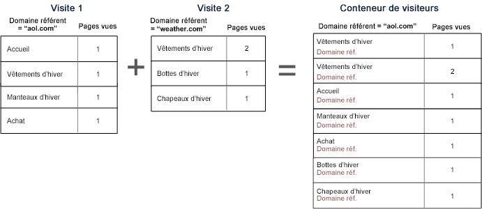

Lorsque vous consultez des données depuis le conteneur de visiteurs, notez que les pages vues ont augmenté significativement (de 98 248 à 112 925). Cela s’explique car toutes les pages vues par le visiteur, y compris celles avec d’autres valeurs de domaine référent enregistrées au niveau du conteneur de visiteurs, ont été répertoriées (ainsi que les visites supplémentaires effectuées par ce visiteur, augmentant les visites de 33 203 à 43 448).

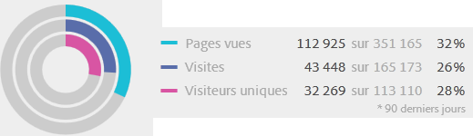

En résumé :

* Le conteneur de visites renvoie toutes les pages vues lors d’une visite lorsqu’au moins une page respecte les critères. Ainsi, si une page n’est vue que lors de la visite 1 le jour 1, alors toutes les pages vues lors l’ensemble de la visite sont incluses dans les données.
* Soyez attentif lorsque la condition que vous segmentez est définie sur une eVar ou un autre type de variable persistante. Par exemple, vous pouvez utiliser la condition « lorsque la campagne contient du courrier électronique » et elle expire au bout de 7 jours. Ainsi, si la campagne est définie sur la première visite, elle persistera pendant 7 jours de plus. Chaque visite sera incluse même si la campagne n’était définie que sur la première visite. Les autres visites seront également incluses (tant qu’elles figurent dans la période du rapport). Si vous souhaitez que les valeurs persistantes ne soient pas incluses, utilisez l’événement « instance de » ou une variable prop équivalente, si disponible.

