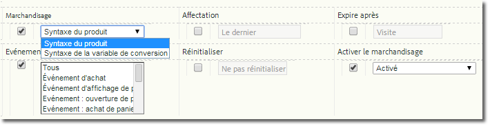

# Implémentation d'une variable de marchandisage

Description de l’activation et de l’implémentation d’une variable de marchandisage.

## Activation d’une variable de marchandisage {#section_331B41FF5AED42F2AEFE043DD60238C7}

Merchandising can be enabled for any custom eVar on the **[!UICONTROL Admin Tools]** &gt; **[!UICONTROL Report Suites]** &gt; **[!UICONTROL Conversion Variables]** page (you no longer need to call Adobe):



| Paramètre | Description |
|--- |--- |
| Expire après | Définit la durée de vie des valeurs de marchandisage. |
| Marchandisage | Syntaxe du produit : valeur définie dans s.products.    Syntaxe de la variable de conversion : valeur définie dans la s.eVar de marchandisage désignée. |
| Evénement de liaison de marchandisage (Syntaxe de la variable de conversion uniquement) | Indique à quel moment un produit doit être lié à la catégorie de marchandisage actuelle. Il est possible de sélectionner plusieurs événements en cliquant sur plusieurs éléments de la liste tout en maintenant la touche Ctrl enfoncée.   Remarque : Vous ne pouvez pas choisir un élément lorsque le paramètre « Syntaxe du produit » est sélectionné (il est désactivé, mais pas grisé). Vous ne pouvez sélectionner un élément que lorsque le paramètre « Syntaxe de la variable de conversion » est actif. |

## Implémentation à l’aide de la syntaxe du produit {#section_2774578D09CE40A093CB0D0A294DBF7C}

Lorsque le paramètre Syntaxe du produit est activé, la catégorie de marchandisage est directement remplie dans la variable products. La sélection et la définition d’un événement de liaison ne sont donc pas requises. Il est vivement conseillé d’utiliser cette méthode, à moins que la valeur ne soit pas disponible pour être définie dans la variable `s.products` lorsque l’événement de succès se produit.

* **Syntaxe**

```js
  s.products="category;product;quantity;price;event_incrementer; 
<codeph outputclass="syntax">
  eVarN=merch_category| 
 <codeph outputclass="syntax">
   eVarM=merch_category2" 
 </codeph outputclass="syntax"> 
</codeph outputclass="syntax">
```

* **Exemple **

```js
  s.events="prodView" 
  s.products=";Fernie Snow Goggles;;;; 
<codeph outputclass="syntax">
  eVar1=goggles" 
   In 
</codeph outputclass="syntax">
```

La valeur « lunettes de ski » pour eVar1 est affectée au produit « Fernie Snow Goggles ». Tous les événements de succès ultérieurs (ajouts de produits, passages en caisse, achats, etc.) qui concernent ce produit seront crédités à « lunettes de ski » (goggles).

## Implémentation à l’aide de la variable de syntaxe de conversion {#section_6AE10F69F4A14636AB050BEA89A34E4E}

La variable de syntaxe de conversion doit être utilisée lorsque la valeur eVar n’est pas disponible pour être définie dans `s.products`. Cela signifie généralement que votre page n’est pas en mesure de déterminer le canal de marchandisage ou la méthode de recherche. Dans ce cas, vous devez définir la valeur de marchandisage avant d’arriver à la page du produit et la valeur persiste jusqu’à l’événement de liaison.

Lorsque l’événement de liaison sélectionné en cours de configuration se produit, la valeur persistante de l’eVar est associée au produit. Par exemple, si prodView est spécifié en tant qu’événement de liaison, la catégorie de marchandisage n’est liée à la liste des produits en cours qu’au moment où l’événement se produit. Seuls les événements de liaison ultérieurs pourront mettre à jour une eVar de marchandisage qui a déjà été affectée à un produit.

* **Syntaxe** Sur la même page ou la page précédente avant l’événement de liaison :

   ```js
   s.eVar1="merchandising_category"
   ```

   Sur la page sur laquelle l’événement de liaison se produit :

   ```js
   s.events="prodView" 
   s.products="category;product"
   ```

* **Exemple** Page 1 de la visite :

   ```js
   s.eVar1="Outdoors:Ski Goggles"
   ```

   Page 2 de la visite :

   ```js
   s.events="prodView" 
   s.products=";Fernie Snow Goggles"
   ```

   La valeur « Extérieur:Lunettes de ski » pour eVar1 est affectée au produit « Fernie Snow Goggles ». Tous les événements de succès ultérieurs (ajouts de produits, passages en caisse, achats, etc.) qui concernent ce produit seront crédités à « lunettes de ski » (goggles).

De plus, la valeur actuelle de la variable de marchandisage sera liée à tous les produits ultérieurs, jusqu’à ce que l’une des conditions suivantes soit remplie :

* Expiration de l’eVar (sur la base du paramètre « Expire après »)
* L’eVar de marchandisage est remplacée par une nouvelle valeur.

Pour plus d’informations, voir [Advanced Conversion Syntax Merchandising](https://analyticsdemystified.com/adobe-analytics/advanced-conversion-syntax-merchandising/) (Marchandisage de syntaxe de conversion avancée) sur [!DNL analyticsdemystified.com].
