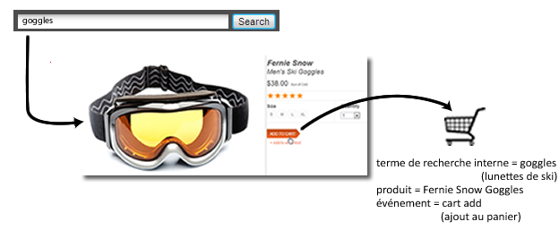
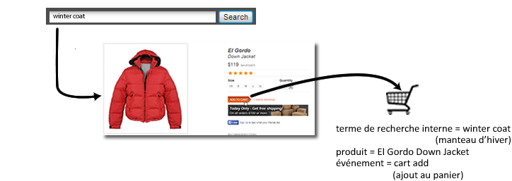

# Variables de marchandisage - Aperçu

Lorsque vous mesurez le succès de termes de recherche ou de campagnes externes, vous voulez généralement qu’une seule valeur reçoive du crédit pour tout événement de succès qui se produit. Par exemple, si un client clique sur un lien d’une campagne par courriel pour visiter votre site Web, tous les achats effectués par ce biais doivent être crédités à cette campagne.

Mais qu’en est-il des événements consécutifs à une recherche interne ou une exploration de catégorie lorsqu’un client recherche plusieurs articles ? Supposons qu’un client recherche des lunettes de ski sur votre site, puis en ajoute une paire dans le panier :

Avant le passage en caisse, le client effectue une recherche sur « manteau d’hiver », puis ajoute une pièce dans le panier :

Une fois cet achat effectué, à condition que le paramètre d’affectation soit resté sur « Le plus récent », la recherche interne portant sur « manteau d’hiver » sera créditée avec l’achat d’une paire de lunettes de ski. Cela est certes bénéfique pour « manteau d’hiver », mais beaucoup moins pour les décisions marketing :

| Terme de recherche interne | Recettes |
|---|---|
| manteau d’hiver | $157 |

**Comment les variables de marchandisage résolvent ce problème**

Les variables de marchandisage inter-catégories, ou « eVars de marchandisage », vous permettent d’affecter la valeur en cours d’une eVar à un produit au moment où l’événement de succès se produit. Cette valeur reste liée à ce produit, même si une ou plusieurs autres valeurs sont définies ultérieurement pour cette eVar.

Si le marchandisage est activé pour l’eVar dans l’exemple précédent, le terme de recherche « lunettes de ski » est associé à la boutique Fernie Snow Goggles, et le terme « manteau d’hiver » est lié à El Gordo Down Jacket. Les variables de marchandisage attribuent du revenu au niveau du produit, de sorte que chaque terme reçoive du crédit pour le revenu relatif au produit auquel il est associé :

| Terme de recherche interne | Recettes |
|---|---|
| manteau d’hiver | $119 |
| lunettes de ski | $38 |

