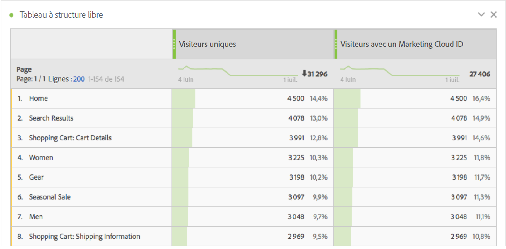
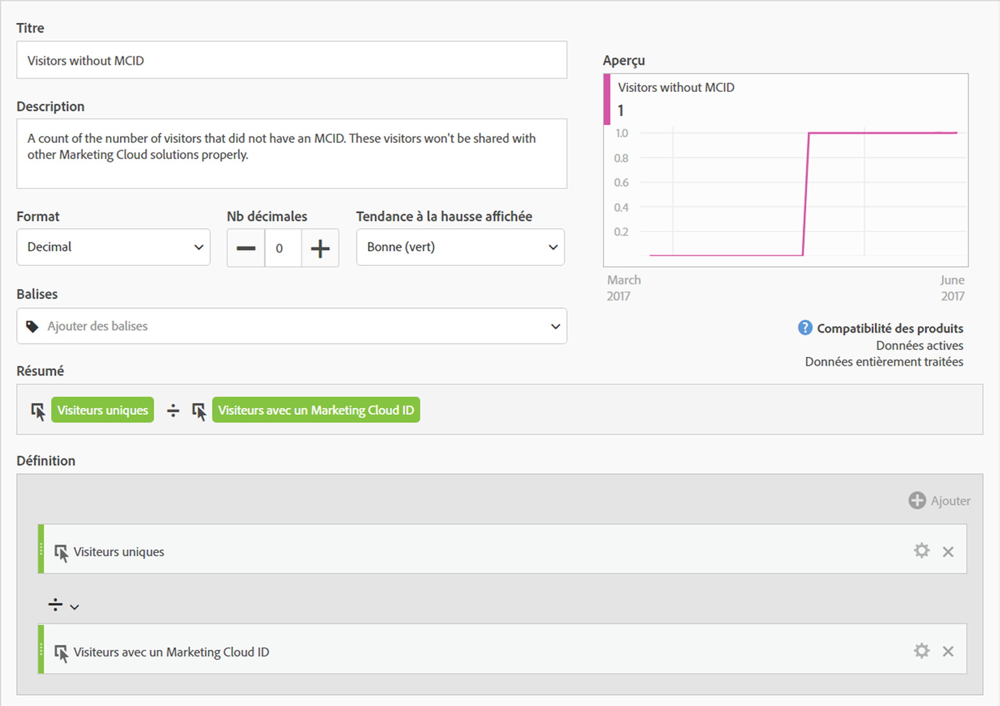
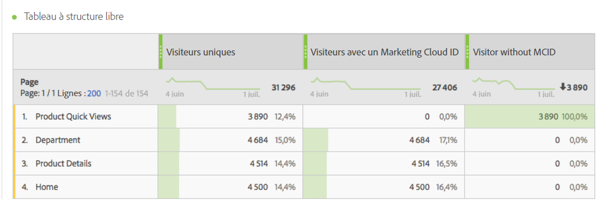
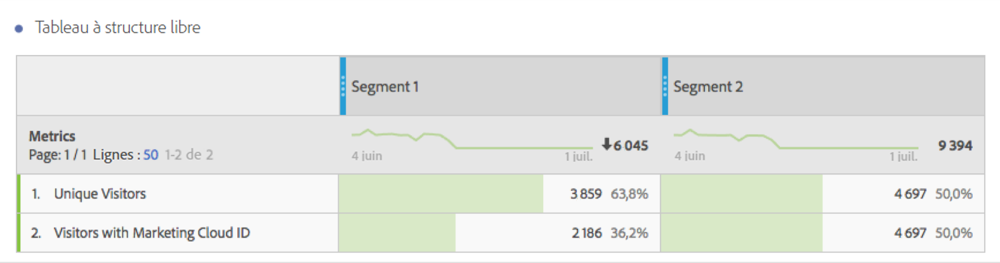

# Visiteurs avec un Experience Cloud ID

Disponible dans Analysis Workspace et le créateur de segments.

Indique le nombre de visiteurs disposant d’un Experience Cloud ID. Vous pouvez déterminer quelles pages disposent du service d’identité déployé et combien de visiteurs peuvent être partagés avec d’autres solutions Experience Cloud. Vous pouvez également utiliser cette mesure dans les segments partagés sur Experience Cloud.

>[!IMPORTANT]
>
>Pour que cette mesure s’affiche, vous devez exécuter le [service d’identité](https://marketing.adobe.com/resources/help/fr_FR/mcvid/) pour la suite de rapports.

## Débogage de la configuration Experience Cloud ID {#section_679E62142A3E46548FF8FBDA46568005}

La mesure [!UICONTROL Visiteurs avec un Experience Cloud ID] est une mesure utile dans Adobe Analytics, conçue pour vous aider à trouver et à déboguer votre configuration de [!UICONTROL service d’identité]. La mesure est un décompte du nombre de visiteurs d’une suite de rapports auxquels a été affecté un Experience Cloud ID depuis le service d’identité. Cette mesure peut être très utile lors du diagnostic de certaines intégrations Experience Cloud afin de savoir pourquoi elles ne partagent pas autant de visiteurs que prévu, ou pour identifier les zones de votre site pour lesquelles Experience Cloud ID n’est pas encore déployé.

Pour utiliser la mesure Visiteurs avec un Experience Cloud ID, faites-la simplement glisser sur un rapport en tant que mesure, par exemple sur ce rapport [!UICONTROL Pages] :

Dans cet exemple, on observe que chaque page comporte le même nombre de visiteurs uniques que de visiteurs avec un Experience Cloud ID. Néanmoins, le nombre total de visiteurs uniques est supérieur au nombre total de visiteurs avec un Experience Cloud ID. Pour rechercher les pages qui ne définissent pas le MCID pour tous les visiteurs, [créez une mesure calculée](https://marketing.adobe.com/resources/help/fr_FR/analytics/calcmetrics/cm_build_metrics.html) avec la définition suivante :

En ajoutant la mesure calculée au rapport, vous pouvez trier le rapport Pages de sorte que les pages comportant le plus grand nombre de visiteurs sans MCID s’affichent :

À présent, vous pouvez rapidement voir que, pour les pages « Product Quick Views » (Vues rapides des produits), le service d’identité n’est pas correctement mis en œuvre. Ces pages doivent être mises à jour aussi rapidement que possible. Un rapport similaire peut être créé à partir de n’importe quel type de dimension, par exemple un type de navigateur, une section de site ou des types de contenu.

Une fois que vous avez identifié les pages comportant des visiteurs sans MCID, vous devriez être en mesure de transmettre cette information à votre équipe de mise en œuvre afin qu’elle corrige ces pages.

Dans certains cas, vous constaterez qu’un petit nombre de MCID ne sont pas définis pour certains visiteurs même si le service MCID a été mis en œuvre sur la page. Ce problème est très probablement dû à une mauvaise configuration d’Analytics JavaScript ou de la gestion dynamique des balises dans laquelle la fonction AppMeasurement est appelée avant de fournir une suite de rapports. Pour éviter ce problème, assurez-vous d’[insérer le code Core AppMeasurement](https://marketing.adobe.com/resources/help/en_US/sc/implement/?f=t_appmeasurement-code.html) correctement.

Gardez à l’esprit que tout segment basé sur la page « Product Quick Views » (comme illustré ci-dessus) que vous partagez avec Experience Cloud aura probablement un taux de correspondance très faible avec les autres solutions Experience Cloud. Pour vérifier la couverture MCID d’un segment, vous pouvez créer un rapport comme celui-ci :

Dans ce tableau, qui compare le nombre de visiteurs uniques au nombre de visiteurs avec un Experience Cloud ID, il est facile de constater que le « Segment 1 » ne dispose pas d’une couverture MCID à 100 %, alors que c’est le cas pour le « Segment 2 ». Cela signifie que si je partage le segment 1 avec Experience Cloud, seuls 2 186 de tous les 3 859 visiteurs seront éligibles pour le partage.
