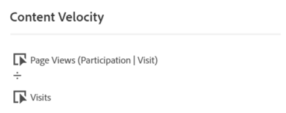

# [!UICONTROL Content Velocity]

[!UICONTROL Content Velocity] est un modèle de mesure Adobe Analytics standard. [!UICONTROL Content Velocity] est défini comme [[!UICONTROL Page Views] | [!UICONTROL Visit Participation]] / [[!UICONTROL Visits]] et vous aide à mesurer l’impact d’un élément de contenu particulier (Page, section du site, etc.) était sur le contenu en aval. Il peut vous aider à comprendre quel contenu conserve les utilisateurs sur le site Web ou dans l’application mobile.

[!UICONTROL Content Velocity] se trouvent dans  espace de travail  en filtrant le rail gauche, soit en effectuant une recherche, soit en utilisant des balises (#Adobe Template).

[!UICONTROL Content Velocity] est généralement utilisée dans le contenu   en plus d’autres mesures clés telles que [!UICONTROL Page Views], [!UICONTROL Visits]et [!UICONTROL Bounce Rate].

