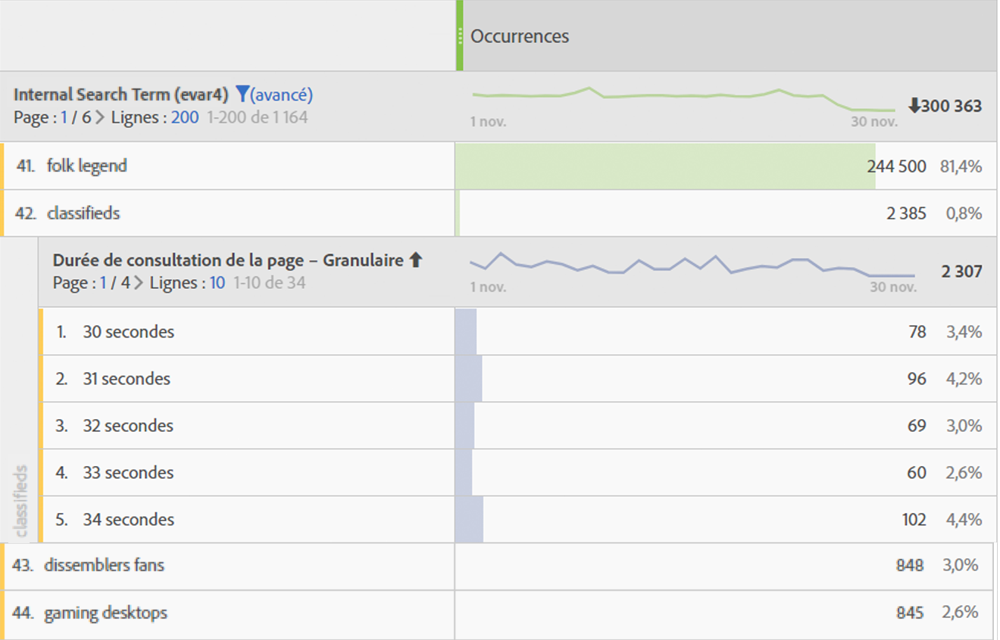
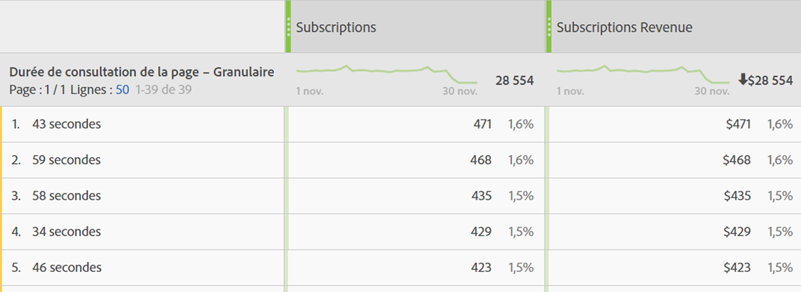

# [!UICONTROL Durée]

Diverses [!UICONTROL "mesures et dimensions de durée de la visite"] sont proposées dans les produits Adobe Analytics.

## [!UICONTROL Mesures "Durée de consultation"]

| Mesure | Définition | Disponible dans |
|---|---|---|
| [!UICONTROL Durée totale (secondes)] | Représente la durée totale pendant laquelle les visiteurs interagissent avec un élément de dimension spécifique. Inclut l’instance d’une valeur et d’une persistance pour tous les accès suivants. Dans le cas des props, la durée de la visite est également prise en compte dans les événements de lien ultérieurs. | Espace de travail d’analyse, Rapports et analyses, Créateur de rapports (appelé "temps total passé"), Entrepôt de données, Analyses ad hoc |
| [!UICONTROL Temps passé par visite] (secondes) | *Total des secondes passées / (retours sur visite)* Représente la durée moyenne pendant laquelle les visiteurs interagissent avec un élément de dimension spécifique au cours de chaque visite. | Analysis Workspace, Reports &amp; Analytics, Analyses ad hoc |
| [!UICONTROL Durée par visiteur] (secondes) | *Total secondes passées /* visiteur uniqueReprésente la durée moyenne pendant laquelle les visiteurs interagissent avec un élément de dimension spécifique pendant la durée de vie du visiteur (durée de son cookie). | Analysis Workspace, Reports &amp; Analytics, Analyses ad hoc |
| [!UICONTROL Durée moyenne de consultation du site] (secondes) | Représente la durée totale pendant laquelle les visiteurs interagissent avec un élément de dimension spécifique, par séquence avec un élément de dimension. Cette option n’est pas limitée aux moyennes de la visite du « site » comme son nom l’indique. Pour plus d’informations sur les séquences, voir la section "Comment la durée de la visite est calculée". **Remarque**: Cette mesure diffère très probablement de "Durée de la visite" au niveau d’un élément de dimension en raison des différences dans le dénominateur dans le calcul. | Espace de travail d’analyse, Rapports et analyses (en minutes), Créateur de rapports (en minutes), Analyses ad hoc |
| [!UICONTROL Durée de consultation moyenne de la page] | Mesure obsolète.  Au lieu de cela, nous vous recommandons d’utiliser la "durée moyenne de consultation du site" si la durée moyenne d’un élément de dimension est nécessaire. | Report Builder (lorsqu’une dimension figure dans la demande) |
| [!UICONTROL Durée]totale de la session, alias Durée de session [!UICONTROL précédente] | SDK d’applications mobiles uniquement.  Déterminée la prochaine fois que l’application est lancée, pour la session précédente. Calculée en secondes, cette mesure ne compte pas lorsque l’application est en arrière-plan, mais uniquement lorsqu’elle est en cours d’utilisation. Il s’agit d’une mesure au niveau de la session. Exemple : Nous installons l'application ABC et la lançons et l'utilisons pendant 2 minutes, puis fermons l'application. Aucune donnée n’est envoyée sur cette heure de session. The next time we launch the app, [!UICONTROL Previous Session Length] will be sent with a value of 120. | Espace de travail d’analyse, rapports et analyses, créateur de rapports, interface utilisateur de Mobile Services |
| [!UICONTROL Durée] moyenne de session (mobile) | *Durée totale de session / (Lancements - Premiers lancements)SDK d’application* mobile uniquement. Il s’agit d’une mesure au niveau de la session. | Créateur de rapports, interface utilisateur des services mobiles, analyses ad hoc |

## Dimensions "Durée de consultation"

| Dimension | Définition | Disponible dans |
|---|---|---|
| [!UICONTROL Temps passé par visite - Valeur granulaire] | Durée totale passée lors la visite arrondie à la seconde la plus proche et appliquée à chaque accès qui faisait partie de la visite. Il s’agit d’une dimension du niveau de la visite. | Espace de travail d’analyse, analyses ad hoc |
| [!UICONTROL Durée par visite – Regroupement] | Dimension granulaire regroupée en 9 plages différentes. Il s’agit d’une dimension du niveau de la visite. Les plages incluent :<ul><li>Moins de 1 minute</li><li>1-5 minutes</li><li>5-10 minutes</li><li>10-30 minutes</li><li>30-60 minutes</li><li>1-2 heures</li><li>2-5 heures</li><li>5-10 heures</li><li>10-15 heures</li></ul>**Remarque**: Il ne peut pas y avoir de intervalles supérieurs à cela, car une visite expire après 12 heures d’activité. | Espace de travail d’analyse, Rapports et analyses, Créateur de rapports, Analyses ad hoc |
| [!UICONTROL Durée de consultation de la page - Granulaire] | Durée totale passée sur chaque accès, arrondie à la seconde la plus proche. Il s’agit d’une dimension de niveau accès qui comprend à la fois les pages vues et les événements de lien. Malgré son nom, il ne se limite pas à la dimension "page". | Espace de travail d’analyse, analyses ad hoc |
| [!UICONTROL Durée de consultation de la page – Regroupement] | La dimension granulaire a été regroupée en 10 plages. Cependant, la dimension regroupée ne décompte que les pages vues (et exclut les événements de lien). Il s’agit d’une dimension du niveau de l’accès. Les plages incluent :<ul><li>moins de 15 secondes</li><li>15 à 29 secondes</li><li>30 à 59 secondes</li><li>1 à 3 minutes</li><li>3 à 5 minutes</li><li>5 à 10 minutes</li><li>10 à 15 minutes</li><li>15 à 20 minutes</li><li>20 à 30 minutes</li><li>plus de 30 minutes</li></ul> | Analysis Workspace, Reports &amp; Analytics, Analyses ad hoc |

## Méthode de calcul de "Durée de la visite"

Adobe Analytics utilise des valeurs explicites (y compris les événements de lien et les affichages de vidéos) pour calculer la [!UICONTROL durée de la visite].

>[!NOTE]
>
>Without link events like [!UICONTROL Video Views] or [!UICONTROL Exit Links], time spent on the last hit of a visit cannot be known. For similar reasons, [!UICONTROL Bounce Visits] (i.e. visits with a single hit) also does not have a 'time spent' associated with it.

The **numerator** in all time spent calculations is total seconds spent.

The **denominator** is not available as a separate metric in Adobe Analytics. Pour les mesures de durée de consultation, le dénominateur est les séquences. Une séquence est un jeu consécutif d’accès pour lequel une variable donnée contient la même valeur (qu’elle soit définie, propagée ou persistante). "Diffuser vers l’avant" désigne la persistance des props entre les pages vues (c.-à-d. entre les événements de lien suivants), aux fins du calcul de la durée de consultation.

* For example, in the case of [!UICONTROL Page Name] or other dimensions at the hit level, the denominator is essentially [!UICONTROL 'Instances'] or [!UICONTROL 'Page Views'], but with reloads and unset values (e.g. link events) counted as a single interaction (a sequence).

* Les accès de rebonds et de sortie sont également supprimés du dénominateur, car le temps passé est inconnu.

## Questions fréquentes

**Q1 : Toutes les mesures "Durée de la visite" peuvent-elles être appliquées à une dimension ?**

A : Les mesures "Durée de consultation" qui peuvent être appliquées à n’importe quelle dimension sont les suivantes :

* [!UICONTROL Durée totale (secondes)]

* [!UICONTROL Temps passé par visite] (secondes)

* [!UICONTROL Durée par visiteur] (secondes)

* [!UICONTROL Durée moyenne de consultation du site] (secondes)

**Q2 : Quelle est la dimension de durée de consultation la mieux utilisée dans les ventilations avec d’autres dimensions ?**

A: The [!UICONTROL Time Spent on Page – granular] dimension is a hit-level dimension. La ventilation de cette dimension en une autre dimension indique le nombre de secondes de la durée d’un accès lorsque la dimension de ventilation était également présente.
Dans l’exemple ci-dessous, le terme de recherche "classifications" est associé aux temps d’accès de 54 secondes, 59 secondes, etc., ce qui indique peut-être que les visiteurs passent du temps à lire le contenu renvoyé pour ce terme.

**Q3 : Quelle mesure convient-il par rapport à la dimension de[!UICONTROL Durée de consultation de la page - granulaire]?**

A : Toute mesure. La dimension indique le temps passé sur l’accès exact où l’événement s’est produit. Une durée plus longue de la visite signifie qu’un visiteur est resté plus longtemps sur une page (accès) où l’événement s’est produit.

**Q4 : En quoi le temps[!UICONTROL moyen passé sur le site]diffère-t-il du[!UICONTROL temps passé par visite]?**

A : La différence est le dénominateur dans la mesure :

* [!UICONTROL Le temps moyen passé sur le site] utilise les séquences qui incluent un élément de dimension.

* [!UICONTROL Le temps passé par visite] utilise le nombre de visites

Par conséquent, ces mesures peuvent donner des résultats similaires au niveau de la visite, mais elles seront différentes au niveau de l’accès.

## Exemples de calculs de [!UICONTROL durée de la visite]

Supposons que le jeu d’appels au serveur suivant concerne un seul visiteur au cours d’une visite unique :

| Accès de la visite | 1 | 2 | 3 | 4 | 5 | 6 | 7 |
|---|---|---|---|---|---|---|---|
| **Temps passé sur la visite (en secondes)** | 0 | 30 | 80 | 180 | 190 | 230 | 290 |
| **Secondes écoulées** | 30 | 50 | 100 | 10 | 40 | 60 | - |
| **Type d’accès** | Activity Map | Lien | Activity Map | Activity Map | Activity Map | Activity Map | Activity Map |
| **Nom de page** | Accueil | - | Produit | Accueil | Accueil (recharge) | Panier | Confirmation de commande |
|  |  |  |  |  |  |  |  |
| **prop1** | A (définie) | A (propagé vers l’avant) | non définie | B (jeu) | B (jeu) | A(définie) | C (définie) |
| **secondes écoulées prop1** | 30 | 50 | - | 10 | 40 | 60 | - |
|  |  |  |  |  |  |  |  |
| **eVar1** | Rouge (définie) | Rouge (persistante) | (expirée) | Bleu (définie) | Bleu (jeu) | Bleu (persistant) | Rouge (jeu) |
| **eVar1 secondes passées** | 30 | 50 | - | 10 | 40 | 60 | - |

Sur la base du tableau ci-dessus, les mesures de durée de la visite sont calculées comme suit :

| prop1 | Durée totale (secondes) | Durée par visite | Durée par visiteur | Nombre de séquences | Durée moyenne de consultation du site |
|---|---|---|---|---|---|
| A | 30+50+60=140 | 140/1=140 | 140/1=140 | 2 | 140/2=70 |
| B | 10+40=50 | 50/1=50 | 50/1=50 | 1 | 50/1=50 |
| C | 0 | 0 | 0 | 0 | 0 |
| Durée non attribuée | 100 | - | - | - | - |

| eVar1 | Durée totale (secondes) | Durée par visite | Durée par visiteur | Nombre de séquences | Durée moyenne de consultation du site |
|---|---|---|---|---|---|
| Rouge | 30+50=80 | 80/1=80 | 80/1=80 | 1 | 80/1=80 |
| Bleu | 10+40+60=110 | 110/1=110 | 110/1=110 | 1 | 110/1=110 |
| Durée non attribuée | 100 | - | - | - | - |

Temps passé par visite (granulaire) : 290Durée de consultation de la page (granulaire) : 10, 30, 40, 50, 60, 100

Quelques remarques supplémentaires à l’appui de l’exemple :

* Tous les calculs de durée de la visite sont basés sur le temps écoulé, qui commence à zéro au premier accès de la visite.

* "Secondes passées" est la différence entre l’horodatage de l’accès actif et l’horodatage de l’accès suivant. En conséquence, le dernier accès de la visite (et rebonds) ne comporte pas de durée de la visite.

* Une « séquence » est un jeu consécutif d’accès pour lequel une variable donnée contient la même valeur (qu’elle soit définie, propagée ou persistante). Par exemple, prop1 « A » comporte deux séquences : accès 1 et 2 et accès 6. Les valeurs du dernier accès de la visite ne démarrent pas une nouvelle séquence car le dernier accès ne comporte pas de durée de la visite. La durée moyenne de la visite du site utilise des séquences du dénominateur.

   * Aux fins de la durée de consultation uniquement, les props sont "propagées en avant" des accès aux pages vers les accès aux liens suivants, comme illustré ci-dessus pour prop1 sur l’accès 2. Cela permet à la valeur qui a été définie pour prop1 sur l’accès 1 (« A ») d’accumuler de la durée de visite sur l’accès 2.

   * Les eVars accumulent le temps passé sur tout accès où l’eVar est définie ou conservée. La persistance des eVars est définie par les paramètres des eVars dans Analytics &gt; Admin.

