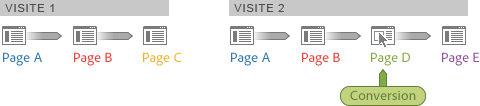

# Participation des visiteurs – Ad Hoc Analysis

Participation des visiteurs est une mesure qui vous permet de visualiser la participation entre différentes sessions, ainsi qu’à des canaux marketing, campagnes, recettes, etc. Par exemple, les crédits de recette et d’achat peuvent être réattribués à d’autres points de contact marketing qui se sont produits avant la visite au cours de laquelle la commande a été passée. Ad Hoc Analysis indique la participation des visiteurs au cours de différentes visites.

**Recettes (Participation)** : étale le crédit de conversion sur toutes les pages d’une seule visite qui ont débouché sur la conversion et ce, jusqu’à la page de conversion.

**Recettes (Participation des visiteurs)** : étale le crédit de conversion sur toutes les pages et les visites, sur la base d’une période que vous avez définie.

**Exemple - Participation aux recettes sur plusieurs visites**

Un visiteur se rend deux fois sur votre site. L’événement de conversion se produit au cours de la seconde visite, sur la page D, pour 60 $ de recettes :

Dans le cadre de la génération de rapports, l’attribution de conversion se présente comme suit :

* **Recettes** : attribué à la page.
* **Recettes (Participation)** : attribué à la seconde visite.
* **Recettes (Participation des visiteurs)** : attribué entre les deux visites.

<table id="table_91A7244E77854838A8392B49366FB445"> 
 <thead> 
  <tr> 
   <th colname="col1" class="entry"> Activity Map </th> 
   <th colname="col2" class="entry"> Recettes </th> 
   <th colname="col3" class="entry"> Recettes (Participation) </th> 
   <th colname="col4" class="entry"> Recettes (Participation des visiteurs) </th> 
  </tr> 
 </thead>
 <tbody> 
  <tr> 
   <td colname="col1"> 
A 
 </td> 
   <td colname="col2"> 
0 
 </td> 
   <td colname="col3"> 
60 $ 
 </td> 
   <td colname="col4"> 
60 $ 
 </td> 
  </tr> 
  <tr> 
   <td colname="col1"> 
B 
 </td> 
   <td colname="col2"> 
0 
 </td> 
   <td colname="col3"> 
60 $ 
 </td> 
   <td colname="col4"> 
60 $ 
 </td> 
  </tr> 
  <tr> 
   <td colname="col1"> 
C 
 </td> 
   <td colname="col2"> 
0 
 </td> 
   <td colname="col3"> 
0 
 </td> 
   <td colname="col4"> 
60 $ 
 </td> 
  </tr> 
  <tr> 
   <td colname="col1"> 
D 
 </td> 
   <td colname="col2"> 
60 $ 
 </td> 
   <td colname="col3"> 
60 $ 
 </td> 
   <td colname="col4"> 
60 $ 
 </td> 
  </tr> 
 </tbody> 
</table>

