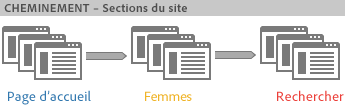
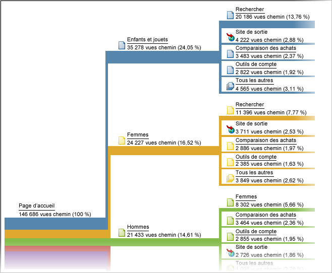

# Cheminement

Groupe de rapports basés sur l’analyse des chemins. D’un point de vue technique, le terme cheminement désigne le passage d’une page à une autre (d’une valeur à une autre).

Utilisez le [Flux d’Analysis Workspace](https://marketing.adobe.com/resources/help/en_US/analytics/analysis-workspace/flow.html) pour des options de cheminement souples.

> [!NOTE] Pour activer le cheminement, accédez à **[!UICONTROL Admin &gt; Suites de rapports &gt; Modifier les paramètres &gt; Trafic &gt; Variables de trafic]**. Pour activer le cheminement pour les rapports Section Site et Serveur, contactez le service à la clientèle.

Pour connaître l’ordre de collecte des valeurs, vous devez activer le cheminement pour la variable qui procède à leur collecte. Le cheminement est activé par défaut pour les pages. Par défaut, il n’est pas activé pour les props, car il n’est approprié que dans certains cas. Pour activer le cheminement sur une prop, contactez le service d’assistance clientèle.

> [!NOTE] Dans les Ad Hoc Analysis, lorsque vous activez des classifications sur une prop, les mesures de cheminement sont disponibles pour l’ensemble des classifications configurées.

**Exemple - Cheminement sur les sections de site**

L’activation du cheminement pour la variable *`s.channel`* vous permet de suivre le mode de déplacement des visiteurs entre les différentes sections de votre site (à mesure que la valeur change).



Le cheminement est alors disponible dans divers rapports sur les chemins, dont [!UICONTROL Flux section suivante], lequel affiche le mode de déplacement des visiteurs entre les groupes de pages ou sections de votre site.



**Exemple - Cheminement sur les recherches**

Le concept de déplacement entre plusieurs valeurs s’applique également à d’autres variables de trafic, dont *`s.props`*. Si vous activez, par exemple, le cheminement pour votre terme de recherche interne *`s.prop`*, vous pouvez visualiser le chemin emprunté par les visiteurs via les termes de recherche.

**Exemple - Cheminement par état de connexion**

Vous pouvez identifier comment les internautes parcourent votre site sur la base de l’état de connexion d’un visiteur. Pour connaître ces informations, ne vous basez pas sur l’état de connexion spécifié dans les rapports de cheminement. Ces rapports indiquent, en effet, la manière dont les visiteurs y ont modifié des valeurs ou sont passés de l’état « connecté » à « déconnecté ». Concaténez plutôt la valeur du segment avec la variable *`s.pageName`* puis tracez la variable obtenue. Voici un exemple de code de cheminement de page par état de membre :

```js
s.pageName="Home Page"; 
s.prop18="Gold"; // Member Status 
s.prop19=s.prop18 + ":" + s.pageName;
```

Activez ensuite le cheminement pour que la variable *`s.prop19`* visualise le cheminement des membres à travers les différentes pages.

> [!NOTE] Si vous effectuez des Ad Hoc Analysis, vous pouvez segmenter les chemins de page sans avoir à concaténer des valeurs de segment et appliquer tout segment à des rapports de cheminement.

