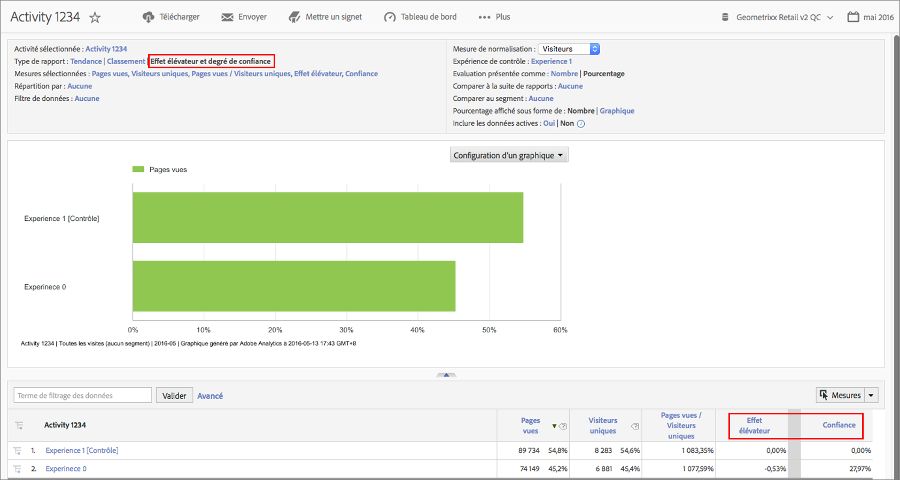

# Effet élévateur et degré de confiance Target

Vous permet d’évaluer le succès des campagnes dans Adobe Analytics comme vous le faisiez auparavant dans [!DNL Target Classic].

**[!UICONTROL Analyses]** &gt; **[!UICONTROL Rapports]** &gt; **[!UICONTROL Afficher tous les rapports]** &gt; **[!UICONTROL Adobe Target]** &gt; **[!UICONTROL Analytics pour Target]** &gt; **[!UICONTROL Activités Target]**.

Vous trouverez dans la documentation d’Adobe Target d’autres informations sur l’[Effet élévateur](https://marketing.adobe.com/resources/help/en_US/target/target/c_estimating_lift_in_revenue.html) et le [Degré de confiance](https://marketing.adobe.com/resources/help/en_US/rec/c_Confidence_Level_and_Confidence_Interval.html).

Pour calculer l’effet élévateur et le degré de confiance :

1. Dans le rapport **[!UICONTROL Activités cibles]**, cliquez sur une activité pour en afficher les détails.
1. Sous Type de rapport, sélectionnez **[!UICONTROL Effet élévateur et degré de confiance]**.
1. Cliquez sur **[!UICONTROL Afficher les mesures]** pour ajouter une mesure.  Vous ne pouvez pas ajouter plusieurs mesures pour ce type de rapport ; il est conseillé d’évaluer un test pour une seule mesure. Si vous ajoutiez plusieurs mesures, vous ajouteriez uniquement du bruit et réduiriez le signal du test.
1. (Facultatif) Sous **[!UICONTROL Mesure de normalisation]**, sélectionnez l’une des mesures suivantes : Visiteurs, Visites ou Impressions. La plupart du temps, la mesure par défaut, Visiteurs, convient.

1. Le rapport ajoute ces mesures, y compris le rapport entre la mesure et la mesure de normalisation.

## Paramètres des rapports {#section_3508439E09CA4E38B2EA309BA477C01D}

<table id="table_0FBB257C96454CDA82D487DC68459C13"> 
 <thead> 
  <tr> 
   <th colname="col1" class="entry"> Paramètre </th> 
   <th colname="col2" class="entry"> Description </th> 
  </tr> 
 </thead>
 <tbody> 
  <tr> 
   <td colname="col1"> Activité sélectionnée </td> 
   <td colname="col2"> Activité cible pour laquelle vous affichez et calculez l’effet élévateur et le degré de confiance. </td> 
  </tr> 
  <tr> 
   <td colname="col1"> Type de rapport </td> 
   <td colname="col2"> C’est là où vous sélectionnez l’effet élévateur et le degré de confiance. Ces options apparaissent comme des mesures dans les résultats du rapport ci-dessous. </td> 
  </tr> 
  <tr> 
   <td colname="col1"> Mesures sélectionnées </td> 
   <td colname="col2"> Affiche la mesure sélectionnée (Recettes dans l’exemple ci-dessus), la mesure de normalisation (Visiteurs uniques), le rapport entre ces deux mesures puis les calculs Effet élévateur et Degré de confiance par rapport à l’Expérience de contrôle. </td> 
  </tr> 
  <tr> 
   <td colname="col1"> Répartition par </td> 
   <td colname="col2"> Vous pouvez ventiler davantage le rapport selon d’autres rapports. </td> 
  </tr> 
  <tr> 
   <td colname="col1"> Filtre de données </td> 
   <td colname="col2"> Vous permet d’appliquer des filtres spécifiques à ce rapport. </td> 
  </tr> 
  <tr> 
   <td colname="col1"> Mesure de normalisation </td> 
   <td colname="col2"> Normalisez selon les visites, les visiteurs ou les impressions. La mesure de normalisation devient le dénominateur du calcul de l’effet élévateur. Elle affecte également la manière dont les données sont agrégées avant l’application du calcul du degré de confiance. </td> 
  </tr> 
  <tr> 
   <td colname="col1"> Expérience de contrôle </td> 
   <td colname="col2"> L’expérience cible par rapport à laquelle vous effectuez la comparaison et pour laquelle vous calculez l’effet élévateur. </td> 
  </tr> 
  <tr> 
   <td colname="col1"> Comparer à la suite de rapports </td> 
   <td colname="col2"> Vous permet de choisir d’autres suites de rapports pour la comparaison. </td> 
  </tr> 
  <tr> 
   <td colname="col1"> Comparer au segment </td> 
   <td colname="col2"> Vous permet de sélectionner les segments pour la comparaison. </td> 
  </tr> 
  <tr> 
   <td colname="col1"> Pourcentage affiché sous forme de nombre/graphique </td> 
   <td colname="col2"> Présente le pourcentage de l’effet élévateur et du degré de confiance sous forme d’un nombre ou d’un graphique. </td> 
  </tr> 
  <tr> 
   <td colname="col1"> Inclure les données actives </td> 
   <td colname="col2"> 
Grâce à l’option Inclure les données actives des Reports &amp; Analytics, vous pouvez afficher les données d’analyse les plus récentes, souvent avant même qu’elles ne soient entièrement traitées et finalisées. Les données actives présentent la plupart des mesures en quelques minutes, ce qui vous permet de disposer d’informations exploitables pour une prise de décisions rapide. 
 </td> 
  </tr> 
 </tbody> 
</table>

