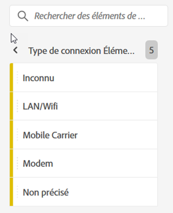
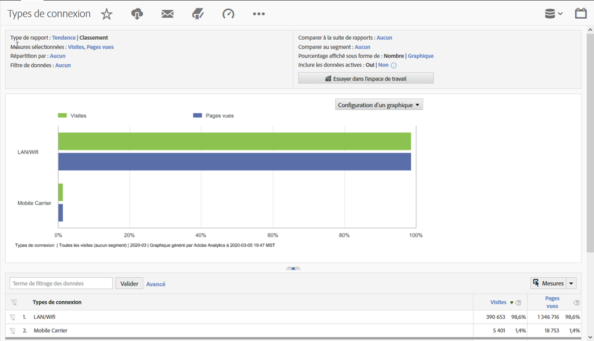

# Type de connexion

Affiche des mesures pour le type de connexion Internet, y compris le modem, le réseau local sans fil, l’opérateur de téléphonie mobile, etc.

## Exemple

Le rapport suivant compare les types de connexion pour les mesures [Visites](https://docs.adobe.com/content/help/en/analytics/components/variables/metrics/metrics-visit.html) et [Pages vues](https://docs.adobe.com/content/help/en/analytics/components/variables/dimensions-reports/reports-page-views.html):

Vous trouverez des informations supplémentaires sur le type de connexion de l&#39;opérateur de téléphonie mobile en consultant le rapport [**Opérateur de téléphonie **](https://docs.adobe.com/content/help/en/analytics/components/variables/dimensions-reports/reports-mobile-carrier.html)mobile.
