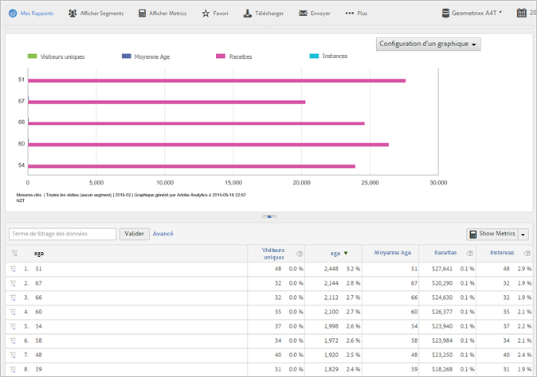

# Attributs du client

Questions fréquentes liées à Analytics portant sur les attributs du client et sur la manière d’exécuter le rapport Attributs du client.

**[!UICONTROL Rapports]** **[!UICONTROL &gt; Profil]** du visiteur &gt; Attributs **[!UICONTROL du client]**

Si vous capturez les données clients d’entreprise dans une base de données de gestion de la relation client, vous pouvez les transférer dans une source de données d’attributs du client dans Experience Cloud. Vous pouvez ensuite exécuter le rapport Attributs du client dans les Reports &amp; Analytics.

* [Attributs du client et mesures de création de rapports dans Analytics](../../../components/c-variables/dimensionslist/reports-customer-attributes.md#section_EF343662146B460A882D3DF772ADD86D)
* [Questions fréquentes – Attributs du client dans Analytics](../../../components/c-variables/dimensionslist/reports-customer-attributes.md#section_E29641D1F3D649C1AC9EA5231921F038)

Voir [Attributs du client](https://marketing.adobe.com/resources/help/en_US/mcloud/index.html?f=attributes) dans l’aide d’Experience Cloud pour en savoir plus sur le transfert des données d’attributs du client.

## Attributs du client et mesures de création de rapports dans Analytics {#section_EF343662146B460A882D3DF772ADD86D}

Une fois que vous avez téléchargé les attributs du client et validé le schéma (dans Experience Cloud), le système crée des mesures basées sur les noms conviviaux (comme *`age`* ou *`gender`*) que vous mappez aux chaînes d’attributs et aux entiers. These metrics appear in **[!UICONTROL Visitor Profile]** &gt; **[!UICONTROL Customer Attributes]** reports.

Par exemple :

**[!UICONTROL Profil]** du visiteur &gt; Attributs **[!UICONTROL du]** client &gt; **[!UICONTROL Age]**

**Exemple – Mesures d’âge**

Si vous spécifiez une chaîne du type *`age`*, the system creates the following metrics and dimensions:

* Dimension Age : vous permet d’exécuter un rapport d’après l’attribut Age.
* Mesure Age : mesure que vous pouvez ajouter à un rapport, par exemple un rapport Visiteurs uniques.
* Mesure Nombre de : Age : vous permet de comprendre, par exemple, si les visiteurs ont spécifié une valeur *`age`* sur un formulaire.

Puisque les mesures sont des sommes dans un tableau de rapports, envisagez de [créer une mesure calculée](https://marketing.adobe.com/resources/help/en_US/analytics/calcmetrics/) qui vous indique l’âge moyen. La formule de cette mesure est `Age / Count of Age`.

## Questions fréquentes – Attributs du client dans Analytics {#section_E29641D1F3D649C1AC9EA5231921F038}

<table id="table_88631069013B408EBB0A810657662B36"> 
 <thead> 
  <tr> 
   <th colname="col1" class="entry"> Question </th> 
   <th colname="col2" class="entry"> Réponse </th> 
  </tr> 
 </thead>
 <tbody> 
  <tr> 
   <td colname="col1"> 
Pourquoi est-il préférable d’utiliser Identity Service pour définir l’ID de client au lieu de renseigner l’ID de client dans une prop ou une eVar ? 
 </td> 
   <td colname="col2"> 
L’utilisation du service d’identité offre plusieurs avantages : 
 
    <ul id="ul_5D3659604D43419F9CA5920B4F93728E"> 
     <li id="li_BA2EF0715C5A47EFAFA7191CFAD088A4">Si vous ne définissez pas l’ID de client avec Identity Service, les enregistrements de client sont disponibles uniquement pour Adobe Analytics. Si vous souhaitez utiliser les enregistrements du client pour le ciblage en temps réel, vous devez utiliser Identity Service. </li> 
     <li id="li_228358684E474A298E39578D427BF932">L’utilisation du service d’identité pour définir l’ID de client réduit le temps nécessaire pour synchroniser les identifiants avec Experience Cloud. Si vous placez l’ID de client dans une prop ou une eVar, les ID de client sont envoyés vers Experience Cloud lors de la synchronisation du serveur principal qui survient par lots. Le service d’identité synchronise immédiatement l’ID de client avec Experience Cloud. </li> 
     <li id="li_BCF28219E4014FCF9F747C3D8D270526"> L’utilisation du service d’identité au lieu d’une prop ou d’une eVar libère cette prop ou cette eVar pour d’autres utilisations. </li> 
    </ul> </td> 
  </tr> 
  <tr> 
   <td colname="col1"> 
Si je stocke déjà un ID de client dans une prop ou une eVar, pourquoi devrais-je utiliser cette nouvelle fonctionnalité plutôt que de classer mes prop ou eVar avec des attributs de gestion de la relation client ? 
 </td> 
   <td colname="col2"> 
Les prop et eVar sont soumises à des limitations de valeurs uniques dépassées. Grâce à cette fonctionnalité, vous pouvez importer des données d’attribut pour un nombre illimité d’ID de client. En outre, le recours à la méthode prop/eVar limite les informations de gestion de la relation client à Analytics. 
 </td> 
  </tr> 
  <tr> 
   <td colname="col1"> 
Comment s’affichent mes attributs de gestion de la relation client dans Adobe Analytics ? 
 </td> 
   <td colname="col2"> 
Les attributs de gestion de la relation client seront manifestes dans Analysis Workspace, les Reports &amp; Analytics, les Ad Hoc Analysis, l’API de création de rapports et le Report Builder. Les attributs textuels apparaîtront sous forme de rapports et dimensions. Les attributs numériques apparaîtront sous forme de dimensions et de mesures. 
 </td> 
  </tr> 
  <tr> 
   <td colname="col1"> 
Les données de gestion de la relation client seront-elles disponibles dans Data Warehouse et dans les flux de données ? 
 </td> 
   <td colname="col2"> 
Les données de gestion de la relation client ne sont actuellement pas disponibles dans Data Warehouse ou dans les flux de données Analytics. 
 </td> 
  </tr> 
 </tbody> 
</table>

