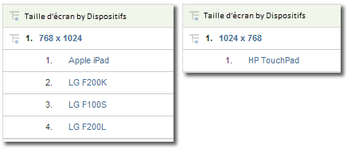

# Mobile

Affiche des informations sur l’accès aux sites web depuis un appareil mobile. Ces rapports améliorent l’identification des visiteurs en collectant des données sur les appareils mobiles utilisés pour se rendre sur votre site. Ils peuvent identifier le fabricant et les caractéristiques d’un appareil, telles que tailles d’écran, vidéo, audio, prise en charge des cookies et autres mesures. Ils sont disponibles pour toutes les suites de rapports.

## Mobile {#topic_D306EA4558194488AC47A45B9C570150}

Affiche des informations sur l’accès aux sites web depuis un appareil mobile. Ces rapports améliorent l’identification des visiteurs en collectant des données sur les appareils mobiles utilisés pour se rendre sur votre site. Ils peuvent identifier le fabricant et les caractéristiques d’un appareil, telles que tailles d’écran, vidéo, audio, prise en charge des cookies et autres mesures. Ils sont disponibles pour toutes les suites de rapports.

> [!NOTE] Les rapports mobiles présentent uniquement le trafic web mobile. Les données d’applications mobiles collectées à l’aide des systèmes natifs iOS, Android et autres SDK sont présentées dans les rapports Applications mobiles, disponibles uniquement s’ils sont activés dans les Outils d’administration.

Les rapports pour mobiles suivants sont disponibles :

<table id="table_900BB8F2F3A746B6B97DC629B39910DA"> 
 <thead> 
  <tr> 
   <th colname="col1" class="entry"> Rapport </th> 
   <th colname="col2" class="entry"> Description </th> 
  </tr> 
 </thead>
 <tbody> 
  <tr> 
   <td colname="col1"> 
Périphériques 
 </td> 
   <td colname="col2"> 
Affiche le nombre de visiteurs ayant accédé à votre site à l’aide d’appareils mobiles comme ceux qui fonctionnent sous iOS ou Android. Ce rapport peut vous aider à comprendre l’impact des initiatives portables pour effectuer une planification en conséquence. Vous pouvez utiliser ce rapport pour : 
 
 
     <ul id="ul_8CC40461C2944A63AED561E384275D24"> 
      <li id="li_4667815ED7384DE9824FB47F02040374"> 
Élaborer des stratégies orientées vers les utilisateurs itinérants 
 </li> 
      <li id="li_12C1F430E5464FB4AC29C2D970165935"> 
Identifier les préférences de votre audience 
 </li> 
      <li id="li_BFECB3B1F5A345BA82FC22BF99E8E418"> 
Suivre l’émergence des utilisateurs sans fil et itinérants 
 </li> 
     </ul> 
 </td> 
  </tr> 
  <tr> 
   <td colname="col1"> Fabricant </td> 
   <td colname="col2"> Groupe les accès des appareils mobiles sur votre site en fonction du fabricant du dispositif. Le rapport affiche le type de fabricant, le nombre de vues pour chaque fabricant et les pourcentages correspondants. </td> 
  </tr> 
  <tr> 
   <td colname="col1"> Taille d’écran </td> 
   <td colname="col2"> 
 Groupe les accès des appareils mobiles sur votre site en fonction de la taille d’écran du dispositif. Le rapport indique les tailles d’écran, le nombre de visiteurs sur votre site utilisant chaque taille d’écran, ainsi que le pourcentage des vues totales pour chaque taille. Le rapport de taille d’écran indique à la fois la hauteur et la largeur d’écran, contrairement au rapport de hauteur d’écran et à celui de largeur d’écran. 
 
Actuellement, le rapport Taille d’écran du dispositif portable est statique par appareil. Quelle que soit l’orientation, chaque dispositif est associé à une résolution d’écran fixe dans le rapport. Vous pouvez l’afficher en triant le rapport Taille d’écran en fonction des dispositifs mobiles. 
 </td> 
  </tr> 
  <tr> 
   <td colname="col1"> Hauteur d’écran </td> 
   <td colname="col2"> 
 Affiche la hauteur d’écran pour les divers appareils mobiles et le nombre de vues pour chaque hauteur d’écran. Vous pouvez également afficher le rapport Taille d’écran pour connaître à la fois la hauteur et la largeur. 
 </td> 
  </tr> 
  <tr> 
   <td colname="col1"> Largeur d’écran </td> 
   <td colname="col2"> 
 Affiche la largeur d’écran pour les divers appareils mobiles et le nombre de vues pour chaque largeur d’écran. Vous pouvez également afficher le rapport Taille d’écran pour connaître à la fois la hauteur et la largeur. 
 </td> 
  </tr> 
  <tr> 
   <td colname="col1"> Prise en charge des cookies </td> 
   <td colname="col2"> 
Groupe les accès des appareils mobiles en fonction de leur prise en charge ou non des cookies. Les visiteurs sont répartis dans des groupes, selon qu’ils acceptent ou non les cookies. Le type d’appareil mobile est identifié dans la chaîne de l’agent utilisateur. Adobe conserve une liste des périphériques mobiles connus pour prendre en charge les cookies. Si le périphérique mobile signalé par la chaîne de l’agent utilisateur figure également dans la liste Adobe des périphériques mobiles, la ligne  Pris en charge du rapport  Prise en charge des cookies est incrémentée. Sinon, c’est l’élément de ligne  Non pris en charge du rapport qui est incrémenté. 
 </td> 
  </tr> 
  <tr> 
   <td colname="col1"> Prise en charge des images </td> 
   <td colname="col2"> 
 Groupe les appareils mobiles en fonction des types d’images qu’ils prennent en charge. 
 
Si, par exemple, le téléphone d’un visiteur prenant en charge les images  .jpeg accède à un site, le rapport  Prise en charge des images est incrémenté d’au moins une unité. Si le téléphone prend en charge plusieurs formats d’image, un accès à un site peut se traduire par plusieurs incréments. En d’autres termes, si le téléphone prend en charge les formats .jpeg, .png et .gif, chacun de ces groupes du rapport est incrémenté. La somme des groupes peut donc être supérieure au total affiché au bas du rapport. 
 </td> 
  </tr> 
  <tr> 
   <td colname="col1"> Profondeur de couleur </td> 
   <td colname="col2"> 
 Groupe les accès des appareils mobiles en fonction du nombre de couleurs prises en charge. Le rapport indique le nombre total de visiteurs sur votre site qui utilisent un appareil mobile et les répartit par groupes en fonction du nombre de couleurs configurées sur leur dispositif. 
 
Si, par exemple, le téléphone mobile du visiteur prend en charge 24 couleurs, le rapport incrémente l’élément de ligne correspondant à 24 couleurs. 
 </td> 
  </tr> 
  <tr> 
   <td colname="col1"> Prise en charge de l’audio </td> 
   <td colname="col2"> 
 Groupe les appareils mobiles en fonction des types de formats audio qu’ils prennent en charge. 
 
Si, par exemple, le téléphone d’un visiteur prend en charge le format  .mp3, le rapport Prise en charge de l’audio est incrémenté d’au moins une unité. Si le téléphone prend en charge plusieurs formats audio, un accès à un site peut déclencher plusieurs incréments pour chaque format pris en charge. En d’autres termes, si le téléphone prend en charge les formats .mp3, .aac et .amr, chacun de ces groupes du rapport est incrémenté d’une unité. La somme des groupes peut donc être supérieure au total affiché au bas du rapport. 
 </td> 
  </tr> 
  <tr> 
   <td colname="col1"> Prise en charge de la vidéo </td> 
   <td colname="col2"> 
 Groupe les appareils mobiles en fonction des types de formats vidéo qu’ils prennent en charge. 
 
Si, par exemple, l’appareil mobile d’un visiteur prend en charge le format .mp4, le rapport Prise en charge de la vidéo est incrémenté d’au moins une unité lors de son accès à votre site. Si le téléphone prend en charge plusieurs formats (.mp4 et .wmv, par exemple), chacun de ces groupes du rapport est incrémenté. La somme des groupes peut donc être supérieure au total affiché au bas du rapport. 
 </td> 
  </tr> 
  <tr> 
   <td colname="col1"> DRM </td> 
   <td colname="col2"> 
 Groupe les appareils mobiles en fonction du type de DRM (Digital Rights Management - Gestion des droits numériques) pris en charge. Les groupes DRM incluent  Verrou avant,  Livraison combinée,  Livraison séparée et Inconnu. 
 </td> 
  </tr> 
  <tr> 
   <td colname="col1"> Protocoles réseau </td> 
   <td colname="col2"> 
 Groupe les appareils mobiles en fonction des protocoles réseau (GPRS, CSD, EDGE, HSCSD, etc.) qu’ils prennent en charge. Le rapport inclut également un groupe Inconnu pour les protocoles réseau non identifiés. 
 
Lorsqu’un visiteur accède à votre site sur un appareil mobile, le rapport Protocoles réseau est incrémenté d’au moins une unité. Si le téléphone prend en charge plusieurs protocoles réseau, chacun de ces groupes du rapport est incrémenté. La somme des groupes peut donc être supérieure au total affiché au bas du rapport. 
 </td> 
  </tr> 
  <tr> 
   <td colname="col1"> Système d’exploitation (obsolète) </td> 
   <td colname="col2"> 
 Groupe les appareils mobiles en fonction du système d’exploitation mobile du périphérique. Les systèmes d’exploitation mobiles comprennent Windows, RIM, iOS, Symbian, etc. Le rapport inclut également un groupe Inconnu pour les systèmes d’exploitation mobiles non identifiés. 
 
Remarque : Ce rapport est devenu obsolète lorsque le rapport Technologie &gt; <a href="/help/components/c-variables/dimensionslist/reports-operating-system.md"  >Systèmes d’exploitation</a> a été mis à jour pour inclure tous les systèmes d’exploitation, y compris les systèmes d’exploitation mobiles. Vous pouvez créer un segment dans lequel « appareil mobile » existe et l’appliquer au rapport Technologie &gt; Systèmes d’exploitation pour n’afficher que les systèmes d’exploitation mobiles. 
 </td> 
  </tr> 
  <tr> 
   <td colname="col1"> Version Java </td> 
   <td colname="col2"> 
 Regroupe les appareils mobiles en fonction de la version Java prise en charge. Le rapport Version Java identifie la version à l’aide de la JSR (Java Specification Request, Demande de spécification Java) prise en charge par le périphérique. Le rapport inclut également un groupe Inconnu pour les systèmes d’exploitation mobiles non identifiés. 
 
Pour plus d’informations sur une JSR donnée, consultez le site web de la <a href="https://jcp.org/en/jsr/overview"  >communauté Java</a>. 
 </td> 
  </tr> 
  <tr> 
   <td colname="col1"> Longueur de l’URL enregistrée comme signet </td> 
   <td colname="col2"> 
 Groupe les appareils mobiles en fonction de la longueur maximale (en caractères) prise en charge d’une URL en signet. 
 </td> 
  </tr> 
  <tr> 
   <td colname="col1"> Longueur de l’URL dans un message électronique </td> 
   <td colname="col2"> 
 Groupe les appareils mobiles en fonction de la longueur maximale (en caractères) prise en charge d’une URL de courriel. 
 </td> 
  </tr> 
  <tr> 
   <td colname="col1"> Longueur de l’URL du navigateur </td> 
   <td colname="col2"> 
 Groupe les appareils mobiles en fonction de la longueur maximale (en caractères) prise en charge d’une URL de navigateur web. 
 </td> 
  </tr> 
  <tr> 
   <td colname="col1"> Envoi du numéro de dispositif (ACTIVÉ/DÉSACTIVÉ) </td> 
   <td colname="col2"> 
 Groupe les appareils mobiles selon que la fonction Envoi du numéro de dispositif est prise en charge ou non. Le rapport inclut également un groupe Inconnu pour les dispositifs dont la prise en charge de la fonction « Envoi du numéro de dispositif » ne peut pas être déterminée. 
 </td> 
  </tr> 
  <tr> 
   <td colname="col1"> PTT </td> 
   <td colname="col2"> 
 Groupe les appareils mobiles selon que PTT est pris en charge ou non. Le rapport inclut également un groupe  Inconnu pour les dispositifs dont la prise en charge de PTT ne peut pas être déterminée. 
 </td> 
  </tr> 
  <tr> 
   <td colname="col1"> Prise en charge de Decoration Mail </td> 
   <td colname="col2"> 
 Groupe les appareils mobiles en fonction de la prise en charge DecoMail par le périphérique, ce qui permet à un utilisateur d’enrichir ses courriels de graphiques et d’animations. Le rapport inclut également un groupe  Inconnu pour les périphériques dont la prise en charge de Decoration Mail ne peut pas être déterminée. 
 </td> 
  </tr> 
  <tr> 
   <td colname="col1"> Services d’informations </td> 
   <td colname="col2"> 
 Regroupe les appareils mobiles en fonction des services d’actualités (canal I/B, EZ News Flash, W+INFO, etc.) pris en charge. Lorsqu’un visiteur accède à votre site à l’aide d’un appareil mobile avec prise en charge d’un service d’actualités, le rapport Services d’informations est incrémenté d’au moins une unité. Si le téléphone prend en charge plusieurs services d’actualités, chacun de ces groupes du rapport est incrémenté. La somme des groupes peut donc être supérieure au total affiché au bas du rapport. 
 </td> 
  </tr> 
 </tbody> 
</table>

