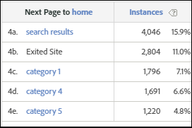

# Page suivante

Le rapport Page suivante présente les pages que les visiteurs ont consultées après avoir vu une page sélectionnée sur votre site. Par exemple, lorsque vous sélectionnez votre site entier et créez des rapports, le rapport indique les dix premières pages d’entrée avec les cinq pages suivantes les plus populaires, répertoriées en dessous de chaque page d’entrée.

Par exemple, l’extrait de page d’entrée suivant présente les cinq pages les plus populaires visitées par les clients après la page d’accueil :

Ces données peuvent vous aider à comprendre le contenu et les fonctionnalités qui incitent le plus souvent les visiteurs à se déplacer sur votre site.

Pour plus d&#39;informations sur le chemin du client avant et après une page sélectionnée, consultez l&#39;aide du rapport Flux [de page](https://docs.adobe.com/content/help/en/analytics/components/variables/dimensions-reports/reports-next-page-flow.html) suivante.

