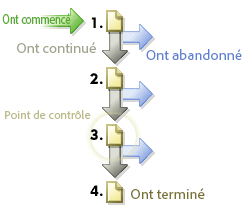

# Chemins

Affichent des informations sur l’ordre de consultation des pages de votre site web. Vous pouvez recueillir des informations sur le chemin qu’emprunte un visiteur avant et après la consultation d’une page de votre site.

## Chemins {#topic_39F11BCBEDC3495EA1300149FC6D4F14}

Affichent des informations sur l’ordre de consultation des pages de votre site web. Vous pouvez recueillir des informations sur le chemin qu’emprunte un visiteur avant et après la consultation d’une page de votre site.

Les rapports de chemins comprennent des rapports détaillés standard et des rapports d’analyse avancés facultatifs qui révèlent le parcours des pages consultées. Vous pouvez révéler les chemins complets, les plus longs et les plus populaires ; expliquer graphiquement le flux des pages, les abandons et les pertes ; présenter les nouveaux modèles et les modèles en évolution au fil du temps ; et analyser les chemins d’entrée et de sortie.

**[!UICONTROL Flux page suivante]** ou **[!UICONTROL Flux au site suivant]** : affiche un graphique d’embranchement à deux niveaux d’une page sélectionnée (ou section, département, etc.) pour les visiteurs une fois qu’ils quittent la page sélectionnée. Utilisez ce rapport pour analyser et identifier les étapes le plus souvent empruntées par vos visiteurs après l’affichage d’une page sélectionnée. Vous pouvez :

* Déterminer les étapes effectuées le plus souvent après la consultation d’une page sélectionnée.
* Optimiser la conception de vos chemins de site pour acheminer le trafic vers la page cible souhaitée.
* Identifier les pages que les visiteurs consultent au lieu de consulter vos pages cibles.

**[!UICONTROL Page suivante]** (ou catégories suivantes) : offre une analyse détaillée du chemin du site en vous indiquant les pages consultées par les visiteurs après avoir accédé à une page donnée. Par exemple, lorsque vous sélectionnez votre site entier et créez des rapports, le rapport indique les dix premières pages d’entrée avec les cinq pages suivantes les plus populaires, répertoriées en dessous de chaque page d’entrée. Ces données vous aident à identifier le contenu, les caractéristiques et autres données qui incitent le plus souvent les visiteurs à naviguer sur votre site.

**[!UICONTROL Flux page précédente]** (ou autre flux de catégories précédentes) : affiche deux niveaux des pages les plus populaires affichées par vos visiteurs avant la page sélectionnée. Le rapport indique également quand les visiteurs accèdent au site.

**[!UICONTROL Page précédente]** (ou autres catégories précédentes) : fournit une analyse détaillée de chemins de site en présentant les pages de votre site consultées par les visiteurs avant la page sélectionnée sur votre site.

**[!UICONTROL Abandons]** : affiche les taux d’attrition des visites et de conversion entre chaque point de contrôle que vous définissez. Les étapes sont organisées par ordre décroissant, avec les chiffres bruts et les pourcentages à gauche, et les pourcentages de conversions et d’abandons à droite.

Voir  [Rapport d’abandons](/help/components/c-variables/dimensionslist/reports-fallout.md).

**[!UICONTROL Pathfinder]** : vous permet de fragmenter davantage vos chemins complets, produisant ainsi des modèles précis, déterminants dans le cadre de l’optimisation de votre site. L’Assistant Pathfinder permet de spécifier les critères de sélection à utiliser pour générer le rapport de manière à analyser les requêtes et les fragments de chemin en interrogeant ceux qui commencent sur une certaine page, finissent sur une certaine page ou même ceux qui commencent sur une page et finissent sur une autre.

**[!UICONTROL Longueur de chemin]** : indique la profondeur du parcours des visiteurs sur votre site (par pourcentage ainsi que par compte total). En d’autres termes, le rapport indique le nombre de pages que le visiteur moyen consulte avant de quitter votre site.

**[!UICONTROL Analyse des pages]** : contient un sous-ensemble de rapports qui vous permet d’analyser les éléments suivants :

* **[!UICONTROL Résumé de la page / Résumé des catégories du site]** : vous indique tout ce que vous devez savoir sur le rapport sur les pages. Il collecte et organise des informations spécifiques à une page et les présente dans un seul rapport.
* **[!UICONTROL Actualisations]** : indique le nombre d’actualisations de pages individuelles par les visiteurs.
* **[!UICONTROL Durée de consultation de la page / Catégories du site]** : affiche le temps passé par les visiteurs sur des pages individuelles de votre site. Le temps passé est fractionné en dix catégories : moins de 15 secondes, 15-30 secondes, 30-60 secondes, 1-3 minutes, 3-5 minutes, 5-10 minutes, 10-15 minutes, 15-20 minutes, 20-30 minutes et plus de 30 minutes.
* **[!UICONTROL Clics jusqu’à la page]** : indique le nombre de clics des visiteurs pour accéder à chaque page de votre site. La profondeur d’une page est mesurée par le décompte des pages consultées avant cette page.

**[!UICONTROL Entrées et sorties]** : le rapport des pages d’entrée vous indique, en pourcentage ou en visites totales, les pages de votre site qui sont les premières à être vues par les nouveaux venus. Vous pouvez voir :

* **[!UICONTROL Pages d’entrée]** (ou sections) : affiche, en pourcentage ou en visites totales, les pages de votre site qui sont les premières à être vues par un nouveau venu. Utilisez ce rapport pour identifier les pages web qui sont les points d’entrée les plus fréquents, optimiser les points d’entrée principaux de votre site et diriger le trafic d’entrée vers vos messages clés.
* **[!UICONTROL Pages d’entrée d’origine]** : indique la première page affichée par les nouveaux visiteurs de votre site. Les utilisateurs ne sont comptabilisés qu’une seule fois, à moins qu’ils ne suppriment leurs cookies ou que les cookies ne soient pas activés.
* **[!UICONTROL Visites mono-page]** : indique les pages qui sont le plus souvent à la fois la page d’entrée et la page de sortie pour les sessions de navigation des visiteurs.
* **[!UICONTROL Pages de sortie]** : indique, en pourcentage et en visites totales, les pages de votre site qui étaient les dernières à être consultées avant que les visiteurs ne quittent votre site.

