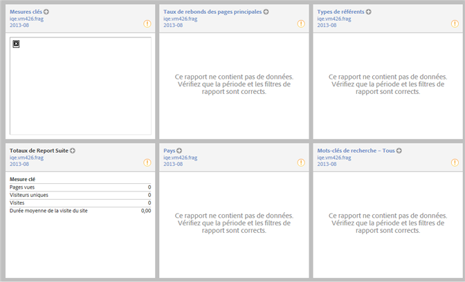

# Aperçu du site

Le rapport Mesures du site &gt; Aperçu d’un site s’affiche à l’ouverture de session. Il vous permet de visualiser immédiatement les données pertinentes et d’interagir avec elles. Vous pouvez en modifier la présentation, l’enregistrer comme un tableau de bord et parcourir les données pour une analyse plus approfondie.

Cliquez sur **[!UICONTROL Mise en page]dans la barre d’outils afin de personnaliser ce rapport et de l’enregistrer en tant que tableau de bord.**

Si vous définissez un tableau de bord comme page d’entrée, ce rapport ne s’affiche pas automatiquement.
