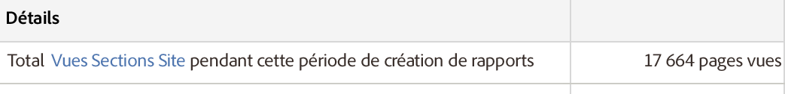

# Résumé des sections du site

Rapport résumé relatif aux sections du site qui affiche le point d’entrée sur la page précédente, les points de sortie sur la page suivante et des informations sur les instances (pages vues appelées dans cette interface), la profondeur des sections du site, le temps passé sur les sections du site, etc.

Une fois de plus, les pages vues affichées sous **[!UICONTROL Détails]doivent être interprétées comme des instances :**

