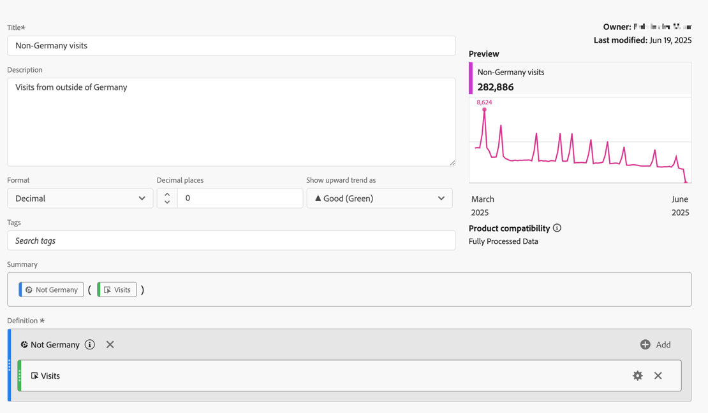

# Mesures segmentées

Dans le [créateur de mesures calculées](cm-build-metrics.md#definition-builder), vous pouvez appliquer des segments dans votre définition de mesure. L’application de segments s’avère utile si vous souhaitez utiliser des mesures pour un sous-ensemble de vos données dans votre analyse.

>[!NOTE]
>
>Les définitions de segment sont mises à jour via le [créateur de segments](/help/components/segmentation/segmentation-workflow/seg-build.md). Si vous apportez une modification à un segment, le segment est automatiquement mis à jour partout où il est utilisé, y compris si le segment fait partie d’une définition de mesure calculée.
>

Vous souhaitez comparer les mesures pour les Allemands qui interagissent avec votre marque par rapport aux personnes en dehors de l’Allemagne. Vous pouvez donc répondre à des questions telles que :

1. Combien de visiteurs allemands et internationaux visitent vos pages les plus [populaires](#popular-pages).
1. Combien de personnes allemandes par rapport aux personnes internationales au [total](#totals) ont interagi en ligne avec votre marque ce mois-ci ?
1. Quels sont les [pourcentages](#percentages) d&#39;Allemands et d&#39;internationaux qui ont visité vos pages populaires ?

Consultez les sections ci-dessous pour illustrer la manière dont les mesures segmentées peuvent vous aider à répondre à ces questions. Le cas échéant, il est fait référence à une documentation plus détaillée.

## Pages populaires

1. [Création d’une mesure calculée](../cm-workflow.md) à partir d’un projet Workspace appelé `Germany`.
1. Dans le [créateur de mesures calculées](cm-build-metrics.md), [créez un segment](/help/components/segmentation/segmentation-workflow/seg-build.md) intitulé `Germany`, qui utilise le champ Pays .

   >[!TIP]
   >
   >Dans le créateur de mesures calculées, vous pouvez créer un segment directement à l’aide du panneau Composants .
   >   

   Votre segment pourrait ressembler à ceci :

   

1. De retour dans le créateur de mesures calculées, utilisez le segment pour mettre à jour la mesure calculée.

   

Répétez les étapes ci-dessus pour la version internationale de votre mesure calculée.

1. Créez une mesure calculée à partir de votre projet Workspace, intitulée `Non Germany visits`.
1. Dans le créateur de mesures calculées , créez un segment, appelé `Not Germany`, qui utilise le champ Pays CRM de vos données CRM pour déterminer la provenance d’une personne.

   Votre segment doit ressembler à ceci :

   

1. De retour dans le créateur de mesures calculées, utilisez le segment pour mettre à jour la mesure calculée.

   

1. Créez un projet dans Analysis Workspace, qui vous permet d’afficher les pages visitées par des visiteurs allemands et non allemands.

   

## Totaux

1. Créez deux nouvelles mesures calculées basées sur le total général. Ouvrez chacun des segments créés précédemment, renommez le segment, définissez le **[!UICONTROL Type de mesure]** pour **[!UICONTROL Personnes]** sur **[!UICONTROL Total général]** puis utilisez **[!UICONTROL Enregistrer sous]** pour enregistrer le segment en utilisant le nouveau nom. Par exemple :

   

1. Ajoutez une nouvelle visualisation de tableau à structure libre à votre projet Workspace, en affichant le nombre total de pages pour cette année.

   Visualisation du tableau à structure libre de 

## Pourcentages

1. Créez deux nouvelles mesures calculées qui calculent un pourcentage à partir des mesures calculées que vous avez créées précédemment.

   Visualisation du tableau à structure libre de 

1. Mettez à jour votre projet Workspace.

   Visualisation du tableau à structure libre de 

