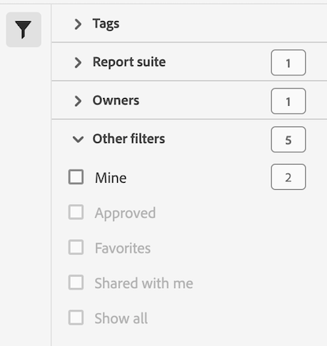

# Filtrer la liste des mesures calculées

Vous pouvez filtrer la liste des mesures calculées. L’utilisation d’un filtre sur les mesures calculées facilite la recherche des mesures calculées disponibles et la gestion des mesures calculées à partir du [gestionnaire de mesures calculées](cm-manager.md).

Pour filtrer la liste des mesures calculées :

1. Sélectionnez  pour ouvrir le panneau Filtres. Si vous avez besoin d’espace supplémentaire pour la liste des filtres, vous pouvez sélectionner à nouveau  pour fermer le panneau.
1. Sélectionnez des filtres parmi les [sections de filtres](#filter-sections) disponibles.

   >[!INFO]
   >
   >*Éléments* faites référence aux éléments de filtre affichés dans la [liste des mesures calculées](cm-manager.md#filters-list).
   > 

## Sections de filtrage

{{tagfiltersection}}
{{reportsuitefiltersection}}
{{ownerfiltersection}}
{{otherfiltersfiltersection}}

La [liste des mesures calculées](cm-manager.md#filters-list) est automatiquement mise à jour en fonction de la configuration de votre filtre. Vous pouvez voir les filtres configurés dans la [Barre des filtres actifs](cm-manager.md#active-filter-bar).

<!--
# Filter calculated metrics

Filter by tags, owners, and other filters (Show All, Mine, Shared With me, Favorites, and Approved.)

Filtering makes it easier to search for calculated metrics in the segment rail.

1. In Adobe Analytics, select the **[!UICONTROL Components]** tab, then select **[!UICONTROL Calculated metrics]**. 

1. In the Calculated metrics manager, click the **[!UICONTROL Filters]** icon:  

   

1. The following filters are available:

   |  Filter Name  | Description  |
   |---|---|
   |  Tags  |Lets you filter on calculated metrics with specific [tags](/help/components/calculated-metrics/workflow/cm-tagging.md). The Tags column is shown by default.  |
   |  Owners  | Lets you filter calculated metrics by owner.  |
   | Report suite | Lets you filter calculated metrics by report suite. |
   |  Other Filters > Show All  | **(Admin only)** Shows all calculated metrics, their owner, and the last date they were modified.  |
   |  Other Filters > Mine  | Shows all calculated metrics that you own.  |
   |  Other Filters > Shared with me  |Shows all calculated metrics that others [shared](/help/components/calculated-metrics/workflow/cm-sharing.md) with you.  |
   |  Other Filters > Favorites  |Shows all calculated metrics you marked as [Favorites](/help/components/segmentation/segmentation-workflow/t-seg-favorite.md).  |
   |  Other Filters > Approved  |Shows all officially [approved](/help/components/calculated-metrics/workflow/cm-approving.md) calculated metrics.  |
   |  Search calculated metrics  | Lets you search for calculated metrics by name.  |

   -->
