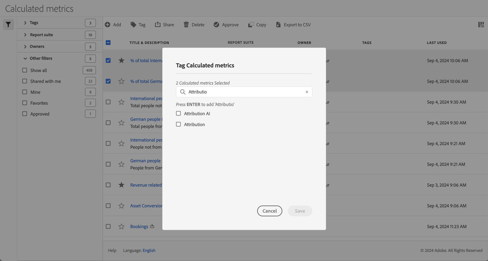

# Baliser des mesures calculées

Dans le [gestionnaire de mesures calculées](cm-manager.md), vous pouvez utiliser des balises pour organiser les mesures calculées. Les administrateurs peuvent baliser toutes les mesures calculées. Les personnes qui ne sont pas administratrices peuvent uniquement baliser les mesures calculées qu’elles créent ou qui ont été partagées avec elles.

Pour baliser une ou plusieurs mesures calculées :

1. Dans le [Gestionnaire de mesures calculées](cm-manager.md), sélectionnez une ou plusieurs des mesures calculées que vous souhaitez baliser.
1. Dans la barre d’actions, sélectionnez  **[!UICONTROL Balise]**.
1. Dans la boîte de dialogue **[!UICONTROL Baliser les mesures calculées]**

   

   1. (Facultatif) utilisez  pour rechercher et limiter la liste des balises.

   2. En fonction de la liste des balises :

      * sélectionner une ou plusieurs balises existantes dans la liste, ou
      * saisissez une nouvelle balise et appuyez sur **[!UICONTROL ENTRÉE]**. Répétez l’opération pour ajouter plusieurs nouvelles balises.

1. Sélectionnez **[!UICONTROL Enregistrer]** pour enregistrer les balises des mesures calculées. Sélectionnez **[!UICONTROL Annuler]** pour annuler.

Une fois enregistrées, les balises sont répertoriées dans le champ [!UICONTROL Balise] de la mesure calculée sélectionnée dans le [Créateur de mesures calculées](cm-tagging.md).

<!--
In the Calculated metric manager, you can organize segments by tagging them.

All users can create tags for calculated metrics and apply one or more tags to a metric. However, you can see tags only for those calculated metrics that you own or that have been shared with you. 

>[!TIP]
>
>The most useful types of tags are usually tags that are based on the following criteria:
>
>* **Team names**, such as Social Marketing or Mobile Marketing.
>* **Projects** (analysis tags), such as Entry-page analysis.
>* **Categories**, such as Women's or Geography.
>* **Workflows**, such as To be approved or Curated for (a specific business unit)

## Apply tags to a calculated metric

1. In Adobe Analytics, select [!UICONTROL **Components**] > [!UICONTROL **Calculated metrics**].

1. In the Calculated metrics manager, select the checkbox next to any metrics that you want to tag. 

   
   
1. In the **[!UICONTROL Tag Calculated metric]** dialog box:

    * Add a new tag. Type the name in the [!UICONTROL **Add tags**] field, then press Enter.
    * Select one or more existing tags to apply to the selected metrics. 

1. Select [!UICONTROL **Save**] to apply the tags.

## View applied tags

1. In Adobe Analytics, select [!UICONTROL **Components**] > [!UICONTROL **Calculated metrics**] to go to the Calculated metrics manager.

1. In the Calculated metrics manager, tags appear in the [!UICONTROL **Tags**] column. (Click the gear icon on the top-right to manage your columns.)

## Filter metrics by tags

1. In Adobe Analytics, select [!UICONTROL **Components**] > [!UICONTROL **Calculated metrics**] to go to the Calculated metrics manager.

1. In the Calculated metrics manager, select the **Filter** icon, then select the tags that you want to filter by. 

   Only metrics that have the filter you select are shown.
-->