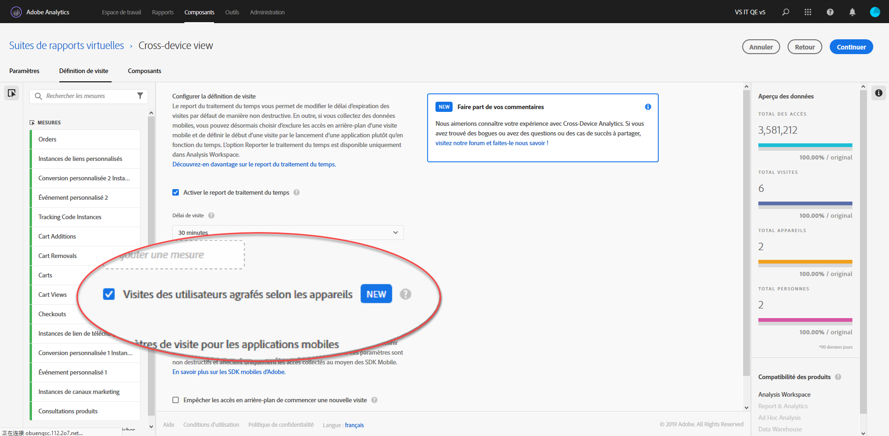

# Configuration des analyses entre appareils

> [!NOTE] La documentation des analyses entre appareils peut être modifiée au fur et à mesure que la fonctionnalité est développée. Consultez régulièrement les mises à jour.

Une fois toutes les conditions préalables remplies, procédez comme suit pour activer les analyses entre appareils. Vous devez appartenir à un groupe d’administrateurs de profil de produit ou disposer de droits d’administrateur dans Adobe Analytics pour suivre cette procédure.

> [!IMPORTANT] Toutes les conditions préalables doivent être remplies avant de suivre cette procédure. Si toutes les conditions préalables ne sont pas remplies, la fonction n’est pas disponible ou ne fonctionne pas. Pour connaître les conditions préalables et les limites, reportez-vous à la section [Analyses entre appareils](cda-home.md).

## Choisissez la suite de rapports entre appareils qui sera activée pour les analyses entre appareils.

Lorsque votre entreprise est configurée pour utiliser les analyses entre appareils, vous choisissez la suite de rapports à utiliser. Ce choix peut être communiqué par l’intermédiaire de votre gestionnaire de compte Adobe. Adobe active ensuite la suite de rapports choisie pour le traitement des analyses entre appareils

## Créer une suite de rapports virtuelle sur plusieurs appareils pour afficher la vue sur plusieurs appareils

Les administrateurs ayant accès à la création de suites de rapports virtuelles peuvent créer des suites de rapports virtuelles des analyses entre appareils comme suit :

1. Accédez à [experiencecloud.adobe.com](https://experiencecloud.adobe.com) et connectez-vous à l’aide de vos identifiants Adobe ID.
2. Cliquez sur l’icône à neuf grilles en haut de l’écran, puis sur Analytics.
3. Passez la souris sur Composants en haut de l’écran, puis cliquez sur Suites de rapports virtuelles.
4. Cliquez sur Ajouter.
5. Saisissez le nom de votre suite de rapports virtuelle et assurez-vous que la suite de rapports compatible avec les analyses entre appareils est sélectionnée.
6. (Facultatif) Appliquez un segment à la suite de rapports virtuelle. Par exemple, vous pouvez appliquer un segment qui limite la suite de rapports virtuelle aux dates suivant l’activation des analyses entre appareils et le début du regroupement. Ce segment permet aux utilisateurs de voir uniquement les plages de dates regroupées dans la suite de rapports virtuelle.
7. Cochez la case « Activer le report de traitement du temps », qui active plusieurs autres options, notamment Analyses entre appareils.
8. Cochez la case « Regrouper les visites de l’utilisateur sur plusieurs appareils ».
9. Cliquez sur Continuer, terminez la configuration de la suite de rapports virtuelle, puis cliquez sur Enregistrer.

## Ajouts et modifications apportés aux suites de rapports virtuelles sur plusieurs appareils

Lorsque les analyses entre appareils sont activées sur une suite de rapports virtuelle, notez les modifications suivantes :

* Une nouvelle icône interpériphérique apparaît en regard du nom de la suite de rapports virtuelle. Cette icône est réservée aux suites de rapports virtuelles sur plusieurs appareils.
* De nouvelles mesures intitulées « Personnes » et « Appareils uniques » sont disponibles.
* La mesure « Visiteurs uniques » n’est pas disponible, car elle est remplacée par Personnes et Appareils uniques.
* Lors de la création de segments, le conteneur de segments « Visiteur » est remplacé par un conteneur « Personne ».

## Mesure calculée Compression

La capacité des analyses entre appareils de regrouper des appareils dépend d’un large éventail de facteurs. L’efficacité de la capacité de la fonction à regrouper des données peut être mesurée à l’aide d’une mesure calculée appelée compression. Les facteurs qui contribuent à la compression sont les suivants :

* Utilisation du graphique Co-op ou du graphique Privé : en général, les entreprises qui utilisent le Device Co-op ont tendance à voir de meilleurs taux de compression que les celles qui utilisent le graphique Privé.
* Taux de connexion : plus les utilisateurs se connectent sur votre site, plus Adobe est en mesure d’identifier et de regrouper les visiteurs entre plusieurs appareils. Les sites qui présentent un faible taux de connexion ont aussi de faibles taux de compression.
* Couverture d’Experience Cloud ID : seuls les visiteurs avec un ECID peuvent être regroupés. Un pourcentage plus faible de visiteurs qui accèdent à votre site en utilisant un ECID correspond à des taux de compression plus faibles.
* Utilisation de plusieurs appareils : si les visiteurs qui se rendent sur votre site n’utilisent pas plusieurs appareils, les taux de compression sont plus faibles.
* Granularité des rapports : la compression par jour est généralement plus petite que la compression par mois ou par année. Les chances qu’une personne utilise plusieurs appareils sont moindres au cours d’un seul jour qu’au cours d’un mois entier. La segmentation, le filtrage ou l’utilisation de dimensions de ventilation peuvent également indiquer un taux de compression plus faible.

Pour afficher la compression de votre entreprise pour une période donnée :

1. Cliquez sur Espace de travail en haut de l’écran, puis sur Créer un projet.
2. Commencez par un projet vierge, puis cliquez sur Créer.
3. Faites glisser la mesure Appareils uniques vers la zone de travail intitulée « Faire glisser la mesure ici ».
4. Faites glisser la mesure Personnes vers la zone de travail directement à droite de l’en-tête de mesures Appareils uniques, afin de placer les deux mesures côte à côte.
5. Cliquez sur le symbole « `+` » en regard des mesures disponibles sur la gauche pour ouvrir le créateur de mesures calculées.
6. Attribuez à cette mesure calculée les paramètres suivants :
   * Nom : compression sur plusieurs appareils
   * Format : pourcentage
   * Nombre de décimales : 2
   * Définition : `[Static Number: 1] minus [People] divided by [Unique Devices]`
      > [!TIP] Cliquez sur Ajouter dans le coin supérieur droit de la zone de définition pour ajouter un nombre statique. Faites glisser Personnes et Appareils uniques dans la liste des mesures disponibles sur la gauche.
7. Cliquez sur Enregistrer.
8. Faites glisser la nouvelle mesure calculée vers la zone de travail directement à droite de l’en-tête de mesures Personnes, afin de placer les trois mesures côte à côte.
9. Facultatif : l’espace de travail charge la dimension Jour par défaut. Faites glisser une autre dimension de date, comme une semaine ou un mois au-dessus de la dimension Jour si vous souhaitez une granularité du temps différente.
