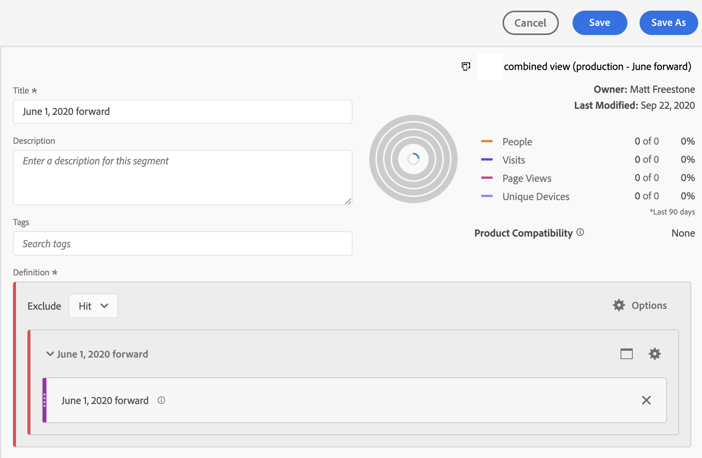

# Limitation d’une suite de rapports virtuelle à certaines dates

Une fois lʼassemblage activé, il débute à une date précise. Supposons que la date soit le 1er juin. La suite de rapports virtuelle des données dʼattribut du client contiendra des données non assemblées antérieures au 1er juin. Vous pouvez masquer les données de la suite de rapports virtuelle antérieures au 1er juin afin que votre analyse puisse se concentrer sur les périodes postérieures au début de lʼassemblage.

Vous pouvez limiter les données de la suite de rapports virtuelle à certaines dates en procédant comme suit :

## Étape 1 : créer une suite de rapports virtuelle avec une période mobile quotidienne

Lorsque vous configurez la suite de rapports virtuelle, sous Composants, ajoutez une période dont le début est fixe, avec une période mobile quotidienne. Le début fixe devrait être le jour de début de lʼassemblage.

## Étape 2 : créer un segment « exclure-exclure »

Créez ensuite un segment dʼaccès qui place la période dans un segment « exclure le conteneur » à lʼintérieur dʼun autre segment « exclure le conteneur ». C&#39;est un &quot;exclusion&quot;.

La raison de l’exclusion est que les plages de dates sont destinées à remplacer la plage de dates du rapport. Ainsi, si vous incluez uniquement les données à partir du 1er juin, la période du rapport sera toujours du 1er juin à la date actuelle. Cela conduira à des résultats indésirables. Lorsque vous &quot;excluez&quot;, cela remplace ce comportement et limite simplement les données que vous pouvez extraire à la période appropriée.

## Étape 3 : appliquer ce segment à votre suite de rapports virtuelle des données dʼattribut du client

## Étape 4 : afficher les résultats dans le compte rendu des performances

Remarquez que le compte rendu des performances débute désormais à la date souhaitée, le jour même où lʼassemblage a été mis en œuvre pour la première fois :

