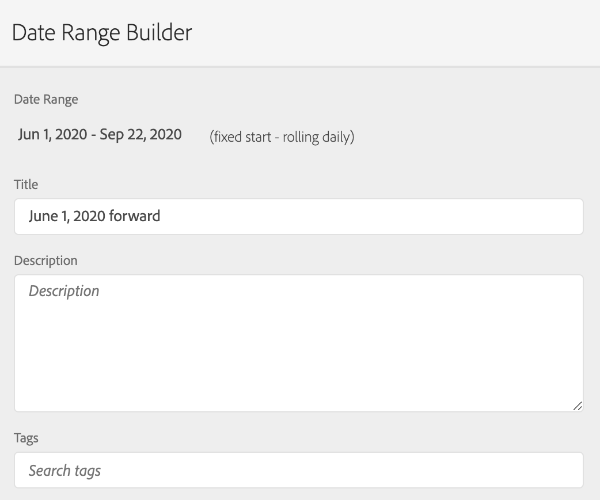
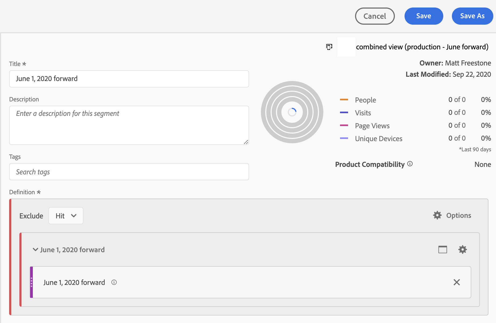
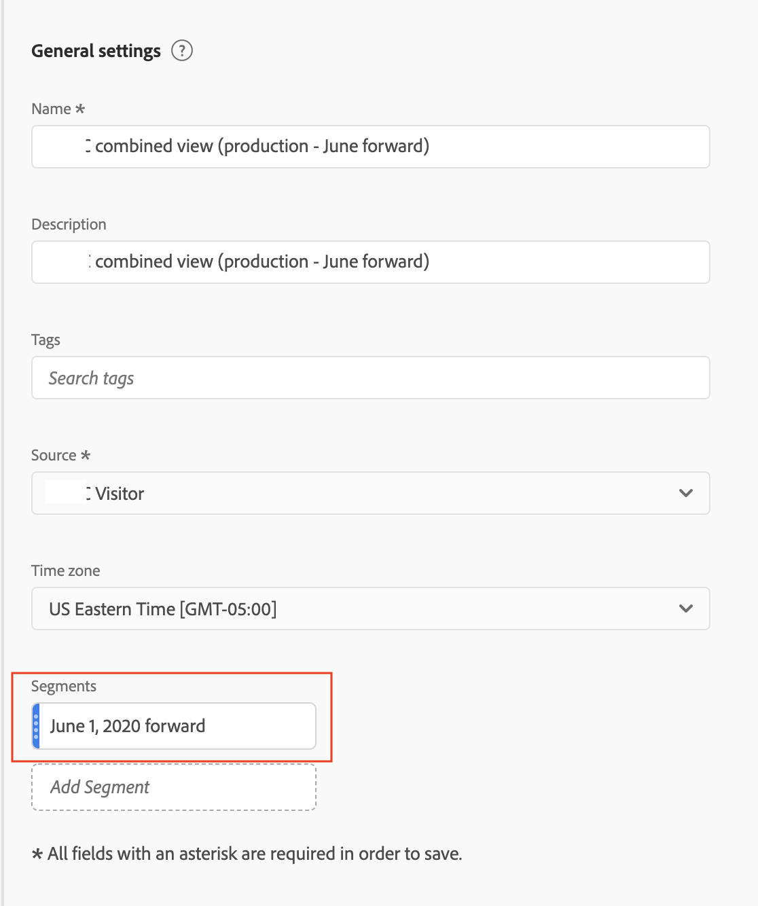
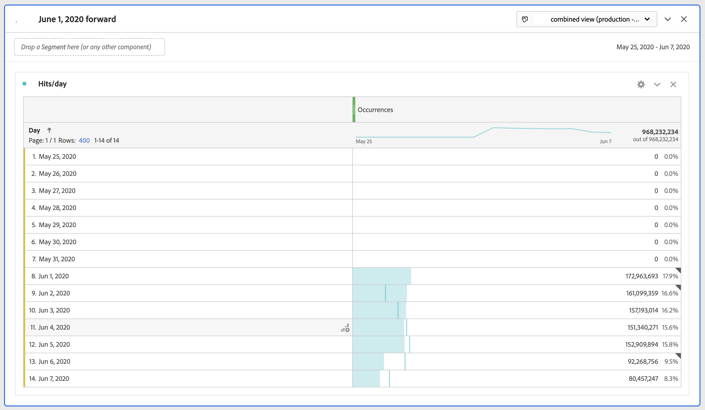

# Limiter une suite de rapports virtuelle à certaines dates

{{available-existing-customers}}

Une fois lʼassemblage activé, il débute à une date précise. Supposons que la date soit le 1er juin. La suite de rapports virtuelle des analyses entre appareils contiendra des données désassemblées avant le 1er juin. Vous pouvez masquer toutes les données de la suite de rapports virtuelle avant le 1er juin afin que votre analyse puisse se concentrer sur les périodes après le début du groupement.

Vous pouvez limiter les données de la suite de rapports virtuelle à certaines dates en procédant comme suit :

## Étape 1 : créer une suite de rapports virtuelle avec une période mobile quotidienne

Lorsque vous configurez la suite de rapports virtuelle, sous Composants, ajoutez une période dont le début est fixe, avec une période mobile quotidienne. Le début fixe devrait être le jour de début de lʼassemblage.

## Étape 2 : créer un segment « exclure-exclure »

Créez ensuite un segment de hits qui place la période dans un conteneur dʼexclusion imbriqué dans un autre conteneur d’exclusion. C&#39;est une exclusion.

La raison de l’« exclusion » est que les périodes sont destinées à remplacer la période du rapport. Ainsi, si vous incluez uniquement les données à partir du 1er juin, la période du rapport sera toujours du 1er juin à la date actuelle. Cela conduira à des résultats indésirables. Lorsque vous « excluez, excluez », cela remplace ce comportement et limite simplement les données que vous pouvez extraire à la période appropriée.

## Étape 3 : appliquer ce segment à votre suite de rapports virtuelle Analytics sur l’ensemble des appareils

## Étape 4 : Consulter les résultats dans le reporting

Notez que le reporting commence désormais à la date souhaitée, le jour même où le rapprochement a été mis en œuvre pour la première fois :

