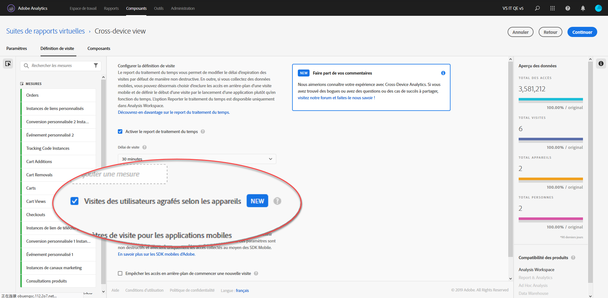

# Configuration d’Analytics sur plusieurs périphériques

Une fois toutes les conditions préalables remplies, procédez comme suit pour activer les analyses entre appareils. Vous devez appartenir à un groupe d’administrateurs de profil de produit ou disposer de droits d’administrateur dans Adobe Analytics pour suivre cette procédure.

>[!IMPORTANT] Toutes les conditions préalables doivent être remplies avant de suivre cette procédure. Si toutes les conditions préalables ne sont pas remplies, la fonction n’est pas disponible ou ne fonctionne pas. Pour connaître les conditions préalables et les limites, consultez la page  d’aperçu et la méthode d’assemblage souhaitée (graphique Périphérique ou graphique basé sur les champs).

## Choisissez la suite de rapports entre appareils qui sera activée pour les analyses entre appareils.

Lorsque votre entreprise est configurée pour utiliser les analyses entre appareils, vous choisissez la suite de rapports à utiliser. Ce choix peut être communiqué par l’intermédiaire de votre gestionnaire de compte Adobe. Adobe active ensuite la suite de rapports choisie pour le traitement des analyses entre appareils

## Créer une suite de rapports virtuelle sur plusieurs appareils pour afficher la vue sur plusieurs appareils

Les administrateurs ayant accès à la création de suites de rapports virtuelles peuvent créer des suites de rapports virtuelles des analyses entre appareils comme suit :

1. Accédez à [experiencecloud.adobe.com](https://experiencecloud.adobe.com) et connectez-vous à l’aide de vos identifiants Adobe ID.
2. Cliquez sur l’icône à neuf grilles en haut de l’écran, puis sur Analytics.
3. Passez la souris sur Composants en haut de l’écran, puis cliquez sur Suites de rapports virtuelles.
4. Cliquez sur Ajouter.
5. Saisissez le nom de votre suite de rapports virtuelle et assurez-vous que la suite de rapports compatible avec les analyses entre appareils est sélectionnée.
6. (Facultatif) Appliquez un segment à la suite de rapports virtuelle. Par exemple, vous pouvez appliquer un segment qui limite la suite de rapports virtuelle aux dates suivant l’activation des analyses entre appareils et le début du regroupement. Ce segment permet aux utilisateurs de voir uniquement les plages de dates regroupées dans la suite de rapports virtuelle.
7. Cochez la case « Activer le report de traitement du temps », qui active plusieurs autres options, notamment Analyses entre appareils.
8. Cochez la case « Visites des utilisateurs agrafés selon les appareils ».
9. Cliquez sur Continuer, terminez la configuration de la suite de rapports virtuelle, puis cliquez sur Enregistrer.

## Ajouts et modifications apportés aux suites de rapports virtuelles sur plusieurs appareils

Lorsque les analyses entre appareils sont activées sur une suite de rapports virtuelle, notez les modifications suivantes :

* Une nouvelle icône interpériphérique apparaît en regard du nom de la suite de rapports virtuelle. Cette icône est réservée aux suites de rapports virtuelles sur plusieurs appareils.
* Une nouvelle dimension intitulée « État identifié » est disponible. Cette dimension détermine si l’Experience Cloud ID sur cet accès est connu par le graphique de l’appareil à ce moment.
* De nouvelles mesures intitulées « Personnes » et « Appareils uniques » sont disponibles.
* La mesure « Visiteurs uniques » n’est pas disponible, car elle est remplacée par « Personnes »et « Appareils uniques ».
* Lors de la création de segments, le conteneur de segments « Visiteur » est remplacé par un conteneur « Personne ».
