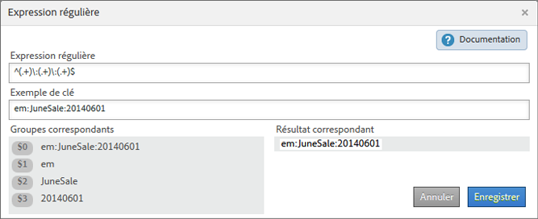
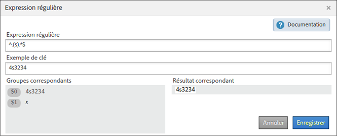
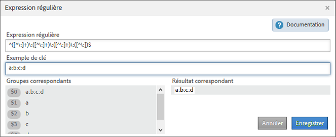

# Règles de classification

Les règles de classification recherchent régulièrement des termes non classés. Si une correspondance de règle est trouvée, les règles ajoutent automatiquement les termes aux tableaux de données de classification. Vous pouvez également utiliser des règles de classification pour remplacer des clés existantes.

**[!UICONTROL Analytics]** > **[!UICONTROL Admin]** > **[!UICONTROL Créateur de règles de classification]**

Le Créateur de règles vous permet de créer un *jeu de règles de classification*, qui consiste en une liste de *règles de classification*. Une règle établit une correspondance avec les critères spécifiés, puis exécute une action.

Les règles de classification conviennent dans les cas suivants :

* **E-mail** et **Afficher les publicités** : créez des règles de classification pour regrouper les campagnes d’affichage individuelles, de sorte que vous puissiez comparer les performances des campagnes d’affichage et des campagnes par e-mail.

* **Codes de suivi** : créez des règles de classification pour catégoriser les valeurs de clé provenant de chaînes dans des codes de suivi et les faire correspondre à des critères spécifiques que vous avez définis.
* **Termes de recherche** : utilisez des  [expressions régulières](/help/components/classifications/crb/classification-quickstart-rules.md) et des caractères génériques pour simplifier la classification de termes de recherche. Si, par exemple, un terme de recherche contient *`baseball`*, vous pouvez définir une classification *`Sports League`* sur *`MLB`*.

Supposons, par exemple, que le code de suivi d’un identifiant de campagne par courriel soit :

`em:Summer:2013:Sale`.

Vous pouvez configurer trois règles dans un jeu pour identifier les parties de la chaîne, puis classer les valeurs :

| Sélectionner le type de règle | Entrer les critères de recherche | Définir la classification | À |
|---|---|---|---|
| Commence par | em : | Canal | Courriel |
| Se termine par | Sale | Type | Sale |
| Contient | 2013 | Année | 2013 |

## Méthode de traitement des règles {#how-rules-are-processed}

Informations importantes sur le traitement des règles de classification.

<!-- 

about_classification_rules.xml

 -->

* [Informations importantes concernant les règles](/help/components/classifications/crb/classification-rule-builder.md)
* [Dans quels cas les règles ne classent-elles pas les clés ?](/help/components/classifications/crb/classification-rule-builder.md)
* [À propos de la priorité des règles](/help/components/classifications/crb/classification-quickstart-rules.md)

>[!NOTE]
>
>Le [!UICONTROL Créateur de règles] ne prend pas en charge les classifications Numérique 2.

## Informations importantes concernant les règles

* Spécifiez les  [droits d’accès de groupe](https://experienceleague.adobe.com/docs/analytics/admin/user-product-management/user-groups/groups.html?lang=fr) correspondant aux classifications dans [!UICONTROL Outils d’administration].

* **Expressions régulières** : une aide est disponible sous [Expressions régulières dans des règles de classification](/help/components/classifications/crb/classification-quickstart-rules.md).

* **Suites de rapports** : pour choisir une classification, il faut qu’au moins une suite de rapports soit sélectionnée. Vous ne pouvez pas appliquer la suite de rapports tant que vous n’avez pas créé le jeu de règles et affecté une variable.

   Lorsque vous testez le jeu de règles, utilisez des clés (la variable étant classée) du rapport afin de déterminer l’impact sur celles-ci du jeu de règles. (La  [clé](/help/components/classifications/importer/c-saint-data-files.md) est la variable étant classée, ou la première colonne du tableau de téléchargement des classifications.)

* **Priorité des règles** : si une clé correspond à plusieurs règles qui définissent la même classification (dans la colonne [!UICONTROL Définir la classification]), la dernière règle correspondant à la classification est utilisée. Voir  [À propos de la priorité des règles](/help/components/classifications/crb/classification-quickstart-rules.md).

* **Limites relatives au nombre de règles** : aucune limite n’est définie quant au nombre de règles que vous pouvez créer. Sachez toutefois qu’un nombre élevé de règles peut avoir une incidence sur les performances du navigateur.
* **Traitement** : les règles sont traitées à intervalles réguliers, selon le volume de trafic lié aux classifications.

   Les règles actives sont traitées toutes les quatre heures ; elles examinent les données de classification remontant généralement à un mois. Les règles recherchent automatiquement les nouvelles valeurs et téléchargent les classifications à l’aide de l’importateur.

* **Remplacement des classifications existantes** : reportez-vous à la section [Dans quels cas les règles ne classent-elles pas les clés ?](/help/components/classifications/crb/classification-quickstart-rules.md) Au besoin, vous pouvez supprimer des classifications existantes à l’aide de l’importateur.

## Dans quels cas les règles ne classent-elles pas les clés ?

Lorsque vous activez des règles, vous pouvez écraser des classifications existantes. Dans les cas suivants, une règle de classification ne classe pas une  [clé](/help/components/classifications/importer/c-saint-data-files.md) (variable) si :

* La clé est déjà classée et vous ne sélectionnez pas l’option [Remplacer les classifications pour](/help/components/classifications/crb/classification-rule-definitions.md).

   Vous pouvez remplacer des classifications lors de l’  [ajout ou de l’activation](/help/components/classifications/crb/classification-quickstart-rules.md) d’une règle, ainsi que lors de l’activation d’une intégration de Data Connectors. (Pour les Data Connectors, les règles sont créées par des partenaires dans le centre de développement, puis affichées dans le [!UICONTROL Créateur de règles de classification].)

* Une clé classée n’est pas apparue dans les données après une période définie lors d’une opération de remplacement de clé, même après avoir activé l’option [Remplacer les classifications pour](/help/components/classifications/crb/classification-rule-definitions.md).
* La clé n’est pas classée et elle n’est jamais transmise à [!DNL Adobe Analytics] après la période qui a débuté il y a environ un mois.

   >[!NOTE]
   >
   >Dans les rapports, les classifications s’appliquent à toute période spécifiée lorsqu’il existe une clé. La période d’un rapport n’a pas d’incidence sur la création de rapports.


## Expressions régulières dans les règles de classification {#regex-in-classification-rules}

Utilisez des expressions régulières pour faire correspondre des valeurs de chaîne formatées de manière uniforme à une classification. Vous pouvez, par exemple, créer une classification à partir de caractères spécifiques d’un code de suivi. Vous pouvez établir des correspondances avec des caractères, des mots ou des schémas de caractères donnés.

<!-- 

regex_classification_rules.xml

 -->

* [Expression régulière – Exemple de code de suivi](/help/components/classifications/crb/classification-quickstart-rules.md#section_2EF7951398EB4C2F8E52CEFAB4032669)
* [Expression régulière – Classification d’un caractère spécifique](/help/components/classifications/crb/classification-quickstart-rules.md#section_5D300C03FA484BADACBFCA983E738ACF)
* [Expressions régulières – Correspondance de codes de suivi de longueur variable](/help/components/classifications/crb/classification-quickstart-rules.md#section_E86F5BF5C2F44ABC8FFCE3EA67EE3BB2)
* [Expressions régulières – Exemple « Ne contient pas » ](/help/components/classifications/crb/classification-quickstart-rules.md#section_FCA88A612A4E4B099458E3EF7B60B59C)
* [Expressions régulières – Tableau de références](/help/components/classifications/crb/classification-quickstart-rules.md#section_0211DCB1760042099CCD3ED7A665D716)

>[!NOTE]
>
>Les expressions régulières sont mieux adaptées aux codes de suivi qui utilisent des délimiteurs.

## Expression régulière – Exemple de code de suivi {#section_2EF7951398EB4C2F8E52CEFAB4032669}

>[!NOTE]
>
>Si le code de suivi est en codage URL, il **n’est pas** classé par le Créateur de règles.

Pour les besoins de cet exemple, supposons que vous souhaitiez classer l’identifiant de campagne suivant :

[!UICONTROL Sample Key]: `em:JuneSale:20130601`

Le code de suivi que vous souhaitez classer se décompose comme suit :

* `em` = email
* `JuneSale` = nom de la campagne
* `20130601` = date

[!UICONTROL Regular Expression]: `^(.+)\:(.+)\:(.+)$`

Corrélation entre l’expression régulière et l’identifiant de campagne :


[!UICONTROL Groupes correspondants] : affiche la correspondance entre l’expression régulière et les caractères d’identification de la campagne, de sorte que vous puissiez classer une position dans l’identifiant de campagne.



Cet exemple indique à la règle que la date de la campagne `20140601` se trouve dans le troisième groupe `(.+)`, identifié par `$3`.

**[!UICONTROL Créateur de règles]**

Configurez la règle comme suit dans le [!UICONTROL Créateur de règles] :

| Sélectionner le type de règle | Entrer les critères de recherche | Définir la classification | À |
|---|---|---|---|
| Expression régulière | &amp;Hat;(.+)\:(.+)\:(.+)$ | Date de la campagne | $3 |

**Syntaxe**

| Expression régulière | Résultat de la chaîne ou de la correspondance | Groupes correspondants |
|--- |--- |--- |
| `^(.+)\:(.+)\:(.+)$` | em:JuneSale:20130601 | `$0`: em:JuneSale:20130601  `$1`: em  `$2`: JuneSale  `$3`: 20130601 |
| Création de la syntaxe | `^` = début d’une ligne ()= regroupe les caractères et vous permet d’extraire les caractères correspondants entre parenthèses.  `(.+)` = Capture un caractère ( . ) caractère et ( + ) en plus \ = début d’une chaîne.  `$` = Indique que le caractère (ou groupe de caractères) précédent est le dernier de la ligne. |

Pour en savoir plus sur la signification des caractères d’une expression régulière, reportez-vous à la section [Expressions régulières – Tableau de références](/help/components/classifications/crb/classification-quickstart-rules.md#section_0211DCB1760042099CCD3ED7A665D716).

## Expression régulière – Classification d’un caractère spécifique {#section_5D300C03FA484BADACBFCA983E738ACF}

Pour utiliser une expression régulière, une méthode consiste à classer un caractère spécifique dans une chaîne. Supposons, par exemple, que le code de suivi ci-dessous contienne deux caractères importants :

[!UICONTROL Sample Key]: `4s3234`

* `4` = nom de la marque
* `s` = identifie un moteur de recherche, tel que Google



**[!UICONTROL Créateur de règles]**

Configurez la règle comme suit dans le [!UICONTROL Créateur de règles] :

| Sélectionner le type de règle | Entrer les critères de recherche | Définir la classification | À |
|--- |--- |--- |--- |
| Expression régulière | `^.(s).*$` | Marque et moteur | `$0` (Capture les deux premiers caractères du nom de la marque et du moteur de recherche.) |
| Expression régulière | `^.(s).*$` | Moteur de recherche | `$1` (Capture le deuxième caractère pour Google.) |

## Expressions régulières – Correspondance de codes de suivi de longueur variable {#section_E86F5BF5C2F44ABC8FFCE3EA67EE3BB2}

Cet exemple illustre la procédure d’identification de caractères spécifiques entre des caractères « deux points » faisant office de délimiteurs lorsque les codes de suivi sont de longueur variable. Adobe recommande l’utilisation d’une seule expression régulière par code de suivi.

Exemples de clés :

* `a:b`
* `a:b:c`
* `a:b:c:d`

**Syntaxe**




**[!UICONTROL Créateur de règles]**

Configurez la règle comme suit dans le [!UICONTROL Créateur de règles] :

| Sélectionner le type de règle | Entrer les critères de recherche | Définir la classification | À |
|--- |--- |--- |--- |
| Expression régulière  Pour la chaîne correspondante a:b | `^([^\:]+)\:([^\:]+)$` | a | `$1` |
| Expression régulière  Pour la chaîne correspondante a:b | `^([^\:]+)\:([^\:]+)$` | b | `$2` |
| Expression régulière Pour la chaîne correspondante a:b:c | `^([^\:]+)\:([^\:]+)\:([^\:]+)$` | a | `$1` |
| Expression régulière Pour la chaîne correspondante a:b:c | `^([^\:]+)\:([^\:]+)\:([^\:]+)$` | b | `$2` |
| Expression régulière Pour la chaîne correspondante a:b:c | `^([^\:]+)\:([^\:]+)\:([^\:]+)$` | c | `$3` |
| Expression régulière Pour la chaîne correspondante a:b:c:d | `^([^\:]+)\:([^\:]+)\:([^\:]+)\:([^\:])$` | d | `$4` |

## Expressions régulières – Exemple « Ne contient pas »  {#section_FCA88A612A4E4B099458E3EF7B60B59C}

Cet exemple illustre une expression régulière qui correspond à toute chaîne ne contenant pas de caractères spécifiques ; `13`, dans le cas présent.

Expression régulière :

`^(?!.*13.*).*$`

Chaînes de test :

```
a:b:
a:b:1313
c:d:xoxo
c:d:yoyo
```

Résultats de la correspondance :

```
a:b:
c:d:xoxo
c:d:yoyo
```

Dans ce résultat, `a:b:1313` n’indique pas de correspondance.

## Expressions régulières – Tableau de références {#section_0211DCB1760042099CCD3ED7A665D716}

| Expression | Description |
|---|---|
| `(?ms)` | Rend toute l’expression régulière correspondant à une entrée à plusieurs lignes, permettant au caractère générique correspondant à n’importe quel caractère de saut de page |
| (`?i`) | Rend toute l’expression régulière insensible à la casse |
| [`abc`] | N’importe quel caractère parmi a, b ou c |
| [`^abc`] | N’importe quel caractère sauf a, b ou c |
| [`a-z`] | N’importe quel caractère entre a et z |
| [`a-zA-Z`] | N’importe quel caractère entre a et z ou A et Z |
| `^` | Début de ligne (correspond au début de la ligne) |
| `$` | Correspondance avec la fin de la ligne (ou avant la nouvelle ligne à la fin) |
| `\A` | Début de chaîne. |
| `\z` | Fin de chaîne. |
| `.` | Correspondance avec n’importe quel caractère (sauf une nouvelle ligne) |
| `\s` | N’importe quel espace |
| `\S` | N’importe quel caractère sauf espace |
| `\d` | N’importe quel chiffre |
| `\D` | N’importe quel caractère non numérique |
| `\w` | N’importe quel caractère d’un mot (lettre, chiffre, caractère de soulignement) |
| `\W` | N’importe quel caractère n’appartenant pas à un mot |
| `\b` | N’importe quelle limite de mot |
| `(...)` | Acquérir tout ce qui est compris |
| `(a\b)` | a ou b |
| `a?` | Zéro ou un de : a |
| `a*` | Zéro ou plus de : a |
| `a+` | Un ou plus de : a |
| `a{3}` | Exactement 3 de : a |
| `a{3,}` | 3 ou plus de : a |
| `a{3,6}` | Entre 3 et 6 de : a |

Le site [https://rubular.com/](https://rubular.com/) constitue une excellente ressource pour tester la validité d’une expression régulière.

## À propos de la priorité des règles

Si une clé correspond à plusieurs règles et qu’elle définit la même colonne de classification que celle affichée dans la colonne [!UICONTROL Définir la classification], c’est la dernière règle qui est utilisée. Dès lors, il se peut que vous souhaitiez classer la règle la plus importante en dernier dans votre jeu de règles.

<!-- 

rule_priority.xml

 -->

Si vous créez plusieurs règles qui ne partagent pas la même classification, l’ordre de traitement n’a pas d’importance.

L’exemple de terme de recherche ci-dessous classe les types de recherche pour un athlète :

| Numéro de règle | Type de règle | Correspond à | Définir la classification | À |
|---|---|---|---|---|
| 1 | Contient | Cowboys | Type de recherche | Team |
| 2 | Contient | Fantasy | Type de recherche | Fantasy |
| 3 | Contient | Romo | Type de recherche | Player |

Si un utilisateur recherche  *`Cowboys fantasy Tony Romo`*, le terme *`Player`* est classé, car il correspond à la dernière classification affichée dans la colonne Définir la classification.

De même, supposons que vous configuriez deux règles d’un jeu pour les termes de recherche suivants :

| Numéro de règle | Type de règle | Correspond à | Définir la classification | À |
|---|---|---|---|---|
| 1 | Contient | Cowboys | Ville | Dallas |
| 2 | Contient | Broncos | Ville | Denver |

Un utilisateur recherche  *`Cowboys vs. Broncos`*. Si le créateur de règles détecte un conflit dans la correspondance de règles, la classification de la deuxième règle (Denver) s’applique à cette recherche.

## Ajout dʼune règle de classification à un jeu de règles {#add-classification-to-rule-set}

<!-- 

t_classification_rule.xml

 -->

Description de la procédure d’ajout ou de modification d’une règle de classification.

Pour ajouter des règles, faites correspondre une condition à une classification et indiquez l’action.

>[!NOTE]
>
>Au cours de cette procédure, vous devez appliquer les règles à une ou plusieurs suites de rapports. Le nombre recommandé de règles par jeu de règles est compris entre 500 et 1000, bien qu’il n’y ait pas de limites. Si le nombre de règles est supérieur à 100, pensez à simplifier votre jeu de règles en utilisant des  [sous-classifications](/help/components/classifications/c-sub-classifications.md).

1. [Créez un jeu de règles de classification](/help/components/classifications/crb/classification-rule-set.md).
1. Sur la page du jeu de règles, cliquez sur **[!UICONTROL Ajouter une règle]**.

   

1. En regard de **[!UICONTROL Suites de rapports]**, cliquez sur **[!UICONTROL Ajouter des suites]** pour indiquer une ou plusieurs suites de rapports à affecter à ce jeu de règles.

   La page **[!UICONTROL Sélectionner une suite de rapports]** s’affiche.

   >[!NOTE]
   >
   >Les suites de rapports s’affichent sur cette page *seulement* lorsque les conditions suivantes sont satisfaites :
   >
   >* Les suites de rapports comportent au moins une classification définie pour la variable dans [!UICONTROL Outils d’administration].
      >
      >   (Voir *Variable* dans [Jeux de règles de classification](/help/components/classifications/crb/classification-rule-set.md) pour obtenir une explication sur cette condition préalable.)
   >
   >* Vous avez sélectionné la suite de rapports sur la page **[!UICONTROL Suites de rapports disponibles]**, qui s’affiche après avoir cliqué sur [Ajouter un jeu de règles](/help/components/classifications/crb/classification-rule-set.md) pour créer le jeu de règles.


1. Spécifiez s’il convient de remplacer les valeurs existantes :

   | **Les règles remplacent toutes les valeurs existantes**. | (Paramètre par défaut) Remplace toujours les clés de classification existantes, y compris les classifications transférées au moyen de l’importateur (SAINT). |
   |---|---|
   | **Les règles remplacent uniquement les valeurs non définies**. | Seules les cellules vides (non définies) sont remplies. Les classifications existantes restent inchangées. |

1. [Définissez la ou les règles](/help/components/classifications/crb/classification-rule-definitions.md#section_4A5BF384EEEE4994B6DC888339833529).

   

   Pour des exemples de création de règles, reportez-vous aux sections [Créateur de règles de classifications](/help/components/classifications/crb/classification-rule-builder.md) et [Expressions régulières dans les règles de classification](/help/components/classifications/crb/classification-quickstart-rules.md).

   >[!NOTE]
   >
   >Si une clé correspond à plusieurs règles qui définissent la même classification (dans la colonne Définir la classification), la dernière règle correspondant à la classification est utilisée. Reportez-vous à la section **À propos de la priorité des règles** pour plus d’informations sur le tri des règles.

1. [Testez votre jeu de règles](/help/components/classifications/crb/classification-quickstart-rules.md).
1. Une fois le test effectué, cliquez sur **[!UICONTROL Actif]** pour valider et activer la règle.

   Lors de l’activation d’une règle, le fichier est automatiquement créé et téléchargé.

   Définitions de champ : voir [Créateur de règles de classification](/help/components/classifications/crb/classification-rule-definitions.md) pour connaître la définition des options d’interface de cette page.

## Tester un jeu de règles de classification

<!-- 

t_classifications_test_rule.xml

 -->

Description de la procédure de test d’une règle ou d’un jeu de règles de classification. Lors de l’exécution d’un test, toutes les règles d’un jeu sont vérifiées.

1. [Créez un jeu de règles de classification](/help/components/classifications/crb/classification-rule-set.md).
1. Sur la page [!UICONTROL Créateur de règles de classifications], cliquez sur le nom du jeu de règles.
1. Assurez-vous que le jeu de règles est associé à une suite de rapports.
1. Dans l’éditeur de règles, cliquez sur **[!UICONTROL Tester le jeu de règles]**.

   

1. Saisissez ou collez des clés de test dans le champ [!UICONTROL Exemples de clés].

   Quelques exemples de clés :

   * Codes de suivi
   * Mots-clés ou expressions de recherche

   Voir  [Expressions régulières dans des règles de classification](/help/components/classifications/crb/classification-quickstart-rules.md).
1. Cliquez sur **[!UICONTROL Exécuter le test]**.

   Les règles correspondantes sont affichées dans le tableau [!UICONTROL Résultats].
1. (Facultatif) Cliquez sur **[!UICONTROL Activer]** pour activer la règle et pour remplacer les classifications existantes.

   Voir pour plus d’informations sur l’utilisation de règles pour remplacer des classifications existantes.

## Valider et activer des règles de classification

<!-- 

t_validate_rules.xml

 -->

Ces étapes décrivent la validation et l’activation de règles de classification.

1. [Créez un jeu de règles de classification](/help/components/classifications/crb/classification-rule-set.md), puis [ajoutez des règles de classification](/help/components/classifications/crb/classification-quickstart-rules.md) au jeu.
1. Cliquez sur **[!UICONTROL Activer]** dans l’éditeur de règles.

   

1. (Facultatif) Pour remplacer des classifications, activez l’option **[!UICONTROL Remplacer les classifications pour]** &lt;*sélection*>.

   Cette option vous permet de remplacer des classifications pour les clés concernées.

   Pour consulter la définition de cette option, voir [Page Règles](/help/components/classifications/crb/classification-rule-definitions.md#section_4A5BF384EEEE4994B6DC888339833529).
