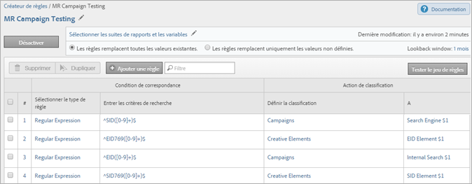

# Jeux de règles de classification

Un jeu de règles est un groupe de règles de classification relatives à une variable spécifique. Vous appliquez une variable au jeu de règles. Si vous souhaitez créer plusieurs jeux de règles pour une seule variable, vous devez appliquer chacun d’eux à plusieurs suites de rapports.

## Page du créateur de règles de classification {#section_C60B0888C76D49C596EF19F11808B718}

**[!UICONTROL Analytics]** > **[!UICONTROL Admin]** > **[!UICONTROL Créateur de règles de classification]**

Les champs et options ci-dessous sont disponibles sur la page [!UICONTROL Créateur de règles de classifications].

<table id="table_A5D92409969747E39E041216A5AA32CD"> 
 <thead> 
  <tr> 
   <th colname="col1" class="entry"> Élément </th> 
   <th colname="col2" class="entry"> Description </th> 
  </tr> 
 </thead>
 <tbody> 
  <tr> 
   <td colname="col1"> 
<a href="/help/components/classifications/crb/classification-rule-set.md"  > Ajouter un jeu de règles</a> 
 </td> 
   <td colname="col2"> 
Crée un jeu de règles. 
 </td> 
  </tr> 
  <tr> 
   <td colname="col1"> 
Règles 
 </td> 
   <td colname="col2"> Affiche le nombre de règles du jeu. </td> 
  </tr> 
  <tr> 
   <td colname="col1"> 
État 
 </td> 
   <td colname="col2"> Affiche l’état d’activité du jeu de règles ; Version préliminaire ou Actif, par exemple. Les règles actives sont traitées tous les jours ; elles examinent les données de classification remontant généralement à un mois. Les règles recherchent automatiquement les nouvelles valeurs et téléchargent les classifications. </td> 
  </tr> 
  <tr> 
   <td colname="col1"> 
Dernière modification 
 </td> 
   <td colname="col2"> Indique la date de la dernière modification du jeu de règles. </td> 
  </tr> 
  <tr> 
   <td colname="col1"> 
Dupliquer 
 </td> 
   <td colname="col2"> Duplique (copie) un jeu de règles, de telle sorte que vous puissiez l’appliquer à une autre variable ou à la même variable dans une autre suite de rapports. </td> 
  </tr> 
 </tbody> 
</table>

## Créer un jeu de règles de classification {#create-classification-rule-set}

Nommez le jeu de règles de classification, appliquez la variable et spécifiez les paramètres de remplacement.

1. (Condition préalable) Définissez la structure de classification sous **[!UICONTROL Admin]** > **[!UICONTROL Report Suites]**.

   (Voir [Classifications](https://experienceleague.adobe.com/docs/analytics/components/classifications/c-classifications.html?lang=fr) dans l’aide des outils d’administration à propos de l’ajout de classifications.)

   Les variables s’affichent dans le panneau [!UICONTROL Nouveau jeu de règles] uniquement une fois qu’au moins une classification est définie pour la variable.

   Vous pouvez créer des classifications sur une variable dans **[!UICONTROL Admin]** > **[!UICONTROL Report Suites]** > **[!UICONTROL Trafic]** > **[!UICONTROL Classifications de trafic]** (ou **[!UICONTROL Conversion]** > **[!UICONTROL Classifications des conversions]**). Sélectionnez ensuite la variable et cliquez sur **[!UICONTROL Ajouter une classification]**.

1. Pour créer le jeu de règles, cliquez sur **[!UICONTROL Admin]** > **[!UICONTROL Créateur de règles de classification]** > **[!UICONTROL Ajouter un jeu de règles]**.

   

1. Nommez le jeu de règles, puis cliquez sur **[!UICONTROL Créer un jeu de règles]**.
1. Sélectionnez le jeu de règles pour modification.

   

1. Cliquez sur **[!UICONTROL Sélectionner les suites de rapports et les variables]**.

   La liste des suites de rapports et des variables contient toutes les variables classées disponibles dans l’ensemble des suites de rapports de la société qui a établi la connexion. Une variable unique d’une suite de rapports ne peut appartenir qu’à un seul jeu de règles.

   Pour plus d’informations, voir *`Variable`* dans les définitions de la page [Créateur de règles de classification](/help/components/classifications/crb/classification-rule-definitions.md) .
1. Spécifiez les suites de rapports et variables à utiliser, puis cliquez sur **[!UICONTROL Enregistrer]**.
1. Poursuivez en [ajoutant des règles de classification](/help/components/classifications/crb/classification-rule-set.md) au jeu de règles.
