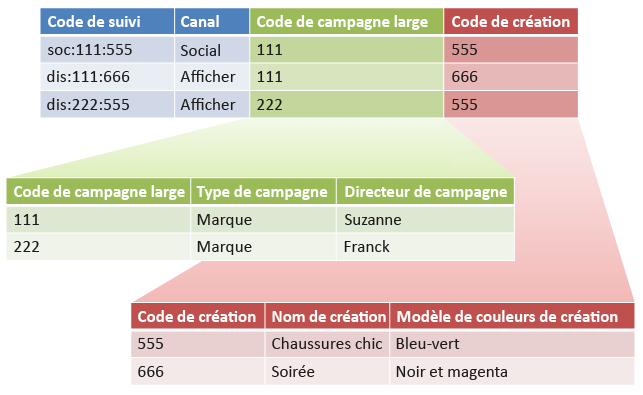

# Sous-classifications et créateur de règles (hérité)

{{classification-rulebuilder-deprecation}}

Vous pouvez combiner le Créateur de règles de classification avec des sous-classifications si vous vous assurez que chaque sous-classification comporte une valeur parente.

Le fait de combiner le Créateur de règles de classifications à des sous-classifications peut simplifier la gestion des classifications et de réduire le nombre de règles requises. Vous pouvez procéder de la sorte si votre code de suivi se compose de codes que vous souhaitez classer séparément.

Voir [Sous-classifications](/help/components/classifications/importer/subclassifications.md) pour obtenir des informations conceptuelles sur les sous-classifications.

## Exemple

Prenons comme exemple le code de suivi ci-dessous :

`channel:broad_campaign:creative`

Une hiérarchie de classification vous permet d’appliquer une classification à une autre (appelée *`sub-classification`*). En d’autres termes, vous pouvez utiliser l’importateur comme une base de données relationnelle, avec plusieurs tables. Une table fait correspondre des codes de suivi complets à des clés, tandis qu’une autre fait correspondre ces clés à d’autres tables.

Une fois cette structure en place, vous pouvez utiliser le [Créateur de règles de classification](/help/components/classifications/crb/classification-rule-builder.md) pour charger de petits fichiers qui ne mettent à jour que les tables de recherche (les tableaux vert et rouge de l’image précédente). Vous pouvez ensuite utiliser le créateur de règles pour assurer la mise à jour du tableau de classification principal.

La tâche ci-dessous décrit la marche à suivre.

## Configurer des sous-classifications à l’aide du Créateur de règles

Exemples d’étapes décrivant comment charger des sous-classifications à l’aide du Créateur de règles.

1. Créez des classifications et des sous-classifications dans le Gestionnaire de classifications.

   Exemple :

   

1. Dans le [créateur de règles de classification](/help/components/classifications/crb/classification-rule-builder.md), classifiez la clé de sous-classification à partir du code de suivi d’origine.

   Pour ce faire, utilisez une expression régulière. Dans cet exemple, la règle pour remplir les *`Broad Campaign code`* utiliserait cette expression régulière :

   | `#` | Type de règle | Correspond à | Définir la classification | À |
   |---|---|---|---|---|
   |   | Expression régulière | `[^\:]:([^\:]):([^\:])` | Code de campagne large | `$1` |
   |   | Expression régulière | `[^\:]:([^\:]):([^\:])` | Code de création | `$2` |

   >[!NOTE]
   >
   >À ce stade, vous ne complétez pas les sous-classifications *`Campaign Type`* et *`Campaign Director`*.

1. Téléchargez un fichier de classification contenant uniquement les sous-classifications spécifiées.

   Voir [Classifications à plusieurs niveaux](/help/components/classifications/importer/subclassifications.md).

   Exemple :

   | Clé | Canal | Code de campagne large | Broad Campaign code&amp;Hat;Campaign type | Broad Campaign code&amp;Hat;Campaign Director | ... |
   |---|---|---|---|---|---|
   | &#42; |  | 111 | Marque | Suzanne |  |
   | &#42; |  | 222 | Marque | Frank |  |

1. Pour gérer les tables de recherche, téléchargez un petit fichier (comme illustré ci-dessus).

   Le téléchargement de ce fichier sera effectué, par exemple, lors de l’insertion d’un nouveau *`Broad Campaign code`*. Ce fichier s’appliquera aux valeurs classées précédemment. De même, si vous créez une sous-classification (telle qu’une sous-classification *`Creative Theme`*’*`Creative code`*), vous ne chargez que le fichier de sous-classification, plutôt que l’ensemble du fichier de classification.

   Dans le cadre de la création de rapports, ces sous-classifications se comportent exactement comme des classifications de niveau supérieur. Cela a pour effet d’alléger la charge de gestion associée à leur utilisation.
