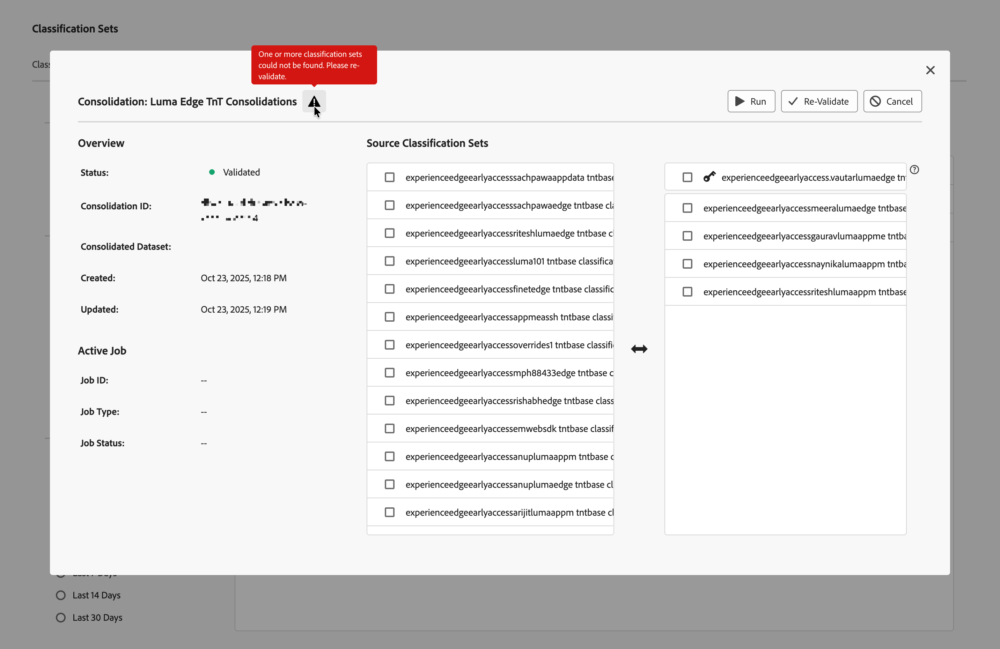

# Créer et modifier des consolidations de classification

Une consolidation d’ensembles de classifications vous permet de prendre des classifications provenant de plusieurs ensembles de classifications et de les combiner en un seul. Utilisez cette interface pour créer une consolidation d’ensemble de classifications du début à la fin. Cette interface est particulièrement utile pour les organisations qui passent des classifications héritées aux ensembles de classifications. Les organisations qui utilisent déjà des ensembles de classifications n’ont pas besoin d’utiliser ce workflow de consolidation.

## Création d’une consolidation {#create-a-consolidation}

>[!CONTEXTUALHELP]
>id="classificationsets_consolidation_setpriority"
>title="Priorité du jeu de classifications"
>abstract="Le  *ensemble de classifications* est l’ensemble de classifications de base et définit le schéma global ; il est prioritaire dans tous les conflits de fusion. Les autres ensembles de classifications sont appliqués dans l’ordre de haut en bas."

Pour créer une consolidation des classifications, dans l’interface principale d’Adobe Analytics :

1. Sélectionnez **[!UICONTROL Ensembles de classifications]** dans le menu **[!UICONTROL Composants]**.
1. Dans le gestionnaire **[!UICONTROL Ensembles de classifications]**, sélectionnez l’onglet **[!UICONTROL Consolidations]**.
1. Dans le gestionnaire **[!UICONTROL Ensembles de classifications - Consolidations]**, sélectionnez  **[!UICONTROL Nouveau]**.
1. Dans la boîte de dialogue **[!UICONTROL Nouvelle consolidation]** :

   
   1. Saisissez un **[!UICONTROL Nom]**. Par exemple : `Consolidation Example`.
   1. Saisissez une **[!UICONTROL Description (facultatif)]**. Par exemple : `Example classification set`.
   1. Saisissez une ou plusieurs adresses e-mail (séparées par des virgules) dans **[!UICONTROL Notifier les problèmes]**. Des notifications par e-mail sont envoyées à ces utilisateurs pour les informer de problèmes éventuels.
   1. Sélectionnez un ensemble de classifications dans le menu déroulant **[!UICONTROL Ensemble de classifications à faire correspondre]**.

      La liste de gauche **[!UICONTROL Ensemble de classifications Source]** est remplie avec des ensembles de classifications similaires à la liste de classifications sélectionnée et disponibles pour la consolidation. La liste de droite est automatiquement renseignée avec l’ensemble de classifications  sélectionné. Cet ensemble de base a défini le schéma global et est toujours prioritaire en cas de conflit de fusion.

   1. Sélectionnez les ensembles de classifications à consolider dans la liste de gauche, puis déposez les ensembles sélectionnés dans la liste de droite, sous l’ensemble de classifications  de base **[!UICONTROL _sélectionné_]**.

      Les ensembles de classifications supplémentaires sont consolidés par ordre croissant lorsque vous exécutez la consolidation. Si une clé existe dans plusieurs ensembles supplémentaires, la valeur de la clé de l’ensemble de classifications le plus élevé est prise. Si une clé existe à la fois dans le jeu de base  et dans tout jeu supplémentaire, la valeur du jeu de base est utilisée.

      Pour gérer les valeurs des clés utilisées, déplacez les ensembles de classifications individuels et sélectionnés dans la liste par glisser-déposer. Vous pouvez également remplacer la  **[!UICONTROL _ensemble de classifications_]** par un ensemble de classifications sélectionné par un glisser-déposer.

   1. Sélectionnez **[!UICONTROL Enregistrer]** pour enregistrer la consolidation de classification. Sélectionnez **[!UICONTROL Annuler]** pour annuler.

Une fois enregistrée, une consolidation de classification est automatiquement validée pour la consolidation. Cette validation garantit que chaque ensemble de classifications individuel est valide pour cette consolidation. Une fois l’opération réussie, l’entrée dans la liste de consolidation Classifications affiche le statut **[!UICONTROL Validé]**.

Après avoir créé une consolidation, les étapes suivantes sont les suivantes :

* [Valider à nouveau](#re-validate) la consolidation de classification lorsque vous avez apporté des modifications à la configuration initiale.
* [Exécutez](#run) la consolidation de la classification.
* [Valider](#approve) la consolidation de la classification.

<!--
         
  

**[!UICONTROL Components]** > **[!UICONTROL Classification sets]** > **[!UICONTROL Consolidations]** > **[!UICONTROL Add]**

The following fields are available when creating a consolidation:

* **[!UICONTROL Name]**: The name of the consolidation.
* **[!UICONTROL Notify of issues]**: A comma-delimited list of email addresses that are notified of issues with this consolidation.
* **[!UICONTROL Dataset to match]**: A drop-down list of all classification sets.

Once you select a classification set, a table with two columns appears:

* The right column contains all classification sets that you want to consolidate. It starts with the classification set selected using the above drop-down list.
* The left column contains all classification sets eligible to be merged with the originally selected dataset. **Schemas must exactly match to be eligible for consolidation**. If schemas do not match the selected classification set, they do not appear in this left column.

Drag the desired classification sets from the available column on the left to the consolidation column on the right. Once the consolidation is given a name and two or more classification sets are in the right column, click **[!UICONTROL Save & Continue]**.

-->

## Modification d’une consolidation

Pour modifier une consolidation de classification, dans l’interface principale d’Adobe Analytics :

1. Sélectionnez **[!UICONTROL Ensembles de classifications]** dans le menu **[!UICONTROL Composants]**.
1. Dans le gestionnaire **[!UICONTROL Ensembles de classifications]**, sélectionnez l’onglet **[!UICONTROL Consolidations]**.
1. Dans le gestionnaire **[!UICONTROL Consolidations des ensembles de classifications]** :
   1. Sélectionnez le nom de votre consolidation de classification. La boîte de dialogue **[!UICONTROL Consolidation : _nom de la consolidation de classification_]**&#x200B;s’affiche. L’apparence et les actions disponibles dépendent du statut actuel de la consolidation et du fait que vous ayez toujours la possibilité de modifier la consolidation de classification.

      | Actions disponibles | Description |
      |---|---|
      |  **[!UICONTROL Annuler]** | [Annuler la consolidation](#cancel). |
      |  **[!UICONTROL Revalider]** | [Revalider la consolidation](#re-validate). |
      |  **[!UICONTROL Exécution]** | [Exécuter la consolidation](#run). |
      |  **[!UICONTROL Approve]** | [Valider la consolidation](#approve). |

### Valider à nouveau

Vous pouvez valider à nouveau une consolidation de classification dans la boîte de dialogue Consolidation : consolidation de classification . Une  peut fournir des informations supplémentaires sur les problèmes liés à la consolidation qui nécessitent de la reconfigurer.

Pour valider à nouveau la consolidation de classification :

1. Reconfigurez la consolidation à l’aide de la même interface de glisser-déposer que celle utilisée pour créer la consolidation.
1. Sélectionnez  **[!UICONTROL Revalider]**. La validation garantit que chaque ensemble de classifications individuel est valide pour cette consolidation. En cas de réussite, un message de toast s’affiche :  **[!UICONTROL Consolidation soumise avec succès pour validation !]**
1. Sélectionnez  pour fermer la boîte de dialogue. Vous pouvez également sélectionner  **[!UICONTROL Exécuter]** pour exécuter la consolidation ou  **[!UICONTROL Annuler]** pour annuler la classification.

<!--
Once you have created a consolidation, a list of source datasets appears on the right. The **[!UICONTROL Validate]** button makes sure that each individual classification set is valid for this consolidation. You can reorder the classification steps here to determine priority in cases of mismatched classification values. **The highest classification set in the list overwrites any mismatched values in other classification sets.**

-->

### Exécutez

Une fois qu’une consolidation de classification a été validée, vous pouvez l’exécuter.

Pour exécuter une consolidation de classification, procédez comme suit :

1. Sélectionnez  **[!UICONTROL Exécuter]**. Un message toast affiche  **[!UICONTROL consolidation soumise avec succès pour traitement !]**
1. Sélectionnez  pour fermer la boîte de dialogue.

### Approuver {#approve}

>[!CONTEXTUALHELP]
>id="classificationsets_consolidations_mismatch"
>title="Discordance"
>abstract="Pourcentage d’incohérences clés lorsque la valeur de l’ensemble de classifications consolidé ne correspond pas à l’ensemble de classifications source."

>[!CONTEXTUALHELP]
>id="classificationsets_consolidations_absent"
>title="Absent"
>abstract="Le pourcentage de clés dans l’ensemble de classifications consolidé, mais pas dans l’ensemble de classifications source."

Une fois qu’une consolidation de classification a été exécutée avec succès, le statut de consolidation est  **[!UICONTROL En attente d’approbation]**. L’approbation d’une consolidation de classification remplace les ensembles de classifications individuels par l’ensemble de classifications consolidé et les ensembles de classifications individuels sont supprimés.

Pour approuver une consolidation d&#39;ensemble de classifications :

1. Utilisez les **[!UICONTROL rapports de similarité]** pour passer en revue la consolidation. Ce rapport présente un tableau avec les colonnes suivantes :

   * **[!UICONTROL Nom de l’ensemble de classifications]** : le nom de l’ensemble de classifications.
   * **[!UICONTROL Discordance]** : pourcentage de lignes dont les valeurs de clé ne correspondent pas à l’ensemble de classifications source. Si le pourcentage d’incohérence est élevé, l’incohérence peut indiquer que les données de classification sont trop différentes. Vérifiez et assurez-vous que les ensembles de classifications sélectionnés ont des données de classification similaires.
   * **[!UICONTROL Absent]** : pourcentage de lignes où les valeurs de clé se trouvent dans le jeu de classifications  mais pas dans le jeu de classifications source. Toutes les lignes absentes sont ajoutées à l’ensemble de classifications consolidé.

1. Si la consolidation de classification est prête pour approbation, sélectionnez  **[!UICONTROL Approuver]**. Une consolidation **[!UICONTROL Valider ?]** boîte de dialogue vous invite à confirmer. Sélectionnez **[!UICONTROL Valider]** pour valider la consolidation. Sélectionnez **[!UICONTROL Annuler]** pour annuler.

Une fois approuvé, l’ensemble de classifications consolidé est créé. Le statut est défini sur **[!UICONTROL Terminé]**.

### Annuler

Vous pouvez annuler une consolidation de classification avant approbation.

Pour annuler une consolidation de classification, procédez comme suit :

1. Sélectionnez **[!UICONTROL Annuler]**.

   Vous ne pouvez pas reprendre une consolidation une fois qu&#39;elle a été annulée.
1. Sélectionnez **[!UICONTROL Annuler la consolidation]** pour annuler la consolidation. Sélectionnez **[!UICONTROL Revenir en arrière]** pour annuler l’annulation.
