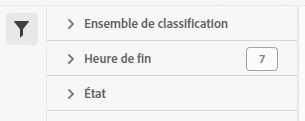

# Gestionnaire des tâches de jeux de classifications

Le gestionnaire des tâches des ensembles de classifications vous permet d’afficher les tâches de classification en cours et terminées qui ont été générées à partir d’ensembles de classifications. Vous pouvez également utiliser cette interface pour télécharger des données ou des modèles de classification pour une tâche spécifique, ou pour charger des données supplémentaires dans une tâche.

**[!UICONTROL Composants]** > **[!UICONTROL Ensembles de classifications]** > **[!UICONTROL Tâches]**

Impossible de créer des tâches à partir de cette interface. Créez des tâches en chargeant des données dans un ensemble de classifications (manuellement ou par l’intermédiaire d’un emplacement externe configuré), en demandant un fichier de téléchargement ou un fichier modèle.

## Filtrer des ensembles de classifications

Le côté gauche du gestionnaire des tâches des ensembles de classifications fournit des paramètres de filtre pour localiser la tâche souhaitée. Cliquez sur l’icône de filtre pour afficher ou masquer les paramètres de filtre. Vous pouvez filtrer les ensembles de classifications par **[!UICONTROL Ensemble de classifications]**, **[!UICONTROL Heure de fin]**, **[!UICONTROL Statut]**, **[!UICONTROL Type de tâche]** ou **[!UICONTROL Source]**.

D’autres options de filtre sont disponibles au-dessus des colonnes du gestionnaire des tâches des ensembles de classifications :

* **[!UICONTROL Recherche par titre]** : recherchez des tâches par nom de fichier.
* **[!UICONTROL Charger plus]** : le gestionnaire des tâches des ensembles de classifications affiche initialement jusqu’à 1 000 tâches. S’il existe d’autres traitements, cliquez sur ce bouton pour charger 1 000 traitements supplémentaires.
* **Afficher/masquer les colonnes** : activez ou désactivez la visibilité de n’importe quelle colonne, à l’exception de [!UICONTROL Nom de fichier] et de [!UICONTROL Heure de fin].

## Colonnes du gestionnaire de tâches des ensembles de classifications

Les colonnes suivantes sont disponibles dans le gestionnaire des tâches des ensembles de classifications :

* **[!UICONTROL Nom de fichier]** : le nom du fichier à charger ou à télécharger.
* **[!UICONTROL Ensemble de classifications]** : le nom de l’ensemble de classifications auquel le fichier s’applique. Vous pouvez cliquer sur le nom de l’ensemble de classifications pour accéder à ses [Paramètres](manage/settings.md).
* **[!UICONTROL Taille]** : la taille du fichier.
* **[!UICONTROL Statut]** : le statut de la tâche qui traite le fichier.
   * **[!UICONTROL Créé]** : la tâche a été envoyée.
   * **[!UICONTROL En file d’attente]** : le fichier est prêt à être traité et attend qu’un serveur de classification le traite.
   * **[!UICONTROL Validé]** : le fichier est valide et attend d’être traité.
   * **[!UICONTROL Échec de la validation]** : le fichier est mal formaté ou non valide. Le fichier n’est pas traité.
   * **[!UICONTROL Traitement]** : le fichier est en cours de traitement par Adobe.
   * **[!UICONTROL Échec du traitement]** : le traitement du fichier a échoué.
   * **[!UICONTROL Terminé]** : le traitement est terminé. Les données de classification sont visibles dans les rapports.
   * **[!UICONTROL Échec]** : échec générique non lié à la validation ou au traitement.
* **[!UICONTROL Type de tâche]** : le type de tâche.
* **[!UICONTROL Source]** : source de la tâche.
* **[!UICONTROL Téléchargement de fichier]** : s’applique uniquement aux tâches de téléchargement, telles que le téléchargement de données de classification ou le téléchargement de modèles. Lorsqu’un téléchargement est prêt, cette colonne fournit un lien de téléchargement.
* **[!UICONTROL Lignes modifiées]** : nombre de lignes modifiées.
* **[!UICONTROL Lignes terminées]** : nombre de lignes terminées.
* **[!UICONTROL Heure de fin]** : la date et l’heure auxquelles la tâche s’est terminée (ou a échoué).
