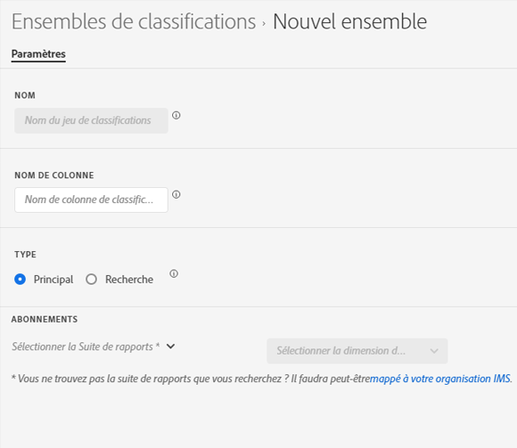

# Création d’un jeu de classifications

Vous pouvez utiliser le gestionnaire de jeux de classifications pour créer un jeu de classifications.

**[!UICONTROL Composants]** > **[!UICONTROL Ensembles de classifications]** > **[!UICONTROL Ensembles]** > **[!UICONTROL Ajouter]**

Lors de la création d’un jeu de classifications, les champs suivants sont disponibles.

* **[!UICONTROL Nom]**: Champ de texte utilisé pour identifier le jeu de classifications. Ce champ ne peut pas être modifié lors de la création, mais peut être renommé ultérieurement.
* **[!UICONTROL Nom de la colonne]**: Nom de la première dimension de classification que vous souhaitez créer. Ce champ correspond au nom de la dimension utilisé dans Analysis Workspace et au nom de la colonne lors de l’exportation de données de classification. Vous pouvez ajouter d’autres noms de colonne une fois le jeu de classifications créé.
* **[!UICONTROL Type]** : cases d’option qui indiquent le type de classification. Les classifications principales sont généralement utilisées ; les classifications de recherche représentent des [sous-classifications](../../c-sub-classifications.md).
* **[!UICONTROL Abonnements]** Suites de rapports et dimensions auxquelles ce jeu de classifications s’applique. Vous pouvez ajouter plusieurs combinaisons de suite de rapports et de dimension à un jeu de classifications.

S’il existe un jeu de classifications pour une suite de rapports + variable donnée, la classification est ajoutée au schéma à la place. Une combinaison donnée de suite de rapports + de variables ne peut pas appartenir à plusieurs jeux de classifications.
