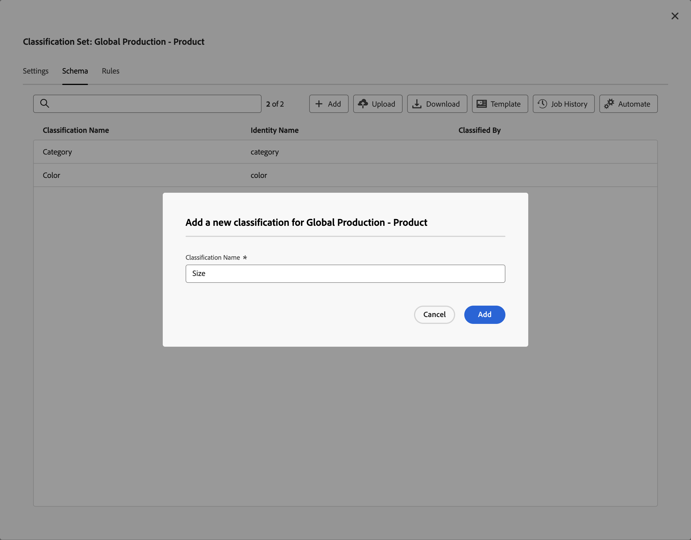

# Schéma du jeu de classifications

Le schéma correspond à la liste des classifications à appliquer aux dimensions clés que vous avez définies pour l’ensemble de classifications. Par exemple, si vous avez défini produit comme dimension clé et que ce champ contient un SKU de produit, vous utilisez le schéma pour ajouter des classifications telles que le nom du produit, la couleur du produit, la taille du produit, etc.

Pour modifier le schéma d’un ensemble de classifications :

1. Sélectionnez **[!UICONTROL Composants]** dans la barre de menus supérieure d’Adobe Analytics, puis sélectionnez **[!UICONTROL Ensembles de classifications]**.
1. Dans **[!UICONTROL Ensembles de classifications]**, sélectionnez l’onglet **[!UICONTROL Ensembles de classifications]**.
1. Dans le gestionnaire **[!UICONTROL Ensembles de classifications]**, sélectionnez l’ensemble de classifications pour lequel vous souhaitez modifier le schéma.
1. Dans la boîte de dialogue **[!UICONTROL Ensemble de classifications : _ensemble de classifications_]**, sélectionnez l’onglet **[!UICONTROL Schéma]**. Cet onglet se compose des éléments d’interface suivants :

   

   * [Liste des classifications](#classification-list)
   * [Recherche](#search)
   * [Actions](#actions)
   * [Barre d’actions](#action-bar)

## Liste des classifications

La liste des classifications comporte les colonnes suivantes :

| Colonne | Description |
|---|---|
| **[!UICONTROL Nom de la classification]** | Nom que vous avez fourni pour la classification. |
| **[!UICONTROL Nom de l’identité]** | Nom dérivé par le système pour la classification. |
| **[!UICONTROL Classé par]** | S’il est utilisé, un lien vers l’ensemble de classifications de recherche utilisé pour classer cette classification. |

## Recherche

Vous pouvez rechercher rapidement  une ou plusieurs classifications. Utilisez  pour effacer la recherche.

## Actions

Les actions suivantes sont disponibles sous forme de boutons en haut de la liste des classifications :

| Icône | Action | Description |
|---|---|---|
|  | **[!UICONTROL Ajouter]** | [Ajoutez une classification](#add) à la liste. |
|  | **[!UICONTROL Charger]** | [Chargez un fichier JSON, CSV, TSV ou TAB](#upload). |
|  | **[!UICONTROL Télécharger]** | [Télécharger des données de classification](#download). |
|  | **[!UICONTROL Modèle]** | [Téléchargez un modèle](#template) pour les données de classification. |
|  | **[!UICONTROL Historique des tâches]** | Affichez le [gestionnaire des tâches des ensembles de classifications](/help/components/classifications/sets/job-manager.md), filtré pour l’ensemble de classifications sélectionné. |
|  | **[!UICONTROL Automatiser]** | [Automatisez l’ingestion des données de classification](#automate) grâce à l’utilisation d’un emplacement cloud. |

### Ajouter

Pour ajouter une nouvelle classification, sélectionnez  **[!UICONTROL Ajouter]**.

Dans la boîte de dialogue **[!UICONTROL Ajouter une nouvelle classification pour _jeu de classifications_]**, saisissez le **[!UICONTROL Nom de la classification]**et sélectionnez **[!UICONTROL Ajouter]**. La classification est ajoutée à la liste.

### Charger

Pour importer des données de classification dans le schéma d’une classification, sélectionnez  **[!UICONTROL Upload]**.

1. Dans la boîte de dialogue **[!UICONTROL Ajouter de nouvelles classifications]** :

   * Faites glisser un fichier contenant des données de classification et déposez-le sur **[!UICONTROL Glisser-déposer ici]**.
   * Sélectionnez **[!UICONTROL Parcourir]** et choisissez un fichier sur votre ordinateur ou votre réseau.

   Un **[!UICONTROL Aperçu du schéma]** du contenu du fichier s’affiche. L’aperçu affiche les colonnes de données du fichier. Pour redimensionner une colonne, sélectionnez  et sélectionnez **[!UICONTROL Redimensionner la colonne]**. Une poignée s’affiche pour vous permettre de redimensionner la colonne.

   Lorsqu’aucune classification n’est définie dans le jeu de classifications pour une colonne, une alerte  s’affiche. L’alerte explique qu’une classification n’est pas présente dans l’ensemble de schémas de classification existant et sera créée lors de l’importation.

1. Sélectionnez **[!UICONTROL Remplacer les données en cas de conflit ?]** si vous souhaitez remplacer les données de classification actuelles par les nouvelles données importées. Par exemple :

   | | Clé | Couleur actuelle du produit | Importer un fichier | Nouvelle couleur du produit |
   |---|---|---|---|---|
   |  **[!UICONTROL Remplacer les données en cas de conflit ?]** | 1234 | vert | bleu | bleu |
   |  **[!UICONTROL Écraser les données en cas de conflit ?]** | 1234 | vert | bleu | vert |

1. Sélectionnez **[!UICONTROL Appliquer]**. Une alerte s’affiche si les colonnes ne sont pas présentes en tant que classifications dans le jeu de schémas existant. Ces colonnes sont ajoutées en tant que nouvelles classifications lorsque vous confirmez le chargement.

   

   Sélectionnez **[!UICONTROL Confirmer le chargement]** pour confirmer le chargement. Sélectionnez **[!UICONTROL Annuler le chargement]** pour annuler le chargement.

### Télécharger

Pour télécharger des données de classification, sélectionnez  **[!UICONTROL Télécharger]**.

Dans la boîte de dialogue **[!UICONTROL Télécharger les données pour _jeu de classifications_]**:

1. Saisissez le nombre de **[!UICONTROL Lignes]** à télécharger. Par exemple : `10000`.
1. Pour sélectionner la période pendant laquelle vous souhaitez télécharger des lignes de données de classification, saisissez des données de début et de fin pour **[!UICONTROL Télécharger les lignes reçues entre]**. Ou utilisez  pour utiliser une fenêtre contextuelle de calendrier afin de sélectionner la période.
1. Pour sélectionner les données à renvoyer, sélectionnez une option dans **[!UICONTROL Données renvoyées]**.

   * **[!UICONTROL Toutes les valeurs]** renvoie toutes les valeurs des données de classification actives.
   * **[!UICONTROL Toute colonne vide]** renvoie une colonne avec des valeurs de clé pour les données de classification existantes. Et les colonnes sans valeur pour les données de classification pour lesquelles il n’existe aucune valeur.
   * **[!UICONTROL Toutes les colonnes vides]** renvoie une colonne clé avec des valeurs pour les données de classification existantes. Et des colonnes sans valeur pour les données de classification.
1. Pour sélectionner le [format de fichier](/help/components/classifications/sets/data-files.md#general-file-requirements) des données de classification téléchargées, sélectionnez une option dans le menu déroulant **[!UICONTROL Format de fichier]**. Les options sont les suivantes :

   * **[!UICONTROL JSON]**
   * **[!UICONTROL valeurs séparées par des virgules]** (CSV).
   * **[!UICONTROL Valeurs séparées par des tabulations Excel]** (TSV ou TAB).

1. Pour sélectionner le [codage du fichier](/help/components/classifications/sets/data-files.md#general-file-requirements) au moment du téléchargement du fichier, sélectionnez une option dans le menu déroulant Codage de fichier. Les options sont les suivantes :

   * **[!UICONTROL UTF-8]**.
   * **[!UICONTROL Latin-1]**.

1. Sélectionnez **[!UICONTROL Télécharger]** pour télécharger les données de classification. Vous trouverez le fichier téléchargé dans le répertoire de téléchargement par défaut de votre navigateur. Le fichier est intitulé <code><i>Ensemble de classifications</i>.<i>json</i>|<i>csv</i>|<i>tsv</i></code>. Si le fichier existe déjà, un numéro de séquence <code>(<i>x</i>)</code> est ajouté au nom du fichier. Si vous avez spécifié des options qui ne renvoient aucune donnée, une boîte de dialogue **[!UICONTROL Remarque]** s’affiche pour vous informer de modifier les options de période et de données renvoyées.

### Modèle

Pour télécharger un modèle pour les données de classification, sélectionnez  **[!UICONTROL Modèle]**.

Dans la boîte de dialogue **[!UICONTROL Télécharger le modèle pour _jeu de classifications_]**:

1. Pour sélectionner le [format de fichier](/help/components/classifications/sets/data-files.md#general-file-requirements) des données de classification téléchargées, sélectionnez une option dans le menu déroulant **[!UICONTROL Format de fichier]**. Les options sont les suivantes :

   * **[!UICONTROL Valeurs séparées par des virgules]**.
   * **[!UICONTROL Valeurs séparées par des tabulations Excel]**.

1. Pour sélectionner le [codage du fichier](/help/components/classifications/sets/data-files.md#general-file-requirements) au moment du téléchargement du fichier, sélectionnez une option dans le menu déroulant Codage de fichier. Les options sont les suivantes :

   * **[!UICONTROL UTF-8]**.
   * **[!UICONTROL Latin-1]**.

1. Sélectionnez **[!UICONTROL Télécharger]** pour télécharger le modèle de données de classification. Vous trouverez le fichier téléchargé dans le répertoire de téléchargement par défaut de votre navigateur. Il est intitulé <code><i>Ensemble de classifications</i>.<i>csv</i>|<i>tsv</i></code>. Si le fichier existe déjà, un numéro de séquence <code>(<i>x</i>)</code> est ajouté au nom du fichier.

### Automatiser

Pour automatiser l’ingestion des classifications, sélectionnez  **[!UICONTROL Automatiser]**.

Dans la boîte de dialogue **[!UICONTROL Associer / Mettre à jour l’emplacement d’ingestion pour _jeu de classifications_]**:

1. Pour sélectionner un emplacement cloud, sélectionnez une option dans **[!UICONTROL Compte d’emplacement]**. Seuls les comptes [d’emplacement des types de compte pris en charge qui permettent l’importation de données de classification](https://experienceleague.adobe.com/fr/docs/analytics/components/locations/configure-import-accounts) s’affichent. Pour créer un compte, sélectionnez **[!UICONTROL Nouveau compte]**.
1. Pour sélectionner un emplacement, sélectionnez une option dans **[!UICONTROL Emplacement]**. Seuls les emplacements des types de compte sélectionnés pour l’importation des données de classification s’affichent. Pour créer un emplacement, sélectionnez **[!UICONTROL Nouvel emplacement]**.

   >[!IMPORTANT]
   >
   >L’emplacement que vous créez ou sélectionnez doit contenir un **[!UICONTROL Préfixe]** (dossier) dans le **[!UICONTROL Compartiment]** pour héberger les fichiers de données de classification. Par exemple, un dossier nommé `files`. L’hébergement de fichiers à la racine d’un compartiment ne fonctionne pas avec la plupart des emplacements cloud.
   >

1. Pour sélectionner un délimiteur, sélectionnez une option dans le menu déroulant **[!UICONTROL Délimiteur de liste]**. Les options sont les suivantes :
   * **[!UICONTROL Virgule ,]**
   * **[!UICONTROL Point-virgule ;]**
   * **[!UICONTROL Deux-points :]**
   * **[!UICONTROL Barre verticale |]**
   * **[!UICONTROL Espace]**
   * **[!UICONTROL Tabulation]**
1. Pour sélectionner le [codage du fichier](/help/components/classifications/sets/data-files.md#general-file-requirements) lors du téléchargement du fichier, sélectionnez une option dans le menu déroulant **[!UICONTROL Codage du fichier]**. Les options sont les suivantes :

   * **[!UICONTROL UTF-8]**.
   * **[!UICONTROL Latin-1]**.

1. Pour informer les utilisateurs et utilisatrices de la fin des tâches d’ingestion, saisissez des adresses e-mail, séparées par des virgules, pour que **[!UICONTROL E-mail(s) à informer de la fin des tâches d’ingestion (séparées par des virgules)]**.
1. Sélectionnez **[!UICONTROL Valider]**. La connexion à l’emplacement cloud est validée.
1. Si la validation est réussie, un message toast s’affiche indiquant  **[!UICONTROL Validation de l’emplacement réussie. La connexion à l’espace de stockage dans le cloud est vérifiée.]** Sélectionnez**[!UICONTROL  Enregistrer ]**si vous avez créé la connexion à la connexion cloud. Sinon, sélectionnez**[!UICONTROL  Mettre à jour ]**. Ou sélectionnez**[!UICONTROL  Annuler ]**pour annuler la configuration de l’emplacement du cloud.

Lorsque vous chargez des fichiers vers l’emplacement cloud, dans les 15 minutes, le fichier est détecté et envoyé en tant que tâche d’importation. Le résultat de cette tâche d’importation est indiqué dans le [Gestionnaire des tâches de classifications](/help/components/classifications/sets/job-manager.md). Si vous êtes ajouté à la liste des utilisateurs à avertir de la fin des tâches d’ingestion, vous recevez également des e-mails.

Par exemple :

{width="400"}

## Barre d’actions

La barre d’actions affiche les actions disponibles pour l’ensemble de classifications sélectionné. Les options disponibles sont les suivantes :

| Icône | Action | Description |
|---|---|---|
|  | **[!UICONTROL Ajouter une recherche]** | Ajoutez un ensemble de classifications comme recherche (sous-classification). Dans la table **[!UICONTROL Joindre la recherche]** : <ol><li>Sélectionnez une classification de recherche dans le menu déroulant **[!UICONTROL Nom de la classification]**.</li><li>Sélectionnez **[!UICONTROL Ajouter]**.</li></ol>La classification de recherche est ajoutée à la classification et répertoriée dans la colonne **[!UICONTROL Classifié par]** à l’aide de l’identifiant interne. |
|  | **[!UICONTROL Supprimer la recherche]** | Supprimez un ensemble de classifications en tant que recherche. Pour supprimer définitivement la recherche de la classification, dans la boîte de dialogue de confirmation **[!UICONTROL Supprimer _ensemble de classifications_ de _classification_]**, sélectionnez **[!UICONTROL Supprimer]**. |
|  | **[!UICONTROL Renommer]** | Renommez une classification. Dans la boîte de dialogue **[!UICONTROL Renommer : _classification_]**, saisissez un nouveau nom et sélectionnez **[!UICONTROL Renommer]**. |
|  | **[!UICONTROL Supprimer]** | Supprimez un ensemble de classifications. La boîte de dialogue **[!UICONTROL Supprimer _classification_]**s’affiche. Sélectionnez **[!UICONTROL Supprimer]**pour supprimer l’ensemble de classifications. |

<!--

View currently configured classification dimensions for this classification set.

**[!UICONTROL Components]** > **[!UICONTROL Classification sets]** > **[!UICONTROL Sets]** > Click the desired classification set name > **[!UICONTROL Schema]**

The following buttons are available:

* **[!UICONTROL Upload]**: Manually upload classification data for a classification dimensions. `JSON`, `CSV`, `TSV`, and `TAB` files are supported. Uploading a valid file shows a table preview of data to classify.
  * **[!UICONTROL File encoding]**: Select the correct file encoding using this drop-down. Valid options include [!UICONTROL UTF-8] and [!UICONTROL Latin1].
  * **[!UICONTROL List delimiter]**: Select the correct list delimiter. If using a downloaded file or template file, make sure that the [!UICONTROL List delimiter] here matches the [!UICONTROL List delimiter] when the file was downloaded.
  * **[!UICONTROL Apply]**: Save the uploaded classification data to the classification set.

  

* **[!UICONTROL Download]**: Download key values and their classification columns.
  * **[!UICONTROL Rows]**: The maximum number of rows to include in the download file.
  * **[!UICONTROL Download rows received between]**: A calendar date picker that allows you to filter key values by when they appear in reporting. If a key value was not collected in this date range, it does not appear in the downloaded file.
  * **[!UICONTROL Data returned]**: A drop-down list that lets you filter key values included in the downloaded file based on their associated classification data.
    * **[!UICONTROL All classified values]**: Includes rows where classification data is included in at least one column.
    * **[!UICONTROL All unclassified values]**: Includes rows where classification data is missing in at least one column.
  * **[!UICONTROL File format]**: A drop-down list that determines the file format that the download file is in. Options include [!UICONTROL JSON], [!UICONTROL Comma separated values], and [!UICONTROL Excel tab separated values].
  * **[!UICONTROL File encoding]**: A drop-down list that determines the file encoding. Options include [!UICONTROL UTF-8] and [!UICONTROL Latin1]. UTF-8 is recommended.

  

* **[!UICONTROL Template]**: Download a template file. This file is similar to the [!UICONTROL Download] button, except it does not contain any classification data or key values.
  * **[!UICONTROL File format]**: A drop-down list that determines the file format that the template file is in. Options include [!UICONTROL Comma separated values], and [!UICONTROL Excel tab separated values].
  * **[!UICONTROL File encoding]**: A drop-down list that determines the file encoding. Options include [!UICONTROL UTF-8] and [!UICONTROL Latin1]. UTF-8 is recommended.
  * **[!UICONTROL List delimiters]**: A drop-down list that determines the list delimiter separating classification columns on each row.

  

* **[!UICONTROL Job history]**: A shortcut link that takes you to the [Job manager](../job-manager.md), showing jobs only for this classification set.
* **[!UICONTROL Automate]**: Automatically ingest data from external storage locations.
  * **[!UICONTROL Location account]**: A drop-down list showing existing location accounts that your organization has configured. If your organization hasn't already configured a location account, you can configure one by selecting [!UICONTROL **Create a new account**].
    
    For information about configuring the location account, see [Configure cloud import and export accounts](/help/components/locations/configure-import-accounts.md).

  * **[!UICONTROL Location]**: A drop-down list showing existing locations that your organization has configured. If your organization hasn't already configured a location, you can configure one by selecting [!UICONTROL **Create a new location**]. 

    For information about configuring a location, see [Configure cloud import and export locations](/help/components/locations/configure-import-locations.md). 

  * **[!UICONTROL Delimiter]**: The column delimiter for uploaded files. Options include [!UICONTROL Comma], [!UICONTROL Semicolon], [!UICONTROL Colon], [!UICONTROL Vertical bar], [!UICONTROL Space], [!UICONTROL Forward slash], [!UICONTROL Backward slash], [!UICONTROL Dash], or [!UICONTROL Underscore].

  * **[!UICONTROL Encoding]**: A drop-down list that determines the file encoding. Options include [!UICONTROL UTF-8] and [!UICONTROL Latin1]. UTF-8 is recommended.

The following actions are available only after selecting a classification.

* **Add lookup**: A lookup table is a classification of a classification. It is metadata about a classification value, rather than the variable itself. For example, the Product variable might have a classification of "color code". A lookup table of "color name" might be attached to "color code" to explain what the colors are.

  

* **Rename**: Lets you rename the classification.

* **Delete**: Lets you delete the classification.
-->