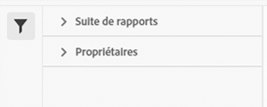

# Gestionnaire de jeux de classifications

Le gestionnaire des jeux de classifications vous permet de créer, de modifier ou de supprimer des jeux de classifications.

**[!UICONTROL Composants]** > **[!UICONTROL Ensembles de classifications]** > **[!UICONTROL Ensembles]**

Les jeux de classifications se composent de **Abonnements** (combinaisons de suites de rapports et de dimensions) et **Noms de classification** (dimensions contenant des données de classification). Les abonnements sont configurés sous [Paramètres](settings.md), tandis que les noms de classification sont configurés sous [Schéma](schema.md).

## Filtrage des jeux de classifications

Le côté gauche du gestionnaire de jeux de classifications fournit des paramètres de filtre pour localiser le jeu de classifications souhaité. Cliquez sur l’icône de filtre pour faire apparaître les paramètres de filtre. Vous pouvez filtrer les jeux de classifications par **[!UICONTROL Balises]**, **[!UICONTROL Suite de rapports]** ou **[!UICONTROL Propriétaire]**.

## Colonnes du gestionnaire de jeux de classifications

Les colonnes suivantes sont disponibles dans le gestionnaire de jeux de classifications :

* **[!UICONTROL Jeu de classifications]**: Nom du jeu de classifications. Cliquer sur le nom d’un jeu de classifications [édite ses paramètres](settings.md).
* **[!UICONTROL Abonnements]**: Le nombre d’abonnements auxquels ce jeu de classifications s’applique.
* **[!UICONTROL Propriétaire]**: Propriétaire du jeu de classifications.
* **[!UICONTROL Classifications]**: Nombre de dimensions de classification contenues dans le jeu de classifications.
* **[!UICONTROL Automatique]**: Détermine si le jeu de classifications est configuré pour importer automatiquement des données à partir d’un emplacement cloud. L’automatisation peut être configurée dans le [schema](schema.md).
* **[!UICONTROL Dernière modification]**: Date et heure de la dernière modification du jeu de classifications.

## Créer ou modifier des options

Les boutons suivants sont disponibles dans le Gestionnaire de jeux de classifications :

* **[!UICONTROL Ajouter]**: [Créer](create.md) un jeu de classifications.
* **[!UICONTROL Recherche par titre]**: Recherchez des jeux de classifications par nom.
* **[!UICONTROL Charger plus]**: Le gestionnaire des jeux de classifications affiche initialement jusqu’à 1 000 jeux de classifications. Ce bouton charge 1 000 jeux de classifications supplémentaires.
* **Afficher/masquer les colonnes**: Activer/désactiver la visibilité de n’importe quelle colonne en plus de [!UICONTROL Jeu de classifications].

Sélectionnez un ou plusieurs jeux de classifications en cochant la case en regard du jeu de classifications souhaité. La sélection d’un jeu de classifications fait apparaître les options suivantes :

* **[!UICONTROL Balise]**: Ajoutez une ou plusieurs balises aux jeux de classifications sélectionnés, ce qui vous permet d’organiser ou de regrouper les jeux de classifications pour les rendre plus faciles à localiser à l’avenir.
* **[!UICONTROL Supprimer]**: Supprime le jeu de classifications. Les dimensions de classification basées sur ce jeu de classifications ne sont plus disponibles. Les projets planifiés qui utilisent le jeu de classifications supprimé continuent à utiliser des dimensions dépendantes jusqu’à ce que vous réenregistrez le projet planifié.
* **[!UICONTROL Consolidation]**: Commencer une nouvelle [consolidation](../consolidations/process.md).
* **[!UICONTROL Renommer]**: Renommez le jeu de classifications sélectionné.
