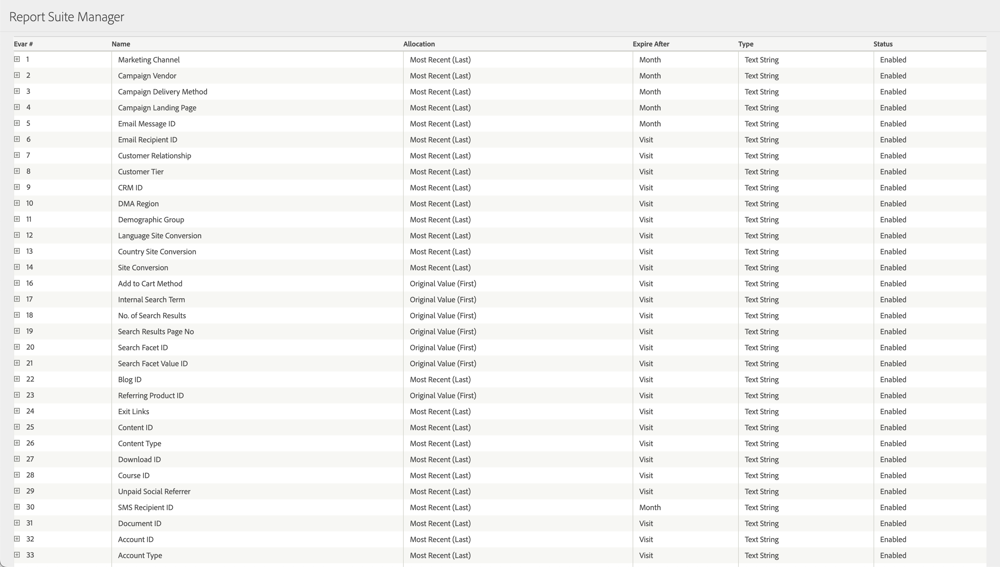

# eVar

*Cette page d’aide décrit le fonctionnement des eVars en tant que [dimension](overview.md). Pour plus d’informations sur la mise en œuvre des eVars, voir [eVars](/help/implement/vars/page-vars/evar.md) dans le Guide d’utilisation de mise en œuvre.*

Les eVars sont des [dimensions](overview.md) personnalisées que vous pouvez utiliser comme vous le souhaitez. Si vous disposez d’un [document de conception de solution](/help/implement/prepare/solution-design.md), la plupart des dimensions propres à votre entreprise se présentent sous la forme d’[!UICONTROL eVars].

Par défaut, les eVars persistent au-delà de l’accès sur lequel elles sont définies. Consultez les sections [Fonctionnement des eVars](#how-evars-work) et [Liaison des eVars aux mesures](#how-evars-tie-to-metrics) ci-dessous pour plus d’informations sur le fonctionnement de la persistance des eVars sur l’architecture d’Adobe. Vous pouvez activer, désactiver ou personnaliser leur expiration et leur attribution sous [Variables de conversion](/help/admin/tools/manage-rs/edit-settings/conversion-var-admin/conversion-var-admin.md) dans les [!UICONTROL Paramètres de la suite de rapports]. L’image suivante présente un exemple de définitions d’eVar dans l’interface des variables de conversion :

Le nombre d’eVars disponibles dépend de votre contrat avec Adobe. Si le contrat que vous avez conclu avec Adobe le prévoit, vous pouvez obtenir jusqu’à 250 eVar.

La casse (majuscule ou minuscule) utilisée dans les rapports est basée sur la première valeur que vous envoyez au cours d’un mois calendaire donné. La casse peut varier en fonction de la fenêtre de création de rapports et de la casse d’une valeur d’eVar collectée en premier pendant cette période.

## Renseignement des eVars avec des données

Chaque eVar collecte des données de la chaîne de requête [`v1` - `v250` ](/help/implement/validate/query-parameters.md) dans les demandes d’image. Par exemple, le paramètre de chaîne de requête `v1` collecte des données pour eVar1, tandis que le paramètre de chaîne de requête `v222` collecte des données pour eVar222.

AppMeasurement, qui compile les variables JavaScript en une demande d’image pour la collecte de données, utilise les variables `eVar1` - `eVar250`. Consultez [eVar](/help/implement/vars/page-vars/evar.md) dans le guide d’utilisation de mise en œuvre pour obtenir des instructions de mise en œuvre.

## Éléments de dimension

Étant donné que les eVars contiennent des chaînes personnalisées dans votre implémentation, votre entreprise détermine les éléments de dimension de chaque eVar. Veillez à enregistrer l’objectif de chaque eVar et les éléments de dimension standard dans un [document de conception de solution](/help/implement/prepare/solution-design.md).

## Fonctionnement des eVars

Lorsque vous envoyez des données à Adobe Analytics, les serveurs de collecte de données convertissent l’accès en une seule ligne de données contenant des centaines de colonnes. Deux colonnes sont dédiées à chaque eVar ; l’une pour la collecte directe de données, l’autre pour les valeurs persistantes.

* Une colonne standard contient les données envoyées à Adobe à partir de la demande d’image.
* Une colonne « post » contient des données persistantes, qui dépendent de l’expiration et de l’attribution de l’eVar.

Dans la plupart des cas, la colonne `post_evar` est utilisée dans les rapports.

### Liaison des eVars aux mesures

Les événements de succès et les eVars sont fréquemment définis à des moments différents. La colonne `post_evar` permet aux valeurs eVar de se lier aux événements, affichant les données dans les rapports. Prenez par exemple la visite suivante :

1. Un visiteur arrive sur votre site sur votre page d’accueil.
2. Il cherche le mot-clé « chats » en utilisant la recherche interne de votre site. Votre implémentation utilise eVar1 pour la recherche interne.
3. Il consulte un produit et passe par le processus de passage en caisse.

Une version simplifiée des données brutes se présenterait comme suit :

| `visitor_id` | `pagename` | `evar1` | `post_evar1` | `event_list` |
| --- | --- | --- | --- | --- |
| `examplevisitor_987` | `Home page` | | | |
| `examplevisitor_987` | `Search results` | `cats` | `cats` | `event1` |
| `examplevisitor_987` | `Product page` | | `cats` | `prodView` |
| `examplevisitor_987` | `Cart` | | `cats` | `scAdd` |
| `examplevisitor_987` | `Checkout` | | `cats` | `scCheckout` |
| `examplevisitor_987` | `Purchase confirmation` | | `cats` | `purchase` |

* La colonne `visitor_id` lie les accès au même visiteur. Dans les données brutes réelles, les valeurs concaténées de `visid_high` et de `visid_low` déterminent l’ID de visiteur.
* La colonne `pagename` renseigne la dimension Pages.
* La colonne `evar` détermine les accès lorsque eVar1 a été explicitement définie.
* La valeur `post_evar1` porte la valeur précédente, en fonction de l’attribution et de l’expiration de la variable définies sous les paramètres de la suite de rapports.
* La colonne `event_list` contient toutes les données de mesure. Dans cet exemple, `event1` est « Recherches » et les autres événements sont des mesures standard du panier. Dans les données brutes réelles, `event_list` contient un ensemble de nombres délimités par des virgules, avec une table de recherche liant ces nombres à une mesure.

### Traduction de la collecte de données en rapports

Les outils d’Adobe Analytics, tels que Analysis Workspace, exploitent ces données collectées. Par exemple, si vous générez un rapport en utilisant eVar1 comme dimension et Commandes comme mesure, un rapport similaire à celui-ci s’affichera :

| `Internal search term (eVar1)` | `Orders` |
| --- | --- |
| `cats` | `1` |

Analysis Workspace extrait ce rapport selon la logique suivante :

* Examinez toutes les valeurs `event_list` et sélectionnez toutes les lignes qui contiennent `purchase`.
* Sur ces lignes, affichez la valeur `post_evar1`.

Le rapport qui en résulte affiche chaque valeur différente contenue dans `post_evar1` à gauche, ainsi que le nombre de commandes attribuées à cette valeur à droite.

### L’importance de l’attribution et de l’expiration

Comme l’attribution et l’expiration déterminent quelles valeurs persistent, elles sont essentielles pour tirer le meilleur parti d’une implémentation d’Analytics. Adobe recommande vivement de discuter au sein de votre organisation de la manière dont plusieurs valeurs pour chaque eVar sont gérées (attribution) et du moment où les eVars cessent de conserver les données (expiration).

* Par défaut, une eVar utilise la dernière attribution. Les nouvelles valeurs remplacent les valeurs conservées.
* Par défaut, une eVar utilise une expiration de visite. Une fois la visite terminée, les valeurs ne sont plus copiées d’une ligne à l’autre dans la colonne `post_evar`.

Vous pouvez modifier l’attribution et l’expiration des eVars sous [Variables de conversion](/help/admin/tools/manage-rs/edit-settings/conversion-var-admin/conversion-var-admin.md) dans les paramètres de la suite de rapports.

## Valeur des eVars par rapport aux props

Dans la plupart des cas, Adobe recommande d’utiliser des eVars, prises en charge comme suit :

* Les eVar sont limitées à 255 octets dans les rapports. Les props sont limitées à 100 octets.
* Par défaut, les props ne persistent pas au-delà de l’accès défini. Les eVars ont une expiration personnalisée, ce qui vous permet de déterminer quand une eVar n’obtient plus le crédit d’un événement ultérieur. Cependant, si vous utilisez le [traitement de l’heure des rapports](/help/components/vrs/vrs-report-time-processing.md), les props et les eVars peuvent utiliser un modèle d’attribution personnalisé.
* Adobe prend en charge jusqu’à 250 eVars et seulement 75 props.

Consultez [prop](prop.md) pour plus de comparaisons entre les props et les eVars.
