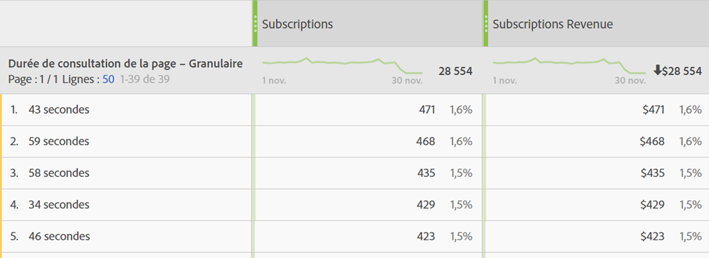

# Durée de consultation de la page

La dimension « Durée de consultation de la page [dimension](overview.md) enregistre la durée passée par un visiteur ou une visiteuse sur la page. Elle utilise les étapes suivantes pour mesurer le calcul :

1. Pour un accès donné, consultez la date et l’heure.
2. Comparez cet accès à l’horodatage du prochain accès de la visite. L’accès de suivi des pages vues et des liens est important.
3. Le temps écoulé entre ces deux accès contribue à la durée de consultation.

Cette dimension est utile pour déterminer la durée d’interaction des visiteurs avec une mesure donnée sur votre site.

>[!TIP]
>
>Le temps passé n’est pas mesuré pour le dernier accès de la visite, puisqu’il n’existe aucune demande d’image ultérieure pour mesurer le temps écoulé. Ce concept s’applique également aux visites composées d’un seul accès (un rebond).

Cette dimension est basée sur les accès, ce qui signifie que la valeur est différente pour chaque accès. Comparez cette dimension à [Durée de la visite](time-spent-per-visit.md), qui est une dimension basée sur les visites. Une durée de visite plus longue signifie qu’un visiteur a passé plus de temps sur une page (accès).

## Renseignement de cette dimension avec des données

Cette dimension est prête à l’emploi pour toutes les implémentations. Cette dimension fonctionne si une suite de rapports contient des données.

## Éléments de dimension

Il existe plusieurs dimensions pour la durée de consultation de la page :

* **Durée de consultation de la page - regroupée** : la durée est regroupée. Les éléments de dimension sont compris entre `"Less than 15 seconds"` et `"More than 30 minutes"`. Le temps entre les accès ne dure généralement pas plus de 30 minutes. Cependant, le temps entre les accès peut dépasser 30 minutes si vous utilisez des accès horodatés ou des sources de données.
* **Durée de consultation de la page - granulaire** : chaque nombre de secondes est un élément de dimension unique.

Consultez [Présentation de la durée de consultation](../metrics/time-spent.md) pour obtenir des informations plus générales sur la durée de consultation.
