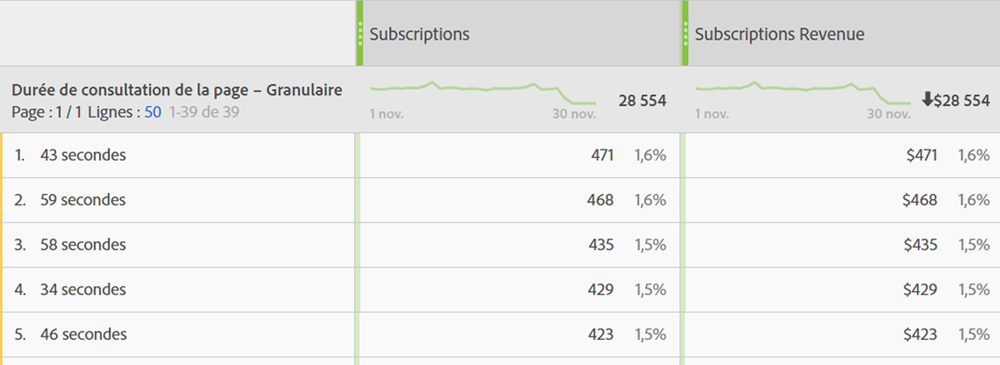

# Durée de consultation de la page

La dimension « Durée de consultation de la page [dimension](overview.md) enregistre la durée passée par un visiteur ou une visiteuse sur la page. Elle utilise les étapes suivantes pour effectuer le calcul :

1. Pour un hit donné, consultez la date et l’heure.
2. Comparez ce hit aux valeurs de date et heure du prochain hit de la visite. Les hits de page vue et de suivi des liens sont tous deux comptabilisés.
3. Le temps écoulé entre ces deux hits contribue à la durée de consultation.

Cette dimension est utile pour déterminer la durée d’interaction des visiteurs avec une mesure donnée sur votre site.

>[!TIP]
>
>Le temps passé n’est pas mesuré pour le dernier hit de la visite, puisqu’il n’existe aucune demande d’image ultérieure pour mesurer le temps écoulé. Ce concept s’applique également aux visites composées d’un seul hit (un rebond).

Cette dimension est basée sur les hits, ce qui signifie que la valeur est différente pour chaque hit. Comparez cette dimension à [Durée de la visite](time-spent-per-visit.md), qui est une dimension basée sur les visites. Une durée de visite plus longue signifie qu’un visiteur a passé plus de temps sur une page (hit).

## Renseignement de cette dimension avec des données

Adobe calcule cette dimension côté serveur à partir du temps écoulé entre chaque accès et l’accès suivant de la visite. Il n’existe aucune variable à définir ; elle est prête à l’emploi pour toutes les implémentations.

| Propriété | Valeur |
| --- | --- |
| **Variable** | Aucun (calculé par Adobe) |
| **Champ Web SDK/XDM** | Aucun (calculé par Adobe) |
| **Paramètre de requête** | S.O. |
| **Balise XML** | S.O. |
| **Limite d’octets** | S.O. |
| **Persistance** | Hit |

## Éléments de dimension

Il existe plusieurs dimensions pour la durée de consultation de la page :

* **Durée de consultation de la page - regroupée** : la durée est regroupée. Les éléments de dimension sont compris entre `"Less than 15 seconds"` et `"More than 30 minutes"`. Le temps entre les accès ne dure généralement pas plus de 30 minutes. Cependant, le temps entre les accès peut dépasser 30 minutes si vous utilisez des accès horodatés ou des sources de données.
* **Durée de consultation de la page - granulaire** : chaque nombre de secondes est un élément de dimension unique.

Consultez [Présentation de la durée de consultation](../metrics/time-spent.md) pour obtenir des informations plus générales sur la durée de consultation.
