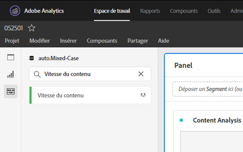

# [!UICONTROL Vitesse du contenu]

[!UICONTROL Velocity] de contenu est un modèle de mesure Adobe Analytics standard. [!UICONTROL La vélocité] du contenu est définie comme [Vues[!UICONTROL de page]] | Participation aux visites] / [[!UICONTROL Visites]] et vous aide à mesurer l’impact d’un élément de contenu particulier (Page, section du site, etc.) était sur le contenu en aval. Il peut vous aider à comprendre quel contenu conserve les utilisateurs sur le site Web ou dans les applications mobiles.

[!UICONTROL La Velocity] du contenu se trouve dans l’espace de travail des Analyses en filtrant le rail de gauche, soit en recherchant des balises, soit en utilisant des balises (#Adobe Template).

[!UICONTROL La vélocité] du contenu est généralement utilisée dans l’analyse du contenu, à côté d’autres mesures clés telles que les Vues [!UICONTROL de]page, [!UICONTROL les visites]et le taux [!UICONTROL de]rebonds.

