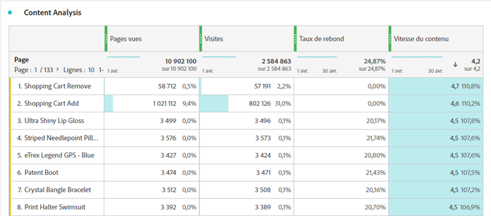

# Vitesse du contenu

La mesure calculée « Vitesse du contenu » vous permet de mesurer la manière dont une dimension (généralement [[!UICONTROL Page]](/help/components/dimensions/page.md)) contribue à ce que les utilisateurs passent du temps sur votre site web ou votre application.

Cette mesure utilise l’[attribution de participation](/help/analyze/analysis-workspace/attribution/models.md) sur la mesure [Pages vues](page-views.md) dans le cadre de son calcul. Avec la participation aux visites, chaque fois qu’une page est consultée, toutes les pages précédemment consultées au cours de la même visite sont également créditées pour la page vue. Cette formule signifie généralement que plus une page est consultée tôt au cours d’une visite, plus elle reçoit de crédit. (Voir [&#x200B; Pages vues (Participation) | Visite) ou « Participation aux visites »](#page-views-participation--visit-or-visit-participation) pour plus d&#39;informations.)

## Calcul

« Vitesse du contenu » est une [mesure](overview.md) calculée par défaut qui utilise la formule `Page views (Visit participation)` divisée par `Visits`.

## Utilisations courantes

La [!UICONTROL vitesse du contenu] est généralement utilisée dans l’analyse du contenu parallèlement à d’autres mesures clés telles que [!UICONTROL Pages vues], [!UICONTROL Visites] et [!UICONTROL Taux de rebond].

## Exemple

L’exemple suivant répartit les 2 parties de la vitesse du contenu : « Pages vues (participation) | « Visite » et « Visites ».

### Pages vues (participation) | Visite) ou « Participation aux visites »

Prenons l’exemple suivant de la manière dont la participation aux visites affecte l’attribution :

Sur un site web, un utilisateur visite les pages suivantes dans cet ordre :

* Page A
* Page B
* Page C
* Page D

Dans l’exemple ci-dessus, la page A est créditée pour 4 accès, la page B pour 3 accès, la page C pour 2 accès et la page D pour 1 accès.

L’exemple suivant illustre le même principe, mais certaines pages étant visitées plus d’une fois.

* Page A
* Page B
* Page C
* Page B
* Page D
* Page A

Dans l’exemple ci-dessus, la page A est créditée pour 7 accès, la page B pour 8 accès, la page C pour 4 accès et la page D pour 2 accès.

### Visites

Une fois la participation aux visites calculée, le résultat est divisé par le nombre de visites.
