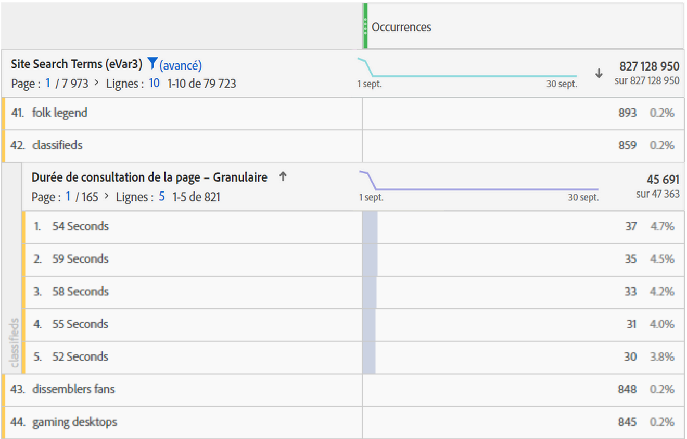

# Présentation de la durée de la visite

Divers [!UICONTROL &quot;temps passé&quot;] [mesures](overview.md) Les dimensions et sont proposées dans les produits Adobe Analytics.

## Mesures de « durée de la visite »

| Mesure | Définition | Disponible dans |
|---|---|---|
| [!UICONTROL Durée totale en secondes] | Représente la durée totale pendant laquelle les visiteurs interagissent avec un élément de dimension spécifique. Inclut l’instance d’une valeur et la persistance sur tous les accès suivants. Dans le cas des props, la durée de la visite est également prise en compte dans les événements de lien ultérieurs. | Analysis Workspace, Report Builder (appelé &quot;temps total passé&quot;), Data Warehouse |
| [!UICONTROL Durée de la visite] (en secondes) | Environ *Durée totale en secondes / (visite-rebonds)*  Représente la durée moyenne pendant laquelle les visiteurs interagissent avec un élément de dimension spécifique au cours de chaque visite. **Remarque**: cette mesure ne peut pas être calculée indépendamment, car le dénominateur de cette fonction est une mesure interne. | Analysis Workspace |
| [!UICONTROL Durée par visiteur] (en secondes) | Environ *Durée totale en secondes / visiteur unique*  Représente la durée moyenne pendant laquelle les visiteurs interagissent avec un élément de dimension spécifique pendant la durée de vie du visiteur (durée de leur cookie). **Remarque**: cette mesure ne peut pas être calculée indépendamment, car le dénominateur de cette fonction est une mesure interne. | Analysis Workspace |
| [!UICONTROL Durée de la visite/de l’utilisateur (état)] | Environ *Durée totale en secondes de l’application mobile / visiteurs de l’application mobile unique*  Représente la durée moyenne pendant laquelle les visiteurs d’applications mobiles interagissent avec un élément de dimension spécifique pendant la durée de vie du visiteur (durée de leur cookie). **Remarque**: cette mesure ne peut pas être calculée indépendamment, car le dénominateur de cette fonction est une mesure interne. | Analysis Workspace |
| [!UICONTROL Durée moyenne de la visite du site] (en secondes) | Représente la durée totale pendant laquelle les visiteurs interagissent avec un élément de dimension spécifique, par séquence avec un élément de dimension. Il ne se limite pas uniquement aux moyennes de &quot;site&quot; comme son nom l’indique. Pour plus d’informations sur les séquences, voir le « Mode de calcul de la durée de la visite ». **Remarque :** Cette mesure diffère très probablement de la « durée de la visite » au niveau d’un élément de dimension en raison des différences de dénominateur dans le calcul. | Analysis Workspace, Report Builder (en minutes) |
| [!UICONTROL Temps moyen passé sur le site] | Il s’agit de la même mesure que *Durée moyenne de la visite du site (en secondes)*, mais au format de la mesure Heure (hh:mm:ss). | Analysis Workspace |
| [!UICONTROL Durée de consultation moyenne de la page] | Mesure obsolète.  Nous vous recommandons plutôt d’utiliser la &quot;Durée moyenne de la visite du site&quot; si la durée moyenne d’un élément de dimension est nécessaire. | Report Builder (lorsqu’une dimension figure dans la demande) |
| [!UICONTROL Durée totale de la session], alias [!UICONTROL Durée de session précédente] | SDK d’applications mobiles uniquement.  Déterminée la prochaine fois que l’application est lancée, pour la session précédente. Calculée en secondes, cette mesure ne compte pas lorsque l’application est en arrière-plan, mais uniquement lorsqu’elle est en cours d’utilisation. Il s’agit d’une mesure au niveau de la session. Par exemple : vous installez l’application ABC et la lancez. Vous l’utilisez pendant 2 minutes, puis vous la fermez. Aucune donnée n’est envoyée sur la durée de cette session. La prochaine fois que vous lancez l’application, la [!UICONTROL Durée de la session précédente] est envoyée avec une valeur de 120. | Analysis Workspace, Report Builder, interface utilisateur de Mobile Services |
| [!UICONTROL Durée de session moyenne] (mobile) | *Durée de session totale / (Lancements - Premiers lancements)*  Kit SDK d’applications mobiles uniquement. Il s’agit d’une mesure au niveau de la session. | Report Builder, IU Mobile Services |

## Dimensions de « durée de la visite »

| Dimension | Définition | Disponible dans |
| --- | --- | --- |
| [!UICONTROL Temps passé par visite - Valeur granulaire] | Durée totale passée lors la visite arrondie à la seconde la plus proche et appliquée à chaque accès qui faisait partie de la visite. Il s’agit d’une dimension du niveau de la visite. | Analysis Workspace |
| [!UICONTROL Durée par visite – Regroupement] | Dimension granulaire regroupée en 9 plages différentes. Il s’agit d’une dimension du niveau de la visite. Les plages incluent :<ul><li>Moins de 1 minute</li><li>1-5 minutes</li><li>5-10 minutes</li><li>10-30 minutes</li><li>30-60 minutes</li><li>1-2 heures</li><li>2-5 heures</li><li>5-10 heures</li><li>10-15 heures</li></ul>**Remarque** : Il n’existe pas de regroupement plus élevé, car une visite expire après 12 heures d’activité. | Analysis Workspace, Report Builder |
| [!UICONTROL Durée de consultation de la page - Granulaire] | Durée totale passée sur chaque accès, arrondie à la seconde la plus proche. Il s’agit d’une dimension du niveau de l’accès. Elle comprend à la fois des pages vues et des événements de lien. Malgré son nom, il ne se limite pas à la dimension &quot;page&quot;. | Analysis Workspace |
| [!UICONTROL Durée de consultation de la page – Regroupement] | La dimension granulaire a été regroupée en 10 plages. Cependant, la dimension regroupée ne décompte que les pages vues (et exclut les événements de lien). Il s’agit d’une dimension du niveau de l’accès. Les plages incluent :<ul><li>moins de 15 secondes</li><li>15 à 29 secondes</li><li>30 à 59 secondes</li><li>1 à 3 minutes</li><li>3 à 5 minutes</li><li>5 à 10 minutes</li><li>10 à 15 minutes</li><li>15 à 20 minutes</li><li>20 à 30 minutes</li><li>plus de 30 minutes</li></ul> | Analysis Workspace |

## Mode de calcul de la « durée de la visite »

Adobe Analytics utilise des valeurs explicites (y compris les événements de lien et les affichages de vidéos) pour calculer la [!UICONTROL durée de la visite].

>[!NOTE]
>
>Sans les événements de lien tels que [!UICONTROL Affichages de vidéos] ou [!UICONTROL Liens de sortie], la durée de la visite sur le dernier accès d’une visite ne peut pas être connue. Pour des raisons similaires, les [!UICONTROL Visites de rebond] (c’est-à-dire les visites avec un seul accès) n’ont pas de « Durée de la visite » associée.

Le **numérateur** dans tous les calculs de durée de la visite est la durée totale en secondes.

Le **dénominateur** n’est pas disponible comme mesure distincte dans Adobe Analytics. Pour les mesures de « durée de la visite » au niveau de l’accès, les séquences sont utilisées comme dénominateur. Une séquence est un jeu consécutif d’accès pour lequel une variable donnée contient la même valeur (qu’elle soit définie, propagée ou persistante). Le terme « propagé » fait référence à la persistance des props entre les pages vues (c’est-à-dire entre les événements de lien suivants), dans le but de calculer la durée de la visite.

* Par exemple, dans le cas du [!UICONTROL Nom de page] ou d’autres dimensions au niveau des accès, le dénominateur correspond essentiellement aux [!UICONTROL Instances] ou aux [!UICONTROL Pages vues], mais avec des actualisations et des valeurs non définies (par exemple, les événements de lien) comptabilisées comme une seule interaction (une séquence).

* Les accès Rebond et Sortie sont également supprimés du dénominateur car la « durée de la visite » ne peut pas être connue.

## Questions fréquentes

+++Toutes les mesures &quot;Durée de la visite&quot; peuvent-elles être appliquées à n’importe quelle dimension ?

Les mesures de &quot;durée de la visite&quot; qui peuvent être appliquées à n’importe quelle dimension sont les suivantes :

* [!UICONTROL Durée totale en secondes]

* [!UICONTROL Durée de la visite] (en secondes)

* [!UICONTROL Durée par visiteur] (en secondes)

* [!UICONTROL Durée moyenne de la visite du site] (en secondes)

+++

+++Quelle dimension de durée de la visite est la mieux utilisée dans les ventilations avec d’autres dimensions ?

La variable [!UICONTROL Durée de consultation de la page - Granulaire] est une dimension du niveau de l’accès. La répartition de cette dimension en une autre dimension indique le nombre de secondes de la durée d’un accès lorsque la dimension de répartition était également présente.
Dans l’exemple ci-dessous, le terme de recherche &quot;classifieds&quot; est associé à des temps d’accès de 54 secondes, 59 secondes, etc., indiquant peut-être que les visiteurs passent du temps à lire le contenu renvoyé pour ce terme.

+++

+++Quelle mesure est appropriée par rapport à la dimension de [!UICONTROL Durée de consultation de la page - Granulaire]?

N’importe quelle mesure. La dimension indiquera la durée de la visite sur l’accès exact où l’événement s’est produit. Une durée plus longue de la visite signifie qu’un visiteur est resté plus longtemps sur une page (accès) où l’événement s’est produit.

+++

+++Comment fait [!UICONTROL Durée moyenne de la visite du site] différer de [!UICONTROL Durée de la visite]?

La différence est le dénominateur de la mesure :

* La [!UICONTROL Durée moyenne de la visite du site] utilise les séquences qui incluent un élément de dimension.

* La [!UICONTROL Durée de la visite] utilise le nombre de visites.

Par conséquent, ces mesures peuvent donner des résultats similaires au niveau de la visite, mais elles seront différentes au niveau de l’accès.

+++

+++Pourquoi les totaux de ventilation avec [!UICONTROL Durée moyenne de la visite du site] ne correspond-il pas à l’élément de ligne parent ?

Parce que [!UICONTROL Durée moyenne de la visite du site] dépend de séquences ininterrompues d’une dimension et le rapport interne ne dépend pas du rapport externe lors du calcul de ces exécutions.

Prenons pour exemple la visite suivante.

| accès# | 1 | 2 | 3 |
|---|---|---|---|
| **Secondes écoulées** | 30 | 100 | 10 |
| **Nom de la page** | Accueil | Product | Accueil |
| **date** | 1er jan | 1er jan | 1er jan |

Le calcul relatif à la durée de la visite sur la page d’accueil correspondrait à (30+10)/2=20, mais la ventilation par jour donnerait (30+10)/1=40, puisque la journée comporte une seule exécution ininterrompue pour le 1er janvier.

Par conséquent, ces mesures peuvent donner des résultats similaires au niveau de la visite, mais elles seront différentes au niveau de l’accès.

+++

## Exemples de calculs de [!UICONTROL durée de la visite]

Supposons que le jeu d’appels au serveur suivant concerne un seul visiteur au cours d’une visite unique :

| Accès de la visite | 1 | 2 | 3 | 4 | 5 | 6 | 7 |
|---|---|---|---|---|---|---|---|
| **Temps écoulé de la visite (en secondes)** | 0 | 30 | 80 | 180 | 190 | 230 | 290 |
| **Secondes écoulées** | 30 | 50 | 100 | 10 | 40 | 60 | - |
| **Type d’accès** | Page | Lien | Page | Page | Page | Page | Page |
| **Nom de la page** | Accueil | - | Product | Accueil | Accueil (rechargement) | Panier | Confirmation de commande |
|  |  |  |  |  |  |  |  |
| **prop1** | A (définie) | A (propagée) | non définie | B (définie) | B (définie) | A (définie) | C (définie) |
| **secondes écoulées prop1** | 30 | 50 | - | 10 | 40 | 60 | - |
|  |  |  |  |  |  |  |  |
| **eVar1** | Rouge (définie) | Rouge (persistante) | (expirée) | Bleu (définie) | Bleu (définie) | Bleu (persistante) | Rouge (définie) |
| **secondes écoulées eVar1** | 30 | 50 | - | 10 | 40 | 60 | - |

Sur la base du tableau ci-dessus, les mesures de durée de la visite sont calculées comme suit :

| prop1 | Durée totale en secondes | Durée de la visite | Durée par visiteur | Nombre de séquences | Durée moyenne de la visite du site |
|---|---|---|---|---|---|
| A | 30+50+60=140 | 140/1=140 | 140/1=140 | 2 | 140/2=70 |
| B | 10+40=50 | 50/1=50 | 50/1=50 | 1 | 50/1=50 |
| C | 0 | 0 | 0 | 0 | 0 |
| Durée non attribuée | 100 | - | - | - | - |

| eVar1 | Durée totale en secondes | Durée de la visite | Durée par visiteur | Nombre de séquences | Durée moyenne de la visite du site |
|---|---|---|---|---|---|
| Rouge | 30+50=80 | 80/1=80 | 80/1=80 | 1 | 80/1=80 |
| Bleu | 10+40+60=110 | 110/1=110 | 110/1=110 | 1 | 110/1=110 |
| Durée non attribuée | 100 | - | - | - | - |

Durée de la visite (granulaire) : 290
Durée par page (granulaire) : 10, 30, 40, 50, 60, 100

Quelques remarques supplémentaires à l’appui de l’exemple :

* Tous les calculs de durée de la visite sont basés sur le temps écoulé de la visite qui commence à zéro lors du premier accès de la visite.

* &quot;Secondes écoulées&quot; correspond à la différence entre l’horodatage de l’accès actif et l’horodatage de l’accès suivant. En conséquence, le dernier accès de la visite (et rebonds) ne comporte pas de durée de la visite.

* Une &quot;séquence&quot; est un ensemble consécutif d’accès pour lequel une variable donnée contient la même valeur (qu’elle soit définie, propagée ou persistante). Par exemple, prop1 &quot;A&quot; comporte deux séquences : accès 1 et 2 et accès 6. Les valeurs du dernier accès de la visite ne démarrent pas une nouvelle séquence car le dernier accès ne comporte pas de durée de la visite. La durée moyenne de la visite du site utilise des séquences du dénominateur.

   * Pour les besoins du temps passé uniquement, les props sont &quot;propagées&quot; à partir des accès à la page vers les accès aux liens suivants, comme indiqué ci-dessus pour prop1 sur l’accès 2. Cela permet à la valeur définie pour prop1 sur l’accès 1 (&quot;A&quot;) d’accumuler la durée de la visite sur l’accès 2.

   * Les eVars accumulent de la durée de visite sur n’importe quel accès pour lequel l’eVar est définie ou persistante. La persistance des eVars est définie par les paramètres d’eVar dans Analytics > Admin.
