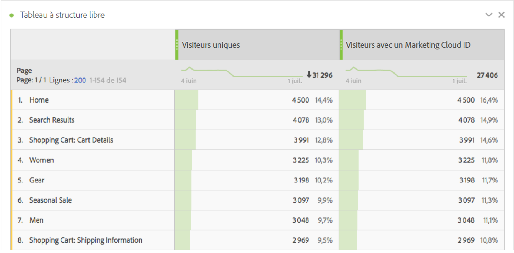
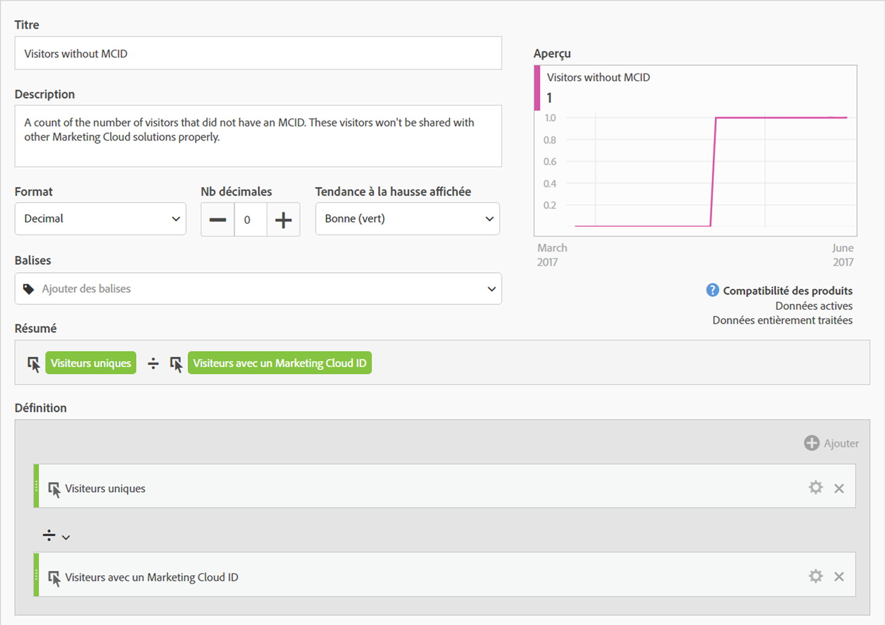
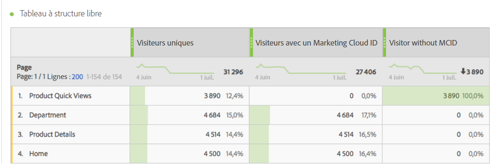

# Visiteurs avec un Experience Cloud ID

&quot;Visiteurs avec un Experience Cloud ID&quot; [metric](overview.md) affiche le nombre de visiteurs uniques qui ont été identifiés par Adobe à l’aide de la variable [Service d’ID Experience Cloud](https://experienceleague.adobe.com/docs/id-service/using/home.html?lang=fr). Cette dimension est utile pour la comparaison avec la mesure [Visiteurs uniques](unique-visitors.md) afin de s’assurer que la majorité des visiteurs de votre site utilise le service d’identifiant. Si une grande partie des visiteurs n’utilisent pas les cookies du service d’ID, cela peut indiquer un problème dans votre implémentation.

>[!NOTE]
>
>Cette mesure est particulièrement importante pour le débogage si vous utilisez plusieurs services Experience Cloud, tels qu’Adobe Target ou Adobe Audience Manager. Les segments partagés entre les produits Experience Cloud ne comprennent pas de visiteurs sans un Experience Cloud ID.

## Méthode de calcul de cette mesure

Cette mesure est basée sur la mesure [Visiteurs uniques](unique-visitors.md), mais ne comprend que les individus identifiés à l’aide de la chaîne de requête `mid` (basée sur le cookie [`s_ecid`](https://experienceleague.adobe.com/docs/core-services/interface/ec-cookies/cookies-analytics.html?lang=fr)).

## Débogage de la configuration Experience Cloud ID

La mesure « Visiteurs avec un Experience Cloud ID » peut s’avérer utile pour résoudre les problèmes d’intégration d’Experience Cloud ou pour identifier les zones de votre site où le service d’ID n’est pas déployé.

Faites glisser « Visiteurs avec un Experience Cloud ID » à côté des visiteurs uniques pour les comparer :

Dans cet exemple, chaque page comporte le même nombre de « Visiteurs uniques » que de « Visiteurs avec un Experience Cloud ID ». Néanmoins, le nombre total de visiteurs uniques est supérieur au nombre total de visiteurs avec un Experience Cloud ID. Vous pouvez créer une [mesure calculée](../c-calcmetrics/cm-overview.md) pour déterminer les pages qui ne définissent pas le service d’ID. Vous pouvez utiliser la définition suivante :

En ajoutant la mesure calculée au rapport, vous pouvez trier le rapport Pages de sorte que les pages comportant le plus grand nombre de visiteurs sans MCID s’affichent :

Notez que l’élément de dimension « Aperçus rapides du produit » n’est pas correctement implémenté avec Identity Service. Vous pouvez collaborer avec les équipes appropriées de votre entreprise pour mettre à jour ces pages le plus rapidement possible. Vous pouvez créer un rapport similaire avec n’importe quel type de dimension, tel que [Type de navigateur](../dimensions/browser-type.md), [Section du site](../dimensions/site-section.md) ou n’importe quelle [eVar](../dimensions/evar.md).
