# Conteneurs de segments

Un segment définit des conditions de filtrage d’un visiteur ou d’une visiteuse basées sur ses attributs ou interactions avec votre site. Pour définir des conditions dans un segment, définissez des règles permettant de filtrer les visiteurs selon leurs caractéristiques de visiteur et/ou de navigation. Pour ventiler plus en détail les données du visiteur, vous pouvez filtrer selon des visites spécifiques et/ou les accès aux pages vues pour chaque visiteur. Le Créateur de segments fournit une architecture simple permettant de créer ces sous-ensembles et d’appliquer des règles sous la forme de conteneurs imbriqués, hiérarchiques Visiteur, Visite ou Accès.

L’architecture de conteneur utilisée dans le Créateur de segments définit :

-  : un conteneur **[!UICONTROL Visiteurs et visiteuses]** comme conteneur le plus éloigné, contenant les données principales spécifiques au visiteur ou à la visiteuse pour les visites et les pages vues.
-  : un conteneur imbriqué **[!UICONTROL Visites]** vous permet de définir des règles pour ventiler les données du visiteur ou de la visiteuse en fonction des visites.
-  : un conteneur imbriqué **[!UICONTROL Accès]** vous permet de ventiler les informations sur le visiteur ou la visiteuse en fonction de pages vues individuelles.

Chaque conteneur permet de créer un rapport de l’historique du visiteur ou de la visiteuse, de ses interactions ventilées par visites ou de ses ventilations par accès individuels.

<table style="table-layout: fixed; border: none;">

<tr>
<td style="background-color: #E5E4E2;" colspan="3" width="200" height="100"> Visiteurs</td>
</tr>

<tr>
<td style="background-color: #E5E4E2;" width="200"></td>
<td style="background-color: #D3D3D3;" colspan="2" width="200" height="100"> Visites</td>
</tr>

<tr>
<td style="background-color: #E5E4E2;" width="200" height="100"></td>
<td style="background-color: #D3D3D3;" width="200" height="100"></td>
<td style="background-color: #C0C0C0;" width="200" height="100" colspan="1"> Accès</td>
</tr>
</table>

<!--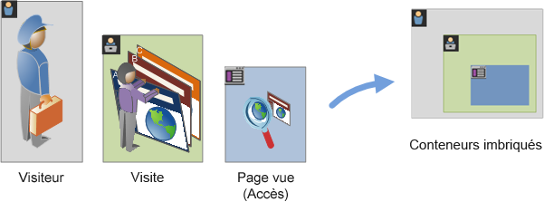-->

Regardez cette vue d’ensemble vidéo sur les conteneurs de segments :

>[!VIDEO](https://video.tv.adobe.com/v/25401/?quality=12)

## Conteneur Visiteurs et visiteuses

Le conteneur de visiteurs inclut chaque visite et page vue pour les visiteurs au cours d’une période indiquée. Un segment au niveau Visiteur renvoie la page qui respecte la condition plus toutes les autres pages consultées par le visiteur (et contraintes uniquement par des périodes définies). Comme il s’agit du conteneur ayant la définition la plus large, les rapports générés au niveau du conteneur Visiteurs et visiteuses renvoient les pages vues de toutes les visites et permettent de générer une analyse multi-visites. De ce fait, le conteneur Visiteurs et visiteuses est le plus susceptible de changer selon les périodes définies.

Les conteneurs de visiteurs peuvent inclure des valeurs basées sur l’historique global d’un visiteur :

- Jours avant le premier achat
- Page d’accès originale
- Domaines référents d’origine

## Conteneur Visites

Le conteneur de visites permet d’identifier les interactions de pages, les campagnes ou les conversions pour une session web spécifique. Un segment au niveau des visites renvoie la page qui respecte la condition plus toutes les autres pages consultées dans la session de visite (et contraintes uniquement par des périodes définies). Le conteneur de visites est le conteneur le plus souvent utilisé, car il capture les comportements pour l’ensemble de la session de visite une fois la règle respectée. Le conteneur de visites permet de définir les visites que vous souhaitez inclure ou exclure de la création et de l’application d’un segment. Il peut vous aider à répondre à la question : combien de visiteurs ont consulté la section Nouvelles et sports lors de la même visite ? Ou encore : les pages qui ont produit une conversion réussie en vente ?

Les conteneurs de visites incluent des valeurs basées sur l’occurrence par visite :

- Nombre de visites
- Page d’accès
- Fréquence des retours
- Mesures de participation
- Mesures allouées linéairement

## Conteneur d’accès

Le conteneur d’accès définit les accès de page que vous souhaitez inclure ou exclure d’un segment. Le conteneur d’accès est le plus restreint des conteneurs disponibles pour vous permettre d’identifier des clics et des pages vues spécifiques pour lesquels une condition est vraie. Vous pouvez afficher un seul code de suivi ou isoler le comportement dans une section spécifique de votre site. Vous souhaitez peut-être également déterminer une valeur spécifique lorsqu’une action se produit, tel que le canal marketing lorsqu’une commande est passée.

Les conteneurs d’accès incluent des valeurs basées sur des répartitions de page unique :

- Produits
- Propriétés de liste
- eVars de liste
- eVars de marchandisage (dans le contexte d’événements)

  >[!NOTE]
  >
  >Si vous utilisez ce conteneur sur une valeur qui persiste, une eVar par exemple, il extrait chaque accès comportant une valeur persistante. Dans le cas d’un code de suivi qui expire au bout d’une semaine, cette valeur pourrait persister sur plusieurs visites.

## Conteneur Groupe logique

Le conteneur Groupe logique vous permet de fournir un conteneur distinct dans les règles de segmentation afin de filtrer les entités qui ne reposent pas sur la hiérarchie. Vous pouvez par exemple souhaiter fournir un conteneur imbriqué dans le segment qui filtre les entités en fonction des visiteurs. Ce type de logique nécessite que vous rompiez la hiérarchie (puisque vous avez déjà utilisé un conteneur de visiteurs et visiteuses de niveau supérieur) afin de filtrer uniquement pour les visiteurs et visiteuses sélectionnés. Pour plus d’informations, consultez [Exemples de groupes logiques](/help/components/segmentation/segmentation-workflow/seg-sequential-build.md).

## Imbrication de conteneurs {#nest-containers}

Lors de la création de conteneur de segments dans d’autres conteneurs, vous créez par essence un segment dans un segment. La logique suivante est utilisée avec les conteneurs imbriqués :

1. Déterminez les données qui sont incluses à l’aide du conteneur le plus éloigné. Les données qui ne correspondent pas à cette règle d’éloignement sont ignorées dans le rapport segmenté.
1. Appliquez la règle imbriquée aux données restantes. La règle imbriquée NE s’applique PAS aux accès que la première règle a rejetés.
1. Répétez jusqu’à ce que toutes les règles de conteneur imbriquées aient été calculées. Les données restantes sont alors incluses dans le rapport résultant.

Vous pouvez utiliser l’imbrication de conteneurs et de règles dans un conteneur. Vous pouvez imbriquer les éléments suivants dans chaque conteneur :

| Nom du conteneur | Éléments que vous pouvez y imbriquer |
|---|---|
| Accès | Événements uniquement |
| Visite | Conteneur d’accès, Événements |
| Visiteur | Conteneur de visites, Conteneur d’accès, Événements |
| Groupe logique | Conteneur de visiteurs, conteneur de visites, conteneur d’accès |

### Inclure plusieurs conteneurs dans une seule définition

L’inclusion de plusieurs segments dans un nouveau segment composé permet d’affiner encore plus les données. Le fait de faire glisser deux segments existants ensemble agit comme une instruction « OR » lors du filtrage des visiteurs. Tous les conteneurs du canevas sont comparés à l’ensemble des données et les données qui correspondent à l’un des conteneurs sont incluses dans la création de rapports.

Par exemple, le fait de faire glisser un conteneur de visites pour lequel Pays = États-Unis avec un conteneur de visites pour lequel Commande = Vrai

```
Country = United States + Order = True
```

crée un segment qui se comporte dans cet ordre :

1. Ce segment étudie tout d’abord l’ensemble des données et identifie tous les visiteurs et visiteuses compris aux États-Unis.
2. Le segment étudierait alors à nouveau toutes les données, recherchant si des visiteurs et visiteuses ont passé une commande.
3. Les deux jeux de données s’appliqueraient alors au rapport.

## Conteneurs pour les segments séquentiels {#containers-sequential}

La segmentation séquentielle utilise les mêmes conteneurs de base, notamment [!UICONTROL Visiteurs et visiteuses], [!UICONTROL Visites] et [!UICONTROL Accès] (y compris les pages vues ou d’autres dimensions), imbriqués hiérarchiquement.

<table style="table-layout:fixed; border: none;">

<tr>
<td style="background-color: #E5E4E2;" colspan="3" width="200" height="100"> Visiteurs</td>
</tr>

<tr>
<td style="background-color: #E5E4E2;" width="200"></td>
<td style="background-color: #D3D3D3;" colspan="2" width="200" height="100"> Visites</td>
</tr>

<tr>
<td style="background-color: #E5E4E2;" width="200" height="100"></td>
<td style="background-color: #D3D3D3;" width="200" height="100"></td>
<td style="background-color: #C0C0C0;" width="200" height="100" colspan="1"> Accès</td>
</tr>
</table>

<!---->

[!UICONTROL Visiteurs et visiteuses] est le conteneur dont l’ordre est le plus élevé dans la segmentation séquentielle ; [!UICONTROL Visites] se trouvant dans le conteneur [!UICONTROL Visiteurs et visiteuses] et [!UICONTROL Accès] se trouvant dans les conteneurs [!UICONTROL Visiteurs et visiteuses] ou [!UICONTROL Visites]. Cette [hiérarchie de conteneurs](/help/components/segmentation/seg-overview.md#section_7FDF47B3C6A94C38AE40D3559AFFAF70) doit être conservée pour créer des segments séquentiels bien ordonnés.

**Pour créer des segments séquentiels**, les conteneurs sont imbriqués et la séquence logique est associée à l’aide de l’opérateur [!UICONTROL ALORS] (THEN)qui exige que chaque conteneur soit défini sur `true` sur la base de la séquence du visiteur ou de la visiteuse.

<table style="table-layout:fixed; border: none;">

<tr>

<td style="background-color: #E5E4E2;" colspan="3" width="200" height="100"> Visiteurs</td>
</tr>

<tr>
<td style="background-color: #E5E4E2;" width="200"></td>
<td style="background-color: #D3D3D3;" colspan="2" width="200" height="100"> Visites</td>
</tr>

<tr>
<td style="background-color: #E5E4E2;" width="200" height="100"></td>
<td style="background-color: #D3D3D3;" width="200" height="100"></td>
<td style="background-color: #C0C0C0;" width="200" height="100" colspan="1"> Accès</td>
</tr>

<tr>
<td style="background-color: #E5E4E2;"></td><td colspan="2">THEN</td></td>
</tr>

<tr>
<td style="background-color: #E5E4E2;" width="200"></td>
<td style="background-color: #D3D3D3;" colspan="2" width="200" height="100"> Visites</td>
</tr>

<tr>
<td style="background-color: #E5E4E2;" width="200" height="100"></td>
<td style="background-color: #D3D3D3;" width="200" height="100"></td>
<td style="background-color: #C0C0C0;" width="200" height="100" colspan="1"> Accès</td>
</tr>
</table>

<!--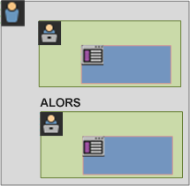-->

S’agissant de cette hiérarchie de conteneurs, la seule exception réside dans l’utilisation du [conteneur Groupe logique](/help/components/segmentation/segmentation-workflow/seg-sequential-build.md). Le conteneur [!UICONTROL Groupe logique] vous permet d’imbriquer un accès dans un conteneur de manière non ordonnée, afin de capturer des événements et des dimensions, mais sans ordre séquentiel.

<table style="table-layout:fixed; border: none;">

<tr>
<td style="background-color: #E5E4E2;" colspan="3" width="200" height="100"> Visiteurs</td>
</tr>

<tr>
<td style="background-color: #E5E4E2;" width="200"></td>
<td style="background-color: #D3D3D3;" colspan="2" width="200" height="100"> Visites</td>
</tr>

<tr>
<td style="background-color: #E5E4E2;" width="200" height="100"></td>
<td style="background-color: #D3D3D3;" width="200" height="100"></td>
<td style="background-color: #C0C0C0;" width="200" height="100" colspan="1"> Accès</td>
</tr>

<tr>
<td style="background-color: #E5E4E2;"></td><td colspan="2">THEN</td></td>
</tr>

<tr>
<td style="background-color: #E5E4E2;" width="200"></td>
<td style="background-color: #D3D3D3;" colspan="2" width="200" height="100"> Groupe</td>
</tr>

<tr>
<td style="background-color: #E5E4E2;" width="200" height="100"></td>
<td style="background-color: #D3D3D3;" width="200" height="100"></td>
<td style="background-color: #C0C0C0;" width="200" height="100" colspan="1"> Accès</td>
</tr>

<tr>
<td style="background-color: #E5E4E2;" width="200" height="100"></td>
<td style="background-color: #D3D3D3;" width="200" height="100"></td>
<td style="background-color: #C0C0C0;" width="200" height="100" colspan="1"> Visites</td>
</tr>

</table>

<!--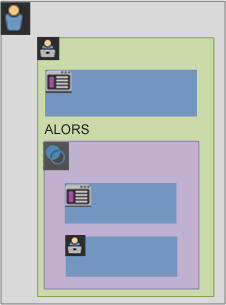-->

## Rapports basés sur les données de conteneur {#reports}

Les conteneurs permettent de filtrer des données différentes différemment selon les valeurs de création de rapports lors de la ventilation de segments et de leur application aux rapports.

Les données capturées à chaque niveau de la hiérarchie de conteneurs Visiteur > Visite > Accès affectent la manière dont vous créez vos segments. Si vous utilisez le même segment appliqué au même rapport utilisant le même jeu de données, vous obtenez des valeurs différentes en fonction du conteneur depuis lequel vous générez le rapport. Des facteurs tels que le niveau de création de rapports et la persistance des valeurs du conteneur dans les accès peuvent provoquer d’importantes modifications dans la précision de la création de rapports.

### Concepts de base des données de conteneur {#container-data}

Par exemple, le visiteur représenté ci-dessous a visité un site à la première visite, est arrivé sur la page d’accueil, puis a visité trois pages supplémentaires et converti la visite en une vente. Lors d’une autre visite, le visiteur est arrivé cette fois-ci par l’intermédiaire de la page des produits, puis a visité la page d’accueil, puis à nouveau la page des produits avant de fermer la session après avoir regardé les chapeaux d’hiver. Selon les données capturées pour chaque conteneur pour le segment, différentes valeurs s’affichent dans le rapport.

Le segment `Pages equals Winter Coat` ci-dessous s’applique au **Rapport Pages**.


En fonction du conteneur sélectionné, le rapport affiche différents résultats pour les visites et pages vues suivantes par un visiteur ou une visiteuse.

<table style="table-layout:auto; border: 0;">

<tr>
<td style="background-color: #E5E4E2;"></td>
<td style="background-color: #E5E4E2;" colspan="4"><b>Visite 1</b></td>
</tr>
<tr>
<tr>
<td style="background-color: #E5E4E2;">

</td>
<td style="background-color: #FFFFFF; "><br/>Accueil</td>
<td style="background-color: #FFFFFF;"><br/>Vêtements d’hiver</td>
<td style="background-color: #FFFFFF;"><br/>Manteau d’hiver</td>
<td style="background-color: #FFFFFF;"><br/>Achat de 100 $</td>
</tr>
<tr>
<td colspan="5">
</tr>
<tr>
<td style="background-color: #E5E4E2;"></td>
<td style="background-color: #E5E4E2;"colspan="4"><b>Visite 2</b></td>
</tr>
<tr>
<tr style="border: 0;">

<td style="background-color: #E5E4E2;">

</td>
<td style="background-color: #FFFFFF; "><br/>Vêtements d’hiver</td>
<td style="background-color: #FFFFFF;"><br/>Bottes d’hiver</td>
<td style="background-color: #FFFFFF;"><br/>Vêtements d’hiver</td>
<td style="background-color: #FFFFFF;"><br/>Bonnets</td>

</table>


<!--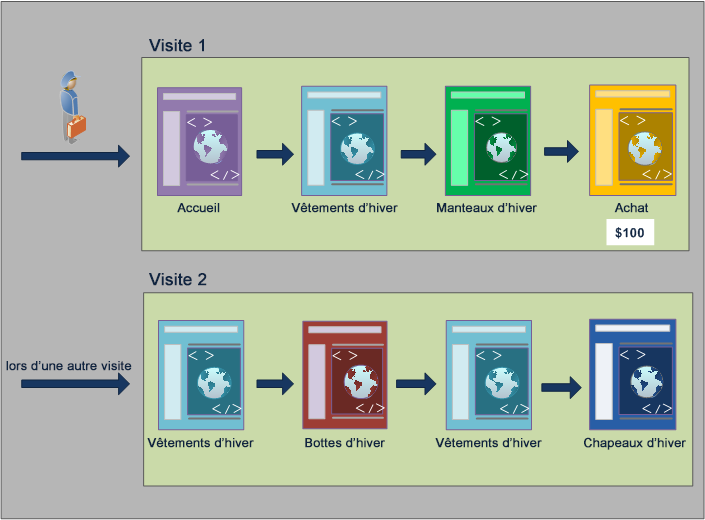-->

### Créer des rapports depuis le conteneur d’accès

Lorsque cette condition est incluse dans un conteneur d’accès, alors le rapport ne répertorie que les pages pour lesquelles la condition *Page = Manteaux d’hiver* est vraie. Puisque seule une page correspond à cette condition dans un conteneur d’une seule page, seule la page Manteaux d’hiver s’affiche.

| Page | Pages vues |
|---|--:|
| Manteau d’hiver | 1 |

<!--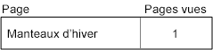-->

Si vous créez des rapports depuis le conteneur d’accès, vous pouvez constater dans quelle mesure la création de rapports depuis différents conteneurs affecte les valeurs globales des rapports. En affichant le rapport de segment, notez que les pages vues sont approximativement égales aux visites (environ 2 000 visiteurs et visiteuses ont vu des pages en double au cours d’une visite, ce qui ajoute au nombre total de pages vues). Et les visiteurs et visiteuses uniques sont approximativement égaux au nombre de visites (environ 2 000 visiteurs et visiteuses uniques ont visité plus d’une fois).

|  | Mesure | # | % |
|---|---|--:|--:|
| | Pages vues :<br/>Vues :<br/>Visiteurs et visiteuses uniques : | **69 252** sur 351 292 <br/>**67 554** sur 165 175 <br/>**63 541** sur 113 169 | **19 %**<br/>**40 %**<br/>**56 %** |


<!--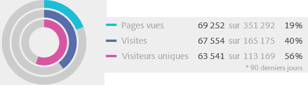-->

>[!IMPORTANT]
>
>Quelle que soit la manière dont vous consultez les données, depuis les conteneurs d’accès, de visites ou de visiteurs et visiteuses, vous trouvez le même nombre de visiteurs, 63 541 par exemple. Quelle que soit la méthode de génération du rapport, la condition initiale du visiteur ou de la visiteuse (visiteurs et visiteuses qui ont consulté la page Manteaux d’hiver) reste en l’état. Il s’agit du sous-ensemble de données depuis lequel vous créez des rapports aux différents niveaux.

### Créer des rapports depuis le conteneur de visites

Si cette même condition figure dans un conteneur de visites, le rapport répertorie toutes les pages de la visite pour lesquelles la condition *Page est égal à Winter Coats* (Manteaux d’hiver) est vraie. Elle filtre la page Manteaux d’hiver mais capture également toutes les autres pages de la visite pour lesquelles la condition est vraie. Le visiteur ou la visiteuse ayant également visité les pages Accueil, Produit et Achat au cours de la visite, ces pages supplémentaires sont répertoriées dans le rapport lorsque ce dernier est créé à l’aide des données du conteneur de visiteurs et visiteuses.

| Page | Pages vues |
|---|--:|
| Accueil | 1 |
| Produit | 1 |
| Manteau d’hiver | 1 |
| Achat | 1 |

<!--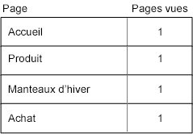-->

En affichant les valeurs de segments depuis le conteneur de visites, vous pouvez constater que le nombre de pages vues a augmenté de manière significative. Vous observez une augmentation car la création de rapports depuis un conteneur de visites identifie toutes les pages qui respectent les conditions, plus toutes les autres pages consultées lors de la visite (avec toutes les pages vues capturées dans chaque conteneur de visites).

|  | Mesure | # | % |
|---|---|--:|--:|
| | Pages vues :<br/>Vues :<br/>Visiteurs et visiteuses uniques : | **226 193** sur 351 292 <br/>**67 554** sur 165 175 <br/>**63 541** sur 113 169 | **64 %**<br/>**40 %**<br/>**56 %** |

<!--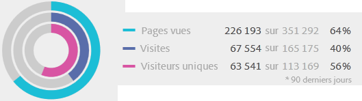-->

### Créer des rapports depuis le conteneur de visiteurs et visiteuses

Si cette même condition figure dans un conteneur de visiteurs et visiteuses, le rapport répertorie toutes les pages vues par n’importe quelle personne pour lesquelles la condition *Page correspond à Manteaux d’hiver* est vraie. Cette condition signifie que si un visiteur ou une visiteuse a consulté la page Manteaux d’hiver, alors toutes les pages du conteneur de visiteurs et visiteuses (y compris les pages vues lors d’autres visites) sont répertoriées. En conséquence, les pages qui ne respectent pas la condition sont également répertoriées dans le rapport, car le visiteur ou la visiteuse les a consultées antérieurement. Toutes les pages du conteneur de visiteurs et visiteuses seront répertoriées dans le rapport, même si elles se sont produites antérieurement et ne respectent pas spécifiquement les conditions.

| Visite 1<br/>Page | <br/>Pages vues |
|---|--:|
| Accueil | 1 |
| Vêtements d’hiver | 1 |
| Manteau d’hiver | 1 |
| Achat | 1 |

| Visite 2<br/>Page | <br/>Pages vues |
|---|--:|
| Vêtements d’hiver | 2 |
| Bottes d’hiver | 1 |
| Bonnets | 1 |

| Visite 1 + Visite 2<br/>Page | <br/>Pages vues |
|---|--:|
| Vêtements d’hiver | 3 |
| Accueil | 1 |
| Manteau d’hiver | 1 |
| Achat | 1 |
| Bottes d’hiver | 1 |
| Bonnets | 1 |

<!--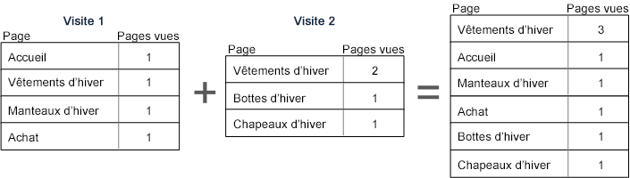-->

Si vous affichez les segments du conteneur de visiteurs et visiteuses, vous pouvez constater que le nombre de pages vues et de visites a augmenté. Vous observez une augmentation, car, depuis le niveau du visiteur ou de la visiteuse, si la personne a consulté la page Manteaux d’hiver une seule fois (rendant la condition vraie), alors toutes les autres pages vues et toutes les autres visites sont capturées pour cette personne.

|  | Mesure | # | % |
|---|---|--:|--:|
| | Pages vues :<br/>Vues :<br/>Visiteurs et visiteuses uniques : | **240 094** sur 351 292 <br/>**83 823** sur 165 175 <br/>**63 541** sur 113 169 | **68 %**<br/>**50 %**<br/>**56 %** |

<!--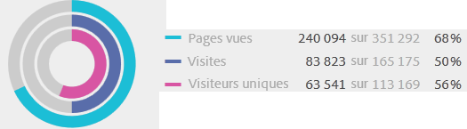-->

En résumé, comprendre comment la segmentation fonctionne sur les différentes répartitions de données constitue la clé de l’interprétation des données qu’elle renvoie.

## Création de rapports basée sur le conteneur {#reporting}

Une portée est appliquée à chaque répartition de données de segment. La plupart des répartitions sont basées sur les *pages vues*. Néanmoins, de nombreux segments de valeur sont basés sur le conteneur de *visites* et, à un degré moindre, sur le conteneur de *visiteurs*. Il est important de comprendre que la création de rapports est basée sur la portée de votre conteneur.

En utilisant l’exemple de segment `Page equals Winter Coats`, vous trouverez ci-dessous des exemples de résultats de ce segment basés sur la manière dont les données de conteneur sont appliquées et sur la manière dont la portée des données correspond au type de segment.

### Conteneur de segment basé sur une règle de segment correspondante

L’application du conteneur de segment sur une portée naturelle de données donne les résultats escomptés pour lesquels les lignes correspondent à la règle de segment.

- **Conteneur d’accès pour lequel la page est égale à « Manteaux d’hiver » (Winter Coats)** : la consultation d’un rapport sur les *pages* avec ce segment renvoie uniquement les valeurs égales à « Manteaux d’hiver ». Toutes les autres pages sont exclues du rapport.
- **Conteneur de visites pour lequel la page d’accès est égale à « Vêtements d’hiver »** : la consultation d’un rapport sur les *pages d’accès* avec ce segment renvoie uniquement la deuxième visite car sa page d’accès correspond à la règle de segment.
- **Conteneur de visites pour lequel le nombre de visites est égal à 1** : la consultation d’une page vue Toutes les visites depuis la première visite est incluse dans le rapport car elle correspond à la règle de segment.

### Pages vues au niveau du conteneur de visites

De nombreuses règles de segment identifient les pages vues par visite. Lorsque cette identifiaction se produit, l’ensemble du conteneur de visiteurs et visiteuses est appliqué, si seulement un accès correspond à la règle. Ce rapport de segment est tout particulièrement intéressant car les pages vues basées sur des visites fournissent des informations sur les pages vues par visite.

- **Conteneur de visites pour lequel la page est égale à la page « Manteaux d’hiver » (Winter Coats)** : dans un rapport sur les pages au niveau du conteneur de visiteurs, affiche toutes les pages vues des visites qui incluaient une consultation de la page « Vêtements d’hiver ». Si une page correspond à la règle de segment, toutes les pages vues associées à cette visite sont incluses dans le rapport.
- **Conteneur de visites pour lequel la page correspond à la page « Accueil »** : dans un rapport sur les pages avec ce segment, il affiche seulement les données de la première visite, car, lors de la deuxième visite, le visiteur ou la visiteuse n’a pas consulté de page « Accueil ».
- **Conteneur de visiteurs et visiteuses pour lequel la page correspond à « Vêtements d’hiver »** : dans un rapport sur les pages, ce segment récupère toutes les données des deux visites, car, lors de ces visites, le visiteur ou la visiteuse a consulté la page « Vêtements d’hiver ».

### Conteneur de segment identifiant les accès plus petits que les pages vues

L’utilisation d’un segment avec un conteneur plus petit que la portée de la répartition renvoie des données inattendues. L’utilisation d’une répartition plus petite extrait tout de même tous les accès de cette portée de données.

- **Conteneur d’accès pour lequel la page d’accès est égale à la page des produits** : chaque page s’associe avec la page d’accès de la visite, créant ainsi une répartition basée sur la visite. L’utilisation de ce segment extrait non seulement la page des produits en tant que page d’accès mais également tous les accès de cette visite.
- **Conteneur d’accès pour lequel Variable de liste 1 contient ValeurA** : si plusieurs valeurs ont été définies sur le même accès en tant que variable de liste, alors toutes les valeurs de variable sont incluses dans le segment. Il n’est pas possible de séparer des valeurs qui se produisent dans la même page vue car le conteneur d’accès est le plus petit conteneur de segments permettant de ventiler des accès.
- **Conteneur d’accès pour lequel la page est égale à « Achat »** : si vous utilisez les pages vues comme mesure, seule la page des achats s’affiche (comme prévu). Si vous utilisez un rapport Participation recettes, toutes les pages de la première visite reçoivent 100 $ puisque les mesures de participation sont basées sur les visites.
- **Conteneur d’accès pour lequel la page est égale à « Manteaux d’hiver »** : si vous utilisez les pages vues comme mesure, seule la page Manteaux d’hiver s’affiche (comme prévu). Si vous utilisez un rapport Participation recettes, aucune page ne reçoit de crédit car cette dimension requiert une dimension persistante. La page vue qui a réellement effectué l’achat (la page des achats) n’est pas incluse dans le conteneur d’accès. De ce fait, aucune participation aux recettes n’est attribuée à un élément quelconque. Néanmoins, l’exécution d’un rapport depuis le conteneur des visites inclurait toutes les pages vues au cours de cette visite et distribuerait une participation aux recettes (100 $) sur toutes les pages vues de la session.

## Persistance dans les conteneurs {#persistence}

Le filtrage par dimensions qui persistent dans une plage de pages, une eVar de campagne ou une dimension référente par exemple, affecte les données collectées au niveau du conteneur et doit être compris afin de garantir la précision de la création de rapports.

Les données de segment peuvent varier selon la persistance d’une dimension ou d’une variable appliquée dans des pages sélectionnées. Certaines dimensions, comme la dimension Page, fournissent des valeurs uniques au niveau de la page et sont filtrées selon les données provenant du conteneur d’accès. (Consultez l’exemple [Rapports basés sur les données de conteneur](/help/components/segmentation/seg-overview.md).) D’autres dimensions, comme la dimension Domaine référent, persistent dans plusieurs pages pour une visite. Par exemple : `Referring Domain equals aol.com`. Certaines dimensions ou variables appliquées, comme la Durée de la visite, s’étalent sur l’ensemble de l’historique du visiteur.

<!--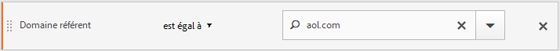-->

En contraste à la dimension Page, la valeur Domaine référent est associée à chaque page de cette visite. Par exemple, le visiteur ci-dessous arrive sur la page d’accueil en provenance d’un site référencé. En conséquence, la même valeur de domaine référent est affectée à toutes les pages de cette visite.

Le segment `Referring Domain equals aol.com` ci-dessous s’applique au **Rapport Pages**.

<table style="table-layout:fixed; border: 0;">

<tr>
<td style="background-color: #E5E4E2;"></td>
<td style="background-color: #E5E4E2;" colspan="4"><b>Visite 1</b></td>
</tr>
<tr>
<tr>
<td style="background-color: #E5E4E2;">
<br/>aol.com
</td>
<td style="background-color: #FFFFFF; "><br/>Accueil</td>
<td style="background-color: #FFFFFF;"><br/>Vêtements d’hiver</td>
<td style="background-color: #FFFFFF;"><br/>Manteau d’hiver</td>
<td style="background-color: #FFFFFF;"><br/>Achat de 100 $</td>
</tr>
<tr>
<td colspan="5">
</tr>
<tr>
<td style="background-color: #E5E4E2;"></td>
<td style="background-color: #E5E4E2;"colspan="4"><b>Visite 2</b></td>
</tr>
<tr>
<tr style="border: 0;">

<td style="background-color: #E5E4E2;">
<br/>weather.com
</td>
<td style="background-color: #FFFFFF; "><br/>Vêtements d’hiver</td>
<td style="background-color: #FFFFFF;"><br/>Bottes d’hiver</td>
<td style="background-color: #FFFFFF;"><br/>Vêtements d’hiver</td>
<td style="background-color: #FFFFFF;"><br/>Bonnets</td>

</table>

<!--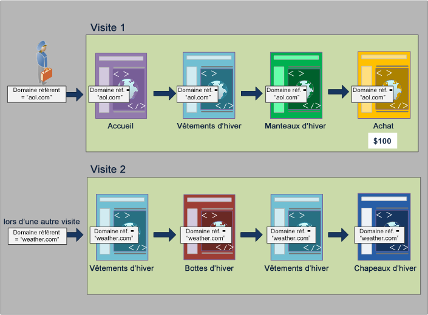-->

Dans une nouvelle visite, la personne est référencée depuis un autre site. En conséquence, la nouvelle valeur de domaine référent pour chaque page vue est affectée à toutes les pages de la nouvelle visite.

### Créer des rapports depuis le conteneur d’accès

La même valeur de domaine référent étant affectée à toutes les pages vues d’une même visite, la création de rapports au niveau du conteneur d’accès où `Referring Domain equsls 'aol.com'` renvoie toutes les pages répertoriées dans le tableau ci-dessous.

| Le domaine référent correspond à « aol.com ». | Pages vues |
|----|---:|
| Accueil | 1 |
| Vêtements d’hiver | 1 |
| Manteau d’hiver | 1 |
| Achat | 1 |

<!--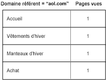-->

L’affichage des données provenant du conteneur d’accès montre qu’un peu plus de 92 000 pages vues ont été consultées en un peu plus de 33 000 visites par à peine plus de 32 000 visiteurs. En moyenne, trois pages ont été vues à chaque visite et la quasi-totalité des visites ont été effectuées par des visiteurs uniques.

|  | Mesure | # | % |
|---|---|--:|--:|
| | Pages vues :<br/>Vues :<br/>Visiteurs et visiteuses uniques : | **98 234** sur 351 165 <br/>**33 203** sur 165 173 <br/>**32 269** sur 113 110 | **27 %**<br/>**20 %**<br/>**28 %** |

<!--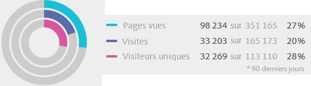-->

### Créer des rapports depuis le conteneur de visites

Si cette même condition est filtrée dans le conteneur de visites pour un rapport sur les pages, alors toutes les pages de la visite où la condition `Referring Domain equals 'aol.com'` est vraie. Dans la mesure où la valeur du domaine référent est définie au niveau de la visite, les rapports au niveau de la page vue et de la visite sont les mêmes.

| Le domaine référent correspond à « aol.com ». | Pages vues |
|----|---:|
| Accueil | 1 |
| Vêtements d’hiver | 1 |
| Manteau d’hiver | 1 |
| Achat | 1 |

<!---->

Toutes les pages ayant la même valeur de domaine référent basée sur la visite, le rapport provenant du niveau du conteneur de visites est (presque) le même que le rapport provenant du conteneur de pages vues. Il existe un léger décalage (98 234 contre 98 248) en raison des anomalies de données.

|  | Mesure | # | % |
|---|---|--:|--:|
| | Pages vues :<br/>Vues :<br/>Visiteurs et visiteuses uniques : | **98 248** sur 351 165 <br/>**33 203** sur 165 173 <br/>**32 269** sur 113 110 | **27 %**<br/>**20 %**<br/>**28 %** |

<!--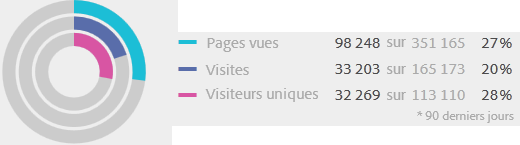-->

### Créer des rapports depuis le conteneur de visiteurs et visiteuses

Depuis le conteneur de visiteurs et visiteuses, le rapport sur les pages répertorie toutes les pages consultées par des visiteurs et visiteuses où la condition `Referring Domain equals 'aol.com'` est vraie. En conséquence, si un visiteur ou une visiteuse comporte *« aol.com »* comme domaine référent dans son historique (au cours d’une période définie), alors toutes les pages du conteneur de visiteurs et visiteuses (y compris les pages vues lors d’autres visites) sont répertoriées. Même les pages qui ne correspondent pas à la condition principale sont répertoriées dans le rapport, car elles sont incluses dans le conteneur de visiteurs et visiteuses. Toutes les pages dans le conteneur de visiteurs et visiteuses sont répertoriées dans le rapport, même si elles se sont produites précédemment et ne respectent pas spécifiquement les conditions.

Dans un rapport Domaine référent, la condition `Referring Domain equals 'aol.com'` est vraie dans quatre pages vues mais la condition `Referring Domain equals "weather.com"` est vraie dans les autres pages de l’accès visiteur. Depuis le conteneur de visiteurs et visiteuses, vous obtenez une liste de visiteurs et visiteuses pour lesquels la condition « aol.com » est vraie. Mais il vous donne également des pages où le domaine référent est « weather.com », et non la valeur qui correspondait à votre requête initiale dans le segment.

| Visite 1<br/>Domaine référent = « aol.com » | <br/>Pages vues |
|----|---:|
| Accueil | 1 |
| Vêtements d’hiver | 1 |
| Manteau d’hiver | 1 |
| Achat | 1 |

| Visite 2<br/>Domaine référent = « weather.com » | <br/>Pages vues |
|----|---:|
| Vêtements d’hiver | 2 |
| Manteau d’hiver | 1 |
| Achat | 1 |

| Conteneur de visiteurs et visiteuses<br/>Domaine référent = « aol.com » | Pages vues |
|----|---:|
| Vêtements d’hiver<br/>Domaine référent : « aol.com » | 1 |
| Vêtements d’hiver<br/>Domaine référent : « weather.com » | 1 |
| Accueil <br/>Domaine référent : « aol.com » | 1 |
| Manteau d’hiver <br/>Domaine référent : « aol.com » | 1 |
| Achat<br/>Domaine référent : « aol.com » | 1 |
| Bottes d’hiver<br/>Domaine référent : « weather.com » | 1 |
| Bonnets<br/>Domaine référent : « weather.com » | 1 |


<!--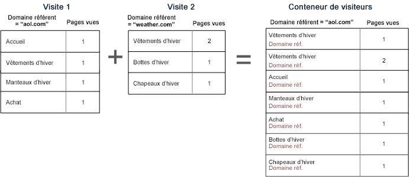-->

Lorsque vous consultez des données depuis le conteneur de visiteurs et visiteuses, notez que les pages vues ont augmenté significativement (de 98 248 à 112 925). Cette augmentation est due au fait que toutes les pages vues par le visiteur ou la visiteuse (y compris les pages avec d’autres valeurs de domaine référent enregistrées au niveau du conteneur de visiteurs et visiteuses) ont été répertoriées. Ainsi que les visites supplémentaires effectuées par cette personne, augmentant les visites de 33 203 à 43 448.

|  | Mesure | # | % |
|---|---|--:|--:|
| | Pages vues :<br/>Vues :<br/>Visiteurs et visiteuses uniques : | **112 925** sur 351 165 <br/>**43 448** sur 165 173 <br/>**32 269** sur 113 110 | **32 %**<br/>**26 %**<br/>**28 %** |

<!--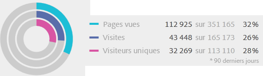-->

## Résumé

- Le conteneur de visiteurs et visiteuses renvoie toutes les pages vues par une personne lorsqu’au moins une page respecte les critères. Ainsi, si une page n’est vue que lors de la visite 1 le jour 1, alors toutes les pages vues par la personne sur plusieurs visites sont incluses dans les données.
- Le conteneur de visites renvoie toutes les pages vues lors d’une visite, pour lesquelles au moins une page respecte les critères. Ainsi, si une page n’est vue que lors de la visite 1 le jour 1, alors toutes les pages vues lors l’ensemble de la visite sont incluses dans les données.
- Veillez à baser la condition que vous avez utilisée pour la segmentation sur une eVar ou un autre type de variable persistante. Par exemple, vous pouvez utiliser la condition « lorsque la campagne contient des e-mails » et elle expire au bout de sept jours. Ainsi, si la campagne est définie sur la première visite, elle persiste pendant sept jours de plus. Chaque visite est incluse même si la campagne n’était définie que sur la première visite. Les autres visites sont également incluses (tant qu’elles figurent dans la période du rapport). Si vous souhaitez que les valeurs persistantes ne soient pas incluses, utilisez l’événement « instance de » ou une variable prop équivalente, si disponible.
