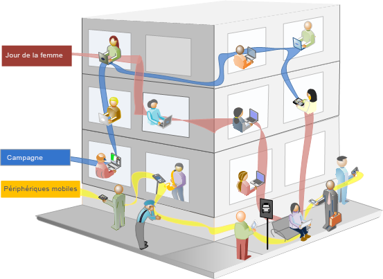
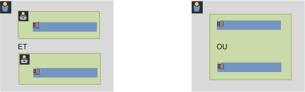
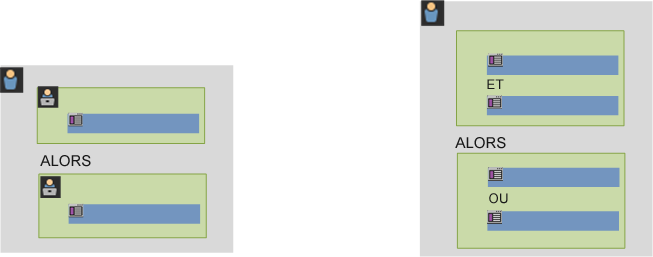

# À propos des segments

Les segments vous permettent d’identifier des sous-ensembles de visiteurs et visiteuses selon des caractéristiques ou des interactions web. Ils sont conçus comme des informations sur les audiences que vous pouvez créer en fonction de vos besoins spécifiques, puis vérifier, modifier et partager avec d’autres personnes membres de l’équipe ou utiliser dans d’autres produits Adobe et fonctionnalités Analytics.

Les segments sont basés sur une hiérarchie de niveau [!UICONTROL Visiteur ou visiteuse], [!UICONTROL Visite] et [!UICONTROL Accès] en utilisant un modèle de conteneur imbriqué. Les conteneurs imbriqués permettent de définir les attributs des visiteurs et les actions en fonction de règles entre et dans les conteneurs. Les segments Analytics peuvent être créés, approuvés, partagés, enregistrés et exécutés dans plusieurs produits et fonctionnalités d’[!DNL Adobe Experience Cloud]. Les segments peuvent être générés depuis un rapport, créés dans un rapport de tableau de bord ou mis en signet pour un accès rapide.

Vous pouvez créer et enregistrer des segments dans le Créateur de segments, ou en générer depuis un rapport sur les abandons (dans [!UICONTROL Analysis Workspace]). Vous pouvez également utiliser et développer des segments préconfigurés en fonction de règles spécifiques entre les conteneurs imbriqués, permettant de filtrer les résultats et de les appliquer aux rapports. En outre, les segments peuvent être utilisés ensemble comme [segments empilés](/help/components/segmentation/segmentation-workflow/seg-workflow.md).

Les segments identifient :

- qui sont vos visiteurs et visiteuses (pays, genre, café-restaurant) ;
- quels appareils et services ils utilisent (navigateur, moteur de recherche, appareil mobile) ;
- où ils ont navigué (moteur de recherche, page de sortie précédente, recherche naturelle) ;
- et bien plus encore.

<!---->

Les segments peuvent être basés sur les valeurs suivantes :

- Visiteurs sur la base d’attributs : type de navigateur, appareil, nombre de visites, pays, sexe.
- Visiteurs sur la base d’interactions : campagnes, recherche par mots-clés, moteur de recherche.
- Visiteurs sur la base des sorties et des entrées : visiteurs provenant de Facebook, d’une page de destination définie, d’un domaine référent.
- Visiteurs sur la base de variables personnalisées : champ de formulaire, catégories définies, ID de client.

Lors de la création de segments d’audiences dans le Créateur de segments, vous définissez des conditions en utilisant les opérateurs [!UICONTROL AND] et [!UICONTROL OR] entre les conteneurs.

<table style="table-layout:fixed; border: none;">

<tr>

<td style="background-color: #E5E4E2;" colspan="3" width="200" height="100"> Visiteurs</td>
</tr>

<tr>
<td style="background-color: #E5E4E2;" width="200"></td>
<td style="background-color: #D3D3D3;" colspan="2" width="200" height="100"> Visites</td>
</tr>

<tr>
<td style="background-color: #E5E4E2;" width="200" height="100"></td>
<td style="background-color: #D3D3D3;" width="200" height="100"></td>
<td style="background-color: #C0C0C0;" width="200" height="100" colspan="1"> Accès</td>
</tr>

<tr>
<td style="background-color: #E5E4E2;"></td><td colspan="2">AND</td></td>
</tr>

<tr>
<td style="background-color: #E5E4E2;" width="200"></td>
<td style="background-color: #D3D3D3;" colspan="2" width="200" height="100"> Visites</td>
</tr>

<tr>
<td style="background-color: #E5E4E2;" width="200" height="100"></td>
<td style="background-color: #D3D3D3;" width="200" height="100"></td>
<td style="background-color: #C0C0C0;" width="200" height="100" colspan="1"> Accès</td>
</tr>
</table>

<table style="table-layout:fixed; border: none;">

<tr>

<td style="background-color: #E5E4E2;" colspan="3" width="200" height="100"> Visiteurs</td>
</tr>

<tr>
<td style="background-color: #E5E4E2;" width="200"></td>
<td style="background-color: #D3D3D3;" colspan="2" width="200" height="100"> Visites</td>
</tr>

<tr>
<td style="background-color: #E5E4E2;" width="200" height="100"></td>
<td style="background-color: #D3D3D3;" width="200" height="100"></td>
<td style="background-color: #C0C0C0;" width="200" height="100" colspan="1"> Accès</td>
</tr>

<tr>
<td style="background-color: #E5E4E2;"></td><td colspan="2">OU</td></td>
</tr>

<tr>
<td style="background-color: #E5E4E2;" width="200"></td>
<td style="background-color: #D3D3D3;" colspan="2" width="200" height="100"> Visites</td>
</tr>

<tr>
<td style="background-color: #E5E4E2;" width="200" height="100"></td>
<td style="background-color: #D3D3D3;" width="200" height="100"></td>
<td style="background-color: #C0C0C0;" width="200" height="100" colspan="1"> Accès</td>
</tr>
</table>

<!---->

Ce type de segment filtre les jeux de données en fonction de caractéristiques regroupées à l’aide des opérateurs [!UICONTROL AND] (et) et [!UICONTROL OR] (ou).

- Vous pouvez [appliquer plusieurs segments à un rapport ou à un projet](/help/components/segmentation/segmentation-workflow/seg-workflow.md).
- Les segments fonctionnent dans toutes les suites de rapports.
- Le [Créateur de segments](/help/components/segmentation/segmentation-workflow/seg-workflow.md) simplifie la création de segments.
- Le [gestionnaire de segments](/help/components/segmentation/segmentation-workflow/seg-workflow.md) permet de configurer des [processus](/help/components/segmentation/segmentation-workflow/seg-workflow.md) pour le partage, le marquage, la vérification et l’approbation des segments.
- Vous pouvez [marquer les segments](/help/components/segmentation/segmentation-workflow/seg-workflow.md) pour les organiser et les rechercher ultérieurement au lieu d’utiliser des dossiers.
- Vous pouvez créer des [segments séquentiels](/help/components/segmentation/segmentation-workflow/seg-sequential-build.md).
- Le conteneur de [!UICONTROL pages vues] est désormais le conteneur [!UICONTROL d’accès] afin d’indiquer que ce conteneur segmente tous les types de données et pas uniquement les pages vues. Par exemple, les appels de suivi des liens et les appels trackAction provenant des Kits de développement logiciel (SDK) mobiles sont tous inclus ou exclus par le conteneur d’accès.

## Segmentation dans Analysis Workspace

Analysis Workspace comprend les fonctionnalités supplémentaires suivantes :

- Vous pouvez [comparer des segments](../../analyze/analysis-workspace/c-panels/c-segment-comparison/segment-comparison.md).
- Utilisez les [segments comme dimensions](https://experienceleague.adobe.com/docs/core-services/interface/audiences/audience-library.html?lang=fr) dans une comparaison.
- Utilisez des segments dans [l’analyse des abandons](../../analyze/analysis-workspace/visualizations/fallout/compare-segments-fallout.md).

## Segments fournis par Adobe

Le rail Composant sur le côté gauche de l’écran affiche les segments que vous et votre entreprise avez créés et les segments d’Adobe fournis prêts à l’emploi. Lorsque vous cliquez sur **[!UICONTROL Tout afficher]**, ces segments apparaissent généralement au bas de la liste et sont identifiés par le logo d’Adobe à droite.

## Segments séquentiels {#sequential}

Les segments séquentiels permettent d’identifier les visiteurs selon la navigation et la page vue sur votre site, fournissant un segment d’actions et d’interactions définies. Les filtres séquentiels permettent d’identifier ce qu’aime un visiteur et ce qu’il évite. Lors de la création de segments séquentiels, l’opérateur [!UICONTROL THEN] est utilisé pour définir et classer la navigation du visiteur.

<!---->

| Visite 1 | Visite 2 | Visite 3 |
|---|---|---|
| Lors de la première visite, la personne s’est rendue sur la page de destination principale A, a exclu la page de la campagne B, puis a consulté la page produit C. | Lors de la deuxième visite, la personne s’est à nouveau rendue sur la page de destination principale A, a exclu la page de la campagne B, est retourné sur la page produit C, puis a consulté une nouvelle page D. | Lors de la troisième visite, la personne a suivi le même chemin que lors des première et deuxième visites, puis a exclu la page F pour se rendre directement à la page produit ciblée G. |

Les segments séquentiels peuvent être basés sur les valeurs d’accès suivantes :

- Visiteurs et visiteuses sur la base d’une séquence d’accès aux pages : pages vues lors d’une visite unique, pages vues lors de visites distinctes, visites qui ont exclu les pages vues.
- Visiteurs et visiteuses sur la base de la durée entre et après les pages vues : une fois une durée écoulée, entre des accès, après un événement.

<table style="table-layout:fixed; border: none;">

<tr>

<td style="background-color: #E5E4E2;" colspan="3" width="200" height="100"> Visiteurs</td>
</tr>

<tr>
<td style="background-color: #E5E4E2;" width="200"></td>
<td style="background-color: #D3D3D3;" colspan="2" width="200" height="100"> Visites</td>
</tr>

<tr>
<td style="background-color: #E5E4E2;" width="200" height="100"></td>
<td style="background-color: #D3D3D3;" width="200" height="100"></td>
<td style="background-color: #C0C0C0;" width="200" height="100" colspan="1"> Accès</td>
</tr>

<tr>
<td style="background-color: #E5E4E2;"></td><td colspan="2">THEN</td></td>
</tr>

<tr>
<td style="background-color: #E5E4E2;" width="200"></td>
<td style="background-color: #D3D3D3;" colspan="2" width="200" height="100"> Visites</td>
</tr>

<tr>
<td style="background-color: #E5E4E2;" width="200" height="100"></td>
<td style="background-color: #D3D3D3;" width="200" height="100"></td>
<td style="background-color: #C0C0C0;" width="200" height="100" colspan="1"> Accès</td>
</tr>
</table>

<table style="table-layout:fixed; border: none;">

<tr>

<td style="background-color: #E5E4E2;" colspan="3" width="200" height="100"> Visiteurs</td>
</tr>

<tr>
<td style="background-color: #E5E4E2;" width="200"></td>
<td style="background-color: #D3D3D3;" colspan="2" width="200" height="100"> Visites</td>
</tr>

<tr>
<td style="background-color: #E5E4E2;" width="200" height="100"></td>
<td style="background-color: #D3D3D3;" width="200" height="100"></td>
<td style="background-color: #C0C0C0;" width="200" height="100" colspan="1"> Accès</td>
</tr>

<tr>
<td style="background-color: #E5E4E2;"></td><td style="background-color: #D3D3D3;"></td><td>AND</td></td>
</tr>

<tr>
<td style="background-color: #E5E4E2;" width="200" height="100"></td>
<td style="background-color: #D3D3D3;" width="200" height="100"></td>
<td style="background-color: #C0C0C0;" width="200" height="100" colspan="1"> Accès</td>
</tr>

<tr>
<td style="background-color: #E5E4E2;"></td><td colspan="2">THEN</td></td>
</tr>

<tr>
<td style="background-color: #E5E4E2;" width="200"></td>
<td style="background-color: #D3D3D3;" colspan="2" width="200" height="100"> Visites</td>
</tr>

<tr>
<td style="background-color: #E5E4E2;" width="200" height="100"></td>
<td style="background-color: #D3D3D3;" width="200" height="100"></td>
<td style="background-color: #C0C0C0;" width="200" height="100" colspan="1"> Accès</td>

<tr>
<td style="background-color: #E5E4E2;"></td><td style="background-color: #D3D3D3;"></td><td>OU</td></td>
</tr>

<tr>
<td style="background-color: #E5E4E2;" width="200" height="100"></td>
<td style="background-color: #D3D3D3;" width="200" height="100"></td>
<td style="background-color: #C0C0C0;" width="200" height="100" colspan="1"> Accès</td>
</tr>
</tr>
</table>

<!---->

Un segment séquentiel filtre des jeux de données sur la base des actions de l’utilisateur à l’aide de l’opérateur [!UICONTROL THEN] (alors).

## Vidéo Comment segmenter {#segment-video}

Cette vidéo donne un bref aperçu des conteneurs de segments et de leur utilisation.

>[!BEGINSHADEBOX]

Voir  [Conteneurs de segments](https://video.tv.adobe.com/v/25401?quality=12&learn=on){target="_blank"} pour une vidéo de démonstration.

>[!ENDSHADEBOX]

## Accès aux outils de segmentation {#access}

+++ **Comment puis-je accéder au Créateur de segments ?**

Accédez au Créateur de segments en procédant comme suit :

- Affichez un rapport existant, puis cliquez sur lʼ dans le volet de navigation de gauche. Dans le rail du segment qui s’affiche, cliquez ensuite sur **[!UICONTROL Ajouter]**, ou

- Dans la partie supérieure du Gestionnaire de segments, cliquez sur **[!UICONTROL + Ajouter]**.  

  ou

- cliquez sur le titre d’un segment existant dans le Gestionnaire de segments afin de le modifier dans le Créateur de segments.

+++

+++ **Comment puis-je accéder au Gestionnaire de segments ?**

Accédez au Gestionnaire de segments en procédant comme suit :

- sélectionnez **[!UICONTROL Analytics]** > **[!UICONTROL Composants]** dans le volet de navigation supérieur. Cliquez ensuite sur **[!UICONTROL Segments]**, ou

- Affichez un rapport existant, puis cliquez sur lʼ dans le volet de navigation de gauche. Cliquez ensuite sur **[!UICONTROL Gérer]**, ou

- appuyez sur la barre oblique « / » n’importe où dans l’interface et recherchez le Gestionnaire de segments.

+++

## Autorisations {#section_648DFA3A882146C485A84ED014EEC707}

+++ **Quels droits et privilèges dois-je posséder pour utiliser, créer et gérer des segments ?**

Par défaut, tous les utilisateurs sont autorisés à créer et à modifier des segments personnels. Toutefois, les administrateurs peuvent distribuer des [autorisations de créer des segments](https://experienceleague.adobe.com/docs/analytics/admin/admin-console/home.html?lang=fr) aux utilisateurs et en affecter à des groupes spécifiques. Ces segments peuvent être partagés directement avec tout autre utilisateur d’Analytics.

Les administrateurs peuvent modifier n’importe quel segment et partager les segments avec des groupes et toute personne de l’entreprise. [Plus...](/help/components/segmentation/seg-reference/seg-rights.md)

+++

+++ **Puis-je consulter tous les segments de mon entreprise ?**

Oui, les administrateurs et admnistratrices peuvent voir tous les segments dans l’interface utilisateur d’[!DNL Analysis Workspace].

Report Builder affiche les segments que vous possédez et les segments qui sont partagés avec vous.

+++

+++ **Puis-je gérer tous les segments Analytics dans le Gestionnaire de segments ?**

Oui, tous les segments peuvent être gérés dans le Gestionnaire de segments. Le Gestionnaire de segments affiche des segments que le propriétaire (utilisateur qui a créé le segment), les utilisateurs partagés et les administrateurs peuvent consulter. Le sélecteur de segments affiche les segments possédés par l’utilisateur et partagés avec ce dernier.

Les administrateurs et administratrices peuvent voir tous les segments dans l’interface utilisateur d’Analysis Workspace.

Report Builder affiche uniquement les segments que vous avez conçus ou ceux qui ont été partagés avec vous.

+++

+++ **Pourquoi ne puis-je pas supprimer ce segment ?**

Si le segment a été [publié sur Experience Cloud](/help/components/segmentation/segmentation-workflow/seg-workflow.md), vous ne pouvez pas le supprimer ni le modifier. Vous pouvez toutefois le copier et modifier la version copiée.

+++
