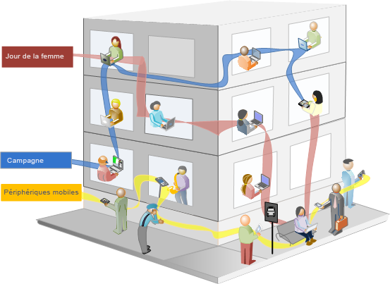
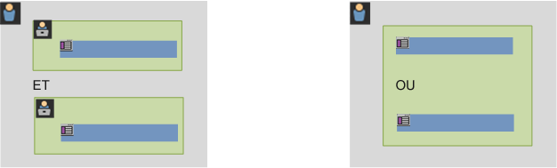
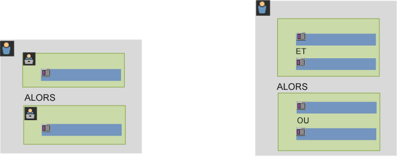

# À propos des segments

Les segments vous permettent d’identifier des sous-ensembles de visiteurs et visiteuses selon des caractéristiques ou des interactions web. Les segments sont conçus comme des informations sur l’audience que vous pouvez créer en fonction de vos besoins spécifiques, puis vérifier, modifier et partager avec les autres membres de l’équipe, ou utiliser dans d’autres produits Adobe et fonctionnalités d’Analytics.

Les segments sont basés sur une hiérarchie de niveau [!UICONTROL Visiteur ou visiteuse], [!UICONTROL Visite] et [!UICONTROL Hit] en utilisant un modèle de conteneur imbriqué. Les conteneurs imbriqués permettent de définir les attributs des visiteurs et les actions en fonction de règles entre et dans les conteneurs. Les segments Analytics peuvent être créés, approuvés, partagés, enregistrés et exécutés sur plusieurs produits et fonctionnalités dans Adobe CX Enterprise. Les segments peuvent être générés depuis un rapport, créés dans un rapport de tableau de bord ou mis en signet pour un accès rapide.

Vous pouvez créer et enregistrer des segments dans le Créateur de segments, ou en générer depuis un rapport sur les abandons (dans [!UICONTROL Analysis Workspace]). Vous pouvez également utiliser et développer des segments préconfigurés en fonction de règles spécifiques entre les conteneurs imbriqués, ce qui permet de filtrer les résultats et de les appliquer aux rapports. En outre, les segments peuvent être utilisés ensemble comme [segments empilés](/help/components/segmentation/segmentation-workflow/seg-workflow.md).

Les segments identifient :

- qui sont vos visiteurs et visiteuses (pays, genre, café-restaurant) ;
- quels appareils et services ils ou elles utilisent (navigateur, moteur de recherche, appareil mobile) ;
- où ils ou elles ont navigué (moteur de recherche, page de sortie précédente, référencement naturel) ;
- et bien plus encore.

<!---->

Les segments peuvent être basés sur les valeurs suivantes :

- Visiteurs et visiteuses sur la base d’attributs : type de navigateur, appareil, nombre de visites, pays, genre.
- Visiteurs sur la base d’interactions : campagnes, recherche par mots-clés, moteur de recherche.
- Visiteurs sur la base des sorties et des entrées : visiteurs provenant de Facebook, d’une page de destination définie, d’un domaine référent.
- Visiteurs sur la base de variables personnalisées : champ de formulaire, catégories définies, ID de client.

Lors de la création de segments d’audiences dans le Créateur de segments, vous définissez des conditions en utilisant les opérateurs [!UICONTROL ET] et [!UICONTROL OU] entre les conteneurs.

<table style="table-layout:fixed; border: none;">

<tr>

<td style="background-color: #E5E4E2;" colspan="3" width="200" height="100"> Visiteurs</td>
</tr>

<tr>
<td style="background-color: #E5E4E2;" width="200"></td>
<td style="background-color: #D3D3D3;" colspan="2" width="200" height="100"> Visites</td>
</tr>

<tr>
<td style="background-color: #E5E4E2;" width="200" height="100"></td>
<td style="background-color: #D3D3D3;" width="200" height="100"></td>
<td style="background-color: #C0C0C0;" width="200" height="100" colspan="1"> Hits</td>
</tr>

<tr>
<td style="background-color: #E5E4E2;"></td><td colspan="2">AND</td></td>
</tr>

<tr>
<td style="background-color: #E5E4E2;" width="200"></td>
<td style="background-color: #D3D3D3;" colspan="2" width="200" height="100"> Visites</td>
</tr>

<tr>
<td style="background-color: #E5E4E2;" width="200" height="100"></td>
<td style="background-color: #D3D3D3;" width="200" height="100"></td>
<td style="background-color: #C0C0C0;" width="200" height="100" colspan="1"> Hits</td>
</tr>
</table>

<table style="table-layout:fixed; border: none;">

<tr>

<td style="background-color: #E5E4E2;" colspan="3" width="200" height="100"> Visiteurs</td>
</tr>

<tr>
<td style="background-color: #E5E4E2;" width="200"></td>
<td style="background-color: #D3D3D3;" colspan="2" width="200" height="100"> Visites</td>
</tr>

<tr>
<td style="background-color: #E5E4E2;" width="200" height="100"></td>
<td style="background-color: #D3D3D3;" width="200" height="100"></td>
<td style="background-color: #C0C0C0;" width="200" height="100" colspan="1"> Hits</td>
</tr>

<tr>
<td style="background-color: #E5E4E2;"></td><td colspan="2">OU</td></td>
</tr>

<tr>
<td style="background-color: #E5E4E2;" width="200"></td>
<td style="background-color: #D3D3D3;" colspan="2" width="200" height="100"> Visites</td>
</tr>

<tr>
<td style="background-color: #E5E4E2;" width="200" height="100"></td>
<td style="background-color: #D3D3D3;" width="200" height="100"></td>
<td style="background-color: #C0C0C0;" width="200" height="100" colspan="1"> Hits</td>
</tr>
</table>

<!---->

Ce type de segment filtre les jeux de données en fonction de caractéristiques regroupées à l’aide des opérateurs [!UICONTROL AND] (et) et [!UICONTROL OR] (ou).

- Vous pouvez [appliquer plusieurs segments à un rapport ou à un projet](/help/components/segmentation/segmentation-workflow/t-seg-apply.md).
- Les segments fonctionnent dans toutes les suites de rapports.
- Le [Créateur de segments](/help/components/segmentation/segmentation-workflow/seg-build.md) simplifie la création de segments.
- Le [Gestionnaire de segments](/help/components/segmentation/segmentation-workflow/seg-manage.md) permet de configurer des [workflows](/help/components/segmentation/segmentation-workflow/seg-workflow.md) pour les fonctionnalités de partage, dee balisage, de vérification et d’approbation des segments.
- Vous pouvez [baliser les segments](/help/components/segmentation/segmentation-workflow/seg-tag.md) pour les organiser et les rechercher ultérieurement au lieu d’utiliser des dossiers.
- Vous pouvez créer des [segments séquentiels](/help/components/segmentation/segmentation-workflow/seg-sequential-build.md).
- Le conteneur [!UICONTROL Pages vues] est désormais le conteneur [!UICONTROL Hit] afin d’indiquer que ce conteneur segmente tous les types de données et pas uniquement les pages vues. Par exemple, les appels de suivi des liens et les appels d’action de suivi provenant des SDK mobiles sont tous inclus ou exclus par le conteneur de hits.

## Segmentation dans Analysis Workspace

Analysis Workspace comprend les fonctionnalités supplémentaires suivantes :

- Vous pouvez [comparer des segments](../../analyze/analysis-workspace/c-panels/c-segment-comparison/segment-comparison.md).
- Utilisez les segments en tant que dimensions dans les visualisations de tableau à structure libre.
- Utilisez des segments dans [l’analyse des abandons](../../analyze/analysis-workspace/visualizations/fallout/compare-segments-fallout.md).

## Compatibilité Data Warehouse

Toutes les fonctionnalités de segment ne sont pas compatibles avec Data Warehouse. Certaines structures et dimensions de segment ne sont pas prises en charge et les segments qui les utilisent ne s’affichent pas lors de la création d’une requête Data Warehouse. Pour obtenir la liste complète des fonctionnalités prises en charge et non prises en charge, consultez [Compatibilité des segments ](/help/export/data-warehouse/segment-compatibility.md).

## Segments fournis par Adobe

Le rail Composant sur le côté gauche de l’écran affiche les segments que vous et votre entreprise avez créés et les segments d’Adobe fournis prêts à l’emploi. Lorsque vous cliquez sur **[!UICONTROL Tout afficher]**, ces segments apparaissent généralement au bas de la liste et sont identifiés par .

## Segments séquentiels {#sequential}

Les segments séquentiels permettent d’identifier les visiteurs selon la navigation et la page vue sur votre site, fournissant un segment d’actions et d’interactions définies. Les segments séquentiels permettent d’identifier ce qu’aime un visiteur et ce qu’il évite. Lors de la création de segments séquentiels, l’opérateur [!UICONTROL THEN] est utilisé pour définir et classer la navigation du visiteur.

| Visite 1 | Visite 2 | Visite 3 |
|---|---|---|
| Lors de la première visite, le visiteur s’est rendu sur la page de destination principale A, a exclu la page de la campagne B, puis a consulté la page produit C. | Lors de la deuxième visite, le visiteur s’est à nouveau rendu sur la page de destination principale A, a exclu la page de la campagne B, est retourné sur la page produit C, puis a consulté une nouvelle page D. | Lors de la troisième visite, le visiteur est entré sur le site et a suivi le même chemin que lors des première et deuxième visites, puis a exclu la page F pour se rendre directement à la page produit ciblée G. |

Les segments séquentiels peuvent être basés sur les valeurs de hit suivantes :

- Visiteurs basés sur une séquence de hits de page : pages vues lors d’une visite unique, pages vues lors de visites distinctes, visites qui ont exclu les pages vues.
- Visiteurs basés sur le temps écoulé entre les pages vues et après celles-ci : une fois une durée écoulée, entre des hits, après un événement.

<table style="table-layout:fixed; border: none;">

<tr>

<td style="background-color: #E5E4E2;" colspan="3" width="200" height="100"> Visiteurs</td>
</tr>

<tr>
<td style="background-color: #E5E4E2;" width="200"></td>
<td style="background-color: #D3D3D3;" colspan="2" width="200" height="100"> Visites</td>
</tr>

<tr>
<td style="background-color: #E5E4E2;" width="200" height="100"></td>
<td style="background-color: #D3D3D3;" width="200" height="100"></td>
<td style="background-color: #C0C0C0;" width="200" height="100" colspan="1"> Hits</td>
</tr>

<tr>
<td style="background-color: #E5E4E2;"></td><td colspan="2">THEN</td></td>
</tr>

<tr>
<td style="background-color: #E5E4E2;" width="200"></td>
<td style="background-color: #D3D3D3;" colspan="2" width="200" height="100"> Visites</td>
</tr>

<tr>
<td style="background-color: #E5E4E2;" width="200" height="100"></td>
<td style="background-color: #D3D3D3;" width="200" height="100"></td>
<td style="background-color: #C0C0C0;" width="200" height="100" colspan="1"> Hits</td>
</tr>
</table>

<table style="table-layout:fixed; border: none;">

<tr>

<td style="background-color: #E5E4E2;" colspan="3" width="200" height="100"> Visiteurs</td>
</tr>

<tr>
<td style="background-color: #E5E4E2;" width="200"></td>
<td style="background-color: #D3D3D3;" colspan="2" width="200" height="100"> Visites</td>
</tr>

<tr>
<td style="background-color: #E5E4E2;" width="200" height="100"></td>
<td style="background-color: #D3D3D3;" width="200" height="100"></td>
<td style="background-color: #C0C0C0;" width="200" height="100" colspan="1"> Hits</td>
</tr>

<tr>
<td style="background-color: #E5E4E2;"></td><td style="background-color: #D3D3D3;"></td><td>AND</td></td>
</tr>

<tr>
<td style="background-color: #E5E4E2;" width="200" height="100"></td>
<td style="background-color: #D3D3D3;" width="200" height="100"></td>
<td style="background-color: #C0C0C0;" width="200" height="100" colspan="1"> Hits</td>
</tr>

<tr>
<td style="background-color: #E5E4E2;"></td><td colspan="2">THEN</td></td>
</tr>

<tr>
<td style="background-color: #E5E4E2;" width="200"></td>
<td style="background-color: #D3D3D3;" colspan="2" width="200" height="100"> Visites</td>
</tr>

<tr>
<td style="background-color: #E5E4E2;" width="200" height="100"></td>
<td style="background-color: #D3D3D3;" width="200" height="100"></td>
<td style="background-color: #C0C0C0;" width="200" height="100" colspan="1"> Hits</td>

<tr>
<td style="background-color: #E5E4E2;"></td><td style="background-color: #D3D3D3;"></td><td>OU</td></td>
</tr>

<tr>
<td style="background-color: #E5E4E2;" width="200" height="100"></td>
<td style="background-color: #D3D3D3;" width="200" height="100"></td>
<td style="background-color: #C0C0C0;" width="200" height="100" colspan="1"> Hits</td>
</tr>
</tr>
</table>

<!---->

Un segment séquentiel filtre des jeux de données sur la base des actions de l’utilisateur à l’aide de l’opérateur [!UICONTROL THEN] (alors).

## Vidéo Comment segmenter {#segment-video}

Cette vidéo propose une brève vue d’ensemble de ce que sont les conteneurs de segments et de la manière de les utiliser.

>[!BEGINSHADEBOX]

Consultez  [Conteneurs de segments](https://experienceleague.adobe.com/en/docs/analytics-learn/tutorials/components/segmentation/segment-containers){target="_blank"} pour une vidéo de démonstration.

>[!ENDSHADEBOX]

## Autorisations {#permissions}

+++ **Quels droits et privilèges dois-je posséder pour utiliser, créer et gérer des segments ?**

Par défaut, tous les utilisateurs sont autorisés à créer et à modifier des segments personnels. Toutefois, les administrateurs peuvent distribuer des [autorisations de créer des segments](/help/admin/admin-console/home.md) aux utilisateurs et en affecter à des groupes spécifiques. Ces segments peuvent être partagés directement avec tout autre utilisateur d’Analytics.

Les administrateurs peuvent éditer n’importe quel segment et partager les segments avec des groupes et avec toutes les personnes de l’entreprise. [Droits des segments par rôle](/help/components/segmentation/seg-reference/seg-rights.md)

+++

+++ **Puis-je consulter tous les segments de mon entreprise ?**

Oui, les administrateurs peuvent voir tous les segments dans l’interface utilisateur d’Analysis Workspace.

Report Builder affiche les segments que vous possédez et les segments qui sont partagés avec vous.

+++

+++ **Puis-je gérer tous les segments Analytics dans le Gestionnaire de segments ?**

Oui, tous les segments peuvent être gérés dans le Gestionnaire de segments. Le Gestionnaire de segments affiche des segments que la personne propriétaire (personne qui a créé le segment), les utilisateurs et utilisatrices partagés et les administrateurs et administratrices peuvent consulter. Le sélecteur de segments affiche les segments possédés par la personne et partagés avec cette dernière.

Les administrateurs et administratrices peuvent voir tous les segments dans l’interface utilisateur d’Analysis Workspace.

Report Builder affiche uniquement les segments que vous avez conçus ou ceux qui ont été partagés avec vous.

+++

+++ **Pourquoi ne puis-je pas supprimer un segment ?**

Si le segment a été [publié dans CX Enterprise](/help/components/segmentation/segmentation-workflow/seg-workflow.md), vous ne pouvez pas le supprimer ni le modifier. Néanmoins, vous pouvez le copier et modifier la version copiée.

+++
